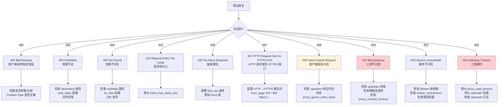

# Nginx 速查手册

::: important 速查手册定位
本手册是 Nginx 日常运维的快速参考，涵盖常用命令、配置模板、核心指令、内置变量、错误码排查和性能调优参数。所有模板可直接复制使用。
:::

## 1 常用命令速查

### 1.1 进程管理

| 命令 | 功能 | 说明 |
|------|------|------|
| `nginx` | 启动 Nginx | 默认读取 `/etc/nginx/nginx.conf` |
| `nginx -s stop` | 快速停止 | 立即断开所有连接 |
| `nginx -s quit` | 优雅停止 | 处理完当前请求后停止 |
| `nginx -s reload` | 重载配置 | 启动新 Worker，旧 Worker 处理完请求后退出 |
| `nginx -s reopen` | 重新打开日志 | 日志轮转时使用 |

### 1.2 配置检查

| 命令 | 功能 |
|------|------|
| `nginx -t` | 检查配置语法 |
| `nginx -T` | 检查语法并输出完整配置 |
| `nginx -t -c /path/to/nginx.conf` | 检查指定配置文件 |

### 1.3 版本与编译信息

| 命令 | 功能 |
|------|------|
| `nginx -v` | 显示版本号 |
| `nginx -V` | 显示版本号和编译参数 |

### 1.4 信号控制

| 信号 | 命令 | 效果 |
|------|------|------|
| TERM, INT | `kill -TERM $(cat /var/run/nginx.pid)` | 快速停止 |
| QUIT | `kill -QUIT $(cat /var/run/nginx.pid)` | 优雅停止 |
| HUP | `kill -HUP $(cat /var/run/nginx.pid)` | 重载配置 |
| USR1 | `kill -USR1 $(cat /var/run/nginx.pid)` | 重新打开日志 |
| USR2 | `kill -USR2 $(cat /var/run/nginx.pid)` | 热升级（启动新 Master） |
| WINCH | `kill -WINCH $(cat /var/run/nginx.pid)` | 优雅关闭旧 Worker |

### 1.5 运维常用命令

```bash
# 查看 Nginx 进程
ps aux | grep nginx

# 查看 Nginx 监听端口
ss -tlnp | grep nginx

# 实时查看访问日志
tail -f /var/log/nginx/access.log

# 实时查看错误日志
tail -f /var/log/nginx/error.log

# 查看 Nginx 状态
systemctl status nginx

# 查看 stub_status
curl http://127.0.0.1:8080/stub_status

# 测试站点响应
curl -I https://example.com/

# 测试 SSL 证书
echo | openssl s_client -connect example.com:443 -servername example.com 2>/dev/null | openssl x509 -noout -dates

# 查看连接状态
ss -ant | awk 'NR>1 {print $1}' | sort | uniq -c | sort -rn
```

## 2 配置模板速查

### 2.1 静态网站配置模板

```nginx
server {
    listen 80;
    server_name www.example.com example.com;

    root /usr/share/nginx/html;
    index index.html index.htm;

    # 字符集
    charset utf-8;

    # Gzip 压缩
    gzip on;
    gzip_vary on;
    gzip_min_length 256;
    gzip_types text/plain text/css application/json application/javascript text/xml application/xml application/xml+rss text/javascript;

    # 主路由
    location / {
        try_files $uri $uri/ /index.html;
    }

    # 静态资源缓存
    location ~* \.(js|css|png|jpg|jpeg|gif|ico|svg|woff|woff2|ttf|eot)$ {
        expires 30d;
        add_header Cache-Control "public, immutable";
        access_log off;
    }

    # 禁止访问隐藏文件
    location ~ /\. {
        deny all;
        access_log off;
        log_not_found off;
    }

    # 安全头
    add_header X-Frame-Options "SAMEORIGIN" always;
    add_header X-Content-Type-Options "nosniff" always;
    add_header X-XSS-Protection "1; mode=block" always;

    # 错误页面
    error_page 404 /404.html;
    error_page 500 502 503 504 /50x.html;
    location = /50x.html {
        root /usr/share/nginx/html;
    }
}
```

### 2.2 反向代理配置模板

```nginx
upstream backend {
    server 10.0.1.10:8080 weight=1 max_fails=3 fail_timeout=30s;
    server 10.0.1.11:8080 weight=1 max_fails=3 fail_timeout=30s;
    keepalive 32;
}

server {
    listen 80;
    server_name app.example.com;

    # 代理头
    proxy_set_header Host $host;
    proxy_set_header X-Real-IP $remote_addr;
    proxy_set_header X-Forwarded-For $proxy_add_x_forwarded_for;
    proxy_set_header X-Forwarded-Proto $scheme;

    # 代理超时
    proxy_connect_timeout 5s;
    proxy_read_timeout 60s;
    proxy_send_timeout 60s;

    # 代理缓冲
    proxy_buffering on;
    proxy_buffer_size 8k;
    proxy_buffers 8 8k;
    proxy_busy_buffers_size 16k;

    # 代理 HTTP 版本和连接
    proxy_http_version 1.1;
    proxy_set_header Connection "";

    location / {
        proxy_pass http://backend;

        # 错误处理
        proxy_next_upstream error timeout http_502 http_503 http_504;
        proxy_next_upstream_timeout 10s;
        proxy_next_upstream_tries 3;
    }
}
```

### 2.3 负载均衡配置模板

```nginx
# 负载均衡策略选择
upstream backend_round_robin {
    # 默认轮询（无需额外配置）
    server 10.0.1.10:8080;
    server 10.0.1.11:8080;
    server 10.0.1.12:8080;
    keepalive 32;
}

upstream backend_weighted {
    # 加权轮询
    server 10.0.1.10:8080 weight=5;
    server 10.0.1.11:8080 weight=3;
    server 10.0.1.12:8080 weight=2;
    keepalive 32;
}

upstream backend_ip_hash {
    # IP Hash（会话保持）
    ip_hash;
    server 10.0.1.10:8080;
    server 10.0.1.11:8080;
}

upstream backend_least_conn {
    # 最少连接
    least_conn;
    server 10.0.1.10:8080;
    server 10.0.1.11:8080;
    keepalive 32;
}

upstream backend_hash {
    # 一致性 Hash
    hash $request_uri consistent;
    server 10.0.1.10:8080;
    server 10.0.1.11:8080;
    server 10.0.1.12:8080;
}

server {
    listen 80;
    server_name app.example.com;

    location / {
        proxy_pass http://backend_round_robin;
        proxy_set_header Host $host;
        proxy_set_header X-Real-IP $remote_addr;
        proxy_set_header X-Forwarded-For $proxy_add_x_forwarded_for;
        proxy_http_version 1.1;
        proxy_set_header Connection "";
    }
}
```

### 2.4 HTTPS 配置模板

```nginx
# HTTP → HTTPS 重定向
server {
    listen 80;
    server_name example.com www.example.com;
    return 301 https://$host$request_uri;
}

# HTTPS 主服务
server {
    listen 443 ssl http2;
    server_name example.com www.example.com;

    # SSL 证书
    ssl_certificate /etc/nginx/ssl/example.com.crt;
    ssl_certificate_key /etc/nginx/ssl/example.com.key;

    # SSL 协议和密码套件
    ssl_protocols TLSv1.2 TLSv1.3;
    ssl_ciphers ECDHE-ECDSA-AES128-GCM-SHA256:ECDHE-RSA-AES128-GCM-SHA256:ECDHE-ECDSA-AES256-GCM-SHA384:ECDHE-RSA-AES256-GCM-SHA384:ECDHE-ECDSA-CHACHA20-POLY1305:ECDHE-RSA-CHACHA20-POLY1305;
    ssl_prefer_server_ciphers off;

    # SSL 会话缓存
    ssl_session_cache shared:SSL:10m;
    ssl_session_timeout 1d;
    ssl_session_tickets off;

    # OCSP Stapling
    ssl_stapling on;
    ssl_stapling_verify on;
    resolver 8.8.8.8 8.8.4.4 valid=300s;
    resolver_timeout 5s;

    # DH 参数
    ssl_dhparam /etc/nginx/ssl/dhparam.pem;

    # HSTS
    add_header Strict-Transport-Security "max-age=31536000; includeSubDomains; preload" always;

    # 安全头
    add_header X-Frame-Options "SAMEORIGIN" always;
    add_header X-Content-Type-Options "nosniff" always;

    location / {
        proxy_pass http://backend;
        proxy_set_header Host $host;
        proxy_set_header X-Real-IP $remote_addr;
        proxy_set_header X-Forwarded-For $proxy_add_x_forwarded_for;
        proxy_set_header X-Forwarded-Proto https;
    }
}
```

### 2.5 WebSocket 代理模板

```nginx
upstream ws_backend {
    server 10.0.1.10:8080;
    server 10.0.1.11:8080;
}

server {
    listen 80;
    server_name ws.example.com;

    location /ws/ {
        proxy_pass http://ws_backend;

        # WebSocket 必需头
        proxy_http_version 1.1;
        proxy_set_header Upgrade $http_upgrade;
        proxy_set_header Connection "upgrade";

        # 代理头
        proxy_set_header Host $host;
        proxy_set_header X-Real-IP $remote_addr;
        proxy_set_header X-Forwarded-For $proxy_add_x_forwarded_for;
        proxy_set_header X-Forwarded-Proto $scheme;

        # 超时配置（WebSocket 需要较长超时）
        proxy_connect_timeout 7d;
        proxy_read_timeout 7d;
        proxy_send_timeout 7d;

        # 关闭缓冲
        proxy_buffering off;
    }
}
```

### 2.6 子域名路由模板

```nginx
# 泛域名路由
server {
    listen 80;
    server_name ~^(?<subdomain>.+)\.example\.com$;

    # 根据子域名路由到不同端口
    location / {
        proxy_pass http://127.0.0.1:$subdomain_port;
        proxy_set_header Host $host;
        proxy_set_header X-Real-IP $remote_addr;
    }
}

# map 方式（更灵活）
map $subdomain $subdomain_port {
    api     8080;
    admin   8081;
    app     8082;
    default 8080;
}

server {
    listen 80;
    server_name ~^(?<subdomain>.+)\.example\.com$;

    location / {
        proxy_pass http://127.0.0.1:$subdomain_port;
    }
}

# 多 server 块方式（更清晰）
server {
    listen 80;
    server_name api.example.com;
    location / { proxy_pass http://api_backend; }
}

server {
    listen 80;
    server_name admin.example.com;
    location / { proxy_pass http://admin_backend; }
}

server {
    listen 80;
    server_name app.example.com;
    location / { proxy_pass http://app_backend; }
}
```

### 2.7 限流配置模板

```nginx
# 请求限流
limit_req_zone $binary_remote_addr zone=api_limit:10m rate=100r/s;
limit_req_zone $binary_remote_addr zone=login_limit:10m rate=5r/m;

# 连接限流
limit_conn_zone $binary_remote_addr zone=conn_limit:10m;

# 带宽限流
limit_rate_after 10m;
limit_rate 500k;

server {
    listen 80;
    server_name api.example.com;

    # API 限流
    location /api/ {
        limit_req zone=api_limit burst=50 nodelay;
        limit_req_status 429;
        limit_conn conn_limit 50;
        proxy_pass http://backend;
    }

    # 登录限流（更严格）
    location /api/login {
        limit_req zone=login_limit burst=5 nodelay;
        limit_req_status 429;
        proxy_pass http://backend;
    }

    # 下载限速
    location /download/ {
        limit_rate_after 10m;
        limit_rate 500k;
        alias /var/www/download/;
    }

    # 自定义限流响应
    error_page 429 = @429;
    location @429 {
        default_type application/json;
        return 429 '{"error": "Too Many Requests", "retry_after": 60}';
    }
}
```

### 2.8 缓存配置模板

```nginx
# 代理缓存
proxy_cache_path /var/cache/nginx/proxy levels=1:2 keys_zone=api_cache:100m
                 max_size=10g inactive=60m use_temp_path=off;

server {
    listen 80;
    server_name api.example.com;

    # 可缓存的 API
    location /api/public/ {
        proxy_pass http://backend;
        proxy_cache api_cache;
        proxy_cache_valid 200 10m;
        proxy_cache_valid 404 1m;
        proxy_cache_key $uri$is_args$args;
        proxy_cache_use_stale error timeout updating http_500 http_502 http_503 http_504;
        proxy_cache_background_update on;
        proxy_cache_lock on;

        add_header X-Cache-Status $upstream_cache_status;
    }

    # 不可缓存的 API
    location /api/private/ {
        proxy_pass http://backend;
        proxy_cache off;
        add_header Cache-Control "no-store, no-cache, must-revalidate";
    }

    # 手动清除缓存
    location /purge/ {
        allow 127.0.0.1;
        allow 10.0.0.0/8;
        deny all;
        proxy_cache_purge api_cache $uri$is_args$args;
    }
}
```

### 2.9 gRPC 代理模板

```nginx
server {
    listen 443 ssl http2;
    server_name grpc.example.com;

    ssl_certificate /etc/nginx/ssl/example.com.crt;
    ssl_certificate_key /etc/nginx/ssl/example.com.key;

    # gRPC 代理
    location / {
        grpc_pass grpc://backend:50051;
        grpc_set_header Host $host;
        grpc_set_header X-Real-IP $remote_addr;
        grpc_connect_timeout 5s;
        grpc_read_timeout 60s;
        grpc_send_timeout 60s;
    }

    # 特定 gRPC 服务
    location /package.Service1/ {
        grpc_pass grpc://service1:50051;
    }

    location /package.Service2/ {
        grpc_pass grpc://service2:50052;
    }

    # gRPC with TLS
    location /secure/ {
        grpc_pass grpcs://secure-backend:50051;
    }
}
```

### 2.10 灰度发布模板

```nginx
# 基于 Cookie 的灰度发布
split_clients "${cookie_canary}" $backend {
    10%    canary;
    *      production;
}

upstream production {
    server 10.0.1.10:8080;
    server 10.0.1.11:8080;
}

upstream canary {
    server 10.0.2.10:8080;
}

server {
    listen 80;
    server_name app.example.com;

    location / {
        proxy_pass http://$backend;
        proxy_set_header Host $host;
        proxy_set_header X-Real-IP $remote_addr;
        proxy_set_header X-Deploy-Version $backend;
    }
}

# 基于 Header 的灰度发布
map $http_x_canary $backend {
    "true"    canary;
    default   production;
}

# 基于IP的灰度发布
map $remote_addr $backend {
    10.0.50.1    canary;
    10.0.50.2    canary;
    default      production;
}
```

## 3 核心指令速查表

### 3.1 全局指令（main 上下文）

| 指令 | 默认值 | 说明 |
|------|--------|------|
| `worker_processes` | 1 | Worker 进程数，建议 `auto` |
| `worker_connections` | 512 | 每个 Worker 最大连接数 |
| `worker_rlimit_nofile` | - | Worker 进程文件描述符上限 |
| `worker_cpu_affinity` | - | Worker 进程 CPU 亲和性 |
| `error_log` | logs/error.log | 错误日志路径和级别 |
| `pid` | logs/nginx.pid | PID 文件路径 |
| `user` | nobody | Worker 进程运行用户 |
| `include` | - | 包含其他配置文件 |
| `load_module` | - | 加载动态模块 |
| `pcre_jit` | off | 启用 PCRE JIT 加速正则 |
| `thread_pool` | - | 线程池配置 |
| `timer_resolution` | - | 定时器精度 |

### 3.2 events 指令

| 指令 | 默认值 | 说明 |
|------|--------|------|
| `use` | - | 事件模型（epoll/kqueue） |
| `multi_accept` | off | 一次接受多个连接 |
| `accept_mutex` | off | 是否启用连接互斥锁（1.11.3+ 默认 off；旧版本默认 on） |
| `accept_mutex_delay` | 500ms | 获取互斥锁重试间隔 |

### 3.3 http 指令

| 指令 | 默认值 | 说明 |
|------|--------|------|
| `sendfile` | off | 零拷贝发送文件 |
| `tcp_nopush` | off | 优化数据包发送 |
| `tcp_nodelay` | on | 禁用 Nagle 算法 |
| `keepalive_timeout` | 75s | 长连接超时 |
| `keepalive_requests` | 1000 | 长连接最大请求数 |
| `send_timeout` | 60s | 响应发送超时 |
| `client_max_body_size` | 1m | 请求体最大大小 |
| `client_body_buffer_size` | 8k/16k | 请求体缓冲区大小 |
| `client_header_buffer_size` | 1k | 请求头缓冲区大小 |
| `large_client_header_buffers` | 4 8k | 大请求头缓冲区 |
| `reset_timedout_connection` | off | 重置超时连接 |
| `server_names_hash_max_size` | 512 | 服务器名哈希表大小 |
| `server_names_hash_bucket_size` | 32/64/128 | 服务器名哈希桶大小 |
| `types_hash_max_size` | 1024 | MIME 类型哈希表大小 |
| `default_type` | application/octet-stream | 默认 MIME 类型 |
| `access_log` | logs/access.log | 访问日志 |
| `open_file_cache` | off | 文件缓存 |
| `open_file_cache_valid` | 60s | 文件缓存有效期 |
| `open_file_cache_min_uses` | 1 | 文件缓存最小使用次数 |
| `open_file_cache_errors` | off | 缓存文件查找错误 |
| `gzip` | off | 启用 Gzip 压缩 |
| `gzip_min_length` | 20 | Gzip 最小压缩长度 |
| `gzip_comp_level` | 1 | Gzip 压缩级别(1-9) |
| `gzip_types` | text/html | Gzip 压缩类型 |

### 3.4 server 指令

| 指令 | 默认值 | 说明 |
|------|--------|------|
| `listen` | 80 | 监听地址和端口 |
| `server_name` | "" | 虚拟主机名 |
| `root` | html | 文档根目录 |
| `index` | index.html | 默认索引文件 |
| `ssl_certificate` | - | SSL 证书路径 |
| `ssl_certificate_key` | - | SSL 私钥路径 |
| `ssl_protocols` | TLSv1.2 TLSv1.3 | SSL 协议版本（1.23.4+ 默认值；旧版本为 TLSv1 TLSv1.1 TLSv1.2） |
| `ssl_ciphers` | HIGH:!aNULL:!MD5 | SSL 密码套件 |
| `ssl_session_cache` | none | SSL 会话缓存 |
| `ssl_session_timeout` | 5m | SSL 会话超时 |
| `server_tokens` | on | 是否显示版本号 |

### 3.5 location 指令

| 指令 | 默认值 | 说明 |
|------|--------|------|
| `proxy_pass` | - | 代理目标 URL |
| `proxy_set_header` | - | 设置代理请求头 |
| `proxy_connect_timeout` | 60s | 代理连接超时 |
| `proxy_read_timeout` | 60s | 代理读取超时 |
| `proxy_send_timeout` | 60s | 代理发送超时 |
| `proxy_buffer_size` | 4k/8k | 代理缓冲区大小 |
| `proxy_buffers` | 8 4k/8k | 代理缓冲区数量和大小 |
| `proxy_cache` | - | 代理缓存区域 |
| `proxy_cache_valid` | - | 缓存有效期 |
| `proxy_next_upstream` | error timeout | 故障转移条件 |
| `proxy_http_version` | 1.0 | 代理 HTTP 版本 |
| `try_files` | - | 按顺序尝试文件 |
| `rewrite` | - | URL 重写 |
| `return` | - | 返回状态码/重定向 |
| `limit_req` | - | 请求限流 |
| `limit_conn` | - | 连接限流 |
| `auth_basic` | off | HTTP 基本认证 |
| `allow` | - | 允许访问的 IP |
| `deny` | - | 拒绝访问的 IP |

## 4 内置变量速查表

### 4.1 客户端相关

| 变量 | 说明 | 示例 |
|------|------|------|
| `$remote_addr` | 客户端 IP | `192.168.1.100` |
| `$remote_port` | 客户端端口 | `54321` |
| `$remote_user` | 认证用户名 | `admin` |
| `$binary_remote_addr` | 二进制客户端 IP（节省内存） | - |
| `$http_x_forwarded_for` | X-Forwarded-For 头 | `1.2.3.4, 5.6.7.8` |
| `$realip_remote_addr` | 真实 IP 模块的原始 IP | - |

### 4.2 请求相关

| 变量 | 说明 | 示例 |
|------|------|------|
| `$request` | 完整请求行 | `GET /api/users HTTP/1.1` |
| `$request_method` | 请求方法 | `GET` |
| `$request_uri` | 完整请求 URI（含参数） | `/api/users?page=1` |
| `$uri` | 当前 URI（不含参数，可被重写） | `/api/users` |
| `$args` | 查询参数 | `page=1&size=10` |
| `$query_string` | 同 `$args` | - |
| `$scheme` | 请求协议 | `http` / `https` |
| `$host` | 请求头中的 Host | `api.example.com` |
| `$http_host` | 同 Host 头 | `api.example.com:8080` |
| `$server_name` | 匹配的 server_name | `api.example.com` |
| `$request_length` | 请求长度（含请求行和头） | `1024` |
| `$request_time` | 请求处理时间（秒） | `0.052` |
| `$request_id` | 唯一请求 ID | `a1b2c3d4e5f6` |
| `$content_type` | Content-Type 头 | `application/json` |
| `$content_length` | Content-Length 头 | `1024` |

### 4.3 响应相关

| 变量 | 说明 | 示例 |
|------|------|------|
| `$status` | 响应状态码 | `200` |
| `$body_bytes_sent` | 发送给客户端的响应体字节数 | `1024` |
| `$bytes_sent` | 发送给客户端的总字节数 | `2048` |
| `$sent_http_content_type` | 响应 Content-Type 头 | `text/html` |

### 4.4 上游相关

| 变量 | 说明 | 示例 |
|------|------|------|
| `$upstream_addr` | 上游服务器地址 | `10.0.1.10:8080` |
| `$upstream_status` | 上游响应状态码 | `200` |
| `$upstream_response_time` | 上游响应时间（秒） | `0.052` |
| `$upstream_connect_time` | 上游连接时间（秒） | `0.001` |
| `$upstream_header_time` | 上游首字节时间（秒） | `0.010` |
| `$upstream_cache_status` | 缓存状态 | `HIT` / `MISS` / `EXPIRED` |

### 4.5 连接相关

| 变量 | 说明 |
|------|------|
| `$connection` | 连接序列号 |
| `$connection_requests` | 当前连接的请求数 |
| `$connections_active` | 活跃连接数（需 stub_status） |
| `$connections_reading` | 正在读取的连接数 |
| `$connections_writing` | 正在写入的连接数 |
| `$connections_waiting` | 等待的连接数 |

### 4.6 系统相关

| 变量 | 说明 |
|------|------|
| `$pid` | Worker 进程 PID |
| `$hostname` | 主机名 |
| `$time_local` | 本地时间 |
| `$time_iso8601` | ISO 8601 格式时间 |
| `$msec` | 带毫秒的 Unix 时间戳 |

## 5 常见错误码速查

### 5.1 错误码决策树



### 5.2 错误码速查表

| 状态码 | 含义 | Nginx 特有 | 常见原因 |
|--------|------|-----------|---------|
| 400 | Bad Request | 否 | 请求格式错误、头部过大 |
| 403 | Forbidden | 否 | IP 限制、认证失败、文件权限 |
| 404 | Not Found | 否 | 路径错误、root/alias 配置错误 |
| 405 | Method Not Allowed | 否 | 请求方法不被允许 |
| 413 | Request Entity Too Large | 否 | 超过 client_max_body_size |
| 414 | Request-URI Too Large | 否 | URI 过长 |
| 429 | Too Many Requests | 否 | 触发 limit_req |
| 494 | Request Header Too Large | **是** | 请求头超过 large_client_header_buffers |
| 495 | SSL Certificate Error | **是** | 客户端证书验证失败 |
| 496 | SSL Certificate Required | **是** | 需要客户端证书 |
| 497 | HTTP Request Sent to HTTPS Port | **是** | HTTP 请求发送到 HTTPS 端口 |
| 499 | Client Closed Request | **是** | 客户端提前断开 |
| 500 | Internal Server Error | 否 | 配置错误、模块异常 |
| 502 | Bad Gateway | 否 | 上游不可用、连接被拒 |
| 503 | Service Unavailable | 否 | 限流、维护模式 |
| 504 | Gateway Timeout | 否 | 上游超时 |

## 6 性能调优参数速查

### 6.1 全局性能参数

```nginx
# /etc/nginx/nginx.conf

user nginx;
worker_processes auto;                    # 自动匹配 CPU 核数
worker_cpu_affinity auto;                 # 自动绑定 CPU
worker_rlimit_nofile 100000;              # 文件描述符限制
worker_priority -5;                       # 进程优先级

events {
    worker_connections 65535;             # 每个 Worker 最大连接数
    use epoll;                            # Linux 使用 epoll
    multi_accept on;                      # 一次接受所有新连接
    accept_mutex off;                     # 高 QPS 时关闭互斥锁
}
```

### 6.2 HTTP 性能参数

```nginx
http {
    # 零拷贝
    sendfile on;
    tcp_nopush on;                         # 配合 sendfile 使用
    tcp_nodelay on;                        # 禁用 Nagle 算法

    # 长连接
    keepalive_timeout 65;
    keepalive_requests 1000;

    # 文件缓存
    open_file_cache max=10000 inactive=30s;
    open_file_cache_valid 60s;
    open_file_cache_min_uses 2;
    open_file_cache_errors on;

    # Gzip 压缩
    gzip on;
    gzip_vary on;
    gzip_proxied any;
    gzip_comp_level 4;
    gzip_min_length 256;
    gzip_types text/plain text/css application/json application/javascript text/xml application/xml application/xml+rss text/javascript image/svg+xml;

    # 日志优化
    access_log /var/log/nginx/access.log main buffer=32k flush=5s;

    # 哈希表优化
    server_names_hash_bucket_size 64;
    types_hash_max_size 2048;

    # 重置超时连接
    reset_timedout_connection on;
}
```

### 6.3 代理性能参数

```nginx
# 代理连接池
upstream backend {
    server 10.0.1.10:8080;
    server 10.0.1.11:8080;
    keepalive 64;                          # 保持 64 个空闲长连接
}

server {
    # 代理 HTTP 版本
    proxy_http_version 1.1;
    proxy_set_header Connection "";

    # 代理缓冲
    proxy_buffering on;
    proxy_buffer_size 8k;
    proxy_buffers 8 8k;
    proxy_busy_buffers_size 16k;

    # 代理临时文件
    proxy_temp_file_write_size 16k;
    proxy_max_temp_file_size 1024m;
}
```

### 6.4 SSL 性能参数

```nginx
# SSL 会话复用
ssl_session_cache shared:SSL:10m;         # 10m 可存储约 40000 个会话
ssl_session_timeout 1d;                   # 会话有效期 1 天
ssl_session_tickets off;                  # 关闭 Session Tickets（安全性）

# OCSP Stapling
ssl_stapling on;
ssl_stapling_verify on;
resolver 8.8.8.8 8.8.4.4 valid=300s;
resolver_timeout 5s;

# 异步 IO（如果支持）
# aio on;
# directio 512;
```

## 7 故障排查命令速查

### 7.1 进程排查

```bash
# 查看 Nginx 进程
ps aux | grep nginx

# 查看 Worker 进程数
ps aux | grep "worker process" | grep -vc grep

# 查看进程树
pstree -p $(cat /var/run/nginx.pid)

# 查看进程资源限制
cat /proc/$(cat /var/run/nginx.pid)/limits

# 查看进程打开的文件数
ls /proc/$(cat /var/run/nginx.pid)/fd | wc -l

# 查看进程内存映射
pmap -x $(cat /var/run/nginx.pid)
```

### 7.2 网络排查

```bash
# 查看监听端口
ss -tlnp | grep nginx

# 查看连接状态分布
ss -ant | awk 'NR>1 {print $1}' | sort | uniq -c | sort -rn

# 查看与上游的连接
ss -ant | grep ":8080" | awk '{print $1}' | sort | uniq -c

# 查看 TIME_WAIT 数量
ss -ant | grep TIME-WAIT | wc -l

# 查看 SYN_RECV（可能遭受 SYN Flood）
ss -ant | grep SYN-RECV | wc -l

# 跟踪 TCP 连接
tcpdump -i eth0 -nn port 80 -A

# 测试上游连通性
curl -v --max-time 5 http://10.0.1.10:8080/healthz
```

### 7.3 日志排查

```bash
# 实时查看错误日志
tail -f /var/log/nginx/error.log

# 统计 5xx 错误
grep ' 5[0-9][0-9] ' /var/log/nginx/access.log | wc -l

# 统计各状态码
awk '{print $9}' /var/log/nginx/access.log | sort | uniq -c | sort -rn

# 查看慢请求
awk -F'rt=' '{split($2,a," "); if(a[1]+0 > 1) print}' /var/log/nginx/access.log

# 查看特定 URL 的错误
grep '/api/users' /var/log/nginx/access.log | grep ' 5[0-9][0-9] '

# 统计每分钟 QPS
awk '{print $4}' /var/log/nginx/access.log | cut -d: -f1-2 | uniq -c

# 查看上游超时错误
grep 'upstream timed out' /var/log/nginx/error.log

# 查看连接重置错误
grep -E 'reset by peer|broken pipe' /var/log/nginx/error.log
```

### 7.4 系统资源排查

```bash
# CPU 使用率
top -bn1 | grep nginx

# 内存使用
ps -eo pid,rss,command | grep nginx | sort -k2 -rn

# 磁盘 I/O
iostat -x 1 5

# 系统负载
uptime

# 文件描述符使用
cat /proc/sys/fs/file-nr

# 内核参数检查
sysctl net.core.somaxconn
sysctl net.ipv4.tcp_max_syn_backlog
sysctl net.ipv4.ip_local_port_range
```

## 8 内核参数优化模板

```bash
# /etc/sysctl.d/99-nginx.conf
# Nginx 生产环境内核参数优化

# ===== 网络核心 =====
net.core.somaxconn = 65535                    # TCP 连接队列大小
net.core.netdev_max_backlog = 65535           # 网络设备积压队列
net.core.rmem_max = 16777216                  # 最大套接字接收缓冲区
net.core.wmem_max = 16777216                  # 最大套接字发送缓冲区
net.core.rmem_default = 262144                # 默认套接字接收缓冲区
net.core.wmem_default = 262144                # 默认套接字发送缓冲区
net.core.optmem_max = 65536                   # 最大辅助缓冲区

# ===== TCP 配置 =====
net.ipv4.tcp_rmem = 4096 87380 16777216       # TCP 接收缓冲区（min/default/max）
net.ipv4.tcp_wmem = 4096 65536 16777216       # TCP 发送缓冲区
net.ipv4.tcp_max_syn_backlog = 65535          # SYN 队列大小
net.ipv4.tcp_max_tw_buckets = 65535           # TIME_WAIT 最大数量
net.ipv4.tcp_tw_reuse = 1                     # 允许 TIME_WAIT 复用
net.ipv4.tcp_fin_timeout = 15                 # FIN-WAIT-2 超时
net.ipv4.tcp_keepalive_time = 300             # TCP Keep-Alive 探测间隔
net.ipv4.tcp_keepalive_intvl = 15             # 探测发送间隔
net.ipv4.tcp_keepalive_probes = 5             # 探测失败重试次数
net.ipv4.tcp_syncookies = 1                   # SYN Flood 防护
net.ipv4.tcp_synack_retries = 2               # SYN-ACK 重试次数
net.ipv4.tcp_timestamps = 1                   # 启用时间戳
net.ipv4.tcp_sack = 1                         # 启用选择性确认
# net.ipv4.tcp_fack = 1                         # [已废弃] Linux 4.7+ 中 FACK 合并到 SACK，此参数已移除
# net.ipv4.tcp_low_latency = 1                  # [已废弃] Linux 4.14+ 中已移除
net.ipv4.tcp_fastopen = 3                     # TCP Fast Open

# ===== 端口配置 =====
net.ipv4.ip_local_port_range = 1024 65535     # 本地端口范围
net.ipv4.ip_forward = 0                       # 禁用 IP 转发

# ===== 连接跟踪 =====
net.netfilter.nf_conntrack_max = 1048576      # 最大连接跟踪数
net.netfilter.nf_conntrack_tcp_timeout_established = 7200

# ===== 文件系统 =====
fs.file-max = 1000000                         # 系统最大文件描述符
fs.inotify.max_user_watches = 524288          # inotify 最大监视数

# 应用配置
# sysctl -p /etc/sysctl.d/99-nginx.conf
```

```bash
# /etc/security/limits.d/nginx.conf
# Nginx 用户资源限制

nginx soft nofile 100000
nginx hard nofile 100000
nginx soft nproc 65535
nginx hard nproc 65535

# root 用户也需要调整
root soft nofile 100000
root hard nofile 100000
```

## 9 安全加固检查清单

### 9.1 配置安全检查

| # | 检查项 | 配置 | 状态 |
|---|--------|------|------|
| 1 | 隐藏版本号 | `server_tokens off;` | [ ] |
| 2 | 禁止目录列表 | `autoindex off;` | [ ] |
| 3 | 限制请求体大小 | `client_max_body_size 50m;` | [ ] |
| 4 | 禁止访问隐藏文件 | `location ~ /\. { deny all; }` | [ ] |
| 5 | 安全响应头 | X-Frame-Options / X-Content-Type-Options | [ ] |
| 6 | HSTS | `Strict-Transport-Security` | [ ] |
| 7 | SSL 协议版本 | `ssl_protocols TLSv1.2 TLSv1.3;` | [ ] |
| 8 | 强密码套件 | `ssl_ciphers ECDHE-...;` | [ ] |
| 9 | SSL 会话缓存 | `ssl_session_cache shared:SSL:10m;` | [ ] |
| 10 | OCSP Stapling | `ssl_stapling on;` | [ ] |
| 11 | DH 参数 | `ssl_dhparam /etc/nginx/ssl/dhparam.pem;` | [ ] |
| 12 | 证书链完整 | 中间证书已包含 | [ ] |

### 9.2 访问控制检查

| # | 检查项 | 说明 | 状态 |
|---|--------|------|------|
| 1 | stub_status 访问限制 | 仅允许监控 IP | [ ] |
| 2 | 管理端点访问限制 | 仅允许内网 IP | [ ] |
| 3 | 上游端口不对外暴露 | upstream 端口不监听公网 | [ ] |
| 4 | 限流配置 | API 接口配置限流 | [ ] |
| 5 | 连接数限制 | `limit_conn` 防止单 IP 过多连接 | [ ] |
| 6 | 恶意 User-Agent 过滤 | 禁止扫描器 UA | [ ] |
| 7 | 敏感路径保护 | /admin 等路径需要认证 | [ ] |
| 8 | HTTP 方法限制 | 禁用 DELETE/TRACE 等 | [ ] |

### 9.3 系统安全检查

| # | 检查项 | 命令 | 状态 |
|---|--------|------|------|
| 1 | Nginx 以非 root 运行 | `ps aux \| grep nginx` | [ ] |
| 2 | 配置文件权限 | `ls -la /etc/nginx/` (644) | [ ] |
| 3 | SSL 密钥权限 | `ls -la /etc/nginx/ssl/` (600) | [ ] |
| 4 | 日志目录权限 | `ls -la /var/log/nginx/` | [ ] |
| 5 | 配置文件所有者 | root:root | [ ] |
| 6 | 无默认配置残留 | 删除 default.conf | [ ] |
| 7 | 文件描述符限制 | `ulimit -n` >= 100000 | [ ] |
| 8 | 防火墙规则 | 仅开放 80/443 | [ ] |

### 9.4 安全加固 Nginx 配置模板

```nginx
# /etc/nginx/snippets/security-hardening.conf
# 安全加固配置片段

# 隐藏版本号
server_tokens off;

# 禁止不安全的 HTTP 方法
if ($request_method !~ ^(GET|HEAD|POST|PUT|DELETE|PATCH|OPTIONS)$ ) {
    return 405;
}

# 防止 MIME 嗅探
add_header X-Content-Type-Options "nosniff" always;

# 点击劫持防护
add_header X-Frame-Options "SAMEORIGIN" always;

# XSS 防护
add_header X-XSS-Protection "1; mode=block" always;

# Referrer 策略
add_header Referrer-Policy "strict-origin-when-cross-origin" always;

# CSP 策略（根据业务调整）
add_header Content-Security-Policy "default-src 'self'; script-src 'self' 'unsafe-inline' 'unsafe-eval'; style-src 'self' 'unsafe-inline';" always;

# 权限策略
add_header Permissions-Policy "camera=(), microphone=(), geolocation=()" always;

# 禁止目录列表
autoindex off;

# 限制客户端请求体
client_max_body_size 50m;
client_body_buffer_size 128k;

# 请求头大小限制
client_header_buffer_size 1k;
large_client_header_buffers 4 8k;

# 超时设置（防止慢速攻击）
client_body_timeout 12;
client_header_timeout 12;
send_timeout 10;
keepalive_timeout 65;

# 限制连接重置
reset_timedout_connection on;

# 禁止访问隐藏文件和敏感文件
location ~ /\. {
    deny all;
    access_log off;
    log_not_found off;
}

location ~ ~$ {
    deny all;
    access_log off;
    log_not_found off;
}

# 禁止访问备份文件
location ~* \.(bak|old|orig|save|swp|tmp)$ {
    deny all;
    access_log off;
    log_not_found off;
}

# 禁止访问源码文件
location ~* \.(git|svn|hg|bzr|cvs)/ {
    deny all;
    access_log off;
    log_not_found off;
}

# 恶意 User-Agent 过滤
map $http_user_agent $bad_agent {
    default 0;
    ~*(?:scanner|bot|crawler|spider|nikto|sqlmap|nmap|dirbuster|wpscan) 1;
}

if ($bad_agent) {
    return 403;
}
```

## 10 参考资源

- [Nginx 官方文档 - 指令索引](https://nginx.org/en/docs/dirindex.html)
- [Nginx 官方文档 - 变量索引](https://nginx.org/en/docs/varindex.html)
- [Nginx 官方文档 - 核心模块](https://nginx.org/en/docs/ngx_core_module.html)
- [Nginx 官方文档 - HTTP 模块](https://nginx.org/en/docs/http/ngx_http_core_module.html)
- [Nginx 官方文档 - 代理模块](https://nginx.org/en/docs/http/ngx_http_proxy_module.html)
- [Nginx 官方文档 - upstream 模块](https://nginx.org/en/docs/http/ngx_http_upstream_module.html)
- [Nginx 官方文档 - SSL 模块](https://nginx.org/en/docs/http/ngx_http_ssl_module.html)
- [Nginx 官方文档 - 限流模块](https://nginx.org/en/docs/http/ngx_http_limit_req_module.html)
- [Nginx 官方文档 - 缓存模块](https://nginx.org/en/docs/http/ngx_http_proxy_module.html#proxy_cache)
- [Nginx 官方文档 - gRPC 模块](https://nginx.org/en/docs/http/ngx_http_grpc_module.html)
