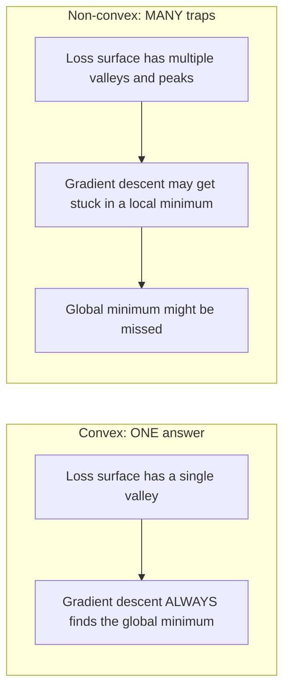
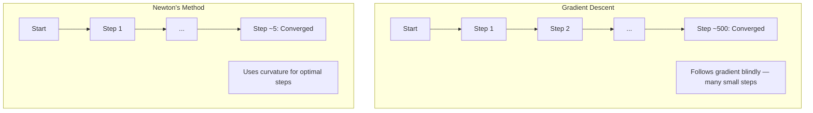
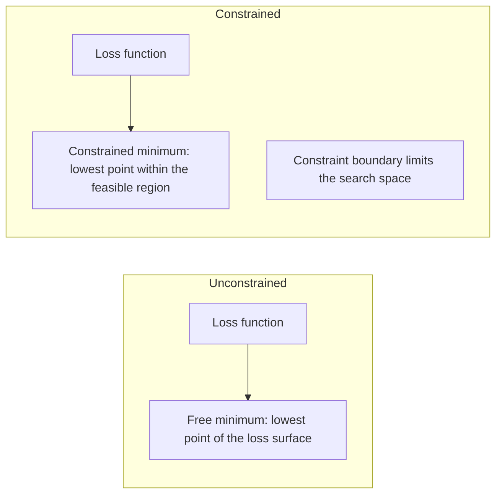
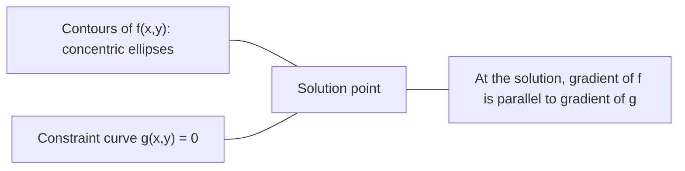

# 凸优化

> 凸问题只有一个谷底,神经网络却有成千上万个。知道两者的区别,至关重要。

**类型:** 动手构建
**编程语言:** Python
**前置要求:** 第 1 阶段,第 04 课(机器学习微积分)、第 08 课(优化)
**预计耗时:** 约 90 分钟

## 学习目标

- 用定义、二阶导数和 Hessian 判据检验一个函数是否凸
- 实现牛顿法,并比较它的二次收敛与梯度下降的差异
- 用拉格朗日乘子求解带约束的优化问题,并解释 KKT 条件
- 解释为什么神经网络的损失曲面是非凸的,而 SGD 依然能找到好的解

## 问题

第 08 课教过你梯度下降、动量和 Adam。这些优化器能在任何曲面上往山下走,但它们不附带任何保证。在非凸曲面上跑梯度下降,可能落进一个糟糕的局部极小值,可能卡在鞍点上,也可能永远震荡下去。你当时还是照用不误,因为神经网络就是非凸的,没有别的选择。

但机器学习里很多问题其实是凸的:线性回归、逻辑回归、SVM、LASSO、岭回归。对这些问题,存在更强的东西——带数学保证的优化。凸问题只有一个谷底,任何朝山下走的算法都会到达全局最小值。不需要随机重启,不需要学习率调度,不需要祈祷。

理解凸性有三重意义。第一,它能告诉你手上的问题是简单的(凸)还是困难的(非凸)。第二,它为凸问题提供了更快的工具,比如牛顿法。第三,它能解释机器学习里反复出现的概念:正则化本质上是一种约束、SVM 里的对偶性,以及深度学习为什么在违背了凸性带来的一切美好性质之后依然有效。

## 概念

### 凸集

如果集合 S 中任意两点之间的线段也完整落在 S 内,那么 S 是凸集。

| 凸集 | 非凸 |
|---|---|
| **矩形**:内部任意两点的连线都留在内部 | **星形/月牙形**:两个内部点的连线可能跑到集合外 |
| **三角形**:所有内部点都满足同样性质 | **甜甜圈/圆环**:中间的洞会让某些线段离开集合 |
| 任意两点的连线都留在集合内 | 存在某些点对,其连线会跑出集合 |

形式化判据:对 S 中任意两点 x、y 和任意 t ∈ [0, 1],点 tx + (1-t)y 也在 S 中。

凸集的例子:
- 一条直线、一个平面、整个 R^n
- 一个球体(圆、球面、超球面)
- 半空间:`{x : a^T x <= b}`
- 任意多个凸集的交集

非凸集的例子:
- 甜甜圈(圆环)
- 两个不相交圆形的并集
- 任何带"凹坑"或"洞"的集合

### 凸函数

函数 f 是凸的,当且仅当它的定义域是凸集,且对定义域内任意两点 x、y 和任意 t ∈ [0, 1],都有:

```
f(tx + (1-t)y) <= t*f(x) + (1-t)*f(y)
```

几何含义:函数图像上任意两点的连线都位于图像之上或与图像重合。

| 性质 | 凸函数 | 非凸函数 |
|---|---|---|
| **连线检验** | 图像上任意两点的连线位于曲线**上方或重合** | 图像上某些点的连线会**沉到**曲线下方 |
| **形状** | 单一向上弯曲的碗状/谷状 | 多个峰谷交错,曲率方向不一 |
| **局部极小值** | 每个局部极小值都是全局最小值 | 可能存在多个高度不同的局部极小值 |

常见的凸函数:
- f(x) = x^2(抛物线)
- f(x) = |x|(绝对值)
- f(x) = e^x(指数)
- f(x) = max(0, x)(ReLU,虽然是分段线性的)
- f(x) = -log(x),x > 0(负对数)
- 任何线性函数 f(x) = a^T x + b(既凸又凹)

### 凸性的检验方法

三种实用检验,从最省事到最严格排列。

**检验 1:二阶导数检验(一维)。** 如果对所有 x 都有 f''(x) >= 0,则 f 是凸的。

- f(x) = x^2:f''(x) = 2 >= 0。凸。
- f(x) = x^3:f''(x) = 6x,当 x < 0 时为负。非凸。
- f(x) = e^x:f''(x) = e^x > 0。凸。

**检验 2:Hessian 检验(多维)。** 如果 Hessian 矩阵 H(x) 对所有 x 都是半正定的,则 f 是凸的。Hessian 是由二阶偏导数构成的矩阵。

**检验 3:定义检验。** 直接验证不等式 f(tx + (1-t)y) <= t*f(x) + (1-t)*f(y)。适用于导数难以计算的函数。

### 凸性为什么重要

凸优化的核心定理:

**对凸函数而言,每个局部极小值都是全局最小值。**

这意味着梯度下降不可能被困住:任何下坡路径都通向同一个答案,算法保证收敛到最优解。



随之而来的推论:
- 不需要随机重启
- 不需要复杂的学习率调度
- 收敛性证明成为可能(收敛速率取决于函数性质)
- 解是唯一的(除平坦区域外)

### 机器学习中的凸与非凸

| 问题 | 是否凸? | 原因 |
|---------|---------|-----|
| 线性回归(MSE) | 是 | 损失是权重的二次函数 |
| 逻辑回归 | 是 | 对数损失对权重是凸的 |
| SVM(hinge 损失) | 是 | 线性函数的最大值 |
| LASSO(L1 回归) | 是 | 凸函数之和仍是凸的 |
| 岭回归(L2) | 是 | 二次加二次仍为凸 |
| 神经网络(任意损失) | 否 | 非线性激活让损失曲面变得非凸 |
| k-means 聚类 | 否 | 离散的分配步骤 |
| 矩阵分解 | 否 | 未知量之间相乘 |

带凸损失的线性模型是凸的。一旦加上带非线性激活的隐藏层,凸性立刻瓦解。

### Hessian 矩阵

函数 f: R^n -> R 的 Hessian H 是由二阶偏导数构成的 n x n 矩阵。

```
H[i][j] = d^2 f / (dx_i dx_j)
```

以 f(x, y) = x^2 + 3xy + y^2 为例:

```
df/dx = 2x + 3y       d^2f/dx^2 = 2      d^2f/dxdy = 3
df/dy = 3x + 2y       d^2f/dydx = 3      d^2f/dy^2 = 2

H = [ 2  3 ]
    [ 3  2 ]
```

Hessian 告诉你曲率信息:
- 特征值全为正:函数在每个方向都向上弯曲(该点处为凸)
- 特征值全为负:在每个方向都向下弯曲(凹,局部极大值)
- 有正有负:鞍点(某些方向向上弯,另一些方向向下弯)
- 特征值为零:该方向是平的(退化)

要判定凸性,Hessian 必须处处半正定(所有特征值 >= 0),而不是只在某一个点成立。

### 牛顿法

梯度下降只用一阶信息(梯度),牛顿法则用二阶信息(Hessian)。它在当前点拟合一个二次近似,然后直接跳到该二次函数的最小值处。

```
Update rule:
  x_new = x - H^(-1) * gradient

Compare to gradient descent:
  x_new = x - lr * gradient
```

牛顿法用 Hessian 的逆替换了标量学习率,从而根据局部曲率自动调整步长和方向。



优点:
- 在最小值附近二次收敛(误差每步平方级缩小)
- 没有学习率需要调
- 尺度不变(无论问题如何参数化都有效)

缺点:
- 计算 Hessian 需要 O(n^2) 内存,求逆需要 O(n^3)
- 对一个有 100 万权重的神经网络,就是 10^12 个矩阵元素和 10^18 次运算
- 对深度学习不实用

### 带约束的优化

无约束优化:在所有 x 上最小化 f(x)。
带约束优化:在约束条件下最小化 f(x)。

真实问题都有约束。你想把成本降到最低,但预算有限;你想把误差压到最小,但模型复杂度有上限。



### 拉格朗日乘子

拉格朗日乘子法把带约束问题转化为无约束问题。

问题:在 g(x) = 0 的约束下最小化 f(x)。

解法:引入一个新变量(拉格朗日乘子 lambda),然后求解无约束问题:

```
L(x, lambda) = f(x) + lambda * g(x)
```

在最优解处,L 的梯度为零:

```
dL/dx = df/dx + lambda * dg/dx = 0
dL/dlambda = g(x) = 0
```

几何直觉:在约束最小值处,f 的梯度必须与约束 g 的梯度平行。如果不平行,你还能沿约束曲面移动,进一步减小 f。



例子:在 x + y = 1 的约束下最小化 f(x,y) = x^2 + y^2。

```
L = x^2 + y^2 + lambda(x + y - 1)

dL/dx = 2x + lambda = 0  =>  x = -lambda/2
dL/dy = 2y + lambda = 0  =>  y = -lambda/2
dL/dlambda = x + y - 1 = 0

From first two: x = y
Substituting: 2x = 1, so x = y = 0.5, lambda = -1
```

直线 x + y = 1 上离原点最近的点是 (0.5, 0.5)。

### KKT 条件

Karush-Kuhn-Tucker 条件(KKT 条件)把拉格朗日乘子推广到了不等式约束。

问题:在 g_i(x) <= 0(i = 1, ..., m)的约束下最小化 f(x)。

KKT 条件(最优性的必要条件):

```
1. Stationarity:    df/dx + sum(lambda_i * dg_i/dx) = 0
2. Primal feasibility:  g_i(x) <= 0  for all i
3. Dual feasibility:    lambda_i >= 0  for all i
4. Complementary slackness:  lambda_i * g_i(x) = 0  for all i
```

互补松弛是关键洞见:要么约束起作用(g_i = 0,解落在边界上),要么乘子为零(约束无所谓)。一个对解没有影响的约束,其 lambda = 0。

KKT 条件是 SVM 的核心。支持向量正是那些约束起作用(lambda > 0)的数据点;其余所有数据点 lambda = 0,对决策边界没有任何影响。

### 正则化即带约束优化

L1 和 L2 正则化并不是什么拍脑袋的技巧,它们是伪装起来的带约束优化问题。

**L2 正则化(岭回归):**

```
minimize  Loss(w)  subject to  ||w||^2 <= t

Equivalent unconstrained form:
minimize  Loss(w) + lambda * ||w||^2
```

约束 ||w||^2 <= t 定义了一个球(二维是圆,三维是球面),解就是损失等值线首次碰到这个球的位置。

**L1 正则化(LASSO):**

```
minimize  Loss(w)  subject to  ||w||_1 <= t

Equivalent unconstrained form:
minimize  Loss(w) + lambda * ||w||_1
```

约束 ||w||_1 <= t 定义了一个菱形(二维下是旋转 45 度的正方形)。

| 性质 | L2 约束(圆形) | L1 约束(菱形) |
|---|---|---|
| **约束形状** | 圆(高维为球) | 菱形(二维为旋转正方形) |
| **损失等值线的切点** | 光滑边界——圆上任意点都可能 | 角点——与坐标轴对齐 |
| **解的行为** | 权重都很小但非零 | 部分权重恰好为零(稀疏) |
| **结果** | 权重收缩 | 特征选择 |

这解释了为什么 L1 会产生稀疏模型(特征选择),而 L2 只会收缩权重。菱形的角点与坐标轴对齐,损失等值线更容易先碰到角点,从而把一个或多个权重恰好压到零。

### 对偶性

每个带约束优化问题(原始问题)都有一个伴随问题(对偶问题)。对凸问题而言,原始问题与对偶问题的最优值相同,这就是强对偶性。

拉格朗日对偶函数:

```
Primal: minimize f(x) subject to g(x) <= 0
Lagrangian: L(x, lambda) = f(x) + lambda * g(x)
Dual function: d(lambda) = min_x L(x, lambda)
Dual problem: maximize d(lambda) subject to lambda >= 0
```

对偶性为什么重要:
- 对偶问题有时比原始问题更容易求解
- SVM 就是在对偶形式下求解的,问题只涉及数据点之间的点积(这正是核技巧的基础)
- 对偶给出原始问题最优值的下界,可用于检验解的质量

具体到 SVM:

```
Primal: find w, b that maximize the margin 2/||w|| subject to
        y_i(w^T x_i + b) >= 1 for all i

Dual:   maximize sum(alpha_i) - 0.5 * sum_ij(alpha_i * alpha_j * y_i * y_j * x_i^T x_j)
        subject to alpha_i >= 0 and sum(alpha_i * y_i) = 0

The dual only involves dot products x_i^T x_j.
Replace x_i^T x_j with K(x_i, x_j) to get the kernel trick.
```

### 为什么深度学习在非凸的情况下依然有效

神经网络的损失函数极度非凸。按一切经典标准衡量,优化它们都应该失败。然而随机梯度下降总能稳定地找到好解。有几个因素可以解释这件事。

**大多数局部极小值已经足够好。** 在高维空间中,随机临界点(梯度为零的点)绝大多数是鞍点,而不是局部极小值。为数不多的局部极小值,其损失值往往也接近全局最小值。当参数空间有上百万维时,被困在一个糟糕的局部极小值里的概率微乎其微。

**真正的障碍是鞍点,而不是局部极小值。** 在一个有 n 个参数的函数里,鞍点同时包含正曲率和负曲率的方向。对高维空间中的随机临界点,全部 n 个特征值都为正(即局部极小值)的概率大约是 2^(-n),所以几乎所有临界点都是鞍点。SGD 自带的噪声有助于逃离它们。

**过参数化让曲面更平滑。** 参数数量超过训练样本数的网络,其损失曲面更平滑、更连通。更宽的网络有更少的糟糕局部极小值。这违反直觉,但与大量实验结果一致。

**损失曲面的结构:**

| 性质 | 低维空间 | 高维空间 |
|---|---|---|
| **曲面形态** | 许多孤立的峰与谷 | 平滑连通的谷地 |
| **极小值** | 许多孤立的局部极小值 | 糟糕的局部极小值很少;大多数接近最优 |
| **寻路** | 很难找到全局最小值 | 很多路径都通向好解 |
| **临界点** | 局部极小值与鞍点混杂 | 绝大多数是鞍点而非局部极小值 |

**随机噪声相当于隐式正则化。** 小批量 SGD 引入的噪声会阻止参数沉入尖锐的极小值。尖锐极小值容易过拟合,平坦极小值泛化更好。噪声把优化过程推向损失曲面上的平坦区域。

### 实践中的二阶方法

纯牛顿法对大模型不现实,但有一些近似方法让二阶信息变得可用。

**L-BFGS(有限内存 BFGS):** 用最近 m 次梯度差分近似 Hessian 的逆,内存从 O(n^2) 降到 O(mn)。适用于约 10,000 个参数以内的问题,常用于经典机器学习(逻辑回归、CRF),但不用于深度学习。

**自然梯度:** 用 Fisher 信息矩阵(对数似然的期望 Hessian)代替标准 Hessian,从而刻画概率分布的几何结构。K-FAC(Kronecker 分解近似曲率)把 Fisher 矩阵近似为 Kronecker 积,使其在神经网络上变得可行。

**无 Hessian 优化:** 用共轭梯度法求解 Hx = g,自始至终不显式构造 H。只需要 Hessian-向量积,而它可以借助自动微分在 O(n) 时间内算出。

**对角近似:** Adam 的二阶矩就是 Hessian 对角线的一种对角近似。AdaHessian 更进一步,通过 Hutchinson 估计器使用真实的 Hessian 对角元素。

| 方法 | 内存 | 单步开销 | 适用场景 |
|--------|--------|--------------|-------------|
| 梯度下降 | O(n) | O(n) | 基线方法、大模型 |
| 牛顿法 | O(n^2) | O(n^3) | 小型凸问题 |
| L-BFGS | O(mn) | O(mn) | 中等规模凸问题 |
| Adam | O(n) | O(n) | 深度学习默认选择 |
| K-FAC | O(n) | 每层 O(n) | 研究场景、大批量训练 |

```figure
convex-vs-nonconvex
```

## 动手构建

### 第 1 步:凸性检查器

写一个函数,通过采样点并验证定义来经验性地检验凸性。

```python
import random
import math

def check_convexity(f, dim, bounds=(-5, 5), samples=1000):
    violations = 0
    for _ in range(samples):
        x = [random.uniform(*bounds) for _ in range(dim)]
        y = [random.uniform(*bounds) for _ in range(dim)]
        t = random.uniform(0, 1)
        mid = [t * xi + (1 - t) * yi for xi, yi in zip(x, y)]
        lhs = f(mid)
        rhs = t * f(x) + (1 - t) * f(y)
        if lhs > rhs + 1e-10:
            violations += 1
    return violations == 0, violations
```

### 第 2 步:二维牛顿法

用显式 Hessian 实现牛顿法,并与梯度下降比较收敛速度。

```python
def newtons_method(f, grad_f, hessian_f, x0, steps=50, tol=1e-12):
    x = list(x0)
    history = [x[:]]
    for _ in range(steps):
        g = grad_f(x)
        H = hessian_f(x)
        det = H[0][0] * H[1][1] - H[0][1] * H[1][0]
        if abs(det) < 1e-15:
            break
        H_inv = [
            [H[1][1] / det, -H[0][1] / det],
            [-H[1][0] / det, H[0][0] / det],
        ]
        dx = [
            H_inv[0][0] * g[0] + H_inv[0][1] * g[1],
            H_inv[1][0] * g[0] + H_inv[1][1] * g[1],
        ]
        x = [x[0] - dx[0], x[1] - dx[1]]
        history.append(x[:])
        if sum(gi ** 2 for gi in g) < tol:
            break
    return history
```

### 第 3 步:拉格朗日乘子求解器

在拉格朗日函数上做梯度下降,求解带约束优化。

```python
def lagrange_solve(f_grad, g_val, g_grad, x0, lr=0.01,
                   lr_lambda=0.01, steps=5000):
    x = list(x0)
    lam = 0.0
    history = []
    for _ in range(steps):
        fg = f_grad(x)
        gv = g_val(x)
        gg = g_grad(x)
        x = [
            xi - lr * (fgi + lam * ggi)
            for xi, fgi, ggi in zip(x, fg, gg)
        ]
        lam = lam + lr_lambda * gv
        history.append((x[:], lam, gv))
    return history
```

### 第 4 步:比较一阶与二阶方法

在同一个二次函数上分别跑梯度下降和牛顿法,数一数收敛所需的步数。

```python
def quadratic(x):
    return 5 * x[0] ** 2 + x[1] ** 2

def quadratic_grad(x):
    return [10 * x[0], 2 * x[1]]

def quadratic_hessian(x):
    return [[10, 0], [0, 2]]
```

牛顿法 1 步就会收敛(对二次函数它是精确的)。梯度下降则要几百步,因为 Hessian 的两个特征值相差 5 倍,形成了一条狭长的山谷。

## 投入使用

选择机器学习模型和求解器时,凸性分析可以直接派上用场。

对于凸问题(逻辑回归、SVM、LASSO):
- 使用专用求解器(liblinear、CVXPY、scipy.optimize.minimize 配 method='L-BFGS-B')
- 可以期待唯一的全局最优解
- 二阶方法实用且快速

对于非凸问题(神经网络):
- 使用一阶方法(SGD、Adam)
- 接受解依赖初始化和随机性这个事实
- 把过参数化、噪声和学习率调度当作隐式正则化来用
- 不要浪费时间寻找全局最小值,一个好的局部极小值就足够了

```python
from scipy.optimize import minimize

result = minimize(
    fun=lambda w: sum((y - X @ w) ** 2) + 0.1 * sum(w ** 2),
    x0=np.zeros(d),
    method='L-BFGS-B',
    jac=lambda w: -2 * X.T @ (y - X @ w) + 0.2 * w,
)
```

对 SVM 来说,对偶形式让你可以使用核技巧:

```python
from sklearn.svm import SVC

svm = SVC(kernel='rbf', C=1.0)
svm.fit(X_train, y_train)
print(f"Support vectors: {svm.n_support_}")
```

## 练习

1. **凸性画廊。** 用检查器检验这些函数的凸性:f(x) = x^4、f(x) = sin(x)、f(x,y) = x^2 + y^2、f(x,y) = x*y、f(x) = max(x, 0)。解释为什么每个结果都合理。

2. **牛顿法与梯度下降的赛跑。** 从起点 (10, 10) 出发,在 f(x,y) = 50*x^2 + y^2 上分别运行两种方法。各自需要多少步才能让损失 < 1e-10?当条件数(Hessian 最大特征值与最小特征值之比)增大时,梯度下降会发生什么?

3. **拉格朗日乘子的几何。** 在 x + 2y = 4 的约束下最小化 f(x,y) = (x-3)^2 + (y-3)^2。通过验证解点处 f 的梯度与 g 的梯度平行来确认解的正确性。

4. **正则化约束。** 实现 L1 约束优化:在 |x| + |y| <= 1 的约束下最小化 (x-3)^2 + (y-2)^2。展示解有一个坐标恰好等于零(菱形约束带来的稀疏性)。

5. **Hessian 特征值分析。** 分别计算 Rosenbrock 函数在 (1,1) 和 (-1,1) 处的 Hessian,并求出两个点的特征值。这些特征值告诉你最小值附近与远离最小值处的曲率有何不同?

## 关键术语

| 术语 | 含义 |
|------|---------------|
| 凸集(Convex set) | 集合中任意两点的连线都留在集合内 |
| 凸函数(Convex function) | 图像上任意两点的连线位于图像上方或与之重合;等价地,Hessian 处处半正定 |
| 局部极小值(Local minimum) | 比附近所有点都低的点。对凸函数,每个局部极小值都是全局最小值 |
| 全局最小值(Global minimum) | 函数在整个定义域上的最低点 |
| Hessian 矩阵(Hessian matrix) | 由所有二阶偏导数构成的矩阵,编码曲率信息 |
| 半正定(Positive semidefinite) | 特征值全部非负的矩阵,是"二阶导数 >= 0"的多维推广 |
| 条件数(Condition number) | Hessian 最大特征值与最小特征值之比。条件数越大,山谷越狭长,梯度下降越慢 |
| 牛顿法(Newton's method) | 用 Hessian 的逆决定步长和方向的二阶优化器,在最小值附近二次收敛 |
| 拉格朗日乘子(Lagrange multiplier) | 为把带约束优化问题转化为无约束问题而引入的变量 |
| KKT 条件(KKT conditions) | 含不等式约束时最优性的必要条件,是拉格朗日乘子的推广 |
| 互补松弛(Complementary slackness) | 在最优解处,要么约束起作用,要么对应乘子为零,两者不同时非零 |
| 对偶性(Duality) | 每个带约束问题都有一个伴随的对偶问题。对凸问题,两者最优值相同 |
| 强对偶性(Strong duality) | 原始问题与对偶问题最优值相等。对满足 Slater 条件的凸问题成立 |
| L-BFGS | 近似二阶方法,只保存最近 m 次梯度差分,而不存完整 Hessian |
| 鞍点(Saddle point) | 梯度为零的点,但在某些方向是极小值、另一些方向是极大值 |
| 过参数化(Overparameterization) | 使用比训练样本更多的参数。能平滑损失曲面、减少糟糕的局部极小值 |

## 延伸阅读

- [Boyd & Vandenberghe:Convex Optimization](https://web.stanford.edu/~boyd/cvxbook/)——标准教科书,网上免费可得
- [Bottou, Curtis, Nocedal:Optimization Methods for Large-Scale Machine Learning (2018)](https://arxiv.org/abs/1606.04838)——在凸优化理论与深度学习实践之间架桥
- [Choromanska et al.:The Loss Surfaces of Multilayer Networks (2015)](https://arxiv.org/abs/1412.0233)——为什么非凸神经网络曲面没有看上去那么糟
- [Nocedal & Wright:Numerical Optimization](https://link.springer.com/book/10.1007/978-0-387-40065-5)——牛顿法、L-BFGS 与带约束优化的全面参考
