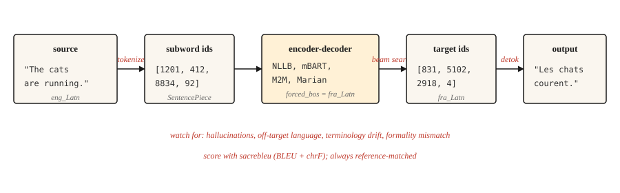

# 机器翻译

> 翻译这个任务,为 NLP 研究买了三十年的单,而且至今还在续费。

**类型:** 动手构建
**编程语言:** Python
**前置要求:** 第 5 阶段 · 10(注意力机制),第 5 阶段 · 04(GloVe、FastText、子词)
**预计耗时:** 约 75 分钟

## 问题

模型读一种语言的句子,产出另一种语言的句子。长度会变,语序会变,有些源词映射到多个目标词,反之亦然。成语拒绝一一对应:"I miss you" 在法语里是 "tu me manques"——字面意思是"你对我而言是缺席的"。任何词级对齐都活不过这种句子。

机器翻译正是逼 NLP 发明编码器-解码器、注意力、Transformer,直至整个 LLM 范式的那个任务。每一步前进,都源于翻译质量可测量,而人机之间的差距又顽固不消。

本课跳过历史课,直接教 2026 年在用的工作流水线:预训练多语言编码器-解码器(NLLB-200 或 mBART)、子词分词、束搜索、BLEU 与 chrF 评估,以及那几个至今仍在悄悄溜进生产的失效模式。

## 概念



现代 MT 是在平行文本上训练的 Transformer 编码器-解码器:编码器用源语言的分词读入源句;解码器通过交叉注意力(第 10 课)利用编码器输出,一次生成一个子词;解码用束搜索避开贪心陷阱;输出经过反分词、还原大小写,再与参考译文对照打分。

三个操作性选择决定了真实世界的 MT 质量。

- **分词器。** 在混合语言语料上训练的 SentencePiece BPE。跨语言共享词表,正是 NLLB 能做零样本语言对的原因。
- **模型规模。** NLLB-200 蒸馏 600M 版本笔记本上能跑;3.3B 是论文发表的生产默认;54.5B 是研究上限。
- **解码。** 通用内容束宽 4–5;长度惩罚避免输出过短;需要术语一致时用约束解码。

```figure
seq2seq-alignment
```

## 动手构建

### 第 1 步:调用预训练 MT 模型

```python
from transformers import AutoTokenizer, AutoModelForSeq2SeqLM

model_id = "facebook/nllb-200-distilled-600M"
tok = AutoTokenizer.from_pretrained(model_id, src_lang="eng_Latn")
model = AutoModelForSeq2SeqLM.from_pretrained(model_id)

src = "The cats are running."
inputs = tok(src, return_tensors="pt")

out = model.generate(
    **inputs,
    forced_bos_token_id=tok.convert_tokens_to_ids("fra_Latn"),
    num_beams=5,
    length_penalty=1.0,
    max_new_tokens=64,
)
print(tok.batch_decode(out, skip_special_tokens=True)[0])
```

```text
Les chats courent.
```

三件事很关键:`src_lang` 告诉分词器用哪种文字和切分方式;`forced_bos_token_id` 告诉解码器生成哪种语言。两个都是 NLLB 特有的技巧——mBART 和 M2M-100 各有自己的约定,不能互换。

### 第 2 步:BLEU 与 chrF

BLEU 衡量输出与参考译文之间的 n-gram 重合度:取 4 种 n-gram 长度(1–4)精确率的几何平均,再对过短输出施加简短惩罚。分数在 [0, 100]。应用广泛,但解读起来恼人:30 分是"能用",40 是"不错",50 是"出色",1 分以内的差异是噪声。

chrF 衡量字符级 F 值:对形态丰富的语言更敏感,因为 BLEU 在那里会少算匹配。通常与 BLEU 一起报。

```python
import sacrebleu

hypotheses = ["Les chats courent."]
references = [["Les chats courent."]]

bleu = sacrebleu.corpus_bleu(hypotheses, references)
chrf = sacrebleu.corpus_chrf(hypotheses, references)
print(f"BLEU: {bleu.score:.1f}  chrF: {chrf.score:.1f}")
```

永远用 `sacrebleu`:它统一了分词,让各论文的分数可比。自己实现 BLEU 计算,正是误导性基准的来源。

### 三层评估体系(2026)

现代 MT 评估使用三个互补的指标家族,交付时至少用两个。

- **启发式**(BLEU、chrF)。快、基于参考、可解释,但对释义不敏感。用于与历史结果对比和回归检测。
- **学习型**(COMET、BLEURT、BERTScore)。在人类判断上训练的神经模型,比较译文与源文、参考译文的语义相似度。COMET 自 2023 年以来与 MT 研究的相关度最高,是 2026 年看重质量时的生产默认。
- **LLM 裁判**(无参考)。提示大模型从流畅度、忠实度、语气、文化得体性给译文打分。评分细则设计得好时,GPT-4 裁判与人类的吻合度约 80%。用于没有参考译文的开放式内容。

2026 年的实用组合:`sacrebleu` 算 BLEU 和 chrF,`unbabel-comet` 算 COMET,再用一个带提示词的 LLM 出最终面向人的信号。信任任何指标之前,先用 50–100 条人工标注样本校准它。

无参考指标(COMET-QE、BLEURT-QE、LLM 裁判)让你在没有参考译文时也能评估翻译——对不存在参考译文的长尾语言对,这至关重要。

### 第 3 步:生产中会坏掉的东西

上面的工作流水线 80% 的时间翻译得很流畅,剩下 20% 会静默失败。点名的失效模式:

- **幻觉(hallucination)。** 模型编造源文中没有的内容,在不熟悉的领域词汇上高发。症状:输出流畅,但声称了源文没说过的事实。缓解:领域术语上约束解码,受监管内容人工复核,监控输出长度远超输入的情况。
- **跑偏目标语言。** 模型翻成了错误的语言。NLLB 在罕见语言对上出人意料地容易犯这个病。缓解:核对 `forced_bos_token_id`,并始终用语言识别模型检查输出。
- **术语漂移。** "Sign up" 在文档 1 里翻成 "s'inscrire",文档 2 里变成 "créer un compte"。对 UI 文案和面向用户的字符串,一致性比单句质量更重要。缓解:术语表约束解码,或译后词典替换。
- **语体不匹配。** 法语的 "tu" 与 "vous",日语的敬语层级——模型会选训练数据里更常见的那个,而面向客户的内容里这通常是错的。缓解:模型支持的话,用语体 token 作前缀;或在纯正式语料上微调一个小模型。
- **短输入的长度爆炸。** 很短的输入句常产出过长的译文,因为源 token 低于约 5 个时长度惩罚会失效。缓解:按源长度比例硬性封顶最大长度。

### 第 4 步:领域微调

预训练模型是通才。法律、医疗或游戏对话的翻译,在领域平行数据上微调后有可测量的收益。配方没什么稀奇:

```python
from transformers import Trainer, TrainingArguments
from datasets import Dataset

pairs = [
    {"src": "The defendant pleaded guilty.", "tgt": "L'accusé a plaidé coupable."},
]

ds = Dataset.from_list(pairs)


def preprocess(ex):
    return tok(
        ex["src"],
        text_target=ex["tgt"],
        truncation=True,
        max_length=128,
        padding="max_length",
    )


ds = ds.map(preprocess, remove_columns=["src", "tgt"])

args = TrainingArguments(output_dir="out", per_device_train_batch_size=4, num_train_epochs=3, learning_rate=3e-5)
Trainer(model=model, args=args, train_dataset=ds).train()
```

几千条高质量平行语料,胜过几十万条从网上爬的噪声语料。训练数据质量是生产中最大的单一杠杆。

## 投入使用

2026 年的 MT 生产组合:

| 场景 | 推荐起点 |
|---------|---------------------------|
| 任意语言对,200 种语言 | `facebook/nllb-200-distilled-600M`(笔记本)或 `nllb-200-3.3B`(生产) |
| 英语为中心,高质量,50 种语言 | `facebook/mbart-large-50-many-to-many-mmt` |
| 短文本,便宜推理,英法/德/西 | Helsinki-NLP / Marian 模型 |
| 浏览器端,延迟敏感 | ONNX 量化的 Marian(约 50 MB) |
| 质量拉满,不计成本 | GPT-4 / Claude / Gemini 加翻译提示词 |

截至 2026 年,LLM 在若干语言对上已经超过专用 MT 模型,尤其是在成语内容和长上下文上。代价是按 token 计的成本和延迟。当上下文长度、文体一致性或通过提示做领域适配比吞吐量更重要时,选 LLM。

## 交付

保存为 `outputs/skill-mt-evaluator.md`:

```markdown
---
name: mt-evaluator
description: Evaluate a machine translation output for shipping.
version: 1.0.0
phase: 5
lesson: 11
tags: [nlp, translation, evaluation]
---

Given a source text and a candidate translation, output:

1. Automatic score estimate. BLEU and chrF ranges you would expect. State whether a reference is available.
2. Five-point human-verifiable check list: (a) content preservation (no hallucinations), (b) correct language, (c) register / formality match, (d) terminology consistency with glossary if provided, (e) no truncation or length explosion.
3. One domain-specific issue to probe. E.g., for legal: named entities and statute citations. For medical: drug names and dosages. For UI: placeholder variables `{name}`.
4. Confidence flag. "Ship" / "Ship with review" / "Do not ship". Tie to the severity of issues found in step 2.

Refuse to ship a translation without a language-ID check on output. Refuse to evaluate without a reference unless the user explicitly opts in to reference-free scoring (COMET-QE, BLEURT-QE). Flag any content over 1000 tokens as likely needing chunked translation.
```

## 练习

1. **简单。** 用 `nllb-200-distilled-600M` 把一段 5 句的英文翻成法文,再翻回英文。测量往返结果与原文的接近程度——你应该看到语义保留但措辞漂移。
2. **中等。** 用 `fasttext lid.176` 或 `langdetect` 给翻译输出加语言识别检查,集成进 MT 调用,让跑偏目标语言的输出在返回前被拦截。
3. **困难。** 在你自选的 5000 对领域语料上微调 `nllb-200-distilled-600M`,在留出集上测量微调前后的 BLEU,报告哪类句子提升了、哪类退步了。

## 关键术语

| 术语 | 别人的说法 | 实际含义 |
|------|-----------------|-----------------------|
| BLEU | 翻译分数 | 带简短惩罚的 n-gram 精确率,[0, 100] |
| chrF | 字符 F 值 | 字符级 F 值,对形态丰富的语言更敏感 |
| NMT | 神经机器翻译 | 在平行文本上训练的 Transformer 编码器-解码器,2017 年后的默认 |
| NLLB | No Language Left Behind | Meta 的 200 语言 MT 模型家族 |
| 约束解码(Constrained decoding) | 受控输出 | 强制特定 token 或 n-gram 出现/不出现在输出中 |
| 幻觉(Hallucination) | 编造的内容 | 源文不支持的模型输出 |

## 延伸阅读

- [Costa-jussà et al. (2022). No Language Left Behind: Scaling Human-Centered Machine Translation](https://arxiv.org/abs/2207.04672)——NLLB 论文
- [Post (2018). A Call for Clarity in Reporting BLEU Scores](https://aclanthology.org/W18-6319/)——为什么 `sacrebleu` 是报告 BLEU 的唯一正确方式
- [Popović (2015). chrF: character n-gram F-score for automatic MT evaluation](https://aclanthology.org/W15-3049/)——chrF 论文
- [Hugging Face MT guide](https://huggingface.co/docs/transformers/tasks/translation)——实用的微调演练
