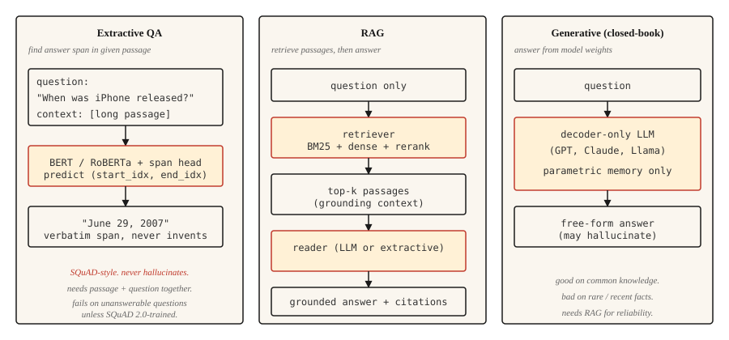

# 问答系统

> 三种系统塑造了现代问答:抽取式找片段,检索增强把答案接地到文档,生成式直接产出答案。今天每一个 AI 助手都是三者的混合。

**类型:** 动手构建
**编程语言:** Python
**前置要求:** 第 5 阶段 · 11(机器翻译),第 5 阶段 · 10(注意力机制)
**预计耗时:** 约 75 分钟

## 问题

用户输入 "When did the first iPhone launch?",期待的是 "June 29, 2007"——不是 "Apple 的历史源远流长",也不是孤零零一个没有句子的 "2007"。要的是直接、有据、正确的答案。

过去十年,三种架构主导了问答。

- **抽取式问答。** 给定问题和一个已知含有答案的段落,找出答案片段在段落中的起止下标。SQuAD 是 经典 基准。
- **开放域问答。** 段落不给定:先检索出相关段落,再抽取或生成答案。这是今天每一条 RAG 流水线的基石。
- **生成式 / 闭卷问答。** 大语言模型凭参数记忆作答,不做检索。推理最快,事实最不可靠。

2026 年的趋势是混合:检索出最好的几个段落,再提示生成模型基于这些段落作答——这就是 RAG,第 14 课会深入讲检索那一半,本课构建问答这一半。

## 概念



**抽取式。** 用 Transformer(BERT 家族)把问题和段落一起编码,训练两个头分别预测答案的起止 token 下标,损失是合法位置上的交叉熵。输出是段落中的一段。构造上永不幻觉(答案必然来自原文),构造上也永远处理不了段落回答不了的问题。

**检索增强(RAG)。** 两个阶段:检索器先从语料中找出前 `k` 个段落,阅读器(抽取式或生成式)再用这些段落产出答案。检索-阅读分离让两者可以独立训练、独立评估。现代 RAG 常在两者之间加一个重排序器(reranker)。

**生成式。** 解码器-only 的 LLM(GPT、Claude、Llama)凭学进权重的知识作答,没有检索环节。常识问题表现出色,罕见或新近的事实上灾难性失败。幻觉率与事实在预训练数据中的出现频率负相关。

```figure
qa-span
```

## 动手构建

### 第 1 步:用预训练模型做抽取式问答

```python
from transformers import pipeline

qa = pipeline("question-answering", model="deepset/roberta-base-squad2")

passage = (
    "Apple Inc. released the first iPhone on June 29, 2007. "
    "The device was announced by Steve Jobs at Macworld in January 2007."
)
question = "When was the first iPhone released?"

answer = qa(question=question, context=passage)
print(answer)
```

```python
{'score': 0.98, 'start': 57, 'end': 70, 'answer': 'June 29, 2007'}
```

`deepset/roberta-base-squad2` 在 SQuAD 2.0 上训练,其中包含无法回答的问题。注意:`question-answering` 流水线默认总是返回得分最高的片段,即便模型的"空答案"分数更高——它*不会*自动返回空答案。要得到显式的"无答案"行为,给流水线调用传 `handle_impossible_answer=True`:这样只有当空答案分数超过所有片段分数时,流水线才返回空答案。无论用哪种方式,都务必检查 `score` 字段。

### 第 2 步:检索增强流水线(示意)

```python
from sentence_transformers import SentenceTransformer
import numpy as np

encoder = SentenceTransformer("sentence-transformers/all-MiniLM-L6-v2")

corpus = [
    "Apple Inc. released the first iPhone on June 29, 2007.",
    "Macworld 2007 featured the iPhone announcement by Steve Jobs.",
    "Android launched in 2008 as Google's mobile operating system.",
    "The first iPod was released in 2001.",
]
corpus_embeddings = encoder.encode(corpus, normalize_embeddings=True)


def retrieve(question, top_k=2):
    q_emb = encoder.encode([question], normalize_embeddings=True)
    sims = (corpus_embeddings @ q_emb.T).squeeze()
    order = np.argsort(-sims)[:top_k]
    return [corpus[i] for i in order]


def answer(question):
    passages = retrieve(question, top_k=2)
    combined = " ".join(passages)
    return qa(question=question, context=combined)


print(answer("When was the first iPhone released?"))
```

两段式流水线:稠密检索器(Sentence-BERT)按语义相似度找相关段落,抽取式阅读器(RoBERTa-SQuAD)从合并后的顶部段落中拉出答案片段。小语料上可行;百万文档级语料,用 FAISS 或向量数据库。

### 第 3 步:生成式 RAG

```python
def rag_generate(question, llm):
    passages = retrieve(question, top_k=3)
    prompt = f"""Context:
{chr(10).join('- ' + p for p in passages)}

Question: {question}

Answer using only the context above. If the context does not contain the answer, say "I don't know."
"""
    return llm(prompt)
```

提示模式很重要。明确告诉模型只依据上下文作答、上下文不足时回答 "I don't know",相比朴素提示能把幻觉率降低 40–60%。更精细的模式还会加引用、置信分数和结构化抽取。

### 第 4 步:反映真实世界的评估

SQuAD 用**完全匹配(EM)**和 **token 级 F1**。EM 是归一化(小写、去标点、去冠词)之后的严格匹配——要么完全一致,要么得 0 分。F1 按预测与参考答案的 token 重合计算,给部分分数。两者都会低估释义:"June 29, 2007" 对 "June 29th, 2007" 通常 EM 得 0(序数词破坏了归一化),但仍能从重合 token 中拿到可观的 F1。

生产 QA 要评的:

- **答案准确率**(LLM 评判或人工评判,因为指标捕捉不到语义等价)。
- **引用准确率。** 引用的段落真的支持答案吗?生成的引用与检索到的段落做字符串匹配,自动可查。
- **拒答校准。** 答案不在检索到的段落里时,系统是否正确说出"我不知道"?测量虚报置信率。
- **检索召回。** 评估阅读器之前,先测检索器能否把正确段落送进前 `k`。阅读器救不回一个没被检出的段落。

### RAGAS:2026 年的生产评估框架

`RAGAS` 专为 RAG 系统设计,是 2026 年的交付默认。它不需要黄金参考答案,从四个维度打分:

- **忠实性(Faithfulness)。** 答案中的每个断言都来自检索到的上下文吗?用基于 NLI 的蕴含测量。这是你的首要幻觉指标。
- **答案相关性(Answer relevance)。** 答案回应了问题吗?从答案反向生成假设问题,与真实问题比较来测量。
- **上下文精确率(Context precision)。** 检索到的块中,真正相关的占比多少?低精确 = 提示词里掺了噪声。
- **上下文召回率(Context recall)。** 检索集合是否包含了所需的全部信息?低召回 = 阅读器不可能成功。

无参考打分让你能在没有精选标准答案的情况下评估线上生产流量。对开放式问题,再叠一层 LLM 裁判——精确匹配类指标在那里毫无用处。

`pip install ragas`,接上你的检索器和阅读器,每个查询得到四个标量,对回归设告警。

## 投入使用

2026 年的组合。

| 场景 | 推荐 |
|---------|-------------|
| 给定段落,找答案片段 | `deepset/roberta-base-squad2` |
| 固定语料,闭卷不可接受 | RAG:稠密检索器 + LLM 阅读器 |
| 文档库上的实时问答 | RAG 配混合检索(BM25 + 稠密)+ 重排序器(第 14 课) |
| 对话式问答(带追问) | LLM 带对话历史,每轮做 RAG |
| 强事实性、受监管领域 | 在权威语料上做抽取式;绝不单用生成式 |

2026 年抽取式问答显得过时,因为带 LLM 的 RAG 能处理更多情况。但在必须逐字引用的场景它仍在服役:法律研究、监管合规、审计工具。

## 交付

保存为 `outputs/skill-qa-architect.md`:

```markdown
---
name: qa-architect
description: Choose QA architecture, retrieval strategy, and evaluation plan.
version: 1.0.0
phase: 5
lesson: 13
tags: [nlp, qa, rag]
---

Given requirements (corpus size, question type, factuality constraint, latency budget), output:

1. Architecture. Extractive, RAG with extractive reader, RAG with generative reader, or closed-book LLM. One-sentence reason.
2. Retriever. None, BM25, dense (name the encoder), or hybrid.
3. Reader. SQuAD-tuned model, LLM by name, or "domain-fine-tuned DistilBERT."
4. Evaluation. EM + F1 for extractive benchmarks; answer accuracy + citation accuracy + refusal calibration for production. Name what you are measuring and how you are measuring it.

Refuse closed-book LLM answers for regulatory or compliance-sensitive questions. Refuse any QA system without a retrieval-recall baseline (you cannot evaluate the reader without knowing the retriever surfaced the right passage). Flag questions that require multi-hop reasoning as needing specialized multi-hop retrievers like HotpotQA-trained systems.
```

## 练习

1. **简单。** 在 10 个 Wikipedia 段落上搭好上面的 SQuAD 抽取流水线,手工出 10 个问题,统计答对率。段落和问题都干净的话,你应该看到 7–9 个答对。
2. **中等。** 加一个拒答分类器:当最高检索分数低于阈值(比如余弦 0.3)时,返回"我不知道"而不调用阅读器。在留出集上调阈值。
3. **困难。** 在你自选的 10,000 文档语料上构建 RAG 流水线,实现混合检索(BM25 + 稠密)加 RRF 融合(见第 14 课)。测量有无混合步骤时的答案准确率,记录哪类问题受益最大。

## 关键术语

| 术语 | 别人的说法 | 实际含义 |
|------|-----------------|-----------------------|
| 抽取式问答(Extractive QA) | 找答案片段 | 预测答案在给定段落中的起止下标 |
| 开放域问答(Open-domain QA) | 语料上的 QA | 没有给定段落,必须先检索再回答 |
| RAG | 先检索再生成 | 检索增强生成,检索器 + 阅读器的流水线 |
| SQuAD | 经典 基准 | 斯坦福问答数据集,指标为 EM + F1 |
| 幻觉(Hallucination) | 编造的答案 | 检索到的上下文不支持的阅读器输出 |
| 拒答校准(Refusal calibration) | 知道何时闭嘴 | 无法回答时,系统能正确说出"我不知道" |

## 延伸阅读

- [Rajpurkar et al. (2016). SQuAD: 100,000+ Questions for Machine Comprehension of Text](https://arxiv.org/abs/1606.05250)——基准论文
- [Karpukhin et al. (2020). Dense Passage Retrieval for Open-Domain QA](https://arxiv.org/abs/2004.04906)——DPR,QA 的 经典 稠密检索器
- [Lewis et al. (2020). Retrieval-Augmented Generation for Knowledge-Intensive NLP Tasks](https://arxiv.org/abs/2005.11401)——给 RAG 命名的论文
- [Gao et al. (2023). Retrieval-Augmented Generation for Large Language Models: A Survey](https://arxiv.org/abs/2312.10997)——全面的 RAG 综述
