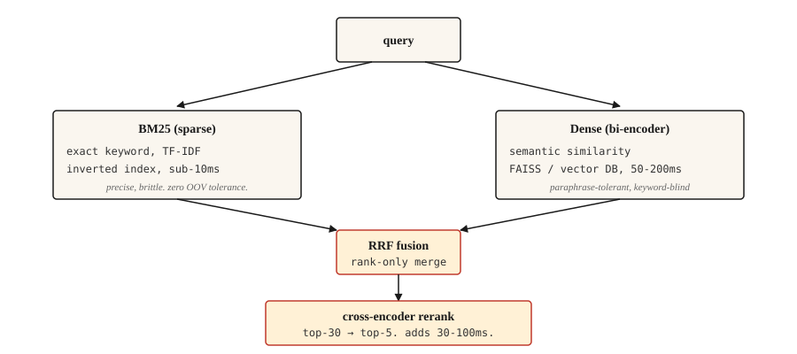

# 信息检索与搜索

> BM25 精准但脆弱;稠密检索网撒得宽却会漏关键词;混合检索是 2026 年的默认答案。其余都是调参。

**类型:** 动手构建
**编程语言:** Python
**前置要求:** 第 5 阶段 · 02(BoW + TF-IDF),第 5 阶段 · 04(GloVe、FastText、子词)
**预计耗时:** 约 75 分钟

## 问题

用户输入"有人骗钱会怎么样",期望找到真正管这事的法条:"IPC 第 420 条"。关键词搜索完全找不到(两边没有共同词汇);语义搜索也会找不到,如果嵌入模型没在法律文本上训练过。真实世界的搜索必须两种都能应付。

IR(信息检索)是每个 RAG 系统、每个搜索框、每个文档站模糊查找底下的流水线。2026 年能在生产环境跑起来的架构不是单一方法,而是一条互补方法串成的链:每一环都在补前一环的漏。

本课把每一环都搭出来,并讲清各自补的是什么漏。

## 概念



四层。按需取用。

1. **稀疏检索(BM25)。** 快,精确匹配上很准,语义上很瞎。跑在倒排索引上,百万级文档单次查询 10 毫秒以内。法条引用、产品型号、错误码、命名实体这类查询,它一抓一个准。
2. **稠密检索。** 把查询和文档编码成向量,做最近邻搜索。能抓住改写和语义相似,但会对只差一个字符的精确关键词视而不见。用 FAISS 或向量数据库,单次查询 50-200 毫秒。
3. **融合。** 合并稀疏和稠密两路排序结果。倒数排名融合(RRF)是省事的默认选择:它无视原始分数(两路分数根本不在一个量纲),只用排名位置。如果你能确定某一路信号在你的领域里占主导,也可以用加权融合。
4. **Cross-encoder 重排。** 取融合后的前 30 条,跑 cross-encoder(查询和文档拼在一起,逐对打分),留前 5 条。Cross-encoder 每对比 bi-encoder 慢,但准得多——只让它跑前 30 条,成本就摊薄了。

三路检索(BM25 + 稠密 + SPLADE 这类学习稀疏)在 2026 年的基准测试上超过两路,但需要为学习稀疏索引搭基础设施。对大多数团队,两路加 cross-encoder 重排是甜点位。

```figure
gx-hybrid-retrieval
```

## 动手构建

### 第 1 步:从零实现 BM25

```python
import math
import re
from collections import Counter

TOKEN_RE = re.compile(r"[a-z0-9]+")


def tokenize(text):
    return TOKEN_RE.findall(text.lower())


class BM25:
    def __init__(self, corpus, k1=1.5, b=0.75):
        if not corpus:
            raise ValueError("corpus must not be empty")
        self.corpus = [tokenize(d) for d in corpus]
        self.k1 = k1
        self.b = b
        self.n_docs = len(self.corpus)
        self.avg_dl = sum(len(d) for d in self.corpus) / self.n_docs
        self.df = Counter()
        for doc in self.corpus:
            for term in set(doc):
                self.df[term] += 1

    def idf(self, term):
        n = self.df.get(term, 0)
        return math.log(1 + (self.n_docs - n + 0.5) / (n + 0.5))

    def score(self, query, doc_idx):
        q_tokens = tokenize(query)
        doc = self.corpus[doc_idx]
        dl = len(doc)
        freq = Counter(doc)
        score = 0.0
        for term in q_tokens:
            f = freq.get(term, 0)
            if f == 0:
                continue
            numerator = f * (self.k1 + 1)
            denominator = f + self.k1 * (1 - self.b + self.b * dl / self.avg_dl)
            score += self.idf(term) * numerator / denominator
        return score

    def rank(self, query, top_k=10):
        scored = [(self.score(query, i), i) for i in range(self.n_docs)]
        scored.sort(reverse=True)
        return scored[:top_k]
```

两个值得了解的参数。`k1=1.5` 控制词频饱和度,越大越看重词的重复出现;`b=0.75` 控制长度归一化,0 是完全不看文档长度,1 是完全归一化。默认值是 Robertson 在原论文里的推荐,基本不用调。

### 第 2 步:用 bi-encoder 做稠密检索

```python
from sentence_transformers import SentenceTransformer
import numpy as np


def build_dense_index(corpus, model_id="sentence-transformers/all-MiniLM-L6-v2"):
    encoder = SentenceTransformer(model_id)
    embeddings = encoder.encode(corpus, normalize_embeddings=True)
    return encoder, embeddings


def dense_search(encoder, embeddings, query, top_k=10):
    q_emb = encoder.encode([query], normalize_embeddings=True)
    sims = (embeddings @ q_emb.T).flatten()
    order = np.argsort(-sims)[:top_k]
    return [(float(sims[i]), int(i)) for i in order]
```

对嵌入做 L2 归一化,点积就等于余弦相似度。`all-MiniLM-L6-v2` 是 384 维,快,对大多数英文检索够用。多语言场景用 `paraphrase-multilingual-MiniLM-L12-v2`。追求最高准确率用 `bge-large-en-v1.5` 或 `e5-large-v2`。

### 第 3 步:倒数排名融合(RRF)

```python
def reciprocal_rank_fusion(rankings, k=60):
    scores = {}
    for ranking in rankings:
        for rank, (_, doc_idx) in enumerate(ranking):
            scores[doc_idx] = scores.get(doc_idx, 0.0) + 1.0 / (k + rank + 1)
    fused = sorted(scores.items(), key=lambda x: x[1], reverse=True)
    return [(score, doc_idx) for doc_idx, score in fused]
```

`k=60` 这个常数来自 RRF 原始论文。`k` 越大,排名差异的贡献越平;`k` 越小,头部排名越主导。60 是论文发表的默认值,基本不用调。

### 第 4 步:混合搜索 + 重排

```python
from sentence_transformers import CrossEncoder

reranker = CrossEncoder("cross-encoder/ms-marco-MiniLM-L-6-v2")


def hybrid_search(query, bm25, encoder, dense_embeddings, corpus, top_k=5, pool_size=30, reranker=reranker):
    sparse_ranking = bm25.rank(query, top_k=pool_size)
    dense_ranking = dense_search(encoder, dense_embeddings, query, top_k=pool_size)
    fused = reciprocal_rank_fusion([sparse_ranking, dense_ranking])[:pool_size]

    pairs = [(query, corpus[doc_idx]) for _, doc_idx in fused]
    scores = reranker.predict(pairs)
    reranked = sorted(zip(scores, [doc_idx for _, doc_idx in fused]), reverse=True)
    return reranked[:top_k]
```

三段串联。BM25 找词汇匹配,稠密找语义匹配,RRF 在不需要分数校准的情况下合并两路排名,cross-encoder 把查询和文档放在一起对前 30 条重打分,捕捉 bi-encoder 漏掉的细粒度相关性。最后留前 5 条。

### 第 5 步:评估

| 指标 | 含义 |
|--------|---------|
| Recall@k | 在正确答案存在的查询中,它进入前 k 名的比例 |
| MRR(平均倒数排名) | 首个相关文档排名倒数的平均值 |
| nDCG@k | 考虑相关性的分级,而不只是"相关/不相关"的二值 |

对 RAG 来说,检索器的 **Recall@k** 是最重要的数字。正确的段落不在检索结果里,阅读器(reader)再有本事也答不出来。

调试技巧:对失败的查询,对比稀疏和稠密两路的排名差异。如果一路找到了正确文档而另一路没有,要么是词汇不匹配(对策:补上缺的那一路),要么是语义歧义(对策:换更好的嵌入或加重排器)。

## 投入使用

2026 年的技术栈:

| 规模 | 技术栈 |
|-------|-------|
| 1k-10 万文档 | 内存版 BM25 + `all-MiniLM-L6-v2` 嵌入 + RRF。不需要单独的数据库。 |
| 10 万-1000 万文档 | 稠密用 FAISS 或 pgvector,BM25 用 Elasticsearch / OpenSearch,两路并行。 |
| 1000 万+ 文档 | Qdrant / Weaviate / Vespa / Milvus,带混合检索支持,前 30 条过 cross-encoder 重排。 |
| 质量最前沿 | 三路(BM25 + 稠密 + SPLADE)+ ColBERT 迟交互重排 |

无论选什么,都要给评估留预算。先基准化检索召回率,再基准化端到端 RAG 准确率。检索器漏掉的东西,阅读器补不回来。

### 2026 年生产 RAG 的血泪经验

- **80% 的 RAG 故障能追溯到数据摄入和切块,而不是模型。** 团队花几周换 LLM、调提示词,检索却每三个查询就悄悄返回一次错误上下文。先修切块。
- **切块策略比块大小更重要。** 定长切分会把表格、代码、嵌套标题拦腰砍断。句子感知是默认选择;对技术文档和产品手册,语义切块或基于 LLM 的切块值得投入。
- **父文档模式。** 检索时用小的"子块"保精度;当同一父节的多个子块命中时,换入父块保上下文。这一招不重训就能稳定提升回答质量。
- **k_rerank=3 通常最优。** 每多塞一块,只是多了 token 成本和生成延迟,回答质量并不涨。如果你 k=8 还比 k=3 好,那是重排器不行。
- **HyDE / 查询扩展。** 先让模型为查询生成一个假想答案,嵌入这个答案再去检索。弥合短问题和长文档之间的措辞鸿沟。不用训练,白捡的精度提升。
- **上下文预算压到 8K token 以内。** 如果经常顶到这个限,说明重排器的阈值太松了。
- **一切皆版本。** 提示词、切块规则、嵌入模型、重排器,全部纳入版本管理。任何漂移都会悄悄搞坏回答质量。在 CI 里卡忠实度、上下文精确率和未答问题率,把回归挡在用户看到之前。
- **三路检索(BM25 + 稠密 + SPLADE 这类学习稀疏)胜过两路**,这是 2026 年基准测试的结论,对专名和语义混合的查询尤其明显。基础设施支持 SPLADE 索引时就上三路。

按 2026 年的行业测量,合理的检索设计能把幻觉(hallucination)降低 70-90%。RAG 的性能提升大多来自更好的检索,而不是模型微调。

## 交付

保存为 `outputs/skill-retrieval-picker.md`:

```markdown
---
name: retrieval-picker
description: Pick a retrieval stack for a given corpus and query pattern.
version: 1.0.0
phase: 5
lesson: 14
tags: [nlp, retrieval, rag, search]
---

Given requirements (corpus size, query pattern, latency budget, quality bar, infra constraints), output:

1. Stack. BM25 only, dense only, hybrid (BM25 + dense + RRF), hybrid + cross-encoder rerank, or three-way (BM25 + dense + learned-sparse).
2. Dense encoder. Name the specific model. Match to language(s), domain, and context length.
3. Reranker. Name the specific cross-encoder model if used. Flag that rerank adds 30-100ms latency on top-30.
4. Evaluation plan. Recall@10 is the primary retriever metric. MRR for multi-answer. Baseline first, incremental improvements measured against it.

Refuse to recommend dense-only for corpora with named entities, error codes, or product SKUs unless the user has evidence dense handles exact matches. Refuse to skip reranking for high-stakes retrieval (legal, medical) where the final top-5 decides the user's answer.
```

## 练习

1. **入门。** 在 500 篇文档的语料上实现上面的 `hybrid_search`。测 20 个查询,对比纯 BM25、纯稠密、混合三种方案的 recall@5。
2. **进阶。** 加上 MRR 计算。对每个已知正确文档的测试查询,找出正确文档在 BM25、稠密、混合三路排名中的位次,分别报告 MRR。
3. **挑战。** 用 MultipleNegativesRankingLoss(Sentence Transformers)在你的领域数据上微调稠密编码器。用 500 对查询-文档构建训练集,对比微调前后的召回率。

## 关键术语

| 术语 | 大家嘴里的说法 | 实际含义 |
|------|-----------------|-----------------------|
| BM25 | 关键词搜索 | Okapi BM25,按词频、IDF 和文档长度给文档打分 |
| 稠密检索 | 向量搜索 | 把查询和文档编码成向量,找最近邻 |
| Bi-encoder | 嵌入模型 | 查询和文档各自独立编码,查询时很快 |
| Cross-encoder | 重排模型 | 查询和文档拼在一起编码,慢但准 |
| RRF | 排名融合 | 按 `1/(k + rank)` 求和来合并两路排名 |
| Recall@k | 检索指标 | 相关文档进入前 k 名的查询占比 |

## 延伸阅读

- [Robertson and Zaragoza (2009). The Probabilistic Relevance Framework: BM25 and Beyond](https://www.staff.city.ac.uk/~sbrp622/papers/foundations_bm25_review.pdf) —— BM25 的权威论述
- [Karpukhin et al. (2020). Dense Passage Retrieval for Open-Domain QA](https://arxiv.org/abs/2004.04906) —— DPR,bi-encoder 的范本
- [Formal et al. (2021). SPLADE: Sparse Lexical and Expansion Model](https://arxiv.org/abs/2107.05720) —— 弥合与稠密检索差距的学习稀疏检索器
- [Cormack, Clarke, Büttcher (2009). Reciprocal Rank Fusion outperforms Condorcet and individual Rank Learning Methods](https://plg.uwaterloo.ca/~gvcormac/cormacksigir09-rrf.pdf) —— RRF 论文
- [Khattab and Zaharia (2020). ColBERT: Efficient and Effective Passage Search](https://arxiv.org/abs/2004.12832) —— 迟交互检索
