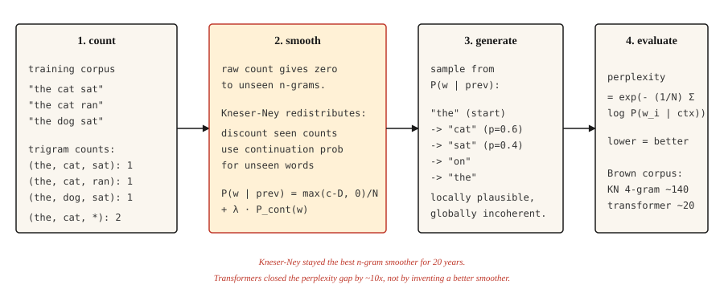

# Transformer 之前的文本生成 —— N-gram 语言模型

> 一个词越出人意料,模型就越差。困惑度(perplexity)把"意外"变成数字,平滑(smoothing)让这个数字不至于爆成无穷。

**类型:** 动手构建
**编程语言:** Python
**前置要求:** 第 5 阶段 · 01(文本处理),第 2 阶段 · 14(朴素贝叶斯)
**预计耗时:** 约 45 分钟

## 问题

在 Transformer 之前、在 RNN 之前、在词嵌入之前,语言模型预测下一个词的方法就一个字:数。数某个词跟在前 `n-1` 个词后面出现了多少次。"the cat" → "sat" 出现 47 次,"the cat" → "jumped" 出现 12 次,"the cat" → "refrigerator" 出现 0 次。归一化,就得到一个概率分布。

这就是 n-gram 语言模型。从 1980 年到 2015 年,每一台语音识别器、每一个拼写检查器、每一套基于短语的机器翻译系统,跑的都是它。直到今天,需要在设备端做廉价语言建模时,它还在跑。

真正有意思的问题是怎么对付没见过的 n-gram。裸计数模型对任何没见过的东西都给零概率,这是灾难性的:句子那么长,几乎每句长句子里都至少有一个没见过的序列。五十年的平滑研究解决了这个问题,Kneser-Ney 平滑就是结晶,现代深度学习继承的正是这一脉实证传统。

## 概念



### 猜谜游戏

在这套机器出现之前,一个实验就定义了什么是语言模型。遮住英文句子的下一个字母,让人一次猜一个字母,猜对为止,记下猜了几次。对几百个字母重复这个实验。

这些猜测次数不是 trivia 小游戏,它们是文本的无损重编码:把这串次数交给第二个规则完全相同的猜测者,他能还原出每一个字母——因为在每个位置上,他都知道候选字母的先后顺序。一条消息能用更少的符号重编码,说明每个符号携带的信息更少,所以猜测次数的统计,给英文的熵定出了上界。

香农(Shannon)在 1951 年做了这个实验,得到的数字至今统治着这个领域。27 个符号的字母表(26 个字母加空格)理论上每字母能携带 `log2(27) ≈ 4.75` 比特;而拿着 100 个字母上下文的人类猜测者,落在每字母 0.6 到 1.3 比特之间。英文大约四分之三都是"被迫的落子"。早在任何模型能学习之前,模型要学的结构就已经被测量出来了。

此后的每一个语言模型,都是这个游戏的机械玩家,而本课的每一个评估数字,都是这个游戏的记分:

- **交叉熵损失**就是模型为每个符号平均需要的比特数。训练语言模型,字面意义上就是在最小化它玩猜谜游戏的得分。
- **困惑度**是 `2^bits`(或 `e^nats`):猜完之后模型面前还剩的分支因子。在 27 个符号上均匀瞎猜,困惑度是 27;每字母 1 比特的玩家,困惑度是 2。
- **上下文长度就是玩家的记忆力。** 三元模型带着两个 token 的记忆上场;Transformer 玩同一个游戏,带着 10 万个 token 的记忆。规则从未改变,只是玩家变强了。

留意一处单位换算:游戏按字母记分,用比特(`log2`);下面 n-gram 的公式按词 token 记分,用 nat(自然对数)。由于 nats 下的困惑度 `e^H` 等于 bits 下的 `2^H`,两种视角是同一测量的不同单位。

```figure
prediction-game
```

**N-gram 概率:** `P(w_i | w_{i-n+1}, ..., w_{i-1})`。定下 `n`(通常 3 是三元,4 是四元),用计数计算:

```text
P(w | context) = count(context, w) / count(context)
```

**零计数问题。** 训练中没见过的 n-gram 概率为零。2007 年一项基于 Brown 语料库的研究发现,即使用四元模型,留出集里也有 30% 的四元序列在训练中没见过。不做平滑,任何真实文本都没法评估。

**平滑方法,按精巧程度排序:**

1. **Laplace(加一)。** 每个计数加 1。简单,但在稀有事件上表现糟糕。
2. **Good-Turing。** 按"频率的频率",把高频事件的概率质量匀一部分给没见过的事件。
3. **插值(Interpolation)。** 用可调权重把 n 元、(n-1) 元等估计组合起来。
4. **回退(Backoff)。** n 元计数为零时,退到 (n-1) 元。Katz 回退把它规范化。
5. **绝对折扣。** 从所有计数里减去固定折扣 `D`,匀给没见过的事件。
6. **Kneser-Ney。** 绝对折扣,加上一个精巧的低阶模型选择:不用原始频率,改用*延续概率*(continuation probability)——一个词出现在多少种不同上下文里。

Kneser-Ney 的洞察很深。"San Francisco" 是常见二元组,但 "Francisco" 这个一元词几乎都跟在 "San" 后面。朴素绝对折扣会给 "Francisco" 很高的一元概率(因为它计数高)。Kneser-Ney 注意到 "Francisco" 只出现在一种上下文里,于是相应压低它的延续概率。结果:一个以 "Francisco" 结尾的新颖二元组,会得到恰如其分的低概率。

**评估:困惑度。** 留出测试集上每词平均负对数似然的指数。越低越好。困惑度 100 意味着模型的困惑程度,相当于在 100 个词里均匀瞎选。

```text
perplexity = exp(- (1/N) * Σ log P(w_i | context_i))
```

```figure
ngram-backoff
```

## 动手构建

### 第 1 步:三元计数

```python
from collections import Counter, defaultdict


def train_ngram(corpus_tokens, n=3):
    ngrams = Counter()
    contexts = Counter()
    for sentence in corpus_tokens:
        padded = ["<s>"] * (n - 1) + sentence + ["</s>"]
        for i in range(len(padded) - n + 1):
            ctx = tuple(padded[i:i + n - 1])
            word = padded[i + n - 1]
            ngrams[ctx + (word,)] += 1
            contexts[ctx] += 1
    return ngrams, contexts


def raw_probability(ngrams, contexts, context, word):
    ctx = tuple(context)
    if contexts.get(ctx, 0) == 0:
        return 0.0
    return ngrams.get(ctx + (word,), 0) / contexts[ctx]
```

输入是分好词的句子列表,输出是 n-gram 计数和上下文计数。`<s>` 和 `</s>` 是句子边界。

### 第 2 步:Laplace 平滑

```python
def laplace_probability(ngrams, contexts, vocab_size, context, word):
    ctx = tuple(context)
    numerator = ngrams.get(ctx + (word,), 0) + 1
    denominator = contexts.get(ctx, 0) + vocab_size
    return numerator / denominator
```

每个计数加 1。能平滑,但给未见事件分配的概率质量过多,连累了那些少见的已知事件。

### 第 3 步:Kneser-Ney(二元,插值版)

```python
def kneser_ney_bigram_model(corpus_tokens, discount=0.75):
    unigrams = Counter()
    bigrams = Counter()
    unigram_contexts = defaultdict(set)

    for sentence in corpus_tokens:
        padded = ["<s>"] + sentence + ["</s>"]
        for i, w in enumerate(padded):
            unigrams[w] += 1
            if i > 0:
                prev = padded[i - 1]
                bigrams[(prev, w)] += 1
                unigram_contexts[w].add(prev)

    total_unique_bigrams = sum(len(ctx_set) for ctx_set in unigram_contexts.values())
    continuation_prob = {
        w: len(ctx_set) / total_unique_bigrams for w, ctx_set in unigram_contexts.items()
    }

    context_totals = Counter()
    for (prev, w), count in bigrams.items():
        context_totals[prev] += count

    unique_follow = defaultdict(set)
    for (prev, w) in bigrams:
        unique_follow[prev].add(w)

    def prob(prev, w):
        count = bigrams.get((prev, w), 0)
        denom = context_totals.get(prev, 0)
        if denom == 0:
            return continuation_prob.get(w, 1e-9)
        first_term = max(count - discount, 0) / denom
        lambda_prev = discount * len(unique_follow[prev]) / denom
        return first_term + lambda_prev * continuation_prob.get(w, 1e-9)

    return prob
```

三个活动部件。`continuation_prob` 刻画"这个词出现在多少种不同的上下文里"(Kneser-Ney 的创新点);`lambda_prev` 是折扣释放出来的概率质量,用来给回退项加权。最终概率 = 打过折的主项 + 加权的延续项。

### 第 4 步:采样生成文本

```python
import random


def generate(prob_fn, vocab, prefix, max_len=30, seed=0):
    rng = random.Random(seed)
    tokens = list(prefix)
    for _ in range(max_len):
        candidates = [(w, prob_fn(tokens[-1], w)) for w in vocab]
        total = sum(p for _, p in candidates)
        r = rng.random() * total
        acc = 0.0
        for w, p in candidates:
            acc += p
            if r <= acc:
                tokens.append(w)
                break
        if tokens[-1] == "</s>":
            break
    return tokens
```

按概率比例采样,换个种子输出就变。想要类似束搜索的效果,就每步取 argmax(贪心),再加一个小小的随机旋钮(temperature)。

### 第 5 步:困惑度

```python
import math


def perplexity(prob_fn, sentences):
    total_log_prob = 0.0
    total_tokens = 0
    for sentence in sentences:
        padded = ["<s>"] + sentence + ["</s>"]
        for i in range(1, len(padded)):
            p = prob_fn(padded[i - 1], padded[i])
            total_log_prob += math.log(max(p, 1e-12))
            total_tokens += 1
    return math.exp(-total_log_prob / total_tokens)
```

越低越好。在 Brown 语料库上,调好的四元 KN 模型困惑度大约 140;同一个测试集上,Transformer 语言模型能到 15-30。差距约 10 倍。这个差距,就是整个领域转身离开的原因。

## 投入使用

- **经典 NLP 教学。** 这是接触平滑、MLE 和困惑度最清晰的一条路。
- **KenLM。** 生产级 n-gram 库,在语音和机器翻译系统里当重打分器(rescorer)用,这些地方延迟要紧。
- **设备端自动补全。** 键盘里的三元模型。至今仍是。
- **基线。** 宣布你的神经语言模型好用之前,永远先算一个 n-gram 模型的困惑度。如果你的 Transformer 不能大幅赢过 KN,那一定是哪里出了问题。

## 交付

保存为 `outputs/prompt-lm-baseline.md`:

```markdown
---
name: lm-baseline
description: Build a reproducible n-gram language model baseline before training a neural LM.
phase: 5
lesson: 16
---

Given a corpus and target use (next-word prediction, rescoring, perplexity baseline), output:

1. N-gram order. Trigram for general English, 4-gram if corpus is large, 5-gram for speech rescoring.
2. Smoothing. Modified Kneser-Ney is the default; Laplace only for teaching.
3. Library. `kenlm` for production, `nltk.lm` for teaching, roll your own only to learn.
4. Evaluation. Held-out perplexity with consistent tokenization between train and test sets.

Refuse to report perplexity computed with different tokenization between systems being compared — perplexity numbers are comparable only under identical tokenization. Flag OOV rate in test set; KN handles OOV poorly unless you reserve a special <UNK> token during training.
```

## 练习

1. **入门。** 在 1000 句莎士比亚语料上训练三元语言模型,生成 20 个句子。它们会局部通顺、全局疯癫——这是最经典的演示。
2. **进阶。** 在留出的莎士比亚数据集上为你的 KN 模型实现困惑度,和 Laplace 平滑对比。KN 的困惑度应该低 30-50%。
3. **挑战。** 构建一个三元拼写纠正器:给定一个拼错的词和它的上下文,生成候选纠正,按 LM 的上下文概率排序。在 Birkbeck 拼写语料库(公开)上评估。

## 关键术语

| 术语 | 大家嘴里的说法 | 实际含义 |
|------|-----------------|-----------------------|
| N-gram | 词序列 | 连续 `n` 个 token 组成的序列 |
| 平滑(Smoothing) | 避免零概率 | 重新分配概率质量,让没见过的事件也有非零概率 |
| 困惑度(Perplexity) | 语言模型质量指标 | 留出数据上的 `exp(-平均对数概率)`,越低越好 |
| 回退(Backoff) | 退回更短的上下文 | 三元计数为零就用二元,Katz 回退把它形式化 |
| Kneser-Ney | n-gram 最好的平滑 | 绝对折扣 + 低阶模型用延续概率 |
| 延续概率 | KN 专属 | `P(w)` 按 `w` 出现的上下文种数加权,不按原始计数 |
| 文本的熵 | 每个符号的信息量 | 给定上下文,编码下一个符号平均需要的比特数。香农 1951 年对印刷英文(上下文至多 100 个字母)的估计:0.6-1.3 比特/字母——在任何模型出现之前就测出来了 |

## 延伸阅读

- [Shannon (1951). Prediction and Entropy of Printed English](https://www.princeton.edu/~wbialek/rome/refs/shannon_51.pdf) —— 定义了所有语言模型至今仍在优化的目标的猜谜实验
- [Jurafsky and Martin — Speech and Language Processing, Chapter 3(2026 draft)](https://web.stanford.edu/~jurafsky/slp3/3.pdf) —— n-gram 语言模型与平滑的经典论述
- [Chen and Goodman (1998). An Empirical Study of Smoothing Techniques for Language Modeling](https://dash.harvard.edu/handle/1/25104739) —— 一锤定音确立 Kneser-Ney 为最佳 n-gram 平滑的论文
- [Kneser and Ney (1995). Improved Backing-off for M-gram Language Modeling](https://ieeexplore.ieee.org/document/479394) —— KN 原始论文
- [KenLM](https://kheafield.com/code/kenlm/) —— 快速的生产级 n-gram 语言模型,2026 年仍用于延迟敏感的应用
