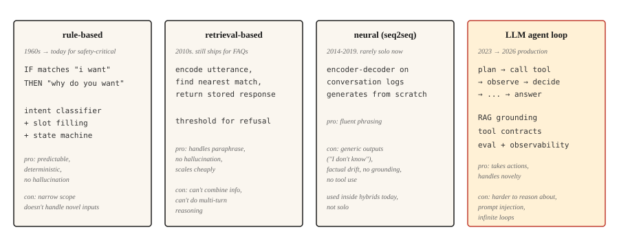

# 聊天机器人 —— 从规则到神经再到 LLM 智能体

> ELIZA 用模式匹配回话,DialogFlow 做意图映射,GPT 从权重里生成答案,Claude 跑工具并验证结果。每一代都在治上一代最难看的病。

**类型:** 学习
**编程语言:** Python
**前置要求:** 第 5 阶段 · 13(问答),第 5 阶段 · 14(信息检索)
**预计耗时:** 约 75 分钟

## 问题

用户说"我想改签航班"。系统得搞清楚:他想要什么、缺什么信息、怎么拿到这些信息、怎么完成这个操作。然后用户又说"等等,我直接取消怎么样?"——系统得记住上下文、切换任务、保住状态。

对话对 ML 系统来说很难。输入是开放式的;输出要在很多轮里保持连贯;系统可能还要动手改造世界(改签航班、扣款)。每一步走错,用户都看在眼里。

聊天机器人的架构已经历了四个范式,每一个都是因为上一代失败得太难看才被请上台的。本课按顺序走一遍。2026 年的生产格局,是后两种的混合体。

## 概念



### 脚本化的半个世纪,1950-2001

第一个范式没有撑过五年——它撑了五十年。了解这段弧线很重要,因为其中的每个系统都是同一台机器:匹配输入、吐出罐头回复、更新一点状态。给这台机器加了五十年规则,也没能加出通用解。这个天花板,就是第二、三、四代范式存在的原因。

**1950 年。** 图灵绕开"机器能思考吗",提出一个可操作的替代判据:如果审问者在电传打字机上分不出机器和人,哲学问题就不重要了。在这个领域连名字都没有的时候,对话就成了它的基准。

**1956 年。** 名字来了——达特茅斯的一场夏季研讨会上,"人工智能"一词诞生,其立论是:智能的每一个特征"原则上都能被精确描述,以至于可以造出机器来模拟它"。提案给"取得实质进展"排的预算是两个月。

**1966 年。** ELIZA 使出了你在第 1 步会亲手实现的映射戏法:分解规则从输入中拆出片段,重组规则把它们以问句形式 echo 回去。总共约 200 条模式,零状态,零理解——可用户照样向它倾诉。Weizenbaum 的后半生都在警觉:让人交出真心,需要的机器竟然这么少。

**1972 年。** PARRY 在斯坦福诞生,用来模拟偏执狂,它补上了 ELIZA 缺的那块:内部状态。恐惧、愤怒、多疑三个数值变量每轮更新,决定下一条触发哪个脚本——同样的输入,因对话进展不同而得到不同的回应。在盲测 transcript 中,精神科医生区分 PARRY 和人类病人的正确率等于瞎猜。它是"人格条件化"的直系祖先——一个用三个浮点数实现的系统提示词。同年,两台机器人在 ARPANET 上被对接到一起:治疗师脚本采访偏执状态机,网络上第一场机器人对机器人的对话。

**1995 年。** ALICE 用 AIML(一种描述模式-模板对的 XML 方言)把 ELIZA 配方规模化:约 4 万条手写类别,三夺 Loebner 奖。它证明了规则系统的规模定律:规则越多,覆盖越广,但永远换不来通用。每一条规则,都是一笔需要有人维护的负债。

**2001 年。** SmarterChild 把这个配方摆到 3000 万即时通讯用户面前,还加了后端查询——天气、股票、电影场次——拼接进模板里。眯起眼看,这就是穿着 2001 年外套的工具调用:解析意图、调用服务、把结果渲染进回复。

五十年,一套机制,规则数一路上涨。这个范式的终结,不是因为谁证伪了它,而是因为手写状态机的维护成本随覆盖度线性增长,而用户的期望值随他们上周看到的东西指数增长。

```figure
chatbot-lineage
```

**规则式(ELIZA、AIML、DialogFlow)。** 手写的模式匹配用户输入并给出回复。意图分类器路由到预定义流程;填槽状态机收集必需信息。在它被设计的窄范围里表现出色,出了范围立刻趴窝。至今仍在安全攸关的领域服役(银行认证、机票预订),那里容不得幻觉。

**检索式。** FAQ 风格的系统。预先把每对(问法, 回答)编码好;运行时编码用户的消息,检索最近的库存回答。想想 Zendesk 经典的"相似文章"功能。比规则更能容忍改写,不做生成,所以没有幻觉。

**神经式(seq2seq)。** 在对话日志上训练的编码器-解码器,从零生成回复。流畅,但容易产出万能废话("我不知道")和事实漂移,从来没法稳定地保持在话题上。2016-2019 年,Google、Facebook、微软的聊天机器人全都令人失望,原因就在这里。

**LLM 智能体。** 把一个语言模型包进循环里:规划、调工具、验证结果。它不是"提示词很长的聊天机器人",而是智能体循环:规划 → 调工具 → 观察结果 → 决定下一步。检索优先的接地(RAG)让它不生幻觉;工具调用让它真能办事。这就是 2026 年的架构。

四个范式不是依次替代的关系。一个 2026 年的生产级聊天机器人会路由穿过全部四层:认证和破坏性操作用规则式,FAQ 用检索式,自然措辞用神经生成,开放式的模糊查询用 LLM 智能体。

## 动手构建

### 第 1 步:规则模式匹配

```python
import re


class RulePattern:
    def __init__(self, pattern, response_template):
        self.regex = re.compile(pattern, re.IGNORECASE)
        self.template = response_template


PATTERNS = [
    RulePattern(r"my name is (\w+)", "Nice to meet you, {0}."),
    RulePattern(r"i (need|want) (.+)", "Why do you {0} {1}?"),
    RulePattern(r"i feel (.+)", "Why do you feel {0}?"),
    RulePattern(r"(.*)", "Tell me more about that."),
]


def rule_based_respond(user_input):
    for pattern in PATTERNS:
        m = pattern.regex.match(user_input.strip())
        if m:
            return pattern.template.format(*m.groups())
    return "I don't understand."
```

20 行写出一个 ELIZA。映射戏法("I feel sad" → "Why do you feel sad")是 Weizenbaum 1966 年那个经典的心理治疗师演示,至今仍有教益。

### 第 2 步:检索式(FAQ)

这段示意代码需要 `pip install sentence-transformers`(会连带安装 torch)。本课可直接运行的 `code/main.py` 用的是标准库的 Jaccard 相似度,所以不装外部依赖也能跑。

```python
from sentence_transformers import SentenceTransformer
import numpy as np


FAQ = [
    ("how do i reset my password", "Go to Settings > Security > Reset Password."),
    ("how do i cancel my order", "Go to Orders, find the order, click Cancel."),
    ("what is your return policy", "30-day returns on unused items, original packaging."),
]


encoder = SentenceTransformer("sentence-transformers/all-MiniLM-L6-v2")
faq_questions = [q for q, _ in FAQ]
faq_embeddings = encoder.encode(faq_questions, normalize_embeddings=True)


def faq_respond(user_input, threshold=0.5):
    q_emb = encoder.encode([user_input], normalize_embeddings=True)[0]
    sims = faq_embeddings @ q_emb
    best = int(np.argmax(sims))
    if sims[best] < threshold:
        return None
    return FAQ[best][1]
```

基于阈值的拒答是关键设计决策:最佳匹配不够近,就返回 `None`,让系统升级处理。

### 第 3 步:神经生成(基线)

用一个小型指令微调的编码器-解码器(FLAN-T5),或者微调过的对话模型。2026 年它单独拿出来没法上生产(自相矛盾、跑题、事实胡扯),但作为混合系统里负责"说得自然"的那一环仍在服役。DialoGPT 式的纯解码器模型需要显式的轮次分隔符和 EOS 处理才能给出连贯回复;教学示例用 FLAN-T5 的 text2text 流水线开箱即用。

```python
from transformers import pipeline

chatbot = pipeline("text2text-generation", model="google/flan-t5-small")

response = chatbot("Respond politely to: Hi there!", max_new_tokens=40)
print(response[0]["generated_text"])
```

### 第 4 步:LLM 智能体循环

2026 年的生产形态:

```python
def agent_loop(user_message, tools, llm, max_steps=5):
    history = [{"role": "user", "content": user_message}]
    for _ in range(max_steps):
        response = llm(history, tools=tools)
        tool_call = response.get("tool_call")
        if tool_call:
            tool_name = tool_call.get("name")
            args = tool_call.get("arguments")
            if not isinstance(tool_name, str) or tool_name not in tools:
                history.append({"role": "assistant", "tool_call": tool_call})
                history.append({"role": "tool", "name": str(tool_name), "content": f"error: unknown tool {tool_name!r}"})
                continue
            if not isinstance(args, dict):
                history.append({"role": "assistant", "tool_call": tool_call})
                history.append({"role": "tool", "name": tool_name, "content": f"error: arguments must be a dict, got {type(args).__name__}"})
                continue
            fn = tools[tool_name]
            result = fn(**args)
            history.append({"role": "assistant", "tool_call": tool_call})
            history.append({"role": "tool", "name": tool_name, "content": result})
        else:
            return response["content"]
    return "I could not complete the task in the step budget."
```

三件事要点名。工具是 LLM 可以调用的函数;循环在 LLM 返回最终答案(而非工具调用)时终止;步数预算防止它在模糊任务上无限循环。

真实生产环境还要加:检索优先的接地(每次 LLM 调用前注入相关文档)、护栏(guardrail,未经确认拒绝破坏性操作)、可观测性(记录每一步)、评估(自动检查智能体行为不跑偏)。

### 第 5 步:混合路由

```python
def hybrid_chat(user_input):
    if is_destructive_action(user_input):
        return structured_flow(user_input)

    faq_answer = faq_respond(user_input, threshold=0.6)
    if faq_answer:
        return faq_answer

    return agent_loop(user_input, tools, llm)


def is_destructive_action(text):
    danger_words = ["delete", "cancel", "charge", "refund", "transfer"]
    return any(w in text.lower() for w in danger_words)
```

模式总结:破坏性的事走确定性规则,罐头 FAQ 走检索,其他一切走 LLM 智能体。2026 年的客服系统就是这么上线的。

## 投入使用

2026 年的技术栈:

| 场景 | 架构 |
|---------|---------------|
| 预订、支付、认证 | 规则状态机 + 填槽 |
| 客服 FAQ | 在精编答案库上检索 |
| 开放式帮助聊天 | LLM 智能体 + RAG + 工具调用 |
| 内部工具 / IDE 助手 | LLM 智能体 + 工具调用(搜索、读、写) |
| 陪伴 / 角色聊天机器人 | 调过人格的 LLM + 人格系统提示词 + 知识检索 |

生产环境永远用混合路由。没有任何单一架构能应付所有请求。路由层本身通常就是一个小小的意图分类器。

## 至今仍在发货的故障模式

- **自信的编造。** LLM 智能体声称完成了一个它根本没做的操作。对策:验证结果、记录工具调用、绝不允许 LLM 在没有成功工具返回的情况下宣称做过某事。
- **提示词注入(prompt injection)。** 用户插入文本,试图覆盖系统提示词。在 OWASP 2025 年 LLM 应用 Top 10 中排名 LLM01。两种形态:直接注入(贴在对话里)和间接注入(藏在文档、邮件或智能体读到的工具输出里)。

  攻击成功率随场景变化。在通用工具使用和编码基准上,前沿模型的实测成功率约 0.5-8.5%;在特定高危配置下(针对 AI 编码智能体的自适应攻击、脆弱的编排)曾达到约 84%。生产环境 CVE 包括 EchoLeak(CVE-2025-32711,CVSS 9.3)——微软 365 Copilot 的零点击数据外泄漏洞,由攻击者控制的一封邮件触发。

  缓解措施:在整个循环里把用户输入当不可信数据;工具调用前做消毒;把工具输出和主提示词隔离;采用"计划-验证-执行"(PVE)模式——智能体先定计划,执行前把每个动作与计划核对(这能阻止工具结果注入计划外的新动作);破坏性操作必须用户确认;工具权限按最小特权授予。

  没有任何提示词工程能完全消除这个风险,必须有外部运行时防线(LLM Guard、白名单校验、语义异常检测)。
- **范围漂移。** 智能体跑偏,因为某个工具调用返回了沾边但不对题的信息。对策:收窄工具契约;系统提示词保持聚焦;给"跑题率"加评估。
- **无限循环。** 智能体反复调同一个工具。对策:步数预算、工具调用去重、用 LLM 当裁判问"我们有进展吗"。
- **上下文窗口耗尽。** 长对话把最早的轮次挤出上下文。对策:摘要旧轮次、按相似度检索相关的历史轮次,或换长上下文模型。

## 交付

保存为 `outputs/skill-chatbot-architect.md`:

```markdown
---
name: chatbot-architect
description: Design a chatbot stack for a given use case.
version: 1.0.0
phase: 5
lesson: 17
tags: [nlp, agents, chatbot]
---

Given a product context (user need, compliance constraints, available tools, data volume), output:

1. Architecture. Rule-based, retrieval, neural, LLM agent, or hybrid (specify which paths go where).
2. LLM choice if applicable. Name the model family (Claude, GPT-4, Llama-3.1, Mixtral). Match to tool-use quality and cost.
3. Grounding strategy. RAG sources, retrieval method (see lesson 14), tool contracts.
4. Evaluation plan. Task success rate, tool-call correctness, off-task rate, hallucination rate on held-out dialogs.

Refuse to recommend a pure-LLM agent for any destructive action (payments, account deletion, data modification) without a structured confirmation flow. Refuse to skip the prompt-injection audit if the agent has write access to anything.
```

## 练习

1. **入门。** 实现上面的规则回复,为一个咖啡店点单机器人写 10 条模式。测边界情况:重复下单、修改订单、取消、意图不清。
2. **进阶。** 搭一个混合 FAQ + LLM 兜底:为一个 SaaS 产品准备 50 条罐头 FAQ,LLM 兜底走文档站检索。用 100 个真实客服问题测拒答率和准确率。
3. **挑战。** 实现上面的智能体循环,配三个工具(search、read-user-data、send-email)。跑 50 个测试场景的评估,其中混入提示词注入尝试。报告跑题率、任务失败率和注入成功数。

## 关键术语

| 术语 | 大家嘴里的说法 | 实际含义 |
|------|-----------------|-----------------------|
| 意图(Intent) | 用户想要什么 | 类别标签(book_flight、reset_password),用来路由到处理器 |
| 槽位(Slot) | 一条信息 | 机器人需要的参数(日期、目的地),填槽就是逐个询问的过程 |
| RAG | 检索加生成 | 先检索相关文档,再让 LLM 的回答接地于它们 |
| 工具调用 | 函数调用 | LLM 发出带名字和参数的结构化调用,运行时执行并返回结果 |
| 智能体循环 | 规划、行动、验证 | 控制器,把 LLM 调用和工具调用交替执行直到任务完成 |
| 提示词注入 | 用户攻击提示词 | 试图覆盖系统提示词的恶意输入 |

## 延伸阅读

- [Turing (1950). Computing Machinery and Intelligence](https://academic.oup.com/mind/article/LIX/236/433/986238) —— 让对话成为这个领域基准的论文
- [Weizenbaum (1966). ELIZA — A Computer Program For the Study of Natural Language Communication](https://web.stanford.edu/class/cs124/p36-weizenabaum.pdf) —— 规则式聊天机器人的原始论文
- [Colby, Weber, Hilf (1971). Artificial Paranoia](https://doi.org/10.1016/0004-3702(71)90002-6) —— PARRY 的情感变量架构,第一个有状态的聊天机器人
- [Thoppilan et al. (2022). LaMDA: Language Models for Dialog Applications](https://arxiv.org/abs/2201.08239) —— Google 神经聊天机器人时代的谢幕论文,之后就是 LLM 智能体的天下
- [Yao et al. (2022). ReAct: Synergizing Reasoning and Acting in Language Models](https://arxiv.org/abs/2210.03629) —— 为智能体循环模式命名的论文
- [Anthropic 构建高效智能体指南](https://www.anthropic.com/research/building-effective-agents) —— 2024 年的生产指导,2026 年依然成立
- [Greshake et al. (2023). Not what you've signed up for: Compromising Real-World LLM-Integrated Applications with Indirect Prompt Injection](https://arxiv.org/abs/2302.12173) —— 提示词注入论文
- [OWASP Top 10 for LLM Applications 2025 — LLM01 Prompt Injection](https://genai.owasp.org/llmrisk/llm01-prompt-injection/) —— 把提示词注入推上头号安全关切的榜单
- [AWS — Securing Amazon Bedrock Agents against Indirect Prompt Injections](https://aws.amazon.com/blogs/machine-learning/securing-amazon-bedrock-agents-a-guide-to-safeguarding-against-indirect-prompt-injections/) —— 编排层的实战防御,含"计划-验证-执行"和用户确认流程
- [EchoLeak(CVE-2025-32711)](https://www.vectra.ai/topics/prompt-injection) —— 间接提示词注入造成零点击数据外泄的标杆 CVE,说明有写权限的智能体为什么需要运行时防线
