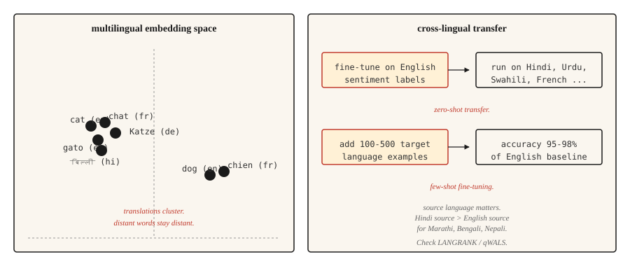

# 多语言 NLP

> 一个模型,100 多种语言,其中大多数连一条训练数据都没有。跨语言迁移,是 2020 年代最实用的奇迹。

**类型:** 学习
**编程语言:** Python
**前置要求:** 第 5 阶段 · 04(GloVe、FastText、子词),第 5 阶段 · 11(机器翻译)
**预计耗时:** 约 45 分钟

## 问题

英文有数十亿条标注样本,乌尔都语有几千条,迈蒂利语几乎没有。任何要服务全球用户的实用 NLP 系统,都得在那些根本没有任务专属训练数据的长尾语言上也能工作。

多语言模型的解法是在多种语言上同时训练一个模型。共享的表示让模型把在高资源语言里学到的技能迁移到低资源语言上。在英文情感分析上微调,它开箱就能给出好得出奇的乌尔都语情感预测。这就是零样本跨语言迁移,它重塑了 NLP 走向世界的方式。

本课讲清其中的取舍、经典模型,以及多语言新手团队最容易踩的一个决策:给迁移选哪门源语言。

## 概念



**共享词表。** 多语言模型用在所有目标语言文本上训练的 SentencePiece 或 WordPiece 分词器。词表是共享的:同一个子词单元,在亲属语言里代表同一个语素。英语和意大利语里的 `anti-` 拿到的是同一个 token。

**共享表示。** 在多种语言上做掩码语言建模预训练的 Transformer,会学到"不同语言里语义相似的句子,隐状态也相似"。mBERT、XLM-R、NLLB 都表现出这个特性。英语 "cat" 的嵌入,会聚在法语 "chat" 和西语 "gato" 附近,整句嵌入也一样。

**零样本迁移。** 在一种语言(通常是英语)的标注数据上微调模型;推理时直接跑在它支持的任何其他语言上,不需要目标语言的任何标注。对类型学上相近的语言效果很好,对距离远的语言就弱一些。

**小样本微调。** 加上 100-500 条目标语言标注样本,分类任务的准确率就能跳到英文基线的 95-98%。这是多语言 NLP 里性价比最高的一根杠杆。

## 模型们

| 模型 | 年份 | 覆盖 | 备注 |
|-------|------|----------|-------|
| mBERT | 2018 | 104 种语言 | 在维基百科上训练,第一个实用的多语言 LM,低资源语言上偏弱 |
| XLM-R | 2019 | 100 种语言 | 在 CommonCrawl 上训练(比维基百科大得多),跨语言基线的定义者。Base 270M,Large 550M |
| XLM-V | 2023 | 100 种语言 | XLM-R 配上 100 万 token 词表(原来 25 万),低资源语言上更好 |
| mT5 | 2020 | 101 种语言 | T5 架构的多语言生成版 |
| NLLB-200 | 2022 | 200 种语言 | Meta 的翻译模型,含 55 种低资源语言 |
| BLOOM | 2022 | 46 种语言 + 13 种编程语言 | 多语言训练的开放 176B LLM |
| Aya-23 | 2024 | 23 种语言 | Cohere 的多语言 LLM,阿拉伯语、印地语、斯瓦希里语上很强 |

按场景选:分类任务,稳妥默认是 XLM-R-base 微调;生成任务,翻译用 NLLB、开放生成用 mT5;LLM 类工作用 Aya-23 或 Claude,配显式的多语言提示词。

## 源语言决策(2026 年研究)

大多数团队默认拿英语当微调源语言。近期研究(2026 年)表明这经常是错的。

语言相似度对迁移质量的预测力,强过语料规模。对斯拉夫语族目标,德语或俄语常常胜过英语;对印度语族目标,印地语常常胜过英语。**qWALS** 相似度指标(2026 年,基于《世界语言结构地图集》特征)把这个量化了出来。**LANGRANK**(Lin et al., ACL 2019)是更早的另一套方法,综合语言相似度、语料规模和谱系亲缘,给候选源语言排名。

实战法则:如果你的目标语言有一门类型学上相近的高资源亲属语言,先试试在它上面微调,再和英语微调对比。

```figure
n5-crosslingual-bridge
```

## 动手构建

### 第 1 步:零样本跨语言分类

```python
from transformers import AutoTokenizer, AutoModelForSequenceClassification
import torch

tok = AutoTokenizer.from_pretrained("joeddav/xlm-roberta-large-xnli")
model = AutoModelForSequenceClassification.from_pretrained("joeddav/xlm-roberta-large-xnli")


def classify(text, candidate_labels, hypothesis_template="This text is about {}."):
    scores = {}
    for label in candidate_labels:
        hypothesis = hypothesis_template.format(label)
        inputs = tok(text, hypothesis, return_tensors="pt", truncation=True)
        with torch.no_grad():
            logits = model(**inputs).logits[0]
        entail_score = torch.softmax(logits, dim=-1)[2].item()
        scores[label] = entail_score
    return dict(sorted(scores.items(), key=lambda x: -x[1]))


print(classify("I love this product!", ["positive", "negative", "neutral"]))
print(classify("मुझे यह उत्पाद पसंद है!", ["positive", "negative", "neutral"]))
print(classify("J'adore ce produit !", ["positive", "negative", "neutral"]))
```

一个模型,三种语言,同一套 API。在 NLI 数据上训练过的 XLM-R,借助"蕴含"这个戏法,能很好地迁移到分类任务。

### 第 2 步:多语言嵌入空间

```python
from sentence_transformers import SentenceTransformer
import numpy as np

model = SentenceTransformer("sentence-transformers/paraphrase-multilingual-MiniLM-L12-v2")

pairs = [
    ("The cat is sleeping.", "Le chat dort."),
    ("The cat is sleeping.", "El gato está durmiendo."),
    ("The cat is sleeping.", "Die Katze schläft."),
    ("The cat is sleeping.", "The dog is barking."),
]

for eng, other in pairs:
    emb_eng = model.encode([eng], normalize_embeddings=True)[0]
    emb_other = model.encode([other], normalize_embeddings=True)[0]
    sim = float(np.dot(emb_eng, emb_other))
    print(f"  {eng!r} <-> {other!r}: cos={sim:.3f}")
```

译文在嵌入空间里落得很近,而不相关的英文句子落得远。跨语言检索、聚类、相似度计算,靠的就是这一点。

### 第 3 步:小样本微调策略

```python
from transformers import TrainingArguments, Trainer
from datasets import Dataset


def few_shot_finetune(base_model, base_tokenizer, examples):
    ds = Dataset.from_list(examples)

    def tokenize_fn(ex):
        out = base_tokenizer(ex["text"], truncation=True, max_length=128)
        out["labels"] = ex["label"]
        return out

    ds = ds.map(tokenize_fn)
    args = TrainingArguments(
        output_dir="out",
        per_device_train_batch_size=8,
        num_train_epochs=5,
        learning_rate=2e-5,
        save_strategy="no",
    )
    trainer = Trainer(model=base_model, args=args, train_dataset=ds)
    trainer.train()
    return base_model
```

对 100-500 条目标语言样本,`num_train_epochs=5` 和 `learning_rate=2e-5` 是稳妥默认。学习率再高,多语言对齐会崩,你会得到一个只会英语的模型。

## 真正有用的评估

- **逐语言的留出集准确率。** 不要看聚合值——聚合会把长尾藏起来。
- **和单语基线对比。** 对数据够多的语言,从零训练的单语模型有时会赢过多语言模型。要测。
- **实体级测试。** 目标语言里的命名实体。多语言模型对远离拉丁字母的文字,分词往往很弱。
- **跨语言一致性。** 同一个意思用两种语言表达,应该得到同一个预测。把这个差距量化出来。

## 投入使用

2026 年的技术栈:

| 任务 | 推荐 |
|-----|-------------|
| 分类,100 种语言 | XLM-R-base(约 270M)微调 |
| 零样本文本分类 | `joeddav/xlm-roberta-large-xnli` |
| 多语言句子嵌入 | `sentence-transformers/paraphrase-multilingual-MiniLM-L12-v2` |
| 翻译,200 种语言 | `facebook/nllb-200-distilled-600M`(见第 11 课) |
| 生成式多语言 | Claude、GPT-4、Aya-23、mT5-XXL |
| 低资源语言 NLP | XLM-V,或在相近高资源语言上做领域微调 |

如果性能重要,永远为目标语言的微调留预算。零样本是起点,不是终点。

### 分词税(低资源语言到底坏在哪)

多语言模型在所有语言间共享一个分词器,而这个词表是在英语、法语、西语、中文、德语主导的语料上训出来的。对主导集合之外的语言,三种税在悄悄叠加:

- **繁殖税(fertility tax)。** 低资源语言的文本,每个词要切出比英语多得多的 token。一个印地语句子可能需要等义英语句子 3-5 倍的 token。这 3-5 倍吃掉的是你的上下文窗口、训练效率和延迟。
- **变体恢复税。** 每一个错别字、变音符差异、Unicode 归一化不一致、大小写变化,在嵌入空间里都变成一个冷启动的陌生序列。母语者看来理所当然的拼写对应关系,模型学不到。
- **容量外溢税。** 税 1 和税 2 消耗掉上下文位置、层深和嵌入维度。真正留给推理的容量,系统性地小于高资源语言从同一个模型里分到的部分。

实际症状是:模型在印地语上训练得一切正常,损失曲线漂亮,评估困惑度也合理,可生产输出就是微妙地不对——句子中间形态崩塌,稀有变格永远恢复不出来。**分词器坏了,堆数据是救不回来的。**

缓解措施:选一个对目标语言覆盖好的分词器(XLM-V 的 100 万 token 词表就是直接的对症药);训练前在留出的目标语言文本上验证分词繁殖率;对真正的长尾文字用字节级回退(SentencePiece 的 `byte_fallback=True`,或 GPT-2 式的字节级 BPE),保证永远没有 OOV。

## 交付

保存为 `outputs/skill-multilingual-picker.md`:

```markdown
---
name: multilingual-picker
description: Pick source language, target model, and evaluation plan for a multilingual NLP task.
version: 1.0.0
phase: 5
lesson: 18
tags: [nlp, multilingual, cross-lingual]
---

Given requirements (target languages, task type, available labeled data per language), output:

1. Source language for fine-tuning. Default English; check LANGRANK or qWALS if target language has a typologically close high-resource language.
2. Base model. XLM-R (classification), mT5 (generation), NLLB (translation), Aya-23 (generative LLM).
3. Few-shot budget. Start with 100-500 target-language examples if available. Zero-shot only if labeling is infeasible.
4. Evaluation plan. Per-language accuracy (not aggregate), cross-lingual consistency, entity-level F1 on non-Latin scripts.

Refuse to ship a multilingual model without per-language evaluation — aggregate metrics hide long-tail failures. Flag scripts with low tokenization coverage (Amharic, Tigrinya, many African languages) as needing a model with byte-fallback (SentencePiece with byte_fallback=True, or byte-level tokenizer like GPT-2).
```

## 练习

1. **入门。** 在英语、法语、印地语、阿拉伯语上各取 10 个句子跑零样本分类流水线,报告各语言准确率。你应该会看到法语很强、印地语尚可、阿拉伯语不稳定。
2. **进阶。** 用 `paraphrase-multilingual-MiniLM-L12-v2` 在一个小型多语言混合语料上搭一个跨语言检索器:用英文查询,检索任意语言的文档,测 recall@5。
3. **挑战。** 在一个印地语分类任务上对比"英语为源"和"印地语为源"的微调。两种方案都用 500 条目标语言样本做小样本微调,报告哪个源语言的印地语准确率更高、高多少。这就是 LANGRANK 论断的微缩验证。

## 关键术语

| 术语 | 大家嘴里的说法 | 实际含义 |
|------|-----------------|-----------------------|
| 多语言模型 | 一个模型管多种语言 | 跨语言共享词表和参数 |
| 跨语言迁移 | 在一种语言上训,在另一种上跑 | 在源语言上微调,在目标语言上评估,不用目标语言标注 |
| 零样本 | 没有目标语言标注 | 不在目标语言上微调,直接迁移 |
| 小样本 | 少量目标语言标注 | 用 100-500 条目标语言样本微调 |
| mBERT | 第一个多语言 LM | 在维基百科上预训练的 104 语言 BERT |
| XLM-R | 跨语言标准基线 | 在 CommonCrawl 上预训练的 100 语言 RoBERTa |
| NLLB | Meta 的 200 语言机器翻译 | No Language Left Behind,含 55 种低资源语言 |

## 延伸阅读

- [Conneau et al. (2019). Unsupervised Cross-lingual Representation Learning at Scale](https://arxiv.org/abs/1911.02116) —— XLM-R 论文
- [Pires, Schlinger, Garrette (2019). How Multilingual is Multilingual BERT?](https://arxiv.org/abs/1906.01502) —— 开创跨语言迁移研究线的分析论文
- [Costa-jussà et al. (2022). No Language Left Behind](https://arxiv.org/abs/2207.04672) —— NLLB-200 论文
- [Üstün et al. (2024). Aya Model: An Instruction Finetuned Open-Access Multilingual Language Model](https://arxiv.org/abs/2402.07827) —— Aya,Cohere 的多语言 LLM
- [Language Similarity Predicts Cross-Lingual Transfer Learning Performance (2026)](https://www.mdpi.com/2504-4990/8/3/65) —— qWALS / LANGRANK 源语言论文
