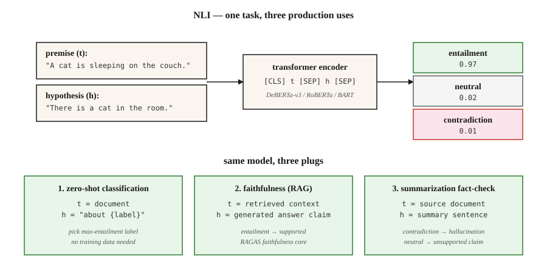

# 自然语言推理 —— 文本蕴含

> "t 蕴含 h"的意思是:一个读到 t 的人会得出 h 为真。NLI 就是预测 蕴含 / 矛盾 / 中立 的任务。表面看着无聊,生产环境却在它身上承重。

**类型:** 学习
**编程语言:** Python
**前置要求:** 第 5 阶段 · 05(情感分析),第 5 阶段 · 13(问答)
**预计耗时:** 约 60 分钟

## 问题

你做了个摘要器,它产出了一份摘要。你怎么知道摘要里没有幻觉?

你做了个聊天机器人,它回答了"是的"。你怎么知道这个答案有检索到的段落撑腰?

你要给 1 万篇新闻按主题分类,没有任何训练标注。能复用现成的模型吗?

这三个问题都可以归约到自然语言推理(NLI)。NLI 问的是:给定前提 `t` 和假设 `h`,`h` 是被 `t` 蕴含、被 `t` 矛盾,还是中立(不相干)?

- **幻觉检查:** `t` = 源文档,`h` = 摘要里的论断。不蕴含 = 幻觉。
- **接地问答:** `t` = 检索到的段落,`h` = 生成的答案。不蕴含 = 编造。
- **零样本分类:** `t` = 文档,`h` = 文字化的标签("这篇是关于体育的")。蕴含 = 预测标签。

一个任务,三种生产用途。这就是为什么每个 RAG 评估框架的引擎盖下都躺着一个 NLI 模型。

## 概念



**三个标签。**

- **蕴含(Entailment)。** `t` → `h`。"猫在垫子上" 蕴含 "有一只猫"。
- **矛盾(Contradiction)。** `t` → ¬`h`。"猫在垫子上" 矛盾于 "这里没有猫"。
- **中立(Neutral)。** 两个方向都推不出来。"猫在垫子上" 对 "猫饿了" 是中立。

**不是逻辑蕴含。** NLI 是*自然*语言推理——普通读者会推出的结论,不是严格逻辑。"John walked his dog" 在 NLI 里蕴含 "John has a dog";但严格的一阶逻辑只有在你把"遛"公理化为"拥有"之后才认这个推理。

**数据集。**

- **SNLI**(2015)。57 万条人工标注对,前提是图片说明文字,领域偏窄。
- **MultiNLI**(2017)。43.3 万条,横跨 10 种文体。2026 年的标准训练语料。
- **ANLI**(2019)。对抗式 NLI:人类专门写出让现有模型翻车的样本。更难。
- **DocNLI、ConTRoL**(2020-21)。文档级长度的前提,考多跳和长程推理。

**架构。** 一个 Transformer 编码器(BERT、RoBERTa、DeBERTa)读入 `[CLS] 前提 [SEP] 假设 [SEP]`,`[CLS]` 的表示喂给一个三分类 softmax。在 MNLI 上训练,在留出基准上评估,分布内样本能拿到 90%+ 准确率。

**用 NLI 做零样本。** 给定一篇文档和候选标签,把每个标签写成一条假设("This text is about sports"),逐个算蕴含概率,取最大。Hugging Face 的 `zero-shot-classification` 流水线背后就是这个机制。

```figure
nli-router
```

## 动手构建

### 第 1 步:跑一个预训练 NLI 模型

```python
from transformers import pipeline

nli = pipeline("text-classification",
               model="facebook/bart-large-mnli",
               top_k=None)  # return all labels; replaces deprecated return_all_scores=True

premise = "The cat is sleeping on the couch."
hypothesis = "There is a cat in the room."

result = nli({"text": premise, "text_pair": hypothesis})[0]
print(result)
# [{'label': 'entailment', 'score': 0.97},
#  {'label': 'neutral', 'score': 0.02},
#  {'label': 'contradiction', 'score': 0.01}]
```

生产环境的 NLI,开源默认是 `facebook/bart-large-mnli` 和 `microsoft/deberta-v3-large-mnli`。DeBERTa-v3 霸榜。

### 第 2 步:零样本分类

```python
zs = pipeline("zero-shot-classification", model="facebook/bart-large-mnli")

text = "The stock market rallied after the central bank cut interest rates."
labels = ["finance", "sports", "politics", "technology"]

result = zs(text, candidate_labels=labels)
print(result)
# {'labels': ['finance', 'politics', 'technology', 'sports'],
#  'scores': [0.92, 0.05, 0.02, 0.01]}
```

默认模板是 "This example is about {label}。",可以用 `hypothesis_template` 自定义。不要训练数据,不要微调,开箱即用。

### 第 3 步:RAG 的忠实度检查

```python
def is_faithful(answer, context, threshold=0.5):
    result = nli({"text": context, "text_pair": answer})[0]
    entail = next(s for s in result if s["label"] == "entailment")
    return entail["score"] > threshold
```

这就是 RAGAS 忠实度指标的核心:把生成的答案拆成原子论断,逐条对照检索上下文做蕴含判断,报告被蕴含的比例。

### 第 4 步:手搓 NLI 分类器(原理示意)

`code/main.py` 里有一个纯标准库的玩具版:用词面重叠加否定检测来比较前提和假设。跟 Transformer 模型没法比——但它展示了任务的形状:两段文本进,三分类标签出,损失是 {蕴含, 矛盾, 中立} 上的交叉熵。

## 坑

- **只看假设的捷径。** 模型不看前提、只看假设,在 SNLI 上也能蒙对约 60%——因为 "not"、"nobody"、"never" 和矛盾标签相关。这是检测标签泄漏的强基线。
- **词面重叠启发式。** "子序列即蕴含"这种启发式能混过 SNLI,但在 HANS/ANLI 上现形。要用对抗基准测。
- **文档长度退化。** 单句 NLI 模型碰到文档级前提,F1 掉 20 个点以上。长上下文要用 DocNLI 训练过的模型。
- **零样本模板敏感。** "This example is about {label}"、"{label}"、"The topic is {label}" 三种写法,准确率能差 10 个点以上。模板要调。
- **领域不匹配。** MNLI 是通用英语。法律、医疗、科技文本需要领域专属的 NLI 模型(如 SciNLI、MedNLI)。

## 投入使用

2026 年的技术栈:

| 场景 | 模型 |
|---------|-------|
| 通用 NLI | `microsoft/deberta-v3-large-mnli` |
| 快速 / 边缘 | `cross-encoder/nli-deberta-v3-base` |
| 零样本分类(轻量) | `facebook/bart-large-mnli` |
| 文档级 NLI | `MoritzLaurer/DeBERTa-v3-large-mnli-fever-anli-ling-wanli` |
| 多语言 | `MoritzLaurer/multilingual-MiniLMv2-L6-mnli-xnli` |
| RAG 幻觉检测 | RAGAS / DeepEval 内置的 NLI 层 |

2026 年的元模式:NLI 是文本理解的万能胶带。每当你需要回答"A 支持 B 吗?"或"A 反驳 B 吗?"——先拿 NLI,别急着再调一次 LLM。

## 交付

保存为 `outputs/skill-nli-picker.md`:

```markdown
---
name: nli-picker
description: Pick an NLI model, label template, and evaluation setup for a classification / faithfulness / zero-shot task.
version: 1.0.0
phase: 5
lesson: 21
tags: [nlp, nli, zero-shot]
---

Given a use case (faithfulness check, zero-shot classification, document-level inference), output:

1. Model. Named NLI checkpoint. Reason tied to domain, length, language.
2. Template (if zero-shot). Verbalization pattern. Example.
3. Threshold. Entailment cutoff for the decision rule. Reason based on calibration.
4. Evaluation. Accuracy on held-out labeled set, hypothesis-only baseline, adversarial subset.

Refuse to ship zero-shot classification without a 100-example labeled sanity check. Refuse to use a sentence-level NLI model on document-length premises. Flag any claim that NLI solves hallucination — it reduces it; it does not eliminate it.
```

## 练习

1. **入门。** 在 20 组手工构造的(前提, 假设, 标签)三元组上跑 `facebook/bart-large-mnli`,覆盖全部三类,测准确率。再加几个对抗性的"子序列启发式"陷阱("I did not eat the cake" 对 "I ate the cake"),看它会不会翻车。
2. **进阶。** 在 100 条 AG News 标题上对比模板 `"This text is about {label}"`、`"The topic is {label}"` 和 `"{label}"`,报告准确率摆幅。
3. **挑战。** 搭一个 RAG 忠实度检查器:原子论断拆解 + 逐论断 NLI。在 50 条带黄金上下文的 RAG 生成答案上评估,对照人工标签测假阳率和假阴率。

## 关键术语

| 术语 | 大家嘴里的说法 | 实际含义 |
|------|-----------------|-----------------------|
| NLI | 自然语言推理 | 对前提-假设关系的三分类 |
| RTE | 识别文本蕴含 | NLI 的旧名字,同一个任务 |
| 蕴含 | "t 推出 h" | 普通读者给定 t 会得出 h 为真 |
| 矛盾 | "t 排除 h" | 普通读者给定 t 会得出 h 为假 |
| 中立 | "说不准" | t 到 h 两个方向都推不出来 |
| 零样本分类 | 拿 NLI 当分类器 | 把标签写成假设,取蕴含概率最大的 |
| 忠实度 | 答案有据吗? | 对(检索上下文, 生成答案)做 NLI |

## 延伸阅读

- [Bowman et al. (2015). A large annotated corpus for learning natural language inference](https://arxiv.org/abs/1508.05326) —— SNLI
- [Williams, Nangia, Bowman (2017). A Broad-Coverage Challenge Corpus for Sentence Understanding through Inference](https://arxiv.org/abs/1704.05426) —— MultiNLI
- [Nie et al. (2019). Adversarial NLI](https://arxiv.org/abs/1910.14599) —— ANLI 基准
- [Yin, Hay, Roth (2019). Benchmarking Zero-shot Text Classification](https://arxiv.org/abs/1909.00161) —— NLI 当分类器
- [He et al. (2021). DeBERTa: Decoding-enhanced BERT with Disentangled Attention](https://arxiv.org/abs/2006.03654) —— 2026 年的 NLI 主力模型
