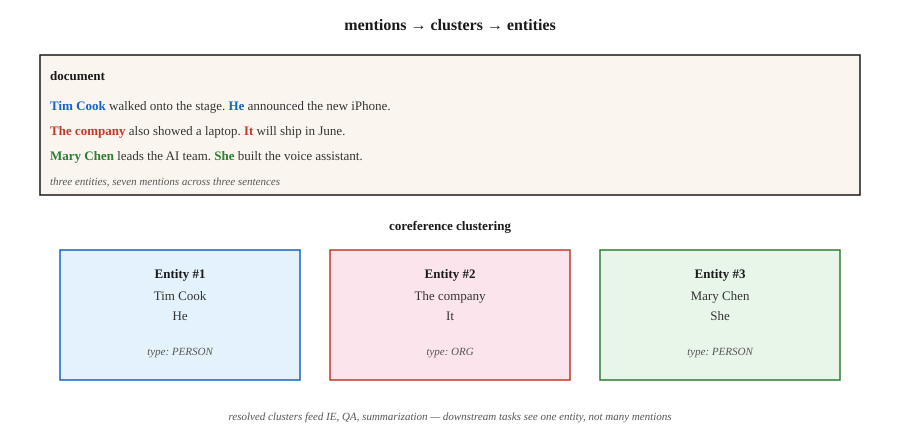

# 共指消解

> "她给他打了电话。他没接。医生当时在吃午饭。"三个指称、两个人物,谁的名字都没出现。共指消解要弄清楚谁是谁。

**类型:** 学习
**编程语言:** Python
**前置要求:** 第 5 阶段 · 06(NER),第 5 阶段 · 07(词性标注与句法分析)
**预计耗时:** 约 60 分钟

## 问题

从一篇 300 词的文章里抽出所有提到苹果公司的地方。文章写 "Apple" 时容易;写 "the company"、"they"、"Cupertino's technology giant"、"Jobs's firm" 时就难了。不把这些指称归并到同一个实体上,你的 NER 流水线会漏掉 60-80% 的提及。

共指消解(coreference resolution)把指向同一个现实世界实体的所有表达式连成一个簇。它是表层 NLP(NER、句法分析)和下游语义(信息抽取、问答、摘要、知识图谱)之间的胶水。

2026 年它为什么重要:

- 摘要:"The CEO announced..." 对 "Tim Cook announced..." —— 摘要里应该写出 CEO 的名字。
- 问答:"Who did she call?" 要求先消解 "she"。
- 信息抽取:知识图谱里 "PER1 founded Apple" 和 "Jobs founded Apple" 是两条独立记录,那就是错的。
- 多文档信息抽取:把多篇报道同一事件的文章里的提及合并,是跨文档共指。

## 概念



**任务定义。** 输入:一篇文档。输出:提及(文本片段)的聚类,每个簇指向一个实体。

**提及类型。**

- **命名实体。** "Tim Cook"
- **名词性。** "the CEO"、"the company"
- **代词性。** "he"、"she"、"they"、"it"
- **同位语。** "Tim Cook, Apple's CEO,"

**架构路线。**

1. **规则式(Hobbs,1978)。** 基于句法树的代词消解,用语法规则。不错的基线,在代词上出奇地难被击败。
2. **提及对分类器。** 对每一对提及 (m_i, m_j) 预测是否共指,再用传递闭包聚类。2016 年之前的标准做法。
3. **提及排序。** 对每个提及,给候选先行词排序(包括"无先行词"这个选项),取第一。
4. **片段级端到端(Lee et al., 2017)。** Transformer 编码器,枚举长度上限内的所有候选片段,预测提及分数,为每个片段预测先行词概率,贪心聚类。现代默认。
5. **生成式(2024+)。** 提示 LLM:"列出文中每个代词及其先行词。"简单情况效果好,长文档和罕见指称上吃力。

**评估指标。** 五个标准指标(MUC、B³、CEAF、BLANC、LEA)并存,因为没有任何单一指标能完整刻画聚类质量。惯例是报告前三个的平均值作为 CoNLL F1。2026 年 CoNLL-2012 上的最好成绩约 83 F1。

**已知的硬骨头。**

- 指代几页之前才引入的实体的定指描述。
- 桥接回指("the wheels" → 之前提到的那辆车)。
- 中文、日语等语言里的零回指。
- 后指(cataphora,代词在先行词之前):"When **she** walked in, Mary smiled."

```figure
coref-links
```

## 动手构建

### 第 1 步:预训练神经共指(AllenNLP / spaCy 实验模型)

```python
import spacy
nlp = spacy.load("en_coreference_web_trf")   # experimental model
doc = nlp("Apple announced new products. The company said they would ship soon.")
for cluster in doc._.coref_clusters:
    print(cluster, "->", [m.text for m in cluster])
```

在长一点的文档上,你会得到类似:
- 簇 1:[Apple, The company, they]
- 簇 2:[new products]

### 第 2 步:规则式代词消解器(教学版)

纯标准库实现见 `code/main.py`:

1. 抽取提及:命名实体(大写片段)、代词(查字典)、定指描述("the X")。
2. 对每个代词,考察前 K 个提及,按以下打分:
   - 性别/数一致(启发式)
   - 距离近者优先
   - 句法角色(主语优先)
3. 连接到得分最高的先行词。

和神经模型没法比,但它展示了搜索空间,以及一个端到端模型必须做的那些决策。

### 第 3 步:用 LLM 做共指

```python
prompt = f"""Text: {text}

List every pronoun and noun phrase that refers to a person or company.
Cluster them by what they refer to. Output JSON:
[{{"entity": "Apple", "mentions": ["Apple", "the company", "it"]}}, ...]
"""
```

两种故障模式要盯紧。第一,LLM 会过度合并(把分属两个人的 "him" 和 "her" 并到一起)。第二,长文档里 LLM 会悄悄丢掉一些提及。永远用片段偏移量校验。

### 第 4 步:评估

标准的 conll-2012 脚本计算 MUC、B³、CEAF-φ4 并报告三者平均。内部评估可以先从标注测试集上的片段级精确率/召回率做起,再加提及链接 F1。

## 坑

- **单例爆炸。** 有些系统把每个提及都报成独立的一簇。B³ 对此宽容,MUC 会狠罚。三个指标要一起看。
- **长上下文里的代词。** 文档超过 2,000 token,性能掉约 15 F1。切块要谨慎。
- **性别假设。** 硬编码的性别规则在非二元指称、组织机构、动物上会崩。用学习型模型或中性打分。
- **LLM 在长文档上漂移。** 单次 API 调用没法可靠地聚类横跨 50+ 段的提及。用滑动窗口 + 合并。

## 投入使用

2026 年的技术栈:

| 场景 | 选择 |
|-----------|------|
| 英语、单文档 | `en_coreference_web_trf`(spaCy 实验模型)或 AllenNLP 神经共指 |
| 多语言 | 在 OntoNotes 或多语言 CoNLL 上训练的 SpanBERT / XLM-R |
| 跨文档事件共指 | 专用端到端模型(2025-26 年 SOTA) |
| 快速 LLM 基线 | GPT-4o / Claude + 结构化输出的共指提示词 |
| 生产对话系统 | 规则兜底 + 神经主力 + 关键槽位人工复核 |

2026 年上线的集成模式:先跑 NER,再跑共指,把共指簇合并进 NER 实体。下游任务看到的是"每簇一个实体",而不是"每提及一个实体"。

## 交付

保存为 `outputs/skill-coref-picker.md`:

```markdown
---
name: coref-picker
description: Pick a coreference approach, evaluation plan, and integration strategy.
version: 1.0.0
phase: 5
lesson: 24
tags: [nlp, coref, information-extraction]
---

Given a use case (single-doc / multi-doc, domain, language), output:

1. Approach. Rule-based / neural span-based / LLM-prompted / hybrid. One-sentence reason.
2. Model. Named checkpoint if neural.
3. Integration. Order of operations: tokenize → NER → coref → downstream task.
4. Evaluation. CoNLL F1 (MUC + B³ + CEAF-φ4 average) on held-out set + manual cluster review on 20 documents.

Refuse LLM-only coref for documents over 2,000 tokens without sliding-window merge. Refuse any pipeline that runs coref without a mention-level precision-recall report. Flag gender-heuristic systems deployed in demographically diverse text.
```

## 练习

1. **入门。** 在 5 段手工构造的文段上跑 `code/main.py` 的规则消解器,对照真值测提及链接准确率。
2. **进阶。** 在一篇新闻上跑预训练神经共指模型,把簇和你自己的人工标注对比。它错在哪?
3. **挑战。** 搭一条共指增强的 NER 流水线:先 NER,再用共指簇合并。在 100 篇文章上测相对纯 NER 的实体覆盖率提升。

## 关键术语

| 术语 | 大家嘴里的说法 | 实际含义 |
|------|-----------------|-----------------------|
| 提及(Mention) | 一处指称 | 指向某个实体的文本片段(名字、代词、名词短语) |
| 先行词(Antecedent) | "它"指的那个 | 后一个提及与之共指的前一个提及 |
| 簇(Cluster) | 实体的所有提及 | 全部指向同一现实世界实体的提及集合 |
| 回指(Anaphora) | 向后的指代 | 后面的提及指向前面的("he" → "John") |
| 后指(Cataphora) | 向前的指代 | 前面的提及指向后面的("When he arrived, John...") |
| 桥接(Bridging) | 隐含的指代 | "我买了辆车。轮子不行。"(就是那辆车的轮子) |
| CoNLL F1 | 排行榜上的数字 | MUC、B³、CEAF-φ4 三个 F1 的平均 |

## 延伸阅读

- [Jurafsky & Martin, SLP3 Ch. 26 — Coreference Resolution and Entity Linking](https://web.stanford.edu/~jurafsky/slp3/26.pdf) —— 经典教科书章节
- [Lee et al. (2017). End-to-end Neural Coreference Resolution](https://arxiv.org/abs/1707.07045) —— 片段级端到端
- [Joshi et al. (2020). SpanBERT](https://arxiv.org/abs/1907.10529) —— 提升共指的预训练
- [Pradhan et al. (2012). CoNLL-2012 Shared Task](https://aclanthology.org/W12-4501/) —— 基准
- [Hobbs (1978). Resolving Pronoun References](https://www.sciencedirect.com/science/article/pii/0024384178900064) —— 规则式经典
