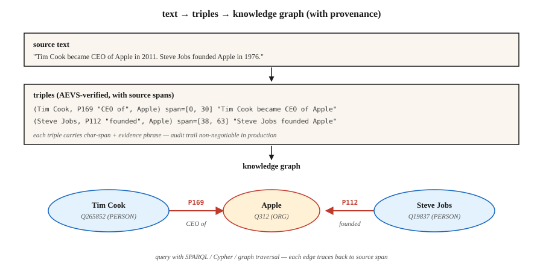

# 关系抽取与知识图谱构建

> NER 找到了实体,实体链接给实体抛了锚,关系抽取找出实体之间的边。知识图谱,就是节点、边以及它们出处的总和。

**类型:** 动手构建
**编程语言:** Python
**前置要求:** 第 5 阶段 · 06(NER),第 5 阶段 · 25(实体链接)
**预计耗时:** 约 60 分钟

## 问题

一位分析师读到:"Tim Cook became CEO of Apple in 2011." 四个事实:

- `(Tim Cook, role, CEO)`
- `(Tim Cook, employer, Apple)`
- `(Tim Cook, start_date, 2011)`
- `(Apple, type, Organization)`

关系抽取(RE)把自由文本变成结构化三元组 `(主语, 关系, 宾语)`。在整个语料上聚合,你就得到一张知识图谱;再聚合再查询,你就有了支撑 RAG、分析或合规审计的推理底座。

2026 年的问题是:LLM 抽起关系来热情过头了——它们会编造源文本根本不支持的三元组。没有出处,你就分不清真三元组和看着像真的虚构。2026 年的答案是 AEVS 式的"锚定-验证"流水线。

## 概念



**三元组形式。** `(主语实体, 关系类型, 宾语实体)`。关系可以来自封闭本体(Wikidata 属性、FIBO、UMLS),也可以是开放的(OpenIE 风格,来者不拒)。

**三种抽取路线。**

1. **规则 / 模式。** Hearst 模式:"X such as Y" → `(Y, isA, X)`,加上手工正则。脆弱,但精准、可解释。
2. **监督分类器。** 给定句中两个实体提及,从固定集合里预测关系。在 TACRED、ACE、KBP 上训练,2015-2022 年的标准做法。
3. **生成式 LLM。** 提示模型直接吐三元组。开箱即用,但需要出处核验,否则幻觉出一堆看着像模像样的垃圾。

**AEVS(Anchor-Extraction-Verification-Supplement,2026)。** 当前的幻觉抑制框架:

- **锚定(Anchor)。** 标出每个实体片段和关系短语片段的精确位置。
- **抽取(Extract)。** 生成与锚定片段挂钩的三元组。
- **验证(Verify)。** 把三元组的每个元素对回源文本,不支持的拒绝。
- **补全(Supplement)。** 覆盖率检查,确保没有锚定片段被漏掉。

幻觉大幅下降。算力开销更高,但全程可审计。

**开放 vs 封闭的取舍。**

- **封闭本体。** 固定属性表(如 Wikidata 的 11,000+ 属性)。可预测、可查询、难臆造。
- **开放 IE。** 任何动词短语都能当关系。召回高、精度低,查询起来很乱。

生产知识图谱通常混用:开放 IE 做发现,再把关系规范化到封闭本体上,最后合入主图。

```figure
relation-triples
```

## 动手构建

### 第 1 步:模式抽取

```python
PATTERNS = [
    (r"(?P<s>[A-Z]\w+) (?:is|was) (?:a|an|the) (?P<o>[A-Z]?\w+)", "isA"),
    (r"(?P<s>[A-Z]\w+) (?:is|was) born in (?P<o>\w+)", "bornIn"),
    (r"(?P<s>[A-Z]\w+) works? (?:at|for) (?P<o>[A-Z]\w+)", "worksAt"),
    (r"(?P<s>[A-Z]\w+) founded (?P<o>[A-Z]\w+)", "founded"),
]
```

完整玩具抽取器见 `code/main.py`。Hearst 模式至今仍在领域专属流水线里服役,因为它好调试。

### 第 2 步:监督式关系分类

```python
from transformers import AutoTokenizer, AutoModelForSequenceClassification

tok = AutoTokenizer.from_pretrained("Babelscape/rebel-large")
model = AutoModelForSequenceClassification.from_pretrained("Babelscape/rebel-large")

text = "Tim Cook was born in Alabama. He later became CEO of Apple."
encoded = tok(text, return_tensors="pt", truncation=True)
output = model.generate(**encoded, max_length=200)
triples = tok.batch_decode(output, skip_special_tokens=False)
```

REBEL 是一个 seq2seq 关系抽取器:文本进,三元组出,而且直接输出 Wikidata 属性 id。在远程监督数据上微调,是标准的开源权重基线。

### 第 3 步:带锚定的 LLM 提示抽取

```python
prompt = f"""Extract (subject, relation, object) triples from the text.
For each triple, include the exact character span in the source text.

Text: {text}

Output JSON:
[{{"subject": {{"text": "...", "span": [start, end]}},
   "relation": "...",
   "object": {{"text": "...", "span": [start, end]}}}}, ...]

Only include triples fully supported by the text. No inference beyond what is stated.
"""
```

把返回的每个片段对回源文本验证,`text[start:end] != triple_entity` 的一律拒绝。这就是 AEVS"验证"一步的最小形态。

### 第 4 步:规范化到封闭本体

```python
RELATION_MAP = {
    "is the CEO of": "P169",       # "chief executive officer"
    "was born in":   "P19",         # "place of birth"
    "founded":        "P112",       # "founded by" (inverted subject/object)
    "works at":       "P108",       # "employer"
}


def canonicalize(relation):
    rel_low = relation.lower().strip()
    if rel_low in RELATION_MAP:
        return RELATION_MAP[rel_low]
    return None   # drop unmapped open relations or route to manual review
```

规范化往往占整个工程工作量的 60-80%。预算要留够。

### 第 5 步:建一张小图并查询

```python
triples = extract(text)
graph = {}
for s, r, o in triples:
    graph.setdefault(s, []).append((r, o))


def neighbors(node, relation=None):
    return [(r, o) for r, o in graph.get(node, []) if relation is None or r == relation]


print(neighbors("Tim Cook", relation="P108"))    # -> [(P108, Apple)]
```

这就是每个"知识图谱上的 RAG"系统的原子。规模化可以用 RDF 三元组库(Blazegraph、Virtuoso)、属性图(Neo4j),或向量增强的图存储。

## 坑

- **RE 之前先做共指。** "He founded Apple" —— RE 得先知道 "he" 是谁。先跑共指(第 24 课)。
- **实体规范化。** "Apple Inc" 和 "Apple" 必须解析到同一个节点。先做实体链接(第 25 课)。
- **幻觉三元组。** LLM 会吐出文本不支持的三元组。强制片段验证。
- **关系规范化漂移。** 开放 IE 的关系不一致("was born in"、"came from"、"is a native of")。不折叠成规范 id,图就没法查。
- **时间错误。** "Tim Cook is CEO of Apple" —— 现在为真,2005 年为假。很多关系是有时间界的,要用限定符(Wikidata 里的 `P580` 开始时间、`P582` 结束时间)。
- **领域不匹配。** REBEL 在维基百科上训练。法律、医疗、科技文本常需要领域微调过的 RE 模型。

## 投入使用

2026 年的技术栈:

| 场景 | 选择 |
|-----------|------|
| 快速生产、通用领域 | REBEL 或 LlamaPred + Wikidata 规范化 |
| 领域专属(生物医学、法律) | SciREX 式领域微调 + 自定义本体 |
| LLM 提示、要审计输出 | AEVS 流水线:锚定 → 抽取 → 验证 → 补全 |
| 大批量新闻信息抽取 | 模式 + 监督混合 |
| 从零建知识图谱 | 开放 IE + 人工规范化一轮 |
| 时序知识图谱 | 抽取时带限定符(开始/结束时间、时间点) |

集成模式:NER → 共指 → 实体链接 → 关系抽取 → 本体映射 → 图加载。每一环都是一个潜在的质量闸门。

## 交付

保存为 `outputs/skill-re-designer.md`:

```markdown
---
name: re-designer
description: Design a relation extraction pipeline with provenance and canonicalization.
version: 1.0.0
phase: 5
lesson: 26
tags: [nlp, relation-extraction, knowledge-graph]
---

Given a corpus (domain, language, volume) and downstream use (KG-RAG, analytics, compliance), output:

1. Extractor. Pattern-based / supervised / LLM / AEVS hybrid. Reason tied to precision vs recall target.
2. Ontology. Closed property list (Wikidata / domain) or open IE with canonicalization pass.
3. Provenance. Every triple carries source char-span + doc id. Non-negotiable for audit.
4. Merge strategy. Canonical entity id + relation id + temporal qualifiers; dedup policy.
5. Evaluation. Precision / recall on 200 hand-labelled triples + hallucination-rate on LLM-extracted sample.

Refuse any LLM-based RE pipeline without span verification (source provenance). Refuse open-IE output flowing into a production graph without canonicalization. Flag pipelines with no temporal qualifier on time-bounded relations (employer, spouse, position).
```

## 练习

1. **入门。** 在 5 个新闻句子上跑 `code/main.py` 的模式抽取器,人工检查精度。
2. **进阶。** 在同样的句子上用 REBEL(或一个小 LLM),对比三元组。哪个抽取器精度高?哪个召回高?
3. **挑战。** 搭 AEVS 流水线:LLM 抽取 + 对源文本验证片段。在 50 个维基风格的句子上,测验证步骤前后的幻觉率。

## 关键术语

| 术语 | 大家嘴里的说法 | 实际含义 |
|------|-----------------|-----------------------|
| 三元组 | 主-谓-宾 | `(s, r, o)` 元组,知识图谱的原子单位 |
| 开放 IE | "什么都抽" | 开放词表的关系短语,召回高、精度低 |
| 封闭本体 | 固定 schema | 有界的关系类型集合(Wikidata、UMLS、FIBO) |
| 规范化 | "全都归一" | 把表面名称/关系映射到规范 id |
| AEVS | 接地抽取 | 锚定-抽取-验证-补全流水线(2026) |
| 出处(Provenance) | 溯源链接 | 每个三元组携带文档 id + 字符片段指向来源 |
| 远程监督 | "便宜标注" | 把文本和已有知识图谱对齐,造出训练数据 |

## 延伸阅读

- [Mintz et al. (2009). Distant supervision for relation extraction without labeled data](https://www.aclweb.org/anthology/P09-1113.pdf) —— 远程监督论文
- [Huguet Cabot, Navigli (2021). REBEL: Relation Extraction By End-to-end Language generation](https://aclanthology.org/2021.findings-emnlp.204.pdf) —— seq2seq RE 主力
- [Wadden et al. (2019). Entity, Relation, and Event Extraction with Contextualized Span Representations(DyGIE++)](https://arxiv.org/abs/1909.03546) —— 联合信息抽取
- [AEVS —— Anchor-Extraction-Verification-Supplement 框架](https://www.mdpi.com/2073-431X/15/3/178) —— 2026 年幻觉抑制设计
- [Wikidata SPARQL 教程](https://www.wikidata.org/wiki/Wikidata:SPARQL_tutorial) —— 规范图查询
