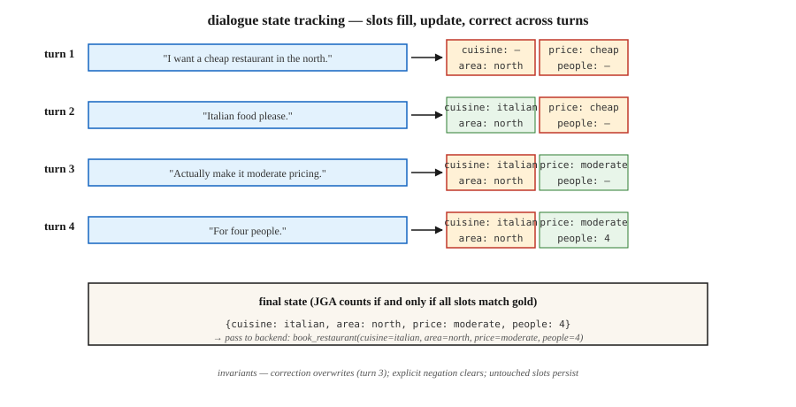

# 对话状态追踪

> "我要北边便宜的餐厅……改成中等价位吧……再加个意大利菜。"三轮对话,三次状态更新。DST 负责让槽位-值字典保持同步,这样订餐才能真正成交。

**类型:** 动手构建
**编程语言:** Python
**前置要求:** 第 5 阶段 · 17(聊天机器人)、第 5 阶段 · 20(结构化输出)
**预计耗时:** 约 75 分钟

## 问题

在任务型对话系统里,用户的目标被编码成一组槽位-值对:`{cuisine: italian, area: north, price: moderate}`。用户的每一轮发言都可能新增、修改或删除一个槽位。系统必须读完整段对话,正确输出当前状态。

一个槽位搞错,系统就会订错餐厅、排错航班、刷错卡。DST 是"用户说了什么"与"后端执行什么"之间的铰链。

为什么到了 2026 年、有了 LLM,它依然重要:

- 合规敏感领域(银行、医疗、机票预订)要求确定性的槽位值,而不是自由生成。
- 工具调用型智能体在调 API 之前,仍然需要先解析出槽位。
- 多轮纠正比看起来难得多:"不对,改成周四。"

现代流水线:经典 DST 概念 + LLM 抽取器 + 结构化输出护栏。

## 概念



**任务结构。** 一个 schema 定义若干领域(餐厅、酒店、出租车)及各自的槽位(菜系、区域、价位、人数)。每个槽位可以为空,可以填闭集中的值(price: {cheap, moderate, expensive}),也可以是自由形式的值(name: "The Copper Kettle")。

**DST 的两种 formulation。**

- **分类式。** 对每个 (槽位, 候选值) 对,预测是/否。适合闭词表槽位。2020 年之前的主流。
- **生成式。** 给定对话,以自由文本形式生成槽位值。适合开放词表槽位。现代默认做法。

**评测指标。** 联合目标准确率(JGA)——*所有*槽位全部正确的轮次占比。全对才算对。MultiWOZ 2.4 排行榜在 2026 年的榜首约为 83%。

**架构路线。**

1. **规则式(槽位正则 + 关键词)。** 窄领域里的强力基线。可调试。
2. **TripPy / BERT-DST。** 用 BERT 编码、基于拷贝的生成。LLM 之前的标准。
3. **LDST(LLaMA + LoRA)。** 指令微调 LLM 加领域-槽位提示。在 MultiWOZ 2.4 上达到 ChatGPT 级质量。
4. **无本体(ontology-free,2024–26)。** 跳过 schema,直接生成槽位名和值。可处理开放领域。
5. **提示词 + 结构化输出(2024–26)。** LLM 配 Pydantic schema + 约束解码。5 行代码,生产可用。

### 经典翻车模式

- **跨轮指代。** "就用第一个吧。"需要解析出"第一个"是哪个。
- **覆盖还是追加。** 用户说"加个意大利菜"。cuisine 是替换还是追加?
- **隐式确认。** "好,行。"——这算接受了刚才的预订吗?
- **纠正。** "改成晚上 7 点。"必须更新 time,同时不能清掉其他槽位。
- **指代系统上一轮的话。** "对,就是那个。"哪个"那个"?

```figure
n5-slot-tracker
```

## 动手构建

### 第 1 步:规则式槽位抽取器

见 `code/main.py`。正则 + 同义词词典,能覆盖窄领域里 70% 的规范说法:

```python
CUISINE_SYNONYMS = {
    "italian": ["italian", "pasta", "pizza", "italy"],
    "chinese": ["chinese", "chow mein", "noodles"],
}


def extract_cuisine(utterance):
    for canonical, synonyms in CUISINE_SYNONYMS.items():
        if any(syn in utterance.lower() for syn in synonyms):
            return canonical
    return None
```

超出规范词表就很脆弱,但对确定性的槽位确认够用。

### 第 2 步:状态更新循环

```python
def update_state(state, utterance):
    new_state = dict(state)
    for slot, extractor in SLOT_EXTRACTORS.items():
        value = extractor(utterance)
        if value is not None:
            new_state[slot] = value
    for slot in NEGATION_CLEARS:
        if is_negated(utterance, slot):
            new_state[slot] = None
    return new_state
```

三条不变式:

- 用户没碰的槽位,永远不去重置。
- 显式否定("菜系无所谓了")必须清空。
- 用户纠正("其实……")必须覆盖,不是追加。

### 第 3 步:LLM 驱动、带结构化输出的 DST

```python
from pydantic import BaseModel
from typing import Literal, Optional
import instructor

class RestaurantState(BaseModel):
    cuisine: Optional[Literal["italian", "chinese", "indian", "thai", "any"]] = None
    area: Optional[Literal["north", "south", "east", "west", "center"]] = None
    price: Optional[Literal["cheap", "moderate", "expensive"]] = None
    people: Optional[int] = None
    day: Optional[str] = None


def llm_dst(history, llm):
    prompt = f"""You track the slot values of a restaurant booking across turns.
Dialogue so far:
{render(history)}

Update the state based on the latest user turn. Output only the JSON state."""
    return llm(prompt, response_model=RestaurantState)
```

Instructor + Pydantic 保证产出合法的状态对象。没有正则,没有 schema 不匹配,没有幻觉出来的槽位。

### 第 4 步:JGA 评测

```python
def joint_goal_accuracy(predicted_states, gold_states):
    correct = sum(1 for p, g in zip(predicted_states, gold_states) if p == g)
    return correct / len(predicted_states)
```

校准一下预期:系统在多大利率上能把一轮里的所有槽位全部答对?MultiWOZ 2.4 上 2026 年的顶尖系统是 80-83%。你的领域内系统在自己的窄词表上应该超过这个数,否则还不如直接用 LLM 基线。

### 第 5 步:处理纠正

```python
CORRECTION_CUES = {"actually", "no wait", "on second thought", "change that to"}


def is_correction(utterance):
    return any(cue in utterance.lower() for cue in CORRECTION_CUES)
```

检测到纠正时,覆盖最近更新的那个槽位,而不是追加。不靠 LLM 很难做对。现代模式:每轮都让 LLM 从完整历史重新生成整个状态,而不是增量更新——纠正问题自然迎刃而解。

## 常见坑

- **全历史重生成的成本。** 每轮让 LLM 重生成状态,总 token 开销是 O(n²)。给历史上限,或把早期轮次摘要化。
- **Schema 漂移。** 事后新增槽位会破坏旧的训练数据。给 schema 加版本。
- **大小写敏感。** "Italian" vs "italian" vs "ITALIAN"——到处都要归一化。
- **隐式继承。** 如果用户之前说过"4 个人",新一轮换个时间的请求不应该清掉人数。永远传完整历史。
- **自由形式 vs 闭集。** 名字、时间、地址需要自由形式槽位;菜系和区域是闭集。schema 里两者混用。

## 投入使用

2026 年的技术选型:

| 场景 | 方案 |
|-----------|----------|
| 窄领域(一两个意图) | 规则式 + 正则 |
| 宽领域、有标注数据 | LDST(在 MultiWOZ 风格数据上做 LLaMA + LoRA) |
| 宽领域、无标注、要上线 | LLM + Instructor + Pydantic schema |
| 语音场景 | ASR + 归一化器 + LLM-DST |
| 多领域预订流程 | Schema 引导的 LLM,每个领域一个 Pydantic 模型 |
| 合规敏感 | 规则式为主,LLM 兜底并配确认流程 |

## 交付

保存为 `outputs/skill-dst-designer.md`:

```markdown
---
name: dst-designer
description: Design a dialogue state tracker — schema, extractor, update policy, evaluation.
version: 1.0.0
phase: 5
lesson: 29
tags: [nlp, dialogue, task-oriented]
---

Given a use case (domain, languages, vocab openness, compliance needs), output:

1. Schema. Domain list, slots per domain, open vs closed vocabulary per slot.
2. Extractor. Rule-based / seq2seq / LLM-with-Pydantic. Reason.
3. Update policy. Regenerate-whole-state / incremental; correction handling; negation handling.
4. Evaluation. Joint Goal Accuracy on a held-out dialogue set, slot-level precision/recall, confusion on the hardest slot.
5. Confirmation flow. When to explicitly ask the user to confirm (destructive actions, low-confidence extractions).

Refuse LLM-only DST for compliance-sensitive slots without a rule-based secondary check. Refuse any DST that cannot roll back a slot on user correction. Flag schemas without version tags.
```

## 练习

1. **简单。** 在 `code/main.py` 里构建覆盖 3 个槽位(菜系、区域、价位)的规则式状态追踪器。在 10 段手工构造的对话上测试,测 JGA。
2. **中等。** 同一份数据集,改用 Instructor + Pydantic + 一个小 LLM。对比 JGA,检查最难的那几轮。
3. **困难。** 两个都实现并做路由:规则式为主;当规则式高置信度抽出的槽位少于 2 个时,回退到 LLM。测量组合后的 JGA 和每轮的推理成本。

## 关键术语

| 术语 | 大家口头的说法 | 实际含义 |
|------|-----------------|-----------------------|
| DST | 对话状态追踪 | 在对话轮次间维护槽位-值字典。 |
| 槽位(Slot) | 用户意图的单位 | 后端需要的具名参数(菜系、日期)。 |
| 领域(Domain) | 任务范围 | 餐厅、酒店、出租车——槽位的集合。 |
| JGA | 联合目标准确率 | 所有槽位全部正确的轮次占比。全对才算对。 |
| MultiWOZ | 那个基准 | 多领域 WOZ 数据集;DST 的标准评测。 |
| 无本体 DST | 没有 schema | 直接生成槽位名和值,不用固定清单。 |
| 纠正(Correction) | "其实……" | 覆盖先前已填槽位的那一轮发言。 |

## 延伸阅读

- [Budzianowski et al. (2018). MultiWOZ — A Large-Scale Multi-Domain Wizard-of-Oz](https://arxiv.org/abs/1810.00278) — 权威基准。
- [Feng et al. (2023). Towards LLM-driven Dialogue State Tracking (LDST)](https://arxiv.org/abs/2310.14970) — 用 LLaMA + LoRA 指令微调做 DST。
- [Heck et al. (2020). TripPy — A Triple Copy Strategy for Value Independent Neural Dialog State Tracking](https://arxiv.org/abs/2005.02877) — 基于拷贝的 DST 主力方案。
- [King, Flanigan (2024). Unsupervised End-to-End Task-Oriented Dialogue with LLMs](https://arxiv.org/abs/2404.10753) — 基于 EM 的无监督任务型对话。
- [MultiWOZ leaderboard](https://github.com/budzianowski/multiwoz) — 权威 DST 结果。
