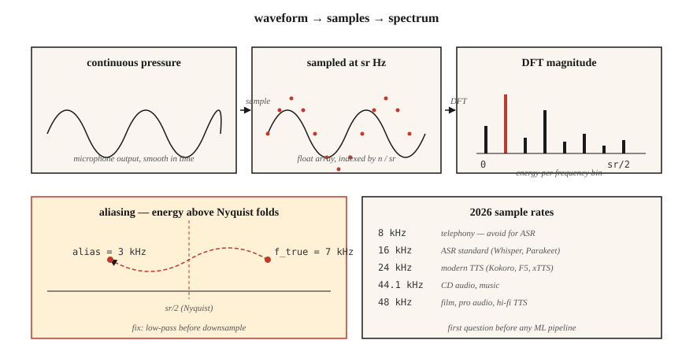

# 音频基础 —— 波形、采样、傅里叶变换

> 波形是原始信号,频谱图是表示形式,Mel 特征是 ML 友好的形态。每条现代 ASR 和 TTS 流水线都要爬这道梯子,而第一级就是理解采样与傅里叶。

**类型:** 学习
**编程语言:** Python
**前置要求:** 第 1 阶段 · 06(向量与矩阵)、第 1 阶段 · 14(概率分布)
**预计耗时:** 约 45 分钟

## 问题

麦克风产出的是"气压随时间变化"的信号,你的神经网络吃的是张量。两者之间隔着一整套约定,违反了就会产出静默的 bug:模型训练得好好的,WER 却翻倍;TTS 上线自带嘶嘶声;语音克隆系统记住了麦克风而不是说话人。

语音系统里的每个 bug,追根溯源都是这三个问题之一:

1. 数据的采样率是多少,模型期望的采样率又是多少?
2. 信号有没有混叠(aliasing)?
3. 你处理的是原始采样点,还是频域表示?

这三问答对了,第 6 阶段剩下的内容都好办;答错了,连 Whisper-Large-v4 吐出来的都是垃圾。

## 概念



**波形。** 一个一维浮点数组,取值在 `[-1.0, 1.0]`。以下标按采样点编号。换算成秒,除以采样率:`t = n / sr`。16 kHz 下 10 秒的音频,就是一个 16 万个浮点数的数组。

**采样率(sr)。** 每秒多少个采样点。2026 年的常见规格:

| 采样率 | 用途 |
|------|-----|
| 8 kHz | 电话、老式 VOIP。奈奎斯特上限 4 kHz,辅音全灭。ASR 不要用。 |
| 16 kHz | ASR 标准。Whisper、Parakeet、SeamlessM4T v2 全都吃 16 kHz。 |
| 22.05 kHz | 老模型的 TTS 声码器训练。 |
| 24 kHz | 现代 TTS(Kokoro、F5-TTS、xTTS v2)。 |
| 44.1 kHz | CD 音质、音乐。 |
| 48 kHz | 影视、专业音频、高保真 TTS(VALL-E 2、NaturalSpeech 3)。 |

**奈奎斯特-香农定理。** 采样率为 `sr` 的系统能无歧义表示的最高频率是 `sr/2`。`sr/2` 这条边界叫*奈奎斯特频率*。超过它的能量会被*混叠*——折返到更低的频率上——污染信号。降采样之前永远先做低通滤波。

**位深。** 16 位 PCM(有符号 int16,范围 ±32767)是通用的交换格式。音乐用 24 位,内部 DSP 用 32 位浮点。`soundfile` 这类库读的是 int16,但暴露给你的是 `[-1, 1]` 区间的 float32 数组。

**傅里叶变换。** 任何有限信号都是不同频率正弦波的叠加。离散傅里叶变换(DFT)对 `N` 个采样点算出 `N` 个复系数——每个频率 bin 一个。`bin k` 对应频率 `k · sr / N` Hz。模长是该频率上的幅度,辐角是相位。

**FFT。** 快速傅里叶变换:当 `N` 为 2 的幂时,DFT 的 `O(N log N)` 算法。所有音频库底层都是 FFT。16 kHz 下做一次 1024 点的 FFT,得到 512 个可用频率 bin,覆盖 0–8 kHz,分辨率 15.6 Hz。

**分帧 + 加窗。** 我们不会对整个音频做 FFT。而是把它切成重叠的*帧*(典型 25 ms 帧长、10 ms 帧移),每帧乘一个窗函数(Hann、Hamming)消除边缘不连续,再对每帧做 FFT。这就是短时傅里叶变换(STFT)。第 02 课从这里接着讲。

```figure
mel-scale
```

## 动手构建

### 第 1 步:读一段音频并画出波形

`code/main.py` 只用标准库的 `wave` 模块,保持示例零依赖。生产环境你会用 `soundfile` 或 `torchaudio.load`(都返回 `(waveform, sr)` 元组):

```python
import soundfile as sf
waveform, sr = sf.read("clip.wav", dtype="float32")  # shape (T,), sr=int
```

### 第 2 步:从第一性原理合成正弦波

```python
import math

def sine(freq_hz, sr, seconds, amp=0.5):
    n = int(sr * seconds)
    return [amp * math.sin(2 * math.pi * freq_hz * i / sr) for i in range(n)]
```

16 kHz 下 1 秒的 440 Hz 正弦波(音乐会标准音 A)是 16000 个浮点数。用 `wave.open(..., "wb")` 以 16 位 PCM 编码写出。

### 第 3 步:手算 DFT

```python
def dft(x):
    N = len(x)
    out = []
    for k in range(N):
        re = sum(x[n] * math.cos(-2 * math.pi * k * n / N) for n in range(N))
        im = sum(x[n] * math.sin(-2 * math.pi * k * n / N) for n in range(N))
        out.append((re, im))
    return out
```

`O(N²)`——`N=256` 时用来验证正确性没问题,对真实音频毫无用处。真实代码调 `numpy.fft.rfft` 或 `torch.fft.rfft`。

### 第 4 步:找主频

幅度谱峰值下标 `k_star` 映射到频率 `k_star * sr / N`。对 440 Hz 正弦波跑一遍,峰值应该出现在 bin `440 * N / sr`。

### 第 5 步:演示混叠

用 10 kHz 采样一个 7 kHz 正弦波(奈奎斯特 = 5 kHz)。7 kHz 超过了上限,折返到 `10 − 7 = 3 kHz`。FFT 峰值出现在 3 kHz 处。这就是经典的混叠演示,也是每台 DAC/ADC 都配砖墙低通滤波器的原因。

## 投入使用

2026 年你真正会用的技术栈:

| 任务 | 库 | 理由 |
|------|---------|-----|
| 读写 WAV/FLAC/OGG | `soundfile`(libsndfile 封装) | 最快、稳定、返回 float32。 |
| 重采样 | `torchaudio.transforms.Resample` 或 `librosa.resample` | 内置正确的抗混叠。 |
| STFT / Mel | `torchaudio` 或 `librosa` | GPU 友好,PyTorch 生态。 |
| 实时流 | `sounddevice` 或 `pyaudio` | 跨平台 PortAudio 绑定。 |
| 查看文件信息 | `ffprobe` 或 `soxi` | 命令行,快,报告采样率/声道/编码。 |

决策规则:**先对齐采样率,再谈别的**。Whisper 期望 16 kHz 单声道 float32。喂给它 44.1 kHz 立体声,你会得到一堆看起来像模型 bug 的垃圾输出。

## 交付

保存为 `outputs/skill-audio-loader.md`。这个技能帮你检查音频输入是否符合下游模型的期望,并在不符合时正确重采样。

## 练习

1. **简单。** 在 16 kHz 下合成 1 秒的 220 Hz + 440 Hz + 880 Hz 混合音。跑 DFT,确认三个峰值出现在预期的 bin 上。
2. **中等。** 用 48 kHz 录 3 秒你自己的声音。分别用 `torchaudio.transforms.Resample`(带抗混叠)降到 16 kHz,和用朴素抽点(每三个取一个)降到 16 kHz。对两者做 FFT。混叠出现在哪里?
3. **困难。** 只用 `math` 和第 3 步的 DFT,从零构建 STFT。帧长 400、帧移 160、Hann 窗。用 `matplotlib.pyplot.imshow` 画出幅度。这就是第 02 课的频谱图。

## 关键术语

| 术语 | 大家口头的说法 | 实际含义 |
|------|-----------------|-----------------------|
| 采样率 | 每秒多少个采样点 | ADC 测量信号的频率,单位 Hz。 |
| 奈奎斯特 | 能表示的最高频率 | `sr/2`;超过它的能量会混叠折返下来。 |
| 位深 | 每个采样点的分辨率 | `int16` = 65536 级;`float32` = `[-1, 1]` 内 24 位精度。 |
| DFT | 序列的傅里叶变换 | `N` 个采样点 → `N` 个复数频率系数。 |
| FFT | 快速 DFT | 要求 `N` 为 2 的幂的 `O(N log N)` 算法。 |
| Bin | 频率列 | `k · sr / N` Hz;分辨率 = `sr / N`。 |
| STFT | 频谱图的底层 | 分帧 + 加窗后逐帧 FFT。 |
| 混叠(Aliasing) | 诡异的频率幽灵 | 奈奎斯特以上的能量镜像折返到更低的 bin。 |

## 延伸阅读

- [Shannon (1949). Communication in the Presence of Noise](https://people.math.harvard.edu/~ctm/home/text/others/shannon/entropy/entropy.pdf) — 采样定理背后的论文。
- [Smith — The Scientist and Engineer's Guide to Digital Signal Processing](https://www.dspguide.com/ch8.htm) — 免费的权威 DSP 教材。
- [librosa docs — audio primer](https://librosa.org/doc/latest/tutorial.html) — 带代码的实战入门。
- [Heinrich Kuttruff — Room Acoustics (6th ed.)](https://www.routledge.com/Room-Acoustics/Kuttruff/p/book/9781482260434) — 解释真实世界的音频为什么不是干净正弦波的参考书。
- [Steve Eddins — FFT Interpretation notebook](https://blogs.mathworks.com/steve/2020/03/30/fft-spectrum-and-spectral-densities/) — 10 分钟讲清频率 bin 的直觉。
