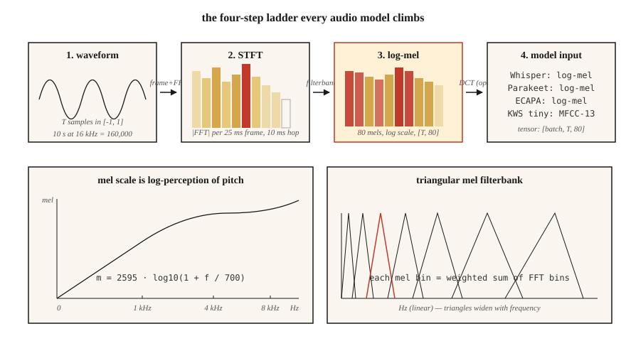

# 频谱图、Mel 刻度与音频特征

> 神经网络直接吃原始波形的效果并不好。它们吃频谱图,吃 Mel 频谱图效果更好。2026 年的每个 ASR、TTS 和音频分类器,生死都系于这一个预处理选择。

**类型:** 动手构建
**编程语言:** Python
**前置要求:** 第 6 阶段 · 01(音频基础)
**预计耗时:** 约 45 分钟

## 问题

取一段 10 秒的 16 kHz 音频。那是 16 万个浮点数,都在 `[-1, 1]` 区间,与"狗叫"或"单词 cat"这个标签几乎完全不相关。原始波形里信息是有的,但形式让模型难以提取。同一个音素,相隔 100 ms 说两遍,原始采样点完全不同。

频谱图解决了这个问题。它在人类感知忽略的维度上压缩时间细节(微秒级抖动),在感知关注的维度上保留结构(在约 10–25 ms 的时间窗内,哪些频率能量强)。

Mel 频谱图更进一步。人对音高的感知是对数式的:100 Hz 与 200 Hz 听起来的"距离",和 1000 Hz 与 2000 Hz 一样。Mel 刻度把频率轴掰弯来匹配这种感知。从 2010 到 2026,Mel 频谱图一直是语音 ML 中最重要的单一特征。

## 概念



**STFT(短时傅里叶变换)。** 把波形切成重叠的帧(典型:25 ms 窗长、10 ms 帧移,16 kHz 下即 400 采样点 / 160 采样点)。每帧乘一个窗函数(默认 Hann;Hamming 取舍略有不同)。逐帧 FFT。把幅度谱堆成形状为 `(n_frames, n_freq_bins)` 的矩阵。这就是频谱图。

**对数幅度。** 原始幅度横跨 5-6 个数量级。取 `log(|X| + 1e-6)` 或 `20 * log10(|X|)` 压缩动态范围。所有生产流水线用的都是对数幅度,不是原始幅度。

**Mel 刻度。** 频率 `f`(Hz)按 `m = 2595 * log10(1 + f / 700)` 映射到 mel 值 `m`。1 kHz 以下近似线性,以上近似对数。覆盖 0–8 kHz 的 80 个 mel bin,是标准的 ASR 输入。

**Mel 滤波器组。** 一组在 mel 刻度上等间距分布的三角滤波器。每个滤波器是相邻若干 FFT bin 的加权和。用滤波器组矩阵乘 STFT 幅度,一次矩阵乘法就得到 mel 频谱图。

**对数 mel 频谱图(log-mel)。** `log(mel_spec + 1e-10)`。Whisper 的输入,Parakeet 的输入,SeamlessM4T 的输入。2026 年通用的音频前端。

**MFCC。** 取 log-mel 频谱图,做 DCT(II 型),保留前 13 个系数。让特征去相关并进一步压缩。2015 年之前的主流特征,之后被直接吃 log-mel 的 CNN/Transformer 追上。说话人识别(x-vectors、ECAPA)中仍在使用。

**分辨率取舍。** FFT 越大,频率分辨率越好,时间分辨率越差。25 ms / 10 ms 是音频 ML 的默认;音乐用 50 ms / 12.5 ms;瞬态检测(鼓点、爆破音)用 5 ms / 2 ms。

```figure
spectrogram-window
```

## 动手构建

### 第 1 步:给波形分帧

```python
def frame(signal, frame_len, hop):
    n = 1 + (len(signal) - frame_len) // hop
    return [signal[i * hop : i * hop + frame_len] for i in range(n)]
```

10 秒的 16 kHz 音频,取 `frame_len=400, hop=160`,得到 998 帧。

### 第 2 步:Hann 窗

```python
import math

def hann(N):
    return [0.5 * (1 - math.cos(2 * math.pi * n / (N - 1))) for n in range(N)]
```

FFT 之前逐元素相乘。消除在非零端点截断引起的频谱泄漏。

### 第 3 步:STFT 幅度

```python
def stft_magnitude(signal, frame_len=400, hop=160):
    win = hann(frame_len)
    frames = frame(signal, frame_len, hop)
    return [magnitudes(dft([w * s for w, s in zip(win, f)])) for f in frames]
```

生产环境用 `torch.stft` 或 `librosa.stft`(FFT 支撑、向量化)。这里的循环是教学用途,在 `code/main.py` 里跑短音频没问题。

### 第 4 步:mel 滤波器组

```python
def hz_to_mel(f):
    return 2595.0 * math.log10(1.0 + f / 700.0)

def mel_to_hz(m):
    return 700.0 * (10 ** (m / 2595.0) - 1)

def mel_filterbank(n_mels, n_fft, sr, fmin=0, fmax=None):
    fmax = fmax or sr / 2
    mels = [hz_to_mel(fmin) + (hz_to_mel(fmax) - hz_to_mel(fmin)) * i / (n_mels + 1)
            for i in range(n_mels + 2)]
    hzs = [mel_to_hz(m) for m in mels]
    bins = [int(h * n_fft / sr) for h in hzs]
    fb = [[0.0] * (n_fft // 2 + 1) for _ in range(n_mels)]
    for m in range(n_mels):
        for k in range(bins[m], bins[m + 1]):
            fb[m][k] = (k - bins[m]) / max(1, bins[m + 1] - bins[m])
        for k in range(bins[m + 1], bins[m + 2]):
            fb[m][k] = (bins[m + 2] - k) / max(1, bins[m + 2] - bins[m + 1])
    return fb
```

`n_fft=400` 时,覆盖 0–8 kHz 的 80 个 mel 给出一个 `(80, 201)` 的矩阵。用 `(n_frames, 201)` 的 STFT 幅度乘它的转置,得到 `(n_frames, 80)` 的 mel 频谱图。

### 第 5 步:log-mel

```python
def log_mel(mel_spec, eps=1e-10):
    return [[math.log(max(v, eps)) for v in frame] for frame in mel_spec]
```

常见替代:`librosa.power_to_db`(参考归一化的 dB)、`10 * log10(power + eps)`。Whisper 用一套更复杂的截断 + 归一化流程(见 Whisper 的 `log_mel_spectrogram`)。

### 第 6 步:MFCC

```python
def dct_ii(x, n_coeffs):
    N = len(x)
    return [
        sum(x[n] * math.cos(math.pi * k * (2 * n + 1) / (2 * N)) for n in range(N))
        for k in range(n_coeffs)
    ]
```

对每个 log-mel 帧做 DCT,保留前 13 个系数,就是 MFCC 矩阵。第一个系数通常丢弃(它编码的是整体能量)。

## 投入使用

2026 年的技术栈:

| 任务 | 特征 |
|------|----------|
| ASR(Whisper、Parakeet、SeamlessM4T) | 80 维 log-mel,10 ms 帧移,25 ms 窗长 |
| TTS 声学模型(VITS、F5-TTS、Kokoro) | 80 维 mel,5–12 ms 帧移,精细时间控制 |
| 音频分类(AST、PANNs、BEATs) | 128 维 log-mel,10 ms 帧移 |
| 说话人嵌入(ECAPA-TDNN、WavLM) | 80 维 log-mel 或原始波形 SSL |
| 音乐(MusicGen、Stable Audio 2) | EnCodec 离散 token(不用 mel) |
| 关键词唤醒 | 40 维 MFCC,用于微型设备 |

经验法则:**不做音乐,就从 80 维 log-mel 开始。** 任何偏离都需要你自己举证。

## 2026 年仍然在上线的坑

- **mel 维数不匹配。** 训练用 80 维,推理用 128 维。静默失败。在两端都打印特征形状。
- **上游采样率不匹配。** 22.05 kHz 算出来的 mel 和 16 kHz 长得不一样。特征化*之前*先统一采样率。
- **dB vs log。** Whisper 期望 log-mel,不是 dB-mel。有些 HF 流水线会自动检测,你的自定义代码不会。
- **归一化漂移。** 训练时逐句归一化,推理时全局归一化。让 WER 翻倍的生产 bug。
- **填充引入的泄漏。** 音频末尾补零会让尾部帧出现平坦频谱。对称填充,或用边缘值复制。

## 交付

保存为 `outputs/skill-feature-extractor.md`。这个技能针对给定的目标模型,帮你选定特征类型、mel 维数、帧长/帧移和归一化方式。

## 练习

1. **简单。** 运行 `code/main.py`。它合成一段扫频音(频率从 200 扫到 4000 Hz),打印每帧的 argmax mel bin。画图(可选)确认它与扫频轨迹吻合。
2. **中等。** 分别以 `n_mels` ∈ {40, 80, 128} 和 `frame_len` ∈ {200, 400, 800} 重跑。测量尖峰在时间轴上的带宽。哪种组合对扫频音的分辨最好?
3. **困难。** 实现 `power_to_db`,在 AudioMNIST 上训练一个小 CNN 分类器,对比 (a) 原始 log-mel、(b) `ref=max` 的 dB-mel、(c) MFCC-13 + 一阶差分 + 二阶差分三种特征的 ASR 准确率。报告 top-1 准确率。

## 关键术语

| 术语 | 大家口头的说法 | 实际含义 |
|------|-----------------|-----------------------|
| 帧(Frame) | 一段切片 | 喂给一次 FFT 的 25 ms 波形块。 |
| 帧移(Hop) | 步长 | 相邻两帧之间的采样点数;ASR 默认 10 ms。 |
| 窗(Window) | Hann/Hamming 那东西 | 逐点相乘的系数,把帧的两端渐缩到零。 |
| STFT | 频谱图生成器 | 分帧 + 加窗的 FFT;产出 时间 × 频率 矩阵。 |
| Mel | 掰弯的频率 | 对数感知刻度;`m = 2595·log10(1 + f/700)`。 |
| 滤波器组 | 那个矩阵 | 把 STFT 投影到 mel bin 上的三角滤波器组。 |
| Log-mel | Whisper 的输入 | `log(mel_spec + eps)`;2026 年已成标准。 |
| MFCC | 老派特征 | log-mel 的 DCT;13 个系数,已去相关。 |

## 延伸阅读

- [Davis, Mermelstein (1980). Comparison of parametric representations for monosyllabic word recognition](https://ieeexplore.ieee.org/document/1163420) — MFCC 原始论文。
- [Stevens, Volkmann, Newman (1937). A Scale for the Measurement of the Psychological Magnitude Pitch](https://pubs.aip.org/asa/jasa/article-abstract/8/3/185/735757/) — 最早的 mel 刻度。
- [OpenAI — Whisper source, log_mel_spectrogram](https://github.com/openai/whisper/blob/main/whisper/audio.py) — 读参考实现。
- [librosa feature extraction docs](https://librosa.org/doc/main/feature.html) — `mfcc`、`melspectrogram` 及帧移/窗长的参考文档。
- [NVIDIA NeMo — audio preprocessing](https://docs.nvidia.com/deeplearning/nemo/user-guide/docs/en/main/asr/asr_all.html#featurizers) — Parakeet + Canary 模型的生产级流水线。
