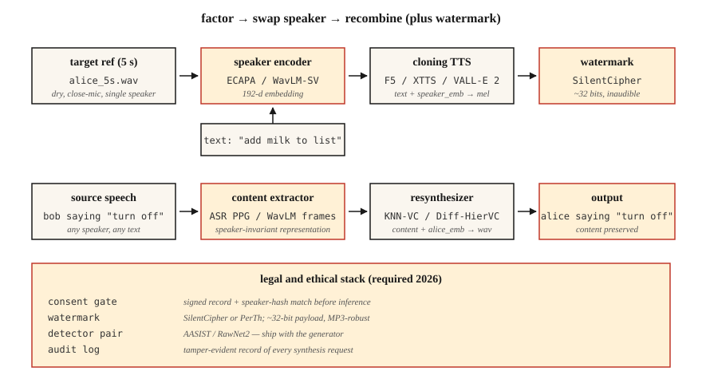

# 语音克隆与语音转换

> 语音克隆是用别人的声音念你的文本;语音转换是把你的声音改写成别人的,同时保住你说的内容。两者都系于同一个分解:把说话人身份与内容分离开。

**类型:** 动手构建
**编程语言:** Python
**前置要求:** 第 6 阶段 · 06(说话人识别)、第 6 阶段 · 07(TTS)
**预计耗时:** 约 75 分钟

## 问题

2026 年,一张消费级显卡加 5 秒音频,就足以高质量克隆任何人的声音。ElevenLabs、F5-TTS、OpenVoice v2、VoiceBox 全都提供零样本或小样本克隆。这项技术既是福音(无障碍 TTS、配音、辅助发声),也是武器(诈骗电话、政治深伪、知识产权盗窃)。

两个密切相关的任务:

- **语音克隆(TTS 侧):** 文本 + 5 秒参考声音 → 用那个声音合成的音频。
- **语音转换(语音侧):** 源音频(A 在说 X)+ B 的参考声音 → B 说 X 的音频。

两者都把波形分解为(内容、说话人、韵律),再把一方提供的内容与另一方提供的说话人重新组合。

2026 年你必须遵守的关键约束:**在欧盟(《AI 法案》,2026 年 8 月可执行)和加州(AB 2905,2025 年生效),水印与知情同意闸门已是法律要求**。你的流水线必须嵌入不可闻的水印,并拒绝未获同意的克隆。

## 概念



**零样本克隆。** 把 5 秒音频喂给一个在上千个说话人语料上训练过的模型。说话人编码器把音频映射成说话人嵌入,TTS 解码器以该嵌入加文本为条件生成。

使用者:F5-TTS(2024)、YourTTS(2022)、XTTS v2(2024)、OpenVoice v2(2024)。

**小样本微调。** 录目标声音 5-30 分钟,对基础模型做一小时 LoRA 微调。质量从"还行"跃升到"真假难辨"。Coqui 和 ElevenLabs 都支持这种模式,社区用 F5-TTS 也这么玩。

**语音转换(VC)。** 两个家族:

- **识别-合成。** 跑一个类 ASR 模型提取内容表示(如软音素后验、PPG),再用目标说话人嵌入重新合成。对语言和口音鲁棒。使用者:KNN-VC(2023)、Diff-HierVC(2023)。
- **解耦。** 训练一个自编码器,在瓶颈处把内容、说话人、韵律在潜空间里分开,推理时换掉说话人嵌入。质量较低但更快。使用者:AutoVC(2019)、VITS-VC 变体。

**基于神经编解码的克隆(2024+)。** VALL-E、VALL-E 2、NaturalSpeech 3、VoiceBox——把音频当作 SoundStream / EnCodec 的离散 token,在编解码 token 上训练大型自回归或流匹配模型。短提示下质量可比 ElevenLabs。

### 伦理部分,不是事后补丁

**水印。** PerTh(Perth)和 SilentCipher(2024)把约 16-32 比特的 ID 不可感知地嵌进音频。能扛住重编码、流式传输和常见剪辑。生产可用的开源方案。

**同意闸门。** 每个克隆输出都必须配一份可验证的同意记录。"我,Rohit,于 2026-04-22,授权此声音用于 X 用途。"存进防篡改日志。

**检测。** AASIST、RawNet2、Wav2Vec2-AASIST 都是现成的检测器。ASVspoof 2025 挑战赛公布的最强检测器,对 ElevenLabs、VALL-E 2 和 Bark 输出的 EER 为 0.8–2.3%。

### 数字(2026)

| 模型 | 零样本? | SECS(目标相似度) | WER(可懂度) | 参数量 |
|-------|-----------|--------------------|--------------|--------|
| F5-TTS | 是 | 0.72 | 2.1% | 335M |
| XTTS v2 | 是 | 0.65 | 3.5% | 470M |
| OpenVoice v2 | 是 | 0.70 | 2.8% | 220M |
| VALL-E 2 | 是 | 0.77 | 2.4% | 370M |
| VoiceBox | 是 | 0.78 | 2.1% | 330M |

SECS > 0.70 时,对大多数听者来说已与目标难以区分。

```figure
sp-voice-factorize
```

## 动手构建

### 第 1 步:用识别-合成做分解(main.py 里的纯代码演示)

```python
def clone_pipeline(ref_audio, text, target_embedder, tts_model):
    speaker_emb = target_embedder.encode(ref_audio)
    mel = tts_model(text, speaker=speaker_emb)
    return vocoder(mel)
```

概念上很简单;实现的工作量在 `tts_model` 和说话人编码器里。

### 第 2 步:用 F5-TTS 零样本克隆

```python
from f5_tts.api import F5TTS
tts = F5TTS()
wav = tts.infer(
    ref_file="rohit_5s.wav",
    ref_text="The quick brown fox jumps over the lazy dog.",
    gen_text="Please add milk and bread to my list.",
)
```

参考转写必须与音频完全一致,标点都要对;对不上就会破坏对齐。

### 第 3 步:用 KNN-VC 做语音转换

```python
import torch
from knnvc import KNNVC  # 2023 model, https://github.com/bshall/knn-vc
vc = KNNVC.load("wavlm-base-plus")
out_wav = vc.convert(source="my_voice.wav", target_pool=["alice_1.wav", "alice_2.wav"])
```

KNN-VC 用 WavLM 为源音频和目标池提取逐帧嵌入,然后把每个源帧替换成目标池中最近的邻居。非参数化,一分钟目标语音就能工作。

### 第 4 步:嵌入水印

```python
from silentcipher import SilentCipher
sc = SilentCipher(model="2024-06-01")
payload = b"consent_id:abc123;ts:1745353200"
watermarked = sc.embed(wav, sr=24000, message=payload)
detected = sc.detect(watermarked, sr=24000)   # returns payload bytes
```

约 32 比特载荷,MP3 重编码和轻度噪声之后仍可检出。

### 第 5 步:同意闸门

```python
def cloned_inference(text, ref_audio, consent_record):
    assert verify_signature(consent_record), "Signed consent required"
    assert consent_record["speaker_id"] == hash_speaker(ref_audio)
    wav = tts.infer(ref_file=ref_audio, gen_text=text)
    wav = watermark(wav, payload=consent_record["id"])
    return wav
```

## 投入使用

2026 年的技术栈:

| 场景 | 选择 |
|-----------|------|
| 5 秒零样本克隆、开源 | F5-TTS 或 OpenVoice v2 |
| 商业生产级克隆 | ElevenLabs Instant Voice Clone v2.5 |
| 语音转换(改写) | KNN-VC 或 Diff-HierVC |
| 多说话人微调 | StyleTTS 2 + 说话人适配器 |
| 跨语言克隆 | XTTS v2 或 VALL-E X |
| 深伪检测 | Wav2Vec2-AASIST |

## 常见坑

- **参考转写不对齐。** F5-TTS 这类模型要求参考文本与参考音频完全一致,包括标点。
- **参考音频带混响。** 回声会毁掉克隆。录干声,近距离拾音。
- **情绪不匹配。** 用"欢快"的参考训练,克隆什么都是欢快的。参考情绪要匹配目标用途。
- **语言泄漏。** 克隆了英语说话人,再让模型说法语,往往还是带着英语口音;用跨语言模型(XTTS、VALL-E X)。
- **没有水印。** 2026 年 8 月起在欧盟属违法,无法交付。

## 交付

保存为 `outputs/skill-voice-cloner.md`。设计一条带同意闸门 + 水印 + 质量目标的克隆或转换流水线。

## 练习

1. **简单。** 运行 `code/main.py`。通过计算两个"说话人"交换前后的余弦相似度,演示说话人嵌入交换。
2. **中等。** 用 OpenVoice v2 克隆你自己的声音。测量参考与克隆之间的 SECS,经 Whisper 测量 CER。
3. **困难。** 给 20 段克隆音频嵌入 SilentCipher 水印,过一遍 128 kbps MP3 编码 + 解码,再检出载荷。报告比特准确率。

## 关键术语

| 术语 | 大家口头的说法 | 实际含义 |
|------|-----------------|-----------------------|
| 零样本克隆 | 5 秒就够 | 预训练模型 + 说话人嵌入;无需训练。 |
| PPG | 音素后验图 | 逐帧 ASR 后验,作为与语言无关的内容表示。 |
| KNN-VC | 最近邻转换 | 把每个源帧替换成目标池中最近的帧。 |
| 神经编解码 TTS | VALL-E 风格 | 在 EnCodec/SoundStream token 上的自回归模型。 |
| 水印 | 不可闻签名 | 嵌在音频里的比特,扛得住重编码。 |
| SECS | 克隆保真度 | 目标与克隆说话人嵌入之间的余弦。 |
| AASIST | 深伪检测器 | 反欺诈模型;检测合成语音。 |

## 延伸阅读

- [Chen et al. (2024). F5-TTS](https://arxiv.org/abs/2410.06885) — 开源 SOTA 零样本克隆。
- [Baevski et al. / Microsoft (2023). VALL-E](https://arxiv.org/abs/2301.02111) 与 [VALL-E 2 (2024)](https://arxiv.org/abs/2406.05370) — 神经编解码 TTS。
- [Qian et al. (2019). AutoVC](https://arxiv.org/abs/1905.05879) — 基于解耦的语音转换。
- [Baas, Waubert de Puiseau, Kamper (2023). KNN-VC](https://arxiv.org/abs/2305.18975) — 基于检索的语音转换。
- [SilentCipher (2024) — Audio Watermarking](https://github.com/sony/silentcipher) — 生产可用的 32 比特音频水印。
- [ASVspoof 2025 results](https://www.asvspoof.org/) — 检测器与合成器的军备竞赛,2026 年更新。
