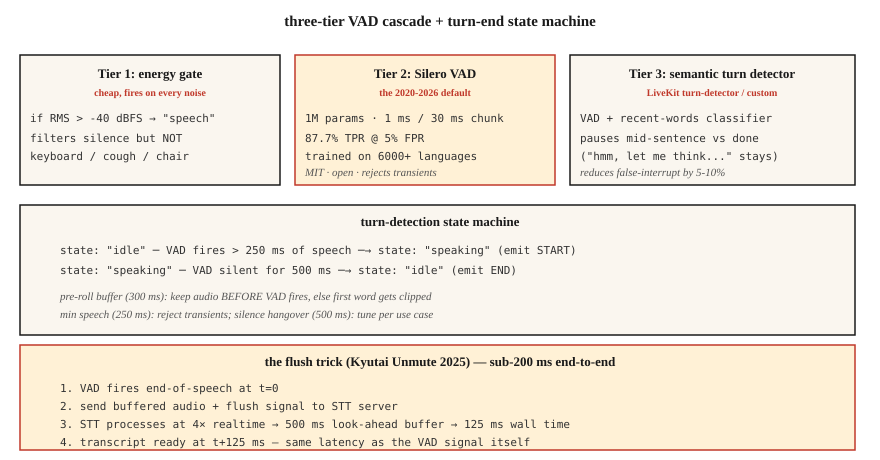

# 语音活动检测与话轮转换 —— Silero、Cobra 与冲刷技巧

> 每个语音智能体的生死都系于两个判断:用户现在在说话吗?说完了吗?VAD 回答第一个,话轮检测(VAD + 静音拖尾 + 语义端点模型)回答第二个。答错任何一个,你的助手要么抢用户的话,要么永远闭不上嘴。

**类型:** 动手构建
**编程语言:** Python
**前置要求:** 第 6 阶段 · 11(实时音频)、第 6 阶段 · 12(语音助手)
**预计耗时:** 约 45 分钟

## 问题

语音智能体在每 20 ms 音频块上要做三个不同的判断:

1. **这一帧是语音吗?** —— VAD。逐帧二分类。
2. **用户开始新的一段发言了吗?** —— 起始检测(onset)。
3. **用户说完了吗?** —— 端点判定(话轮结束)。

朴素的答案(能量阈值)在任何噪声面前都会失效——车流、键盘、人群嘈杂。2026 年的答案是:Silero VAD(开源、深度学习)+ 话轮检测模型(语义端点)+ 经 VAD 校准的静音拖尾。

## 概念



### 三级 VAD 级联

**第 1 级:能量门。** 最便宜。RMS 阈值设在 -40 dBFS。能滤掉明显的静音,但任何超过阈值的噪声都会触发它。

**第 2 级:Silero VAD**(2020-2026,MIT)。100 万参数。在 6000+ 种语言上训练。单 CPU 线程处理 30 ms 一块约 1 ms。5% 误报率下召回率 87.7%。开源默认。

**第 3 级:语义话轮检测器。** LiveKit 的话轮检测模型(2024-2026)或你自训的小分类器。区分"句中停顿"和"说完了"。利用的是语言上下文(语调 + 最近的词),而不只是静音。

### 关键参数及其默认值

- **阈值。** Silero 输出概率;> 0.5(默认)或 > 0.3(灵敏)判为语音。阈值越低,首词被切越少,误报越多。
- **最短语音时长。** 短于 250 ms 的"语音"直接拒掉——多半是咳嗽或椅子响。
- **静音拖尾(端点判定)。** VAD 回到 0 之后,等 500-800 ms 再宣布话轮结束。太短会打断用户,太长显得迟钝。
- **预滚缓冲。** 保留 VAD 触发前 300-500 ms 的音频。防止"嘿"被切掉。

### 冲刷技巧(Kyutai 2025)

流式 STT 模型有前瞻延迟(Kyutai STT-1B 是 500 ms,STT-2.6B 是 2.5 s)。正常情况下,语音结束后你得等那么久才能拿到转写。冲刷技巧:VAD 判定语音结束时,**给 STT 发一个冲刷信号**,强制它立刻输出。STT 以约 4 倍实时速度处理,500 ms 的缓冲约 125 ms 就能吐完。

端到端:125 ms VAD + 冲刷 STT = 对话级延迟。

### 2026 年 VAD 对比

| VAD | 5% 误报下召回率 | 延迟 | 协议 |
|-----|--------------|---------|---------|
| WebRTC VAD(Google,2013) | 50.0% | 30 ms | BSD |
| Silero VAD(2020-2026) | 87.7% | ~1 ms | MIT |
| Cobra VAD(Picovoice) | 98.9% | ~1 ms | 商业 |
| pyannote segmentation | 95% | ~10 ms | 类 MIT |

Silero 是正确的默认。Cobra 是合规/精度升级。纯能量 VAD 在 2026 年的生产环境没有立足之地。

```figure
sp-vad-cascade
```

## 动手构建

### 第 1 步:能量门

```python
def energy_vad(chunk, threshold_dbfs=-40.0):
    rms = (sum(x * x for x in chunk) / len(chunk)) ** 0.5
    dbfs = 20.0 * math.log10(max(rms, 1e-10))
    return dbfs > threshold_dbfs
```

### 第 2 步:Python 里用 Silero VAD

```python
from silero_vad import load_silero_vad, get_speech_timestamps

vad = load_silero_vad()
audio = torch.tensor(waveform_16k, dtype=torch.float32)
segments = get_speech_timestamps(
    audio, vad, sampling_rate=16000,
    threshold=0.5,
    min_speech_duration_ms=250,
    min_silence_duration_ms=500,
    speech_pad_ms=300,
)
for s in segments:
    print(f"{s['start']/16000:.2f}s - {s['end']/16000:.2f}s")
```

### 第 3 步:话轮结束状态机

```python
class TurnDetector:
    def __init__(self, silence_hangover_ms=500, min_speech_ms=250):
        self.state = "idle"
        self.speech_ms = 0
        self.silence_ms = 0
        self.silence_hangover_ms = silence_hangover_ms
        self.min_speech_ms = min_speech_ms

    def update(self, is_speech, chunk_ms=20):
        if is_speech:
            self.speech_ms += chunk_ms
            self.silence_ms = 0
            if self.state == "idle" and self.speech_ms >= self.min_speech_ms:
                self.state = "speaking"
                return "START"
        else:
            self.silence_ms += chunk_ms
            if self.state == "speaking" and self.silence_ms >= self.silence_hangover_ms:
                self.state = "idle"
                self.speech_ms = 0
                return "END"
        return None
```

### 第 4 步:冲刷技巧骨架

```python
def flush_on_end(stt_client, audio_buffer):
    stt_client.send_audio(audio_buffer)
    stt_client.send_flush()
    return stt_client.recv_transcript(timeout_ms=150)
```

STT(Kyutai、Deepgram、AssemblyAI)必须支持冲刷才行。Whisper 流式不支持——它是按块处理的,永远要等块到齐。

## 投入使用

| 场景 | VAD 选择 |
|-----------|-----------|
| 开源、快、通用 | Silero VAD |
| 商业呼叫中心 | Cobra VAD |
| 端侧(手机) | Silero VAD ONNX |
| 研究 / 说话人日志 | pyannote segmentation |
| 零依赖兜底 | WebRTC VAD(遗留) |
| 需要话轮结束质量 | Silero + LiveKit 话轮检测器叠加 |

经验法则:除非真的别无选择,否则永远不要交付纯能量 VAD。

## 常见坑

- **固定阈值。** 安静环境能用,嘈杂环境就废。要么在设备上校准,要么换 Silero。
- **静音拖尾太短。** 助手在句中打断用户。对话语音的甜点是 500-800 ms。
- **拖尾太长。** 显得迟钝。拿目标用户做 A/B 测试。
- **没有预滚缓冲。** 用户音频的前 200-300 ms 丢失。永远保留滚动预滚。
- **忽视语义端点。** "嗯,我想想……"中间有长停顿。用户讨厌在思考时被打断。用 LiveKit 的话轮检测器或类似方案。

## 交付

保存为 `outputs/skill-vad-tuner.md`。针对工作负载,选定 VAD 模型、阈值、拖尾、预滚和话轮检测策略。

## 练习

1. **简单。** 运行 `code/main.py`。它模拟 语音 + 静音 + 语音 + 咳嗽 的序列,测试三级 VAD。
2. **中等。** 安装 `silero-vad`,处理一段 5 分钟录音,调阈值,同时最小化首词被切和误触发。报告精确率/召回率。
3. **困难。** 搭一个迷你话轮检测器:Silero VAD + 在最后 10 个词嵌入上的 3 层 MLP(用 sentence-transformers)。在手工标注的话轮结束数据集上训练,F1 要比纯 Silero 高 10%。

## 关键术语

| 术语 | 大家口头的说法 | 实际含义 |
|------|-----------------|-----------------------|
| VAD | 语音检测器 | 逐帧二分类:这是语音吗? |
| 话轮检测 | 端点判定 | VAD + 静音拖尾 + 语义端点。 |
| 静音拖尾 | 语音后的等待 | 宣布话轮结束前的等待时间;500-800 ms。 |
| 预滚 | 语音前缓冲 | 保留 VAD 触发前 300-500 ms 的音频。 |
| 冲刷技巧 | Kyutai 的招 | VAD → 冲刷 STT → 125 ms 取代 500 ms 延迟。 |
| 语义端点 | "他们是想停吗?" | 看词而不只看静音的 ML 分类器。 |
| 5% 误报下召回率 | ROC 点 | VAD 标准基准;Silero 87.7%,WebRTC 50%。 |

## 延伸阅读

- [Silero VAD](https://github.com/snakers4/silero-vad) — 开源 VAD 参考实现。
- [Picovoice Cobra VAD](https://picovoice.ai/products/cobra/) — 商业精度领跑者。
- [Kyutai — Unmute + flush trick](https://kyutai.org/stt) — 亚 200 ms 的工程技巧。
- [LiveKit — turn detection](https://docs.livekit.io/agents/logic/turns/) — 生产中的语义端点。
- [WebRTC VAD](https://webrtc.googlesource.com/src/) — 遗留基线。
- [pyannote segmentation](https://github.com/pyannote/pyannote-audio) — 日志级切分。
