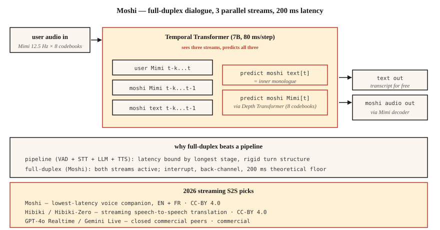

# 流式语音到语音 —— Moshi、Hibiki 与全双工对话

> 2024-2026 年重新定义了语音 AI。Moshi 交付了一个能同时听和说的单一模型,延迟 200 ms;Hibiki 做逐块的语音到语音翻译。两者都抛弃了 ASR → LLM → TTS 流水线,改用 Mimi 编解码 token 上的统一全双工架构。这是新的参考设计。

**类型:** 学习
**编程语言:** Python
**前置要求:** 第 6 阶段 · 13(神经音频编解码器)、第 6 阶段 · 11(实时音频)、第 7 阶段 · 05(完整 Transformer)
**预计耗时:** 约 75 分钟

## 问题

用第 11、12 课搭出来的每个语音智能体,都有一个 300-500 ms 的根本延迟地板:VAD 触发、STT 处理、LLM 推理、TTS 生成。每一级都有自己的最小延迟。你可以调优、可以并行化,但流水线的形状给你封了顶。

Moshi(Kyutai,2024-2026)问了一个不同的问题:要是根本没有流水线呢?要是只用一个模型,音频进、音频出,连续不断,文本只是一条居间的"内心独白"而不是必经阶段呢?

答案就是**全双工语音到语音**。理论延迟 160 ms(80 ms Mimi 帧 + 80 ms 声学延迟),单张 L4 GPU 上的实际延迟 200 ms。这是最顶尖的流水线语音助手的一半。

## 概念



### Moshi 架构

**输入。** 两路 Mimi 编解码流,都是 12.5 Hz × 8 码本:

- 流 1:用户音频(Mimi 编码,持续到达)
- 流 2:Moshi 自己的音频(由 Moshi 生成)

**Transformer。** 一个 70 亿参数的时序 Transformer 同时处理两路音频流和一路文本"内心独白"流。在每个 80 ms 步长上,它:

1. 消费最新的用户 Mimi token(8 个码本)。
2. 消费最近的 Moshi Mimi token(8 个码本,刚生成的)。
3. 生成下一个 Moshi 文本 token(内心独白)。
4. 生成下一组 Moshi Mimi token(经一个小型深度 Transformer 产出 8 个码本)。

三路流——用户音频、Moshi 音频、Moshi 文本——并行运转。Moshi 能在说话时听见用户;用户插话时它能打断自己;还能在不打断主体发言的情况下发出附和的"嗯哼"。

**深度 Transformer(Depth Transformer)。** 一帧之内的 8 个码本不是并行预测的——码本之间有依赖关系。一个小型 2 层深度 Transformer 在 80 ms 内按序预测它们。这是 AR 编解码 LM 的标准分解方式(VALL-E、VibeVoice 也这么用)。

### 内心独白文本为什么有用

没有显式文本,模型就得在声学流里隐式建模语言。Moshi 的洞察是:强制它在音频之外同时输出文本 token。文本流本质上就是 Moshi 所说话语的转写稿。这改善了语义连贯性,让换语言模型头更容易,还白送一份转写。

### Hibiki:流式语音到语音翻译

同样的架构,在翻译对上训练。源语言音频进,目标语言音频出,连续不断。Hibiki-Zero(2026 年 2 月)摆脱了对词级对齐训练数据的需求——用句子级数据 + GRPO 强化学习做延迟优化。

最初支持四个语言对;适配一门新语言约需 1000 小时数据。

### Kyutai 全家桶(2026)

- **Moshi** —— 全双工对话(法语优先,英语支持良好)
- **Hibiki / Hibiki-Zero** —— 同声传译
- **Kyutai STT** —— 流式 ASR(500 ms 或 2.5 s 前瞻)
- **Kyutai Pocket TTS** —— 1 亿参数 TTS,CPU 可跑(2026 年 1 月)
- **Unmute** —— 在公共服务器上整合以上全部的完整管线

L40S GPU 上的吞吐:64 路并发会话,3 倍实时。

### Sesame CSM —— 表亲

Sesame CSM(2025)思路相近——Llama-3 骨干加 Mimi 编解码头。但 CSM 是单向的(接收上下文 + 文本,产出语音),不是全双工。它是市面上"声音存在感"最好的 TTS,但与 Moshi 的全双工能力不完全是一回事。

### 2026 年性能数字

| 模型 | 延迟 | 用途 | 协议 |
|-------|---------|----------|---------|
| Moshi | 200 ms(L4) | 全双工英语/法语对话 | CC-BY 4.0 |
| Hibiki | 12.5 Hz 帧率 | 法 ↔ 英流式翻译 | CC-BY 4.0 |
| Hibiki-Zero | 同上 | 5 个语言对,无需对齐数据 | CC-BY 4.0 |
| Sesame CSM-1B | 200 ms 首音 | 上下文条件 TTS | Apache-2.0 |
| GPT-4o Realtime | ~300 ms | 闭源,OpenAI API | 商业 |
| Gemini 2.5 Live | ~350 ms | 闭源,Google API | 商业 |

```figure
sp-fullduplex
```

## 动手构建

### 第 1 步:接口

Moshi 暴露一个 WebSocket 服务,接收 80 ms 一块的 Mimi 编码音频,返回 80 ms 一块的 Mimi 编码音频。双向,持续不断。

```python
import asyncio
import websockets
from moshi.client_utils import encode_audio_mimi, decode_audio_mimi

async def moshi_chat():
    async with websockets.connect("ws://localhost:8998/api/chat") as ws:
        mic_task = asyncio.create_task(stream_mic_to(ws))
        spk_task = asyncio.create_task(stream_from_to_speaker(ws))
        await asyncio.gather(mic_task, spk_task)
```

### 第 2 步:全双工循环

```python
async def stream_mic_to(ws):
    async for chunk_80ms in mic_stream_at_12_5_hz():
        mimi_tokens = encode_audio_mimi(chunk_80ms)
        await ws.send(serialize(mimi_tokens))

async def stream_from_to_speaker(ws):
    async for msg in ws:
        mimi_tokens, text_token = deserialize(msg)
        audio = decode_audio_mimi(mimi_tokens)
        await play(audio)
```

两个方向同时跑。传输层标准是 Python asyncio 或 Rust futures。

### 第 3 步:训练目标(概念)

对每个 80 ms 帧 `t`:

- 输入:`user_mimi[0..t]`、`moshi_mimi[0..t-1]`、`moshi_text[0..t-1]`
- 预测:`moshi_text[t]`,然后是 `moshi_mimi[t, codebook_0..7]`

文本先于音频预测(内心独白);音频在深度 Transformer 内按码本顺序预测。

### 第 4 步:Moshi 赢在哪,输在哪

Moshi 赢:

- 廉价硬件上端到端 <250 ms。
- 自然的附和与打断。
- 没有流水线胶水代码。

Moshi 不赢:

- 工具调用(没为此训练;你得另开一条 LLM 路径)。
- 长推理(Moshi 是 8B 量级的对话模型,不是 Claude/GPT-4)。
- 小众话题的事实准确性。
- 大多数企业生产用例(2026 年主流仍是流水线)。

## 投入使用

| 场景 | 选择 |
|-----------|------|
| 最低延迟语音伙伴 | Moshi |
| 实时翻译通话 | Hibiki |
| 语音演示 / 研究 | Moshi、CSM |
| 带工具的企业智能体 | 流水线(第 12 课),不是 Moshi |
| 上下文中的定制音色 TTS | Sesame CSM |
| 任意语言的语音到语音 | GPT-4o Realtime 或 Gemini 2.5 Live(商业) |

## 常见坑

- **工具调用有限。** Moshi 是对话模型,不是智能体框架。要用工具就搭配流水线。
- **特定音色条件。** Moshi 只用单一训练好的人设;克隆音色要单独训练一轮。
- **语言覆盖。** 法语 + 英语很出色;其他语言有限。Hibiki-Zero 有帮助,但你仍需训练数据。
- **资源成本。** 一路完整的 Moshi 会话要独占一个 GPU 槽位;不是便宜的多租户部署模式。

## 交付

保存为 `outputs/skill-duplex-pipeline.md`。针对语音智能体工作负载,在流水线与全双工架构之间做选择,并说明理由。

## 练习

1. **简单。** 运行 `code/main.py`。它以符号方式模拟双流 + 内心独白架构。
2. **中等。** 从 HuggingFace 拉 Moshi,起服务,测一轮对话。测量从用户说完到 Moshi 开始回应的墙钟延迟。
3. **困难。** 拿你第 12 课的流水线智能体,与 Moshi 在 20 条配对测试语句上比 P50 延迟。写一份分析:什么情况下流水线在架构上反而胜出。

## 关键术语

| 术语 | 大家口头的说法 | 实际含义 |
|------|-----------------|-----------------------|
| 全双工 | 边听边说 | 同一个模型上两路音频流同时活跃。 |
| 内心独白 | 模型的文本流 | Moshi 在音频输出之外同时输出文本 token。 |
| 深度 Transformer | 码本间预测器 | 在一个 80 ms 帧内预测 8 个码本的小 Transformer。 |
| Mimi | Kyutai 的编解码器 | 12.5 Hz × 8 码本;语义+声学;驱动 Moshi。 |
| 流式 S2S | 音频 → 音频实时 | 逐块翻译/对话,没有流水线各级。 |
| 附和(Back-channeling) | "嗯哼"反应 | Moshi 能不中断自己话轮地发出简短应答。 |

## 延伸阅读

- [Défossez et al. (2024). Moshi — speech-text foundation model](https://arxiv.org/html/2410.00037v2) — 论文。
- [Kyutai Labs (2026). Hibiki-Zero](https://arxiv.org/abs/2602.12345) — 无需对齐数据的流式翻译。
- [Sesame (2025). Crossing the uncanny valley of voice](https://www.sesame.com/research/crossing_the_uncanny_valley_of_voice) — CSM 规格。
- [Kyutai — Moshi repo](https://github.com/kyutai-labs/moshi) — 安装与服务端。
- [OpenAI — Realtime API](https://platform.openai.com/docs/guides/realtime) — 闭源商业对照。
- [Kyutai — Delayed Streams Modeling](https://github.com/kyutai-labs/delayed-streams-modeling) — 底层的 STT/TTS 框架。
