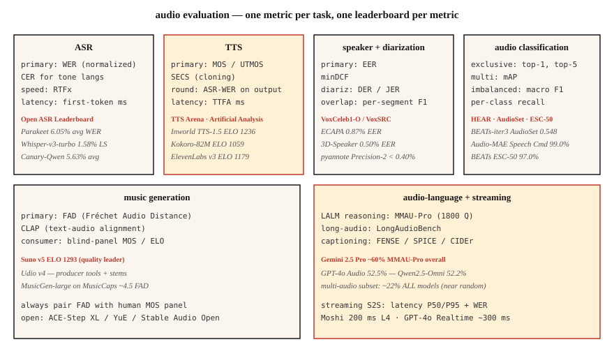

# 音频评测 —— WER、MOS、UTMOS、MMAU、FAD 与公开排行榜

> 不能度量,就不能交付。本课点名 2026 年每个音频任务的指标:ASR(WER、CER、RTFx)、TTS(MOS、UTMOS、SECS、ASR 往返 WER)、音频-语言(MMAU、LongAudioBench)、音乐(FAD、CLAP)、说话人(EER),外加供你横向对比的排行榜。

**类型:** 学习
**编程语言:** Python
**前置要求:** 第 6 阶段 · 04、06、07、09、10;第 2 阶段 · 09(模型评测)
**预计耗时:** 约 60 分钟

## 问题

每个音频任务都有多个指标,各测一个维度。用错指标,交付的就是仪表盘上漂亮、生产上拉胯的模型。2026 年权威清单:

| 任务 | 主指标 | 次指标 |
|------|---------|-----------|
| ASR | WER | CER · RTFx · 首 token 延迟 |
| TTS | MOS / UTMOS | SECS · ASR 往返 WER · CER · 首音时间 |
| 语音克隆 | SECS(ECAPA 余弦) | MOS · CER |
| 说话人验证 | EER | minDCF · 工作点上的 FAR / FRR |
| 说话人日志 | DER | JER · 说话人混淆 |
| 音频分类 | top-1 · mAP | 宏 F1 · 逐类召回率 |
| 音乐生成 | FAD | CLAP · 听审团 MOS |
| 音频-语言模型 | MMAU-Pro | LongAudioBench · AudioCaps FENSE |
| 流式语音到语音 | 延迟 P50/P95 | WER · MOS |

## 概念



### ASR 指标

**WER(词错误率)。** `(S + D + I) / N`。打分前统一小写、去标点、归一化数字。用 `jiwer` 或 OpenAI 的 `whisper_normalizer`。< 5% = 朗读语音的人类水平。

**CER(字符错误率)。** 同公式,字符级。用于分词有歧义的声调语言(普通话、粤语)。

**RTFx(实时因子的倒数)。** 每个墙钟秒处理的音频秒数。越高越好。Parakeet-TDT 达 3380×,Whisper-large-v3 约 30×。

**首 token 延迟。** 从音频输入到第一个转写 token 的墙钟时间。流式场景的关键指标。Deepgram Nova-3:约 150 ms。

### TTS 指标

**MOS(平均意见分)。** 1-5 分人工评分。金标准但慢。每个样本至少 20 个听众,每个模型 100+ 样本。

**UTMOS(2022-2026)。** 学习出来的 MOS 预测器。标准基准上与人类 MOS 相关性约 0.9。F5-TTS:UTMOS 3.95;真实人声:4.08。

**SECS(说话人编码器余弦相似度)。** 用于语音克隆。参考音频与克隆输出的 ECAPA 嵌入余弦。> 0.75 = 可辨认的克隆。

**ASR 往返 WER。** 把 TTS 输出过一遍 Whisper,与输入文本算 WER。抓可懂度退化。2026 年 SOTA:CER < 2%。

**TTFA(首音时间)。** 墙钟延迟。Kokoro-82M:约 100 ms;F5-TTS:约 1 s。

### 语音克隆专项

**SECS + MOS + CER** 三件套。SECS 高 MOS 低,说明音色对但不自然;反过来则是声音自然但不像目标说话人。

### 说话人验证

**EER(等错误率)。** 误接受率等于误拒绝率处的阈值。ECAPA 在 VoxCeleb1-O 上:0.87%。

**minDCF(最小检测代价)。** 选定工作点(常取 FAR=0.01)上的加权代价。比 EER 更贴近生产。

### 说话人日志

**DER(日志错误率)。** `(FA + Miss + Confusion) / total_speaker_time`。漏检语音 + 虚警语音 + 说话人混淆,各占一个比例。AMI 会议:DER 10-20% 是现实水平。pyannote 3.1 + Precision-2 商业版:录音良好时 DER <10%。

**JER(Jaccard 错误率)。** DER 的替代,对短片段偏置更鲁棒。

### 音频分类

多标签:**mAP(平均精度均值)**,跨所有类别。AudioSet:BEATs-iter3 为 0.548 mAP。

多类互斥:**top-1、top-5 准确率**。Speech Commands v2:99.0% top-1(Audio-MAE)。

失衡数据:**宏 F1** + **逐类召回率**。逐类报告——汇总准确率会掩盖哪些类崩了。

### 音乐生成

**FAD(Fréchet 音频距离)。** 真实音频与生成音频在 VGGish 嵌入分布上的距离。MusicGen-small 在 MusicCaps 上:4.5。MusicLM:4.0。越低越好。

**CLAP 分数。** 用 CLAP 嵌入算文本-音频对齐分。> 0.3 = 对齐合理。

**听审团 MOS。** 消费级音乐的最终裁决。Suno v5 在 TTS Arena 上 ELO 1293(来自成对人类偏好)。

### 音频-语言基准

**MMAU(大规模多音频理解)。** 1 万组音频问答。

**MMAU-Pro。** 1800 道难题,四类:语音 / 环境音 / 音乐 / 多音频。四选一随机 25%。Gemini 2.5 Pro 总分约 60%;所有模型的多音频都在约 22%。

**LongAudioBench。** 多分钟音频配语义查询。Audio Flamingo Next 击败 Gemini 2.5 Pro。

**AudioCaps / Clotho。** 音频描述基准。SPICE、CIDEr、FENSE 指标。

### 流式语音到语音

**延迟 P50 / P95 / P99。** 从用户说完到第一个可闻回应的墙钟时间。Moshi:200 ms;GPT-4o Realtime:300 ms。

输出上的 **WER / MOS**。

**打断响应。** 从用户插话到助手静音的时间。目标 < 150 ms。

### 2026 年排行榜

| 排行榜 | 赛道 | URL |
|------------|--------|-----|
| Open ASR Leaderboard(HF) | 英语 + 多语言 + 长音频 | `huggingface.co/spaces/hf-audio/open_asr_leaderboard` |
| TTS Arena(HF) | 英语 TTS | `huggingface.co/spaces/TTS-AGI/TTS-Arena` |
| Artificial Analysis Speech | TTS + STT,成对投票 ELO | `artificialanalysis.ai/speech` |
| MMAU-Pro | LALM 推理 | `mmaubenchmark.github.io` |
| SpeakerBench / VoxSRC | 说话人识别 | `voxsrc.github.io` |
| MMAU 音乐子集 | 音乐 LALM | (MMAU 内部) |
| HEAR benchmark | 自监督音频 | `hearbenchmark.com` |

```figure
sp-wer-align
```

## 动手构建

### 第 1 步:带归一化的 WER

```python
from jiwer import wer, Compose, ToLowerCase, RemovePunctuation, Strip

transform = Compose([ToLowerCase(), RemovePunctuation(), Strip()])
score = wer(
    truth="Please turn on the lights.",
    hypothesis="please turn on the light",
    truth_transform=transform,
    hypothesis_transform=transform,
)
# ~0.17
```

### 第 2 步:TTS 往返 WER

```python
def ttr_wer(tts_model, asr_model, texts):
    errors = []
    for txt in texts:
        audio = tts_model.synthesize(txt)
        recog = asr_model.transcribe(audio)
        errors.append(wer(truth=txt, hypothesis=recog))
    return sum(errors) / len(errors)
```

### 第 3 步:语音克隆的 SECS

```python
from speechbrain.inference.speaker import EncoderClassifier
sv = EncoderClassifier.from_hparams("speechbrain/spkrec-ecapa-voxceleb")

emb_ref = sv.encode_batch(load_wav("reference.wav"))
emb_clone = sv.encode_batch(load_wav("cloned.wav"))
secs = torch.nn.functional.cosine_similarity(emb_ref, emb_clone, dim=-1).item()
```

### 第 4 步:音乐生成的 FAD

```python
from frechet_audio_distance import FrechetAudioDistance
fad = FrechetAudioDistance()
score = fad.get_fad_score("generated_folder/", "reference_folder/")
```

### 第 5 步:说话人验证的 EER(同第 6 课代码)

```python
def eer(same_scores, diff_scores):
    thresholds = sorted(set(same_scores + diff_scores))
    best = (1.0, 0.0)
    for t in thresholds:
        far = sum(1 for s in diff_scores if s >= t) / len(diff_scores)
        frr = sum(1 for s in same_scores if s < t) / len(same_scores)
        if abs(far - frr) < best[0]:
            best = (abs(far - frr), (far + frr) / 2)
    return best[1]
```

## 投入使用

给每次发布配一个固定的评测台,模型每更新一次就跑一遍。三条铁律:

1. **打分前先归一化。** 小写、去标点、展开数字。报告你用的归一化规则。
2. **报告分布,不报均值。** 延迟报 P50/P95/P99,分类报逐类召回率,MMAU 报逐类别。
3. **跑一个权威公开基准。** 即使你的生产数据不一样,在 Open ASR / TTS Arena / MMAU 上报告数字,评审者才能 同类对同类地比。

## 常见坑

- **UTMOS 外推。** 它在 VCTK 式干净语音上训练;给带噪/克隆/情绪化音频打分不准。
- **MOS 评审团偏差。** 20 个亚马逊众包工人 ≠ 20 个目标用户。事关重大就花钱请领域评审团。
- **FAD 依赖参考集。** 跨模型对比时,必须用同一个参考分布。
- **汇总 WER。** 总体 5% 的 WER 可能掩盖口音语音上 30% 的 WER。按人群切片报告。
- **公开基准饱和。** 前沿模型在标准基准上大多接近天花板。建一个反映你真实流量的内部留出集。

## 交付

保存为 `outputs/skill-audio-evaluator.md`。针对任何音频模型的发布,选定指标、基准和报告格式。

## 练习

1. **简单。** 运行 `code/main.py`。在玩具输入上计算 WER / CER / EER / SECS / 类 FAD / 类 MMAU。
2. **中等。** 搭一个 TTS 往返 WER 评测台。把你的 Kokoro 或 F5-TTS 输出过一遍 Whisper,在 50 条提示上算 WER。标出 WER > 10% 的提示。
3. **困难。** 用你第 10 课选的 LALM,在 MMAU-Pro 的语音 + 多音频子集(各 50 题)上打分。报告逐类准确率,与公开数字对比。

## 关键术语

| 术语 | 大家口头的说法 | 实际含义 |
|------|-----------------|-----------------------|
| WER | ASR 得分 | 归一化后的词级 `(S+D+I)/N`。 |
| CER | 字符 WER | 用于声调语言或字符级系统。 |
| MOS | 人工意见分 | 1-5 分;20+ 听众 × 100 样本。 |
| UTMOS | ML 的 MOS 预测器 | 学习模型;与人类 MOS 相关性约 0.9。 |
| SECS | 语音克隆相似度 | 参考与克隆之间的 ECAPA 余弦。 |
| EER | 说话人验证得分 | FAR = FRR 处的阈值。 |
| DER | 日志得分 | (FA + Miss + Confusion) / 总时长。 |
| FAD | 音乐生成质量 | VGGish 嵌入上的 Fréchet 距离。 |
| RTFx | 吞吐 | 每墙钟秒处理的音频秒数。 |

## 延伸阅读

- [jiwer](https://github.com/jitsi/jiwer) — 带归一化工具的 WER/CER 库。
- [UTMOS (Saeki et al. 2022)](https://arxiv.org/abs/2204.02152) — 学习型 MOS 预测器。
- [Fréchet Audio Distance (Kilgour et al. 2019)](https://arxiv.org/abs/1812.08466) — 音乐生成标准。
- [Open ASR Leaderboard](https://huggingface.co/spaces/hf-audio/open_asr_leaderboard) — 2026 实时排行。
- [TTS Arena](https://huggingface.co/spaces/TTS-AGI/TTS-Arena) — 人类投票 TTS 排行榜。
- [MMAU-Pro benchmark](https://mmaubenchmark.github.io/) — LALM 推理排行榜。
- [HEAR benchmark](https://hearbenchmark.com/) — 音频 SSL 基准。
