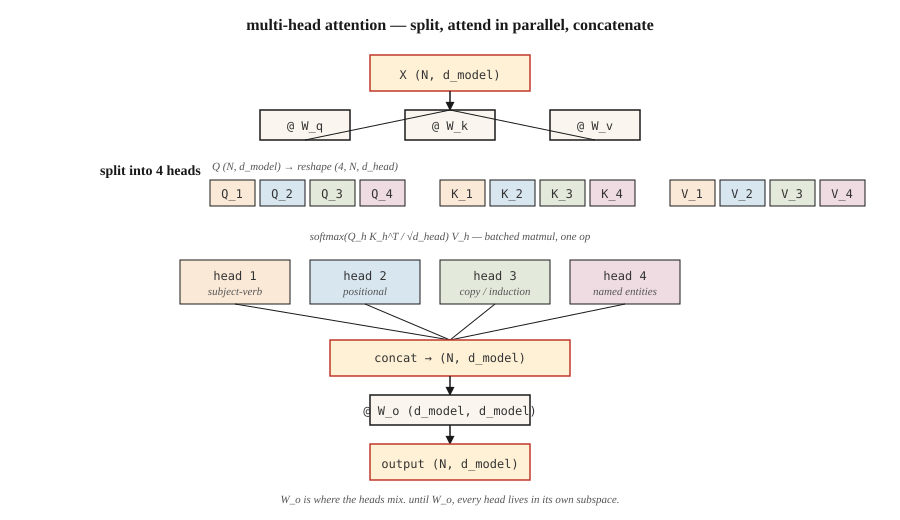

# 多头注意力

> 一个注意力头一次学一种关系,八个头就学八种。头不要钱,多拿几个。

**类型:** 动手构建
**编程语言:** Python
**前置要求:** 第 7 阶段 · 02(从零实现自注意力)
**预计耗时:** 约 75 分钟

## 问题

单个自注意力头只算一个注意力矩阵,这个矩阵只能捕捉一种关系——通常是让训练损失降得最多的那一种。如果你的数据里,主谓一致、共指、长程篇章关系和句法组块全都缠在一起,单头会把它们揉进同一个 softmax 分布里,丢了一半的信号。

2017 年 Vaswani 论文的修法:并行跑多个注意力函数,每个头有自己的 Q、K、V 投影,最后把输出拼接起来。每个头在 `d_model / n_heads` 维的更小子空间里工作。总参数量不变,表达能力上去了。

多头注意力是 2026 年每一个 Transformer 出厂自带的东西。争论只剩下:*用多少*个头,以及 key 和 value 要不要共享投影(分组查询注意力 GQA、多查询注意力 MQA、多头潜在注意力 MLA)。

## 概念



**拆分。** 输入 `X`,形状 `(N, d_model)`。投影出 Q、K、V,各为 `(N, d_model)`。reshape 成 `(N, n_heads, d_head)`,其中 `d_head = d_model / n_heads`,再转置成 `(n_heads, N, d_head)`。

**并行注意。** 在每个头内部跑缩放点积注意力,每个头产出 `(N, d_head)`。各个头在嵌入的不同子空间里工作,注意力计算过程中互不通信。

**拼接并投影。** 把各头堆回 `(N, d_model)`,乘上一个学出来的输出矩阵 `W_o`(形状 `(d_model, d_model)`)。头与头的信息交融,就发生在 `W_o` 里。

**为什么有效。** 每个头可以各专一门,不用互相抢表示预算。2019–2024 年的探针研究揭示了不同头的分工:位置头、专看前一个 token 的头、复制头、命名实体头、归纳头(in-context learning 的底层机制)。

**2026 年的变体谱系:**

| 变体 | Q 头数 | K/V 头数 | 使用者 |
|---------|---------|-----------|---------|
| 多头(MHA) | N | N | GPT-2、BERT、T5 |
| 多查询(MQA) | N | 1 | PaLM、Falcon |
| 分组查询(GQA) | N | G(如 N/8) | Llama 2 70B、Llama 3+、Qwen 2+、Mistral |
| 多头潜在(MLA) | N | 压缩到低秩 | DeepSeek-V2、V3 |

GQA 是现代默认,因为它把 KV 缓存显存砍掉 `N/G` 倍,质量几乎不掉。MLA 更进一步:把 K/V 压进潜在空间,计算时再投影回来——费一点 FLOPs,省下多得多的显存。

```figure
multihead-split
```

## 动手构建

### 第 1 步:在已有的单头注意力上加拆分

把第 02 课的 `SelfAttention` 拿过来,包上一对拆分/拼接。numpy 实现见 `code/main.py`,逻辑是:

```python
def split_heads(X, n_heads):
    n, d = X.shape
    d_head = d // n_heads
    return X.reshape(n, n_heads, d_head).transpose(1, 0, 2)  # (heads, n, d_head)

def combine_heads(H):
    h, n, d_head = H.shape
    return H.transpose(1, 0, 2).reshape(n, h * d_head)
```

一次 reshape 加一次转置,没有循环。这正是 PyTorch 在 `nn.MultiheadAttention` 底下做的事。

### 第 2 步:每个头各自做缩放点积注意力

每个头拿到 Q、K、V 的各自切片。注意力变成一次批量矩阵乘法:

```python
def mha_forward(X, W_q, W_k, W_v, W_o, n_heads):
    Q = X @ W_q
    K = X @ W_k
    V = X @ W_v
    Qh = split_heads(Q, n_heads)         # (heads, n, d_head)
    Kh = split_heads(K, n_heads)
    Vh = split_heads(V, n_heads)
    scores = Qh @ Kh.transpose(0, 2, 1) / np.sqrt(Qh.shape[-1])
    weights = softmax(scores, axis=-1)
    out = weights @ Vh                    # (heads, n, d_head)
    concat = combine_heads(out)
    return concat @ W_o, weights
```

在真实硬件上,`Qh @ Kh.transpose(...)` 就是一次 `bmm`。GPU 看到的是一个形状为 `(heads, N, d_head) × (heads, d_head, N) -> (heads, N, N)` 的批量矩阵乘法。加头是免费的。

### 第 3 步:分组查询注意力(GQA)变体

只有 key 和 value 的投影变了。Q 有 `n_heads` 组;K 和 V 只有 `n_kv_heads < n_heads` 组,靠重复对齐:

```python
def gqa_project(X, W, n_kv_heads, n_heads):
    kv = split_heads(X @ W, n_kv_heads)       # (kv_heads, n, d_head)
    repeat = n_heads // n_kv_heads
    return np.repeat(kv, repeat, axis=0)      # (n_heads, n, d_head)
```

推理时省显存,因为 KV 缓存里只存 `n_kv_heads` 份,而不是 `n_heads` 份。Llama 3 70B 用 64 个查询头配 8 个 KV 头——缓存缩小 8 倍。

### 第 4 步:探查每个头学到了什么

用 4 个头在短句上跑 MHA,打印每个头的 `(N, N)` 注意力矩阵。即使是随机初始化,你也会看到不同的头挑出不同的结构——一部分是真信号,一部分是子空间里的旋转对称性。

## 投入使用

PyTorch 里一行搞定:

```python
import torch.nn as nn

mha = nn.MultiheadAttention(embed_dim=512, num_heads=8, batch_first=True)
```

PyTorch 2.5+ 的 GQA:

```python
from torch.nn.functional import scaled_dot_product_attention

# scaled_dot_product_attention auto-dispatches Flash Attention on CUDA.
# For GQA, pass Q of shape (B, n_heads, N, d_head) and K,V of shape
# (B, n_kv_heads, N, d_head). PyTorch handles the repeat.
out = scaled_dot_product_attention(q, k, v, is_causal=True, enable_gqa=True)
```

**用多少个头?** 2026 年生产模型的经验值:

| 模型规模 | d_model | n_heads | d_head |
|------------|---------|---------|--------|
| 小(~125M) | 768 | 12 | 64 |
| 基础(~350M) | 1024 | 16 | 64 |
| 大(~1B) | 2048 | 16 | 128 |
| 前沿(~70B) | 8192 | 64 | 128 |

`d_head` 几乎总是落在 64 或 128。它是一个头能"看见"多少的度量单位。低于 32,头开始跟缩放因子 `sqrt(d_head)` 打架;高于 256,就丢了"许多小专家"的好处。

## 交付

见 `outputs/skill-mha-configurator.md`。这个技能根据参数预算、序列长度和部署目标,为新的 Transformer 推荐头数、KV 头数和投影策略。

## 练习

1. **易。** 把 `code/main.py` 里的 MHA 拿过来,固定 `d_model=64`,把 `n_heads` 从 1 变到 16。在合成复制任务上画出一个单层小模型的损失曲线。头多了是有帮助、到平台期,还是反而有害?
2. **中。** 实现 MQA(所有查询头共享一个 KV 头)。测量相对完整 MHA 参数量下降多少,并计算 N=2048 时推理 KV 缓存缩小多少。
3. **难。** 实现迷你版多头潜在注意力(MLA):把 K、V 压缩到秩为 `r` 的潜在表示,KV 缓存里只存潜在表示,注意力计算时再解压。`r` 取多少时,缓存显存能降到完整 MHA 的 1/8 以下,同时验证困惑度差距在 1 bit 以内?

## 关键术语

| 术语 | 人们常说的 | 实际含义 |
|------|-----------------|-----------------------|
| 头(Head) | "一个注意力电路" | 维度为 `d_head = d_model / n_heads` 的一组 Q/K/V 投影,有自己独立的注意力矩阵 |
| d_head | "头的维度" | 每个头的隐藏宽度;生产中几乎总是 64 或 128 |
| 拆分 / 合并 | "reshape 技巧" | 注意力前后的 `(N, d_model) ↔ (n_heads, N, d_head)` reshape 加转置 |
| W_o | "输出投影" | 拼接各头之后施加的 `(d_model, d_model)` 矩阵;头与头在这里交融 |
| MQA | "一个 KV 头" | 多查询注意力:单一共享的 K/V 投影。KV 缓存最小,质量略损 |
| GQA | "Llama 2 以来的默认" | 分组查询注意力,`n_kv_heads < n_heads`,靠重复对齐 Q |
| MLA | "DeepSeek 的技巧" | 多头潜在注意力:K、V 压缩到低秩潜在表示,计算注意力时再解压 |
| 归纳头(Induction head) | "in-context learning 背后的电路" | 一对配合的头:检测先前出现过的模式,并复制其后跟随的内容 |

## 延伸阅读

- [Vaswani et al. (2017). Attention Is All You Need §3.2.2](https://arxiv.org/abs/1706.03762) ——多头机制的原始定义
- [Shazeer (2019). Fast Transformer Decoding: One Write-Head is All You Need](https://arxiv.org/abs/1911.02150) ——MQA 论文
- [Ainslie et al. (2023). GQA: Training Generalized Multi-Query Transformer Models from Multi-Head Checkpoints](https://arxiv.org/abs/2305.13245) ——训练完之后如何把 MHA 转成 GQA
- [DeepSeek-AI (2024). DeepSeek-V2 Technical Report](https://arxiv.org/abs/2405.04434) ——MLA 及其在缓存显存上胜过 MHA/GQA 的原因
- [Olsson et al. (2022). In-context Learning and Induction Heads](https://transformer-circuits.pub/2022/in-context-learning-and-induction-heads/index.html) ——从机制层面看清注意力头到底在做什么
