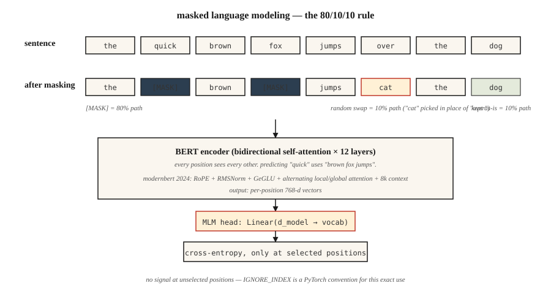

# BERT——掩码语言建模

> GPT 预测下一个词,BERT 预测被遮住的词。一句话的差别——成就了此后五年所有"嵌入形态"的东西。

**类型:** 动手构建
**编程语言:** Python
**前置要求:** 第 7 阶段 · 05(完整 Transformer),第 5 阶段 · 02(文本表示)
**预计耗时:** 约 45 分钟

## 问题

2018 年,每一个 NLP 任务——情感分析、命名实体识别、问答、蕴含——都在自己那份标注数据上从零训练自己的模型。不存在一个预训练好的"懂英语"的检查点可以拿来微调。ELMo(2018)证明了可以用双向 LSTM 预训练上下文嵌入,有帮助,但泛化不动。

BERT(Devlin 等人,2018)问:如果我们拿一个 Transformer 编码器,在互联网上的每一个句子上训练,强迫它根据左右两侧的上下文预测缺失的词呢?然后给你的下游任务微调一个小头部就行。参数效率之高,堪称一次启示。

结果:18 个月内,BERT 和它的变体(RoBERTa、ALBERT、ELECTRA)统治了当时存在的每一个 NLP 榜单。到 2020 年,地球上每一个搜索引擎、每一条内容审核流水线、每一个语义搜索系统,肚子里都有一个 BERT。

2026 年,纯编码器模型仍是分类、检索和结构化抽取的正确工具——它们单 token 推理比解码器快 5–10 倍,其嵌入是所有现代检索技术栈的基石。ModernBERT(2024 年 12 月)用 Flash Attention + RoPE + GeGLU 把这个架构推进到 8K 上下文。

## 概念



### 训练信号

取一句话:`the quick brown fox jumps over the lazy dog`。

随机遮住 15% 的 token:

```
input:  the [MASK] brown fox jumps [MASK] the lazy dog
target: the  quick brown fox jumps  over  the lazy dog
```

训练模型在被遮位置预测原始 token。因为编码器是双向的,预测位置 1 的 `[MASK]` 时,可以用上位置 2 及以后的 `brown fox jumps`。这正是 GPT 做不到的事。

### BERT 的掩码规则

在被选中做预测的那 15% token 中:

- 80% 替换成 `[MASK]`。
- 10% 替换成随机 token。
- 10% 保持原样。

为什么不全用 `[MASK]`?因为推理时 `[MASK]` 从不出现。如果训练时让模型 100% 在 `[MASK]` 处做预测,预训练和微调之间就会产生分布偏移。10% 随机 + 10% 原样,让模型保持诚实。

### 下一句预测(NSP)——以及它为什么被抛弃

原始 BERT 还训练 NSP:给定句子 A 和 B,预测 B 是否跟在 A 后面。RoBERTa(2019)做了消融,证明 NSP 有害无益。现代编码器都把它跳过了。

### 2026 年的变化:ModernBERT

2024 年的 ModernBERT 论文用 2026 年的原语重造了这个模块:

| 部件 | 原始 BERT(2018) | ModernBERT(2024) |
|-----------|----------------------|-------------------|
| 位置 | 学习的绝对位置 | RoPE |
| 激活 | GELU | GeGLU |
| 归一化 | LayerNorm | pre-norm RMSNorm |
| 注意力 | 全稠密 | 局部(128)与全局交替 |
| 上下文长度 | 512 | 8192 |
| 分词器 | WordPiece | BPE |

而且与 2018 年的技术栈不同,它原生支持 Flash Attention。8K 序列长度下,推理比 DeBERTa-v3 快 2–3 倍,GLUE 分数还更好。

### 2026 年仍该选编码器的场景

| 任务 | 为什么编码器胜过解码器 |
|------|---------------------------|
| 检索 / 语义搜索嵌入 | 双向上下文 = 单 token 嵌入质量更高 |
| 分类(情感、意图、毒性) | 一次前向;没有生成开销 |
| 命名实体识别 / token 标注 | 逐位置输出,天然双向 |
| 零样本蕴含(NLI) | 编码器上加分类头即可 |
| RAG 重排序器 | 交叉编码器打分,比 LLM 重排快 10 倍 |

```figure
transformer-residual
```

## 动手构建

### 第 1 步:掩码逻辑

见 `code/main.py`。`create_mlm_batch` 函数接收 token ID 列表、词表大小和掩码概率,返回施加掩码后的输入 ID 和标签(只有被遮位置有标签,其余为 -100——PyTorch 的忽略索引约定)。

```python
def create_mlm_batch(tokens, vocab_size, mask_prob=0.15, rng=None):
    input_ids = list(tokens)
    labels = [-100] * len(tokens)
    for i, t in enumerate(tokens):
        if rng.random() < mask_prob:
            labels[i] = t
            r = rng.random()
            if r < 0.8:
                input_ids[i] = MASK_ID
            elif r < 0.9:
                input_ids[i] = rng.randrange(vocab_size)
            # else: keep original
    return input_ids, labels
```

### 第 2 步:在小语料上跑 MLM 预测

在 20 词词表、200 个句子上训练一个 2 层编码器 + MLM 头。不算梯度——只做前向健全性检查。完整训练需要 PyTorch。

### 第 3 步:比较掩码类型

展示三段式规则如何让模型在没有 `[MASK]` 时也能用。分别在未加掩码和加了掩码的句子上预测。两者都应产生合理的 token 分布,因为模型在训练中两种模式都见过。

### 第 4 步:微调头部

把 MLM 头换成分类头,在玩具情感数据集上训练。只训头部,编码器冻结。这是每一个 BERT 应用都遵循的模式。

## 投入使用

```python
from transformers import AutoModel, AutoTokenizer

tok = AutoTokenizer.from_pretrained("answerdotai/ModernBERT-base")
model = AutoModel.from_pretrained("answerdotai/ModernBERT-base")

text = "Attention is all you need."
inputs = tok(text, return_tensors="pt")
out = model(**inputs).last_hidden_state   # (1, N, 768)
```

**嵌入模型就是微调过的 BERT。** `sentence-transformers` 里的模型(如 `all-MiniLM-L6-v2`)是用对比损失训练的 BERT。编码器一样,损失变了。

**交叉编码器重排器也是微调过的 BERT。** 在 `[CLS] query [SEP] doc [SEP]` 上做配对分类。query 与 doc 之间的双向注意力,正是交叉编码器相对双编码器的质量优势所在。

**2026 年什么时候不该选 BERT。** 一切生成式任务。编码器没有合理的自回归产出方式。另外:1B 参数以下、小解码器能以更大灵活性追平质量的场景(Phi-3-Mini、Qwen2-1.5B)。

## 交付

见 `outputs/skill-bert-finetuner.md`。这个技能为新的分类或抽取任务规划一次 BERT 微调(骨干选择、头部规格、数据、评估、早停)。

## 练习

1. **易。** 运行 `code/main.py`,打印 10,000 个 token 上的掩码分布。确认约 15% 被选中,其中约 80% 变成 `[MASK]`。
2. **中。** 实现整词掩码(whole-word masking):一个词被切成子词时,要么全遮要么全不遮。在 500 句语料上测量它是否提升 MLM 准确率。
3. **难。** 在公开数据集的 10,000 个句子上训练一个迷你 BERT(2 层,d=64),用 `[CLS]` 微调 SST-2 情感分类。与同参数量的纯解码器基线对比——谁赢?

## 关键术语

| 术语 | 人们常说的 | 实际含义 |
|------|-----------------|-----------------------|
| MLM | "掩码语言建模" | 训练信号:随机把 15% 的 token 换成 `[MASK]`,预测原词 |
| 双向(Bidirectional) | "两边都看" | 编码器注意力没有因果掩码——每个位置看得到所有位置 |
| `[CLS]` | "池化 token" | 加在每个序列开头的特殊 token;它的最终嵌入用作句子级表示 |
| `[SEP]` | "段落分隔符" | 分隔成对的序列(如 query/doc、句子 A/B) |
| NSP | "下一句预测" | BERT 的第二个预训练任务;RoBERTa 证明无用,2019 年后被弃用 |
| 微调(Fine-tuning) | "适配任务" | 编码器基本冻结,只在顶上为下游任务训练一个小头部 |
| 交叉编码器(Cross-encoder) | "重排器" | 同时接收 query 和 doc、输出相关性分数的 BERT |
| ModernBERT | "2024 焕新版" | 用 RoPE、RMSNorm、GeGLU、局部/全局交替注意力和 8K 上下文重造的编码器 |

## 延伸阅读

- [Devlin et al. (2018). BERT: Pre-training of Deep Bidirectional Transformers for Language Understanding](https://arxiv.org/abs/1810.04805) ——原始论文
- [Liu et al. (2019). RoBERTa: A Robustly Optimized BERT Pretraining Approach](https://arxiv.org/abs/1907.11692) ——如何正确训练 BERT;杀死了 NSP
- [Clark et al. (2020). ELECTRA: Pre-training Text Encoders as Discriminators Rather Than Generators](https://arxiv.org/abs/2003.10555) ——同等算力下,替换 token 检测胜过 MLM
- [Warner et al. (2024). Smarter, Better, Faster, Longer: A Modern Bidirectional Encoder](https://arxiv.org/abs/2412.13663) ——ModernBERT 论文
- [HuggingFace `modeling_bert.py`](https://github.com/huggingface/transformers/blob/main/src/transformers/models/bert/modeling_bert.py) ——编码器的典范参考实现
