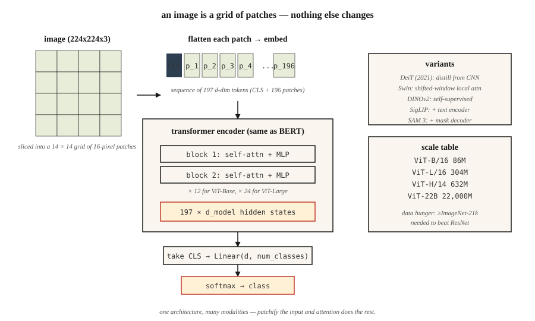

# 视觉 Transformer(ViT)

> 图像是一个图块(patch)网格,句子是一个 token 网格。同一个 Transformer,两者通吃。

**类型:** 动手构建
**编程语言:** Python
**前置要求:** 第 7 阶段 · 05(完整 Transformer),第 4 阶段 · 03(CNN),第 4 阶段 · 14(视觉 Transformer 入门)
**预计耗时:** 约 45 分钟

## 问题

2020 年之前,计算机视觉就等于卷积。ImageNet、COCO 和检测基准上的每一个 SOTA,用的都是 CNN 骨干。Transformer 是语言的东西。

Dosovitskiy 等人(2020)——《An Image is Worth 16x16 Words》——证明了可以完全丢掉卷积:把图像切成固定大小的图块,每个图块线性投影成嵌入,把序列喂给一个普通的 Transformer 编码器。规模足够大时(ImageNet-21k 预训练或更大),ViT 追平甚至超过 ResNet 系模型。

ViT 开启了 2026 年的一个大模式:一个架构,多种模态。Whisper 把音频 token 化,ViT 把图像 token 化,机器人用动作 token,视频用像素 token。Transformer 不在乎——给它一个序列,它就学。

到 2026 年,ViT 和它的后代(DeiT、Swin、DINOv2、ViT-22B、SAM 3)拿下了视觉的大半江山。CNN 仍在边缘设备和延迟敏感任务上胜出,其他地方的流水线里多少都藏着一个 ViT。

## 概念



### 第 1 步——切块(patchify)

把 `H × W × C` 的图像切成 `N × (P·P·C)` 的扁平图块序列。典型配置:`224 × 224` 图像,`16 × 16` 图块 → 196 个图块,每个 768 个数。

```
image (224, 224, 3) → 14 × 14 grid of 16x16x3 patches → 196 vectors of length 768
```

图块尺寸是那个调节杆。图块小 = token 多、分辨率好、注意力代价二次方;图块大 = 更粗、更便宜。

### 第 2 步——线性嵌入

一个学出来的矩阵把每个扁平图块投影到 `d_model`。这等价于一个核大小为 `P`、步幅为 `P` 的卷积。在 PyTorch 里就是 `nn.Conv2d(C, d_model, kernel_size=P, stride=P)`——两行写完。

### 第 3 步——前置 `[CLS]` token,加位置嵌入

- 在最前面加一个可学习的 `[CLS]` token。它的最终隐状态就是用于分类的图像表示。
- 加可学习位置嵌入(ViT 原版)或二维正弦编码(后来的变体)。
- 2024 年后,RoPE 被扩展到二维来表示位置,有时干脆不要显式嵌入了。

### 第 4 步——标准 Transformer 编码器

堆 L 个 `LayerNorm → Self-Attention → + → LayerNorm → MLP → +` 模块。与 BERT 一模一样,没有任何视觉专属的层。这正是这篇论文在教学上的点睛之笔。

### 第 5 步——头部

分类:取 `[CLS]` 隐状态 → 线性 → softmax。DINOv2 或 SAM 则丢掉 `[CLS]`,直接用图块嵌入。

### 重要的变体

| 模型 | 年份 | 改动 |
|-------|------|--------|
| ViT | 2020 | 原版。固定图块尺寸,全全局注意力 |
| DeiT | 2021 | 蒸馏;只在 ImageNet-1k 上也能训 |
| Swin | 2021 | 分层 + 移位窗口。代价降到亚二次方 |
| DINOv2 | 2023 | 自监督(无标签)。最好的通用视觉特征 |
| ViT-22B | 2023 | 22B 参数;扩展定律同样适用 |
| SigLIP | 2023 | ViT + 语言配对,sigmoid 对比损失 |
| SAM 3 | 2025 | 分割一切;ViT-Large + 可提示的掩码解码器 |

### 为什么等了很多年

ViT 需要*大量*数据才能追平 CNN,因为它完全没有 CNN 的归纳偏置(平移不变性、局部性)。没有超过 1 亿张带标注图像,或者强力的自监督预训练,同算力下 CNN 仍然赢。DeiT 在 2021 年用蒸馏技巧缓解了这个问题;DINOv2 在 2023 年用自监督彻底解决了它。

```figure
n5-patch-stream
```

## 动手构建

见 `code/main.py`。纯标准库的切块 + 线性嵌入 + 健全性检查。不训练——任何现实规模的 ViT 都需要 PyTorch 和按小时计的 GPU 时间。

### 第 1 步:假图像

一张 24 × 24 的 RGB 图像,表示为 `(R, G, B)` 元组组成的行列表。我们用 6×6 图块 → 16 个图块,每个是 108 维嵌入向量。

### 第 2 步:切块

```python
def patchify(image, P):
    H = len(image)
    W = len(image[0])
    patches = []
    for i in range(0, H, P):
        for j in range(0, W, P):
            patch = []
            for di in range(P):
                for dj in range(P):
                    patch.extend(image[i + di][j + dj])
            patches.append(patch)
    return patches
```

光栅顺序:网格内按行优先。每个 ViT 都用这个顺序。

### 第 3 步:线性嵌入

把每个扁平图块乘以一个随机的 `(patch_flat_size, d_model)` 矩阵。前置 `[CLS]` 后,验证输出形状是 `(N_patches + 1, d_model)`。

### 第 4 步:数一数真实 ViT 的参数量

打印 ViT-Base 的参数量:12 层、12 头、d=768、图块 16。与 ResNet-50(约 25M)对比。ViT-Base 约 86M,ViT-Large 约 307M,ViT-Huge 约 632M。

## 投入使用

```python
from transformers import ViTImageProcessor, ViTModel
import torch
from PIL import Image

processor = ViTImageProcessor.from_pretrained("google/vit-base-patch16-224-in21k")
model = ViTModel.from_pretrained("google/vit-base-patch16-224-in21k")

img = Image.open("cat.jpg")
inputs = processor(img, return_tensors="pt")
out = model(**inputs).last_hidden_state   # (1, 197, 768): [CLS] + 196 patches
cls_emb = out[:, 0]                       # image representation
```

**DINOv2 嵌入是 2026 年图像特征的默认选择。** 冻结骨干,训一个小头部。分类、检索、检测、图像描述全都管用。Meta 的 DINOv2 检查点在所有非文本视觉任务上都胜过 CLIP。

**图块尺寸怎么挑。** 小模型用 16×16(ViT-B/16)。稠密预测(分割)用 8×8 或 14×14(SAM、DINOv2)。超大模型用 14×14。

## 交付

见 `outputs/skill-vit-configurator.md`。这个技能根据数据集规模、分辨率和算力预算,为新的视觉任务挑选 ViT 变体和图块尺寸。

## 练习

1. **易。** 运行 `code/main.py`,验证图块数等于 `(H/P) * (W/P)`,扁平图块维度等于 `P*P*C`。
2. **中。** 实现二维正弦位置嵌入——为每个图块的 `row` 和 `col` 各算一份独立的正弦编码,再拼接。喂给一个迷你 PyTorch ViT,在 CIFAR-10 上与可学习位置嵌入比准确率。
3. **难。** 搭一个 3 层 ViT(PyTorch),用 4×4 图块在 1,000 张 MNIST 上训练,测准确率。然后在同样的 1,000 张图上加 DINOv2 式预训练(简化版:让编码器从被掩图块预测图块嵌入)。准确率提升了吗?

## 关键术语

| 术语 | 人们常说的 | 实际含义 |
|------|-----------------|-----------------------|
| 图块(Patch) | "视觉 Transformer 的 token" | 图像中一个 `P × P × C` 区域的像素值压平成的向量 |
| 切块(Patchify) | "切碎 + 压平" | 把图像切成不重叠的图块,每个压平成向量 |
| `[CLS]` token | "图像摘要" | 前置的可学习 token;它的最终嵌入就是图像表示 |
| 归纳偏置(Inductive bias) | "模型的假设" | ViT 的先验比 CNN 少;需要更多数据补上差距 |
| DINOv2 | "自监督 ViT" | 不用标签,靠图像增强 + 动量教师训练。2026 年最好的通用图像特征 |
| SigLIP | "CLIP 的继任者" | ViT + 文本编码器,用 sigmoid 对比损失训练;同算力下优于 CLIP |
| Swin | "窗口化 ViT" | 分层 ViT,局部注意力 + 移位窗口;代价亚二次方 |
| 寄存器 token(Register tokens) | "2023 年的技巧" | 几个额外的可学习 token,吸收注意力汇聚点(attention sinks);改善 DINOv2 特征 |

## 延伸阅读

- [Dosovitskiy et al. (2020). An Image is Worth 16x16 Words: Transformers for Image Recognition at Scale](https://arxiv.org/abs/2010.11929) ——ViT 论文
- [Touvron et al. (2021). Training data-efficient image transformers & distillation through attention](https://arxiv.org/abs/2012.12877) ——DeiT
- [Liu et al. (2021). Swin Transformer: Hierarchical Vision Transformer using Shifted Windows](https://arxiv.org/abs/2103.14030) ——Swin
- [Oquab et al. (2023). DINOv2: Learning Robust Visual Features without Supervision](https://arxiv.org/abs/2304.07193) ——DINOv2
- [Darcet et al. (2023). Vision Transformers Need Registers](https://arxiv.org/abs/2309.16588) ——DINOv2 的寄存器 token 修复
