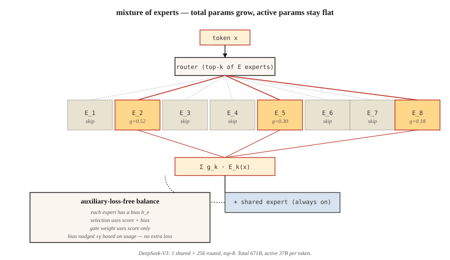

# 混合专家(MoE)

> 稠密的 70B Transformer,每个 token 都要激活全部参数。一个 671B 的 MoE,每个 token 只激活 37B,却在每个基准上都赢。稀疏化,是这个十年最重要的规模化思想。

**类型:** 动手构建
**编程语言:** Python
**前置要求:** 第 7 阶段 · 05(完整 Transformer),第 7 阶段 · 07(GPT)
**预计耗时:** 约 45 分钟

## 问题

稠密 Transformer 推理时的 FLOPs 等于它的参数量(前向再乘 2)。稠密模型一路做大,每个 token 都得付全款。到 2024 年,前沿模型撞上了算力墙:想明显更聪明,就得让每个 token 的 FLOPs 指数级增长。

混合专家(Mixture of Experts,MoE)斩断了这条锁链。把每个 FFN 换成 `E` 个独立的专家,加一个路由器,为每个 token 挑 `k` 个专家。总参数 = `E × FFN_size`,每个 token 的激活参数 = `k × FFN_size`。2026 年的典型配置:`E=256`,`k=8`。存储随 `E` 增长,算力随 `k` 增长。

2026 年的前沿几乎全是 MoE:DeepSeek-V3(总参数 671B / 激活 37B)、Mixtral 8×22B、Qwen2.5-MoE、Llama 4、Kimi K2、gpt-oss。在 Artificial Analysis 的独立榜单上,开源模型前十全是 MoE。

## 概念



### FFN 的替换

稠密 Transformer 块:

```
h = x + attn(norm(x))
h = h + FFN(norm(h))
```

MoE 块:

```
h = x + attn(norm(x))
scores = router(norm(h))              # (N_tokens, E)
top_k = argmax_k(scores)              # pick k of E per token
h = h + sum_{e in top_k}(
        gate(scores[e]) * Expert_e(norm(h))
    )
```

每个专家是一个独立的 FFN(通常是 SwiGLU)。路由器就是一层线性层。每个 token 挑出自己的 `k` 个专家,得到它们输出的门控混合。

### 负载均衡问题

如果路由器把 90% 的 token 都发给 3 号专家,其他专家就得挨饿。试过三种修法:

1. **辅助负载均衡损失**(Switch Transformer、Mixtral)。加一个与专家用量方差成正比的惩罚。有效,但多一个超参数,多一路梯度信号。
2. **专家容量 + token 丢弃**(早期 Switch)。每个专家最多处理 `C × N/E` 个 token,溢出的 token 跳过这一层。损害质量。
3. **免辅助损失的均衡**(DeepSeek-V3)。加一个可学习的逐专家偏置,偏移路由器的 top-k 选择。偏置在训练损失之外更新,主目标不受惩罚。2024 年的关键解锁。

DeepSeek-V3 的做法:每个训练步之后,检查每个专家的用量高于还是低于目标,按 `±γ` 微调偏置。选择时用 `scores + bias`,而门控用的专家概率仍是原始的 `scores`,不变。路由与表达就此解耦。

### 共享专家

DeepSeek-V2/V3 还把专家分成*共享*和*路由*两类。每个 token 都会经过所有共享专家;路由专家则按 top-k 挑选。共享专家捕获公共知识,路由专家负责专门化。V3 的配置是 1 个共享专家,外加 256 个路由专家中的前 8 个。

### 细粒度专家

经典 MoE(GShard、Switch):每个专家和一个完整 FFN 一样宽。`E` 小(8–64),`k` 小(1–2)。

现代细粒度 MoE(DeepSeek-V3、Qwen-MoE):每个专家更窄(FFN 的 1/8)。`E` 大(256+),`k` 大(8+)。总参数相同,但组合数增长快得多:`C(256, 8) = 400 万亿`种每个 token 的可能"专家"。质量上升,延迟不变。

### 成本账本

每个 token、每层:

| 配置 | 每 token 激活参数 | 总参数 |
|--------|-----------------------|--------------|
| Mixtral 8×22B | ~39B | 141B |
| Llama 3 70B(稠密) | 70B | 70B |
| DeepSeek-V3 | 37B | 671B |
| Kimi K2(MoE) | ~32B | 1T |

DeepSeek-V3 在几乎所有基准上击败 Llama 3 70B(稠密),而**每 token 激活 FLOPs 还更少**。参数越多 = 知识越多;激活 FLOPs 越多 = 每 token 算力越多。MoE 把两者解耦了。

### 代价:显存

不管哪些专家被触发,所有专家都得住在 GPU 上。671B 的模型,fp16 权重就要约 1.3 TB 显存。前沿 MoE 的部署必须靠专家并行——把专家分到不同 GPU 上,token 跨网络路由。延迟的大头在 all-to-all 通信,而不是矩阵乘法。

```figure
expert-routing
```

## 动手构建

见 `code/main.py`。一个纯标准库的紧凑 MoE 层,包含:

- `n_experts=8` 个类 SwiGLU 专家(示意用,各一层线性)
- top-k=2 路由
- softmax 归一化的门控权重
- 逐专家偏置实现的免辅助损失均衡

### 第 1 步:路由器

```python
def route(hidden, W_router, top_k, bias):
    scores = [sum(h * w for h, w in zip(hidden, W_router[e])) for e in range(len(W_router))]
    biased = [s + b for s, b in zip(scores, bias)]
    top_idx = sorted(range(len(biased)), key=lambda i: -biased[i])[:top_k]
    # softmax over ORIGINAL scores of the chosen experts
    chosen = [scores[i] for i in top_idx]
    m = max(chosen)
    exps = [math.exp(c - m) for c in chosen]
    s = sum(exps)
    gates = [e / s for e in exps]
    return top_idx, gates
```

偏置影响选择,不影响门控权重。这正是 DeepSeek-V3 的技巧——偏置纠正负载失衡,却不带偏模型的预测。

### 第 2 步:让 100 个 token 过路由器

跟踪每个专家被触发的频率。没有偏置时,用量是歪的。加上偏置更新循环(过量专家 `-γ`,不足专家 `+γ`),几轮迭代后用量收敛到均匀分布。

### 第 3 步:参数量对比

打印一个 MoE 配置的"稠密等价物"。DeepSeek-V3 的形状:256 个路由专家 + 1 个共享,激活 8 个,d_model=7168。总参数量令人咋舌,激活参数量却只有稠密 Llama 3 70B 的七分之一。

## 投入使用

HuggingFace 加载:

```python
from transformers import AutoModelForCausalLM, AutoTokenizer
model = AutoModelForCausalLM.from_pretrained("mistralai/Mixtral-8x22B-v0.1")
```

2026 年的生产推理:vLLM 原生支持 MoE 路由,SGLang 有最快的专家并行路径。两者都自动处理 top-k 选择和专家并行。

**什么时候选 MoE:**
- 你要前沿质量,又想压低单 token 推理成本。
- 你有显存 / 专家并行基础设施。
- 负载是 token 密集型(聊天、代码),而不是上下文密集型(长文档)。

**什么时候不选 MoE:**
- 边缘部署——任何一次激活 FLOP,你都要为全部存储买单。
- 延迟敏感的单用户服务——专家路由有额外开销。
- 小模型(<7B)——MoE 的质量优势要过了某个算力门槛(约 6B 激活参数)才显现。

## 交付

见 `outputs/skill-moe-configurator.md`。这个技能根据参数预算、训练 token 量和部署目标,为新的 MoE 挑选 E、k 和共享专家布局。

## 练习

1. **易。** 运行 `code/main.py`,观察免辅助损失的偏置更新如何在 50 轮迭代内把专家用量抹平。
2. **中。** 把学习的路由器换成哈希路由(确定性,不学习)。对比质量与均衡度。为什么学习的路由器更好?
3. **难。** 实现 GRPO 风格的"rollout 对齐路由"(DeepSeek-V3.2 技巧):记录推理时哪些专家被触发,并在梯度计算时强制相同的路由。在玩具策略梯度环境中测量其效果。

## 关键术语

| 术语 | 人们常说的 | 实际含义 |
|------|-----------------|-----------------------|
| 专家(Expert) | "众多 FFN 之一" | 一个独立的前馈网络;参数专门负责 FFN 计算的一块稀疏切片 |
| 路由器(Router) | "那道门" | 一个微型线性层,为每个 token 对每个专家打分;top-k 选择 |
| Top-k 路由 | "每 token 激活 k 个专家" | 每个 token 的 FFN 计算恰好经过 k 个专家,按门控加权 |
| 辅助损失(Auxiliary loss) | "负载均衡惩罚" | 惩罚专家用量歪斜的额外损失项 |
| 免辅助损失(Auxiliary-loss-free) | "DeepSeek-V3 的技巧" | 只在路由器选择上加逐专家偏置来均衡;不产生额外梯度 |
| 共享专家(Shared expert) | "永远在线" | 每个 token 都经过的额外专家;捕获公共知识 |
| 专家并行(Expert parallelism) | "按专家切分" | 把不同专家分到不同 GPU,token 跨网络路由 |
| 稀疏度(Sparsity) | "激活参数 < 总参数" | 比值 `k × expert_size / (E × expert_size)`;DeepSeek-V3 为 37/671 ≈ 5.5% |

## 延伸阅读

- [Shazeer et al. (2017). Outrageously Large Neural Networks: The Sparsely-Gated Mixture-of-Experts Layer](https://arxiv.org/abs/1701.06538) ——思想的源头
- [Fedus, Zoph, Shazeer (2022). Switch Transformer: Scaling to Trillion Parameter Models with Simple and Efficient Sparsity](https://arxiv.org/abs/2101.03961) ——Switch,经典 MoE
- [Jiang et al. (2024). Mixtral of Experts](https://arxiv.org/abs/2401.04088) ——Mixtral 8×7B
- [DeepSeek-AI (2024). DeepSeek-V3 Technical Report](https://arxiv.org/abs/2412.19437) ——MLA + 免辅助损失 MoE + MTP
- [Wang et al. (2024). Auxiliary-Loss-Free Load Balancing Strategy for Mixture-of-Experts](https://arxiv.org/abs/2408.15664) ——基于偏置的均衡论文
- [Dai et al. (2024). DeepSeekMoE: Towards Ultimate Expert Specialization in Mixture-of-Experts Language Models](https://arxiv.org/abs/2401.06066) ——本课路由器所用的细粒度 + 共享专家拆分
- [Kim et al. (2022). DeepSpeed-MoE: Advancing Mixture-of-Experts Inference and Training](https://arxiv.org/abs/2201.05596) ——共享专家的原始论文
