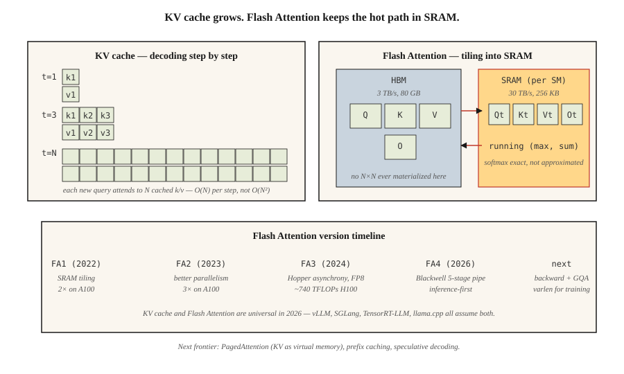

# KV 缓存、Flash Attention 与推理优化

> 训练是并行的,瓶颈在 FLOPs;推理是串行的,瓶颈在显存。瓶颈不同,技巧也不同。

**类型:** 动手构建
**编程语言:** Python
**前置要求:** 第 7 阶段 · 02(自注意力),第 7 阶段 · 05(完整 Transformer),第 7 阶段 · 07(GPT)
**预计耗时:** 约 75 分钟

## 问题

朴素的自回归解码器生成 `N` 个 token 要做 `O(N²)` 的工作:每一步都重新计算整个前缀上的注意力。一段 4K token 的回复就是 1,600 万次注意力运算,其中大部分是重复的。前缀 token 的隐状态一旦算出就是确定的——你只需要让新 token 的 query 去查之前所有内容的缓存 key 和 value。

雪上加霜的是,注意力本身要搬大量数据。标准注意力会实体化一个 N×N 的分数矩阵、N×d 的 softmax 输出、N×d 的最终输出——对 HBM 的读写太多。N≥2K 时,注意力先撞上显存带宽瓶颈,然后才轮到 FLOPs。经典注意力 kernel 对现代 GPU 的利用率,只有应有水平的 1/4 到 1/10。

两个优化——都出自 Dao 等人——把前沿推理从"慢"推进到"快":

1. **KV 缓存。** 存下每个前缀 token 的 K 和 V 向量。新 token 的注意力,就是一个 query 对上缓存的 key。每个生成步的计算量从 `O(N²)` 降到 `O(N)`。
2. **Flash Attention。** 把注意力计算切块,让完整的 N×N 矩阵永远不落到 HBM 上。softmax + 矩阵乘法全在 SRAM 里完成。A100 上墙钟快 2–4 倍;H100 配 FP8 快 5–10 倍。

到 2026 年,两者无处不在。每一个生产推理栈(vLLM、TensorRT-LLM、SGLang、llama.cpp)都以它们为前提,每一个前沿模型出厂都开着 Flash Attention。

## 概念



### KV 缓存的账

每个解码器层、每个 token、每个头:

```
bytes_per_token_per_layer = 2 * d_head * dtype_size
                          ^
                          K and V
```

一个 7B 模型,32 层、32 头、d_head=128、fp16:

```
per token per layer = 2 * 128 * 2 = 512 bytes
per token (32 layers) = 16 KB
per 32K context = 512 MB
```

Llama 3 70B(80 层、d_head=128、8 个 KV 头的 GQA):

```
per token per layer = 2 * 8 * 128 * 2 = 4096 bytes (4 KB)
per 32K context = 10.4 GB
```

这 10 GB 就是为什么 batch size 为 1 时,Llama 3 70B 跑 128K 上下文,光 KV 缓存就要吃掉一块 40 GB A100 的大半。

**GQA 就是 KV 缓存的救星。** 64 头的完整 MHA 要 32 GB,MLA 压得更狠。

拖动各个维度,看缓存大小怎么动;把序列长度或 batch 往上推,看它多快冲破单卡:

```figure
kv-cache-sizer
```

### Flash Attention——分块技巧

标准注意力:

```
S = Q @ K^T          (HBM read, N×N, HBM write)
P = softmax(S)       (HBM read, HBM write)
O = P @ V            (HBM read, HBM write)
```

三次 HBM 往返。H100 上 HBM 带宽 3 TB/s,SRAM 是 30 TB/s。每往返一次 HBM,就比全程片上慢十倍。

Flash Attention:

```
for each block of Q (tile size ~128 × 128):
    load Q_tile into SRAM
    for each block of K, V:
        load K_tile, V_tile into SRAM
        compute S_tile = Q_tile @ K_tile^T     (SRAM)
        running softmax aggregation             (SRAM)
        accumulate into O_tile                  (SRAM)
    write O_tile to HBM
```

每个分块只有一次 HBM 往返。总显存占用从 `O(N²)` 降到 `O(N)`。反向传播时,部分中间值不前向存储、用时重算——又省一笔显存。

**数值技巧。** 滚动 softmax 跨分块维护 `(max, sum)`,最终归一化是精确的。这不是近似——Flash Attention 的输出与标准注意力逐位一致(不考虑 fp16 的非结合性)。

**版本演进:**

| 版本 | 年份 | 关键变化 | 参考硬件上的加速 |
|---------|------|-----------|-------------------------------|
| Flash 1 | 2022 | SRAM 分块 kernel | A100 上 2× |
| Flash 2 | 2023 | 更好的并行、因果优先排序 | A100 上 3× |
| Flash 3 | 2024 | Hopper 异步、FP8 | H100 上 1.5–2×(FP16 约 740 TFLOPs) |
| Flash 4 | 2026 | Blackwell 五级流水线、软件 exp2 | 推理优先(首发仅前向) |

Flash 4 发布时只支持前向。训练仍用 Flash 3。Flash 4 的 GQA 和变长序列支持在路上(2026 年中)。

### 投机解码——另一个延迟杀手

便宜的模型提议 N 个 token,大模型并行验证全部 N 个。验证通过 k 个,你就用一次大模型前向换来了 k 个生成。代码和散文上,典型的 k 是 3–5。

2026 年的默认:
- **EAGLE 2 / Medusa。** 与验证模型共享隐状态的集成草稿头。2–3 倍加速,质量无损。
- **带草稿模型的投机解码。** 消费级硬件上 2–4 倍加速。
- **Lookahead 解码。** Jacobi 迭代,无需草稿模型。小众但免费。

### 连续批处理

经典批量推理:等最慢的序列生成完,才开新的一批。短回复早结束了,GPU 在空转。

连续批处理(Orca 首创,现已在 vLLM、TensorRT-LLM、SGLang):旧序列一完成,立刻把新请求换进批次。典型聊天负载下吞吐提升 5–10 倍。

### PagedAttention——把 KV 缓存当虚拟内存管

vLLM 的招牌特性。KV 缓存按 16 token 一块分配,页表把逻辑位置映射到物理块。可以跨并行样本共享 KV(束搜索、并行采样),为 prompt 缓存热插拔前缀,还能整理内存碎片。相比朴素的连续分配,吞吐提升 4 倍。

```figure
flash-attention-memory
```

## 动手构建

见 `code/main.py`。我们实现:

1. 一个朴素的 `O(N²)` 增量解码器。
2. 一个 `O(N)` 的 KV 缓存解码器。
3. 一个模拟 Flash Attention 滚动最大值算法的分块 softmax。

### 第 1 步:KV 缓存

```python
class KVCache:
    def __init__(self, n_layers, n_heads, d_head):
        self.K = [[[] for _ in range(n_heads)] for _ in range(n_layers)]
        self.V = [[[] for _ in range(n_heads)] for _ in range(n_layers)]

    def append(self, layer, head, k, v):
        self.K[layer][head].append(k)
        self.V[layer][head].append(v)

    def read(self, layer, head):
        return self.K[layer][head], self.V[layer][head]
```

很简单:按层、按头的列表,逐 token 追加 K、V 向量。

### 第 2 步:分块 softmax

```python
def tiled_softmax_dot(q, K, V, tile=4):
    """Flash-attention-style softmax(qK^T)V with running max/sum."""
    m = float("-inf")
    s = 0.0
    out = [0.0] * len(V[0])
    for start in range(0, len(K), tile):
        k_block = K[start:start + tile]
        v_block = V[start:start + tile]
        scores = [sum(qi * ki for qi, ki in zip(q, k)) for k in k_block]
        new_m = max(m, *scores)
        exp_old = math.exp(m - new_m) if m != float("-inf") else 0.0
        exp_new = [math.exp(sc - new_m) for sc in scores]
        s = s * exp_old + sum(exp_new)
        for j in range(len(out)):
            out[j] = out[j] * exp_old + sum(e * v[j] for e, v in zip(exp_new, v_block))
        m = new_m
    return [o / s for o in out]
```

输出与一次性算 `softmax(qK) V` 逐位一致,但任意时刻的工作集只是一个 `tile × d_head` 分块,而不是完整的 `N × d_head`。

### 第 3 步:100 token 生成上对比朴素 vs 缓存解码

数注意力运算次数。朴素:`O(N²)` = 5050。缓存:`O(N)` = 100。代码会打印两者。

## 投入使用

```python
# HuggingFace transformers auto-enables KV cache on decoder-only generate().
from transformers import AutoModelForCausalLM
model = AutoModelForCausalLM.from_pretrained(
    "meta-llama/Llama-3.2-3B",
    attn_implementation="flash_attention_2",  # use FA3 if Hopper
    torch_dtype="bfloat16",
)
# generate() uses KV cache automatically
```

vLLM 生产用法:

```bash
pip install vllm
vllm serve meta-llama/Llama-3.1-70B-Instruct \
    --tensor-parallel-size 4 \
    --max-model-len 32768 \
    --enable-prefix-caching \
    --kv-cache-dtype fp8
```

跨请求的前缀缓存是 2026 年的大杀器——同一个系统提示词、few-shot 示例或长上下文文档,可以跨调用复用 KV。对工具提示词反复出现的智能体负载,前缀缓存 通常就能带来 5 倍吞吐。

## 交付

见 `outputs/skill-inference-optimizer.md`。这个技能为新的推理部署挑选注意力实现、KV 缓存策略、量化和投机解码方案。

## 练习

1. **易。** 运行 `code/main.py`,确认朴素解码器与缓存解码器产出相同,注意运算次数的差异。
2. **中。** 实现前缀缓存:给定 prompt P 和多个补全,先对 P 做一次前向填满 KV 缓存,再按补全分支。测量相对每次重新编码 P 的加速比。
3. **难。** 实现玩具版 PagedAttention:KV 缓存按固定 16 token 分块,带空闲列表;序列结束时把块归还池子。模拟 1,000 条长度不一的聊天补全,对比与连续分配方案的内存碎片差异。

## 关键术语

| 术语 | 人们常说的 | 实际含义 |
|------|-----------------|-----------------------|
| KV 缓存(KV cache) | "让解码变快的技巧" | 存下每个前缀 token 的 K 和 V;新 query 直接查缓存,不重算 |
| HBM | "GPU 主存" | 高带宽显存;H100 上 80 GB,B200 上 192 GB。带宽约 3 TB/s |
| SRAM | "片上内存" | 每个 SM 的高速内存,H100 上每 SM 约 256 KB。带宽约 30 TB/s |
| Flash Attention | "分块注意力 kernel" | 不在 HBM 上实体化 N×N 矩阵的注意力计算方法 |
| 连续批处理(Continuous batching) | "不等待的批处理" | 完成的序列换出、新序列换入,不用清空整个批次 |
| PagedAttention | "vLLM 的招牌" | KV 缓存按固定块分配、页表映射;消除碎片 |
| 前缀缓存(Prefix caching) | "复用长 prompt" | 跨请求缓存共享前缀的 KV;为智能体负载大幅省成本 |
| 投机解码(Speculative decoding) | "草稿 + 验证" | 便宜的草稿模型提议 token;大模型一次前向验证 k 个 |

## 延伸阅读

- [Dao et al. (2022). FlashAttention: Fast and Memory-Efficient Exact Attention with IO-Awareness](https://arxiv.org/abs/2205.14135) ——Flash 1
- [Dao (2023). FlashAttention-2: Faster Attention with Better Parallelism and Work Partitioning](https://arxiv.org/abs/2307.08691) ——Flash 2
- [Shah et al. (2024). FlashAttention-3: Fast and Accurate Attention with Asynchrony and Low-precision](https://arxiv.org/abs/2407.08608) ——Flash 3
- [FlashAttention-4 release notes (Dao-AILab, 2026)](https://github.com/Dao-AILab/flash-attention) ——Blackwell 五级流水线与软件 exp2 技巧;本课提到的"首发仅前向"注意事项见仓库 README
- [Kwon et al. (2023). Efficient Memory Management for Large Language Model Serving with PagedAttention](https://arxiv.org/abs/2309.06180) ——vLLM 论文
- [Leviathan et al. (2023). Fast Inference from Transformers via Speculative Decoding](https://arxiv.org/abs/2211.17192) ——投机解码
- [Li et al. (2024). EAGLE: Speculative Sampling Requires Rethinking Feature Uncertainty](https://arxiv.org/abs/2401.15077) ——EAGLE-1/2 论文,即本课提到的集成草稿路线
- [Cai et al. (2024). Medusa: Simple LLM Inference Acceleration Framework with Multiple Decoding Heads](https://arxiv.org/abs/2401.10774) ——与 EAGLE 并列提到的 Medusa 方案
- [vLLM docs — PagedAttention](https://docs.vllm.ai/en/latest/design/kernel/paged_attention.html) ——16 token 块与页表设计的权威深挖
