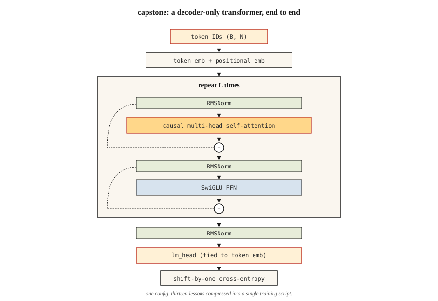

# 从零构建 Transformer——毕业设计

> 十三课,一个模型,没有捷径。

**类型:** 动手构建
**编程语言:** Python
**前置要求:** 第 7 阶段 · 01 至 13 课。一课都不许跳。
**预计耗时:** 约 120 分钟

## 问题

论文你读完了。注意力、多头拆分、位置编码、编码器与解码器块、BERT 和 GPT 的损失、MoE、KV 缓存,你都实现过了。现在,让它们在一个真实任务上协同工作。

毕业设计:端到端训练一个小型纯解码器 Transformer,做字符级语言建模。它读莎士比亚,它写新的"莎士比亚"。它小到笔记本上 10 分钟内能训完,又正确到换个更大的数据集、加更长的训练,就能变成真正的语言模型。

这就是本课程的 "nanoGPT"。它不是原创——Karpathy 2023 年的 nanoGPT 教程是每个学生至少写一遍的参考实现。我们借它的形状,换上本课程讲过的内容。

## 概念



架构,带注解:

```
input tokens (B, N)
   │
   ▼
token embedding + positional embedding  ◀── Lesson 04 (RoPE option)
   │
   ▼
┌──── block × L ────────────────────┐
│  RMSNorm                          │  ◀── Lesson 05
│  MultiHeadAttention (causal)      │  ◀── Lesson 03 + 07 (causal mask)
│  residual                         │
│  RMSNorm                          │
│  SwiGLU FFN                       │  ◀── Lesson 05
│  residual                         │
└────────────────────────────────── ┘
   │
   ▼
final RMSNorm
   │
   ▼
lm_head (tied to token embedding)
   │
   ▼
logits (B, N, V)
   │
   ▼
shift-by-one cross-entropy            ◀── Lesson 07
```

### 我们交付什么

- `GPTConfig` ——所有超参数集中配置的地方。
- `MultiHeadAttention` ——因果、批量,带可选的 Flash 式路径(PyTorch 的 `scaled_dot_product_attention`)。
- `SwiGLUFFN` ——现代 FFN。
- `Block` ——pre-norm,残差包裹的注意力 + FFN。
- `GPT` ——嵌入、堆叠的块、LM 头、generate()。
- 训练循环:AdamW、余弦学习率、梯度裁剪。
- 莎士比亚文本上的字符级分词器。

### 我们不交付什么

- RoPE——第 04 课已从概念上实现。这里为简单起见用可学习位置嵌入。练习会要求你换成 RoPE。
- 生成时的 KV 缓存——每个生成步都对完整前缀重算注意力。更慢,但更简单。练习会要求你加 KV 缓存。
- Flash Attention——输入匹配时 PyTorch 2.0+ 会自动派发;我们用 `F.scaled_dot_product_attention`。
- MoE——每块一个 FFN。MoE 你在第 11 课见过了。

### 目标指标

Mac M2 笔记本上,4 层、4 头、d_model=128 的 GPT,在 `tinyshakespeare.txt` 上训 2,000 步:

- 训练损失从约 4.2(随机)收敛到约 1.5,用时约 6 分钟。
- 采样输出有莎士比亚的样子:古风词汇、换行、像 "ROMEO:" 这样的人名会冒出来。
- 验证损失(留出最后 10% 文本)紧贴训练损失;这个规模和预算下没有过拟合。

```figure
n5-block-stack
```

## 动手构建

本课使用 PyTorch。安装 `torch`(CPU 版即可)。见 `code/main.py`。脚本会处理:

- `tinyshakespeare.txt` 缺失时自动下载(或读本地副本)。
- 字节级字符分词器。
- 90/10 的训练/验证划分。
- 支持硬件上启用 bf16 autocast 的训练循环。
- 训练结束后的采样。

### 第 1 步:数据

```python
text = open("tinyshakespeare.txt").read()
chars = sorted(set(text))
stoi = {c: i for i, c in enumerate(chars)}
itos = {i: c for c, i in stoi.items()}
encode = lambda s: [stoi[c] for c in s]
decode = lambda xs: "".join(itos[x] for x in xs)
```

65 个不同字符。词表极小,4 字节 vocab_size 都装得下。没有 BPE,没有分词器的糟心事。

### 第 2 步:模型

见 `code/main.py`。模块就是第 05 课的教科书写法——pre-norm、RMSNorm、SwiGLU、因果 MHA。4/4/128 配置的参数量:约 80 万。

### 第 3 步:训练循环

取一批随机的长度 256 token 窗口。前向。移位一格的交叉熵。反传。AdamW 一步。记日志。重复。

```python
for step in range(max_steps):
    x, y = get_batch("train")
    logits = model(x)
    loss = F.cross_entropy(logits.view(-1, vocab_size), y.view(-1))
    loss.backward()
    torch.nn.utils.clip_grad_norm_(model.parameters(), 1.0)
    opt.step()
    opt.zero_grad()
```

### 第 4 步:采样

给定 prompt,反复前向,从 top-p logits 采样,拼接,继续。500 个 token 后停止。

### 第 5 步:读输出

2,000 步之后:

```
ROMEO:
Away and mild will not thy friend, that thou shalt wit:
The chief that well shame and hath been his friends,
...
```

不是莎士比亚。但有莎士比亚的样子。对约 80 万参数、笔记本 6 分钟来说,是场大胜。

## 投入使用

这个毕业设计是一个参考架构。三个把它变成真东西的扩展方向:

1. **换分词器。** 用 BPE(如 `tiktoken.get_encoding("cl100k_base")`)。词表从 65 涨到约 50,000,模型容量要相应放大。
2. **在更大语料上训练。** 用 `OpenWebText` 或 `fineweb-edu`(HuggingFace)。一块 A100 上,125M 参数的 GPT 训 10B token 约 24 小时。
3. **加 RoPE + KV 缓存 + Flash Attention。** 下面的练习会带你逐个实现。

最终得到一个 125M 参数、能生成流畅英文的 GPT。不是前沿模型。但同一条代码路径——只是放大——正是 Karpathy、EleutherAI 和 Allen Institute 在 2026 年训练研究检查点所用的。

## 交付

见 `outputs/skill-transformer-review.md`。这个技能按之前 13 课的全部内容,审查一个从零实现的 Transformer 的正确性。

## 练习

1. **易。** 运行 `code/main.py`,验证训练后模型的最后一步验证损失低于 2.0。把 `max_steps` 从 2,000 改成 5,000——验证损失还在降吗?
2. **中。** 把可学习位置嵌入换成 RoPE,在 `MultiHeadAttention` 内部对 Q 和 K 施加旋转。训练并验证验证损失至少不降。
3. **中。** 在采样循环里实现 KV 缓存。分别在有/无缓存下生成 500 个 token。笔记本上墙钟应提升 5–20 倍。
4. **难。** 给模型加第二个头,预测下下个 token(MTP——DeepSeek-V3 的多 token 预测)。联合训练。有帮助吗?
5. **难。** 把每块的单个 FFN 换成 4 专家 MoE,路由器 + top-2 路由。在激活参数相同的前提下,看验证损失怎么变。

## 关键术语

| 术语 | 人们常说的 | 实际含义 |
|------|-----------------|-----------------------|
| nanoGPT | "Karpathy 的教程仓库" | 极简纯解码器 Transformer 训练代码,约 300 行;经典参考实现 |
| tinyshakespeare | "标准玩具语料" | 约 1.1 MB 文本;2015 年以来每个字符级 LM 教程都用它 |
| 共享嵌入(Tied embeddings) | "输入输出共用一个矩阵" | LM 头权重 = token 嵌入矩阵的转置;省参数,还提质量 |
| bf16 autocast | "训练精度技巧" | 前向/反向用 bf16,优化器状态保持 fp32;2021 年以来的标准 |
| 梯度裁剪(Gradient clipping) | "防爆" | 全局梯度范数封顶 1.0;防止训练炸掉 |
| 余弦学习率调度 | "2020 年后的默认" | 学习率先线性爬升(warmup),再按余弦形衰减到峰值的 10% |
| MFU | "模型 FLOP 利用率" | 实际达成 FLOPs / 理论峰值;2026 年稠密 40%、MoE 30% 算强 |
| 验证损失(Val loss) | "留出集损失" | 在模型从未见过的数据上的交叉熵;过拟合探测器 |

## 延伸阅读

- [The Annotated Transformer (Harvard NLP)](https://nlp.seas.harvard.edu/annotated-transformer/) ——经典的带注解实现
