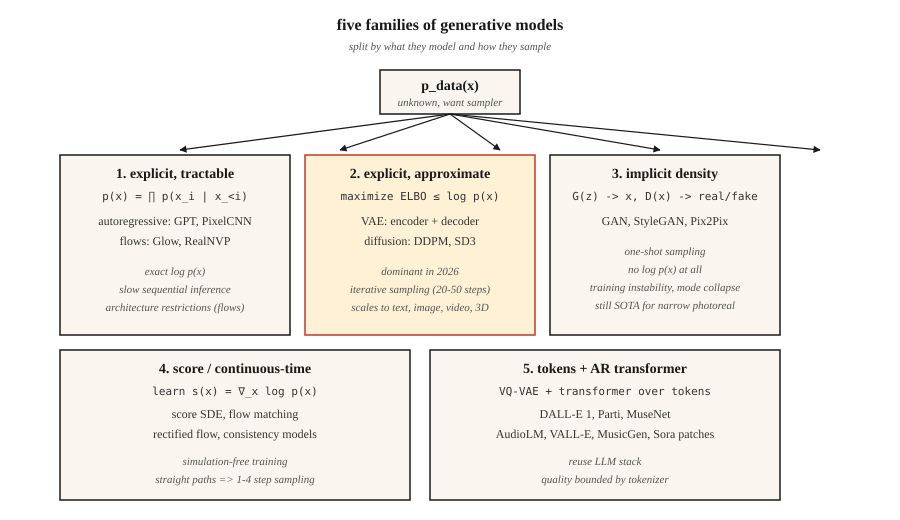

# 生成模型 —— 分类法与简史

> 无论图像模型、文本模型、视频模型还是 3D 模型,都逃不出五个桶。进错桶,你得和数学搏斗好几周;进对桶,这个领域过去十二年的进展会在你脑子里码得整整齐齐。

**类型:** 学习
**编程语言:** Python
**前置要求:** 第 2 阶段(机器学习基础)、第 3 阶段(深度学习核心)、第 7 阶段第 14 课(Transformer)
**预计耗时:** 约 45 分钟

## 问题

生成模型只干一件事:给定从未知分布 `p_data(x)` 采出的训练样本,产出看起来来自同一分布的新样本。人脸、句子、MIDI 文件、蛋白质结构——眯起眼睛看,全是同一个问题。

麻烦在于:`p_data` 活在百万维的空间里(一张 512x512 RGB 图像约 78.6 万维),样本躺在空间中的一张薄薄流形上,而你手里只有约 1000 万个样本。暴力求密度是没戏的。每个生成模型都是一种妥协:用一个稍容易的问题,换掉原来的难问题。

过去十二年,五个家族活了下来。弄清每个家族做的那笔妥协,你就明白它为什么在某些任务上称王、在另一些任务上翻车。

## 概念



**1. 显式密度,可解。** 把 `log p(x)` 写成一个你真能算出来的求和。自回归模型(PixelCNN、WaveNet、GPT)做因式分解 `p(x) = ∏ p(x_i | x_<i)`;归一化流(RealNVP、Glow)把 `p(x)` 构造为简单基础分布的可逆变换。优点:似然精确,训练损失干净。缺点:自回归推理是串行的(长序列慢),流要求架构可逆(架构上束手束脚)。

**2. 显式密度,近似。** 从下方逼近 `log p(x)`(ELBO),优化这个下界。VAE(Kingma 2013)用编码器-解码器加变分后验;扩散模型(DDPM,Ho 2020)训练一个去噪器,隐式优化加权 ELBO。扩散是 2026 年图像、视频和 3D 的主流骨干。

**3. 隐式密度。** 彻底绕开密度:学一个产样本的生成器 `G(z)`,再学一个分真假的判别器 `D(x)`。GAN(Goodfellow 2014)。推理快(一次前向),训练却出了名的不稳定。即使在 2026 年,StyleGAN 1/2/3 仍是固定领域照片级真实感(人脸、卧室)的 SOTA。

**4. 基于分数 / 连续时间。** 直接学对数密度的梯度 `∇_x log p(x)`(即分数,score)。Song & Ermon(2019)证明分数匹配把扩散推广成了 SDE。Flow matching(Lipman 2023)是 2024–2026 年的当红路线:免模拟训练、更直的路径、采样比 DDPM 快 4–10 倍。Stable Diffusion 3、Flux、AudioCraft 2 用的都是 flow matching。

**5. 离散编码上的 token 自回归。** 先用 VQ-VAE 或残差量化器把高维数据压成一小串离散 token,再用 Transformer 建模 token 序列。Parti、MuseNet、AudioLM、VALL-E、Sora 的 patch 分词器都走这条路。本质上是桶 1 加一个学出来的分词器。

## 简史

| 年份 | 模型 | 为什么重要 |
|------|-------|-----------------|
| 2013 | VAE(Kingma) | 第一个有可用训练损失的深度生成模型。 |
| 2014 | GAN(Goodfellow) | 隐式密度,没有似然——样本却锐利得惊人。 |
| 2015 | DRAW、PixelCNN | 序列化图像生成。 |
| 2017 | Glow、RealNVP | 可逆流;靠深度换取精确似然。 |
| 2017 | Progressive GAN | 第一批百万像素人脸。 |
| 2019 | StyleGAN / StyleGAN2 | 照片级人脸,那个领域至今难被超越。 |
| 2020 | DDPM(Ho) | 扩散走向实用。 |
| 2021 | CLIP、DALL-E 1、VQGAN | 文生图进入主流。 |
| 2022 | Imagen、Stable Diffusion 1、DALL-E 2 | 潜在扩散 + 文本条件 = 大宗商品。 |
| 2022 | ControlNet、LoRA | 对预训练扩散模型的精细控制。 |
| 2023 | SDXL、Midjourney v5、Flow matching | 规模 + 更好的训练动力学。 |
| 2024 | Sora、Stable Diffusion 3、Flux.1 | 视频扩散;flow matching 胜出。 |
| 2025 | Veo 2、Kling 1.5、Runway Gen-3、Nano Banana | 生产级视频。 |
| 2026 | 一致性模型 + Rectified Flow | 扩散骨干上的一步采样。 |

## 五问分诊法

一篇新的生成模型论文出来时,先回答这五个问题,再看方法部分。

1. **建模对象是什么?** 像素、潜在表示、离散 token、3D 高斯、网格、波形?
2. **密度是显式还是隐式?** 他们写出 `log p(x)` 了吗?
3. **采样:一步到位还是迭代?** 迭代意味着推理慢;一步通常意味着对抗训练或蒸馏。
4. **条件化:无条件、类别、文本、图像、姿态?** 这决定损失和架构脚手架。
5. **评估:FID、CLIP 分数、IS、人类偏好、任务准确率?** 各有已知翻车方式(见第 14 课)。

本阶段每一课,你都要重答这五个问题。到最后,它们会成为你的条件反射。

```figure
autoencoder-bottleneck
```

## 动手构建

本课代码是一个轻量可视化:在一个 1 维高斯混合上,用三种玩具方法从样本拟合分布(核密度估计、离散直方图、一个"类 GAN"的最近样本生成器),让你在一个屏幕就能打印的问题上,看清显式密度与隐式密度的差别。

运行 `code/main.py`。它从双峰高斯混合中采 2000 个样本,然后打印:

```
explicit density (histogram): p(x in [-0.5, 0.5]) ≈ 0.38
approximate density (KDE):     p(x in [-0.5, 0.5]) ≈ 0.41
implicit (nearest-sample gen): 20 new samples printed, no p(x)
```

注意:前两个能让你问"这个点有多可能?",第三个不能。这就是*显式 vs 隐式*的区别,往后每课都绕不开它。

## 投入使用

2026 年,什么任务选哪个家族?

| 任务 | 最佳家族 | 为什么 |
|------|-------------|-----|
| 窄领域照片级人脸 | StyleGAN 2/3 | 仍最锐利,推理最快。 |
| 通用文生图 | 潜在扩散 + flow matching | SD3、Flux.1、DALL-E 3。 |
| 快速文生图 | Rectified flow + 蒸馏 | SDXL-Turbo、SD3-Turbo、LCM。 |
| 文生视频 | 扩散 Transformer + flow matching | Sora、Veo 2、Kling。 |
| 语音 + 音乐 | token 自回归(AudioLM、VALL-E、MusicGen)或 flow matching(AudioCraft 2) | 离散 token 规模化的成本低。 |
| 3D 场景 | 高斯泼溅拟合、扩散先验 | 重建用 3D-GS,新视角用扩散。 |
| 密度估计(不采样) | 流 | 唯一能给出精确 `log p(x)` 的家族。 |
| 模拟 / 物理 | flow matching、score SDE | 直线路径,平滑向量场。 |

## 交付

保存为 `outputs/skill-model-chooser.md`。

这个技能接收一段任务描述,输出:(1) 该用哪个家族;(2) 三个开源选项和三个托管选项的排名列表;(3) 需要警惕的可能失败模式;(4) 算力/时间预算。

## 练习

1. **易。** 为以下五个产品指出所属家族与骨干:ChatGPT 图像、Midjourney v7、Sora、Runway Gen-3、ElevenLabs。证据要来自公开技术报告。
2. **中。** 你明天要读的论文宣称采样比扩散快 100 倍。写下三个问题,检验这个加速在带条件和高分辨率下是否依然成立。
3. **难。** 挑一个你在乎的领域(如蛋白质结构、CAD、分子、轨迹)。为该领域当前 SOTA 模型回答五问分诊,并勾画一个更好的模型会改变什么。

## 关键术语

| 术语 | 人们常说的是 | 实际含义是 |
|------|-----------------|-----------------------|
| 生成模型 | "造新东西的" | 学一个 `p_data(x)` 的采样器,可选地暴露 `log p(x)`。 |
| 显式密度 | "能算出来的那种" | 模型提供闭式或可解的 `log p(x)`。 |
| 隐式密度 | "GAN 那种" | 只有采样器——无法计算给定点处的 `p(x)`。 |
| ELBO | "证据下界" | `log p(x)` 的可解下界;VAE 和扩散优化的都是它。 |
| 分数(score) | "对数密度的梯度" | `∇_x log p(x)`;扩散和 SDE 模型学的是这个场。 |
| 流形假说 | "数据躺在一张面上" | 高维数据集中在低维流形上;降维之所以有效的根据。 |
| 自回归 | "预测下一块" | 把联合分布因式分解为条件分布的乘积。 |
| 潜在表示 | "压缩码" | 解码器能从中重建输入的低维表示。 |

## 生产注记:五个家族,五种推理形态

每个家族对应不同的推理服务器成本曲线。生产推理文献把 LLM 推理拆成 prefill + decode;同样的分解在这里也适用:

- **自回归(桶 1 和桶 5)。** 串行 decode 主导延迟;KV-cache、连续批处理、投机解码全部直接适用。
- **VAE / 扩散 / flow matching(桶 2 和桶 4)。** 没有 LLM 意义上的 decode。成本 = `步数 × 单步成本`,单步成本是一次全潜在分辨率下的 Transformer 或 U-Net 前向。生产旋钮是:步数(DDIM / DPM-Solver / 蒸馏)、批次大小、精度(bf16 / fp8 / int4)。
- **GAN(桶 3)。** 一次前向。没有调度,没有 KV-cache。TTFT ≈ 总延迟。这就是 StyleGAN 在窄领域 UX 上仍然称王的原因。

看到论文摘要说"比扩散快"时,把它翻译成"步数更少 × 单步成本不变"或"步数相同 × 单步成本更低"。其余都是营销话术。

## 延伸阅读

- [Goodfellow et al. (2014). Generative Adversarial Nets](https://arxiv.org/abs/1406.2661) — GAN 论文。
- [Kingma & Welling (2013). Auto-Encoding Variational Bayes](https://arxiv.org/abs/1312.6114) — VAE 论文。
- [Ho, Jain, Abbeel (2020). Denoising Diffusion Probabilistic Models](https://arxiv.org/abs/2006.11239) — DDPM 论文。
- [Song et al. (2021). Score-Based Generative Modeling through SDEs](https://arxiv.org/abs/2011.13456) — 作为 SDE 的扩散。
- [Lipman et al. (2023). Flow Matching for Generative Modeling](https://arxiv.org/abs/2210.02747) — flow matching 论文。
- [Esser et al. (2024). Scaling Rectified Flow Transformers for High-Resolution Image Synthesis](https://arxiv.org/abs/2403.03206) — Stable Diffusion 3。
