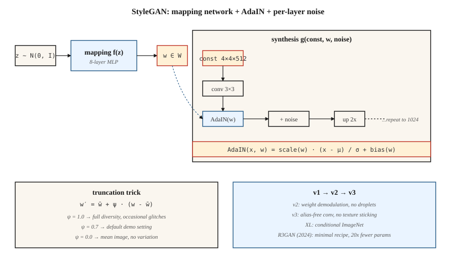

# StyleGAN

> 大多数生成器把 `z` 同时搅进所有层。StyleGAN 把它拆开:先把 `z` 映射成中间量 `w`,再通过 AdaIN 把 `w` *注入*每一个分辨率级别。就这一个改动,解开了纠缠的潜在空间,让照片级人脸连续七年成为已解决的问题。

**类型:** 动手构建
**编程语言:** Python
**前置要求:** 第 8 阶段第 03 课(GAN)、第 4 阶段第 08 课(归一化)、第 3 阶段第 07 课(CNN)
**预计耗时:** 约 45 分钟

## 问题

DCGAN 通过一叠转置卷积把 `z` 映射成图像。问题在于:`z` 什么都管——姿态、光照、身份、背景——全纠缠在一起。沿 `z` 的某根轴挪一步,四样东西全变。你没法对模型说"同一个人,换个姿态",因为这种表示不那样分解。

Karras et al.(2019,NVIDIA)的方案:别再直接把 `z` 喂进卷积层,改为喂一个常量 `4×4×512` 张量作为网络输入;学一个 8 层 MLP 把 `z ∈ Z` 映射成 `w ∈ W`;在每个分辨率上通过*自适应实例归一化*(AdaIN)注入 `w`:先归一化每个卷积特征图,再用 `w` 的仿射投影做缩放和平移。另加逐层噪声,负责随机细节(毛孔、发丝)。

结果:`W` 的各轴大致正交——"高级风格"(姿态、身份)与"精细风格"(光照、颜色)分开了。你可以交换两张图的风格:低分辨率层用图 A 的 `w`,高分辨率层用图 B 的 `w`。这解锁了编辑、跨域风格化,以及整条"StyleGAN 反演"研究线。

## 概念



**映射网络。** `f: Z → W`,8 层 MLP。`Z = N(0, I)^512`。`W` 不被强制成高斯——它学出贴合数据的形状。

**合成网络。** 从一个可学习常量 `4×4×512` 起步。每个分辨率块:`上采样 → 卷积 → AdaIN(w_i) → 加噪 → 卷积 → AdaIN(w_i) → 加噪`。分辨率逐级翻倍:4、8、16、32、64、128、256、512、1024。

**AdaIN。**

```
AdaIN(x, y) = y_scale · (x - mean(x)) / std(x) + y_bias
```

其中 `y_scale` 和 `y_bias` 来自 `w` 的仿射投影。先逐特征图归一化,再重新赋"风格"。这里的"风格"就是特征图的一阶、二阶统计量。

**逐层噪声。** 单通道高斯噪声加到每个特征图上,按可学习的逐通道系数缩放。控制随机细节,不影响全局结构。

**截断技巧(truncation trick)。** 推理时采 `z`,算 `w = mapping(z)`,再算 `w' = ŵ + ψ·(w - ŵ)`,`ŵ` 是大量样本上的平均 `w`。`ψ < 1` 用多样性换质量。几乎每个 StyleGAN 演示都用 `ψ ≈ 0.7`。

## StyleGAN 1 → 2 → 3

| 版本 | 年份 | 创新 |
|---------|------|------------|
| StyleGAN | 2019 | 映射网络 + AdaIN + 噪声 + 渐进生长。 |
| StyleGAN2 | 2020 | 权重解调取代 AdaIN(修复水滴伪影);跳跃/残差架构;路径长度正则化。 |
| StyleGAN3 | 2021 | 抗混叠卷积 + 等变卷积核;消除纹理黏在像素网格上的问题。 |
| StyleGAN-XL | 2022 | 类条件、1024²、ImageNet。 |
| R3GAN | 2024 | 更强正则的新包装;参数量仅为其 1/20,在 FFHQ-1024 上追平扩散。 |

2026 年,StyleGAN3 仍是以下场景的默认:(a) 高帧率窄领域照片级生成;(b) 少样本域适应(用 100 张图在新数据集上微调,冻结映射网络);(c) 基于反演的编辑(找到重建某张真实照片的 `w`,再编辑它)。开放域文生图不是它的活——那是扩散的。

```figure
gx-stylegan-mapping
```

## 动手构建

`code/main.py` 在 1 维下实现玩具版"StyleGAN Lite":一个映射 MLP、一个以可学习常量向量为输入并用 `w` 导出的 scale/bias 调制的合成函数,以及逐层噪声。它展示:通过仿射调制注入 `w`,效果追平或优于把 `z` 拼进生成器输入。

### 第 1 步:映射网络

```python
def mapping(z, M):
    h = z
    for i in range(num_layers):
        h = leaky_relu(add(matmul(M[f"W{i}"], h), M[f"b{i}"]))
    return h
```

### 第 2 步:自适应实例归一化

```python
def adain(x, w_scale, w_bias):
    mu = mean(x)
    sd = std(x)
    x_norm = [(xi - mu) / (sd + 1e-8) for xi in x]
    return [w_scale * xi + w_bias for xi in x_norm]
```

逐特征图的 scale 和 bias 由 `w` 经线性投影得到。

### 第 3 步:逐层噪声

```python
def add_noise(x, sigma, rng):
    return [xi + sigma * rng.gauss(0, 1) for xi in x]
```

逐通道的 sigma 是可学习的。

## 陷阱

- **水滴伪影。** StyleGAN 1 的特征图里出现团状水滴,因为 AdaIN 把均值清零了。StyleGAN2 的权重解调改为缩放卷积权重,修好了它。
- **纹理黏格。** StyleGAN 1 和 2 的纹理跟着像素坐标走,而不是跟着物体坐标走(插值时肉眼可见)。StyleGAN3 用加窗 sinc 滤波的抗混叠卷积修复。
- **众数覆盖。** 截断 `ψ < 0.7` 画面干净,但样本只来自一个窄锥;要多样性就用 `ψ = 1.0`。
- **反演是有损的。** 把真实照片反演进 `W`,通常靠优化或编码器(e4e、ReStyle、HyperStyle)。迭代多了结果会漂。

## 投入使用

| 使用场景 | 方案 |
|----------|----------|
| 照片级人脸(动漫、商品图等窄域) | StyleGAN3 FFHQ / 自定义微调 |
| 从照片做人脸编辑 | e4e 反演 + StyleSpace / InterFaceGAN 方向 |
| 换脸 / 面部重演 | StyleGAN + 编码器 + 融合 |
| 虚拟形象流水线 | StyleGAN3 配 ADA 做低数据微调 |
| 少量图的域适应 | 冻结映射网络,微调合成网络 |
| 多模态或文本条件生成 | 别用——上扩散 |

对"答案就是一张人脸照片"的产品级演示,StyleGAN 在推理成本(单次前向,4090 上 <10ms)和同等质量线下的锐利度上都胜过扩散。

## 交付

保存 `outputs/skill-stylegan-inversion.md`。技能输入:一张真实照片;输出:反演方法(e4e / ReStyle / HyperStyle)、预期潜在损失、编辑预算(在 `W` 中能走多远不出伪影),以及一组已知好用的编辑方向(年龄、表情、姿态)。

## 练习

1. **易。** 分别以 `adain_on=True` 和 `adain_on=False` 跑 `code/main.py`。对比固定潜在向量与扰动潜在向量下输出的分散程度。
2. **中。** 实现混合正则化(mixing regularization):对一个训练批次,计算 `w_a`、`w_b`,合成前半段用 `w_a`、后半段用 `w_b`。解码器能学出解耦的风格吗?
3. **难。** 拿一个预训练 StyleGAN3 FFHQ 模型(ffhq-1024.pkl),在标注样本上训一个 SVM,找出控制"微笑"的 `w` 方向;报告能推多远而身份不漂移。

## 关键术语

| 术语 | 人们常说的是 | 实际含义是 |
|------|-----------------|-----------------------|
| 映射网络 | "那个 MLP" | `f: Z → W`,8 层,把潜在几何与数据统计解耦。 |
| W 空间 | "风格空间" | 映射网络的输出;大致解耦。 |
| AdaIN | "自适应实例归一化" | 先归一化特征图,再用 `w` 的投影缩放平移。 |
| 截断技巧 | "Psi" | `w = mean + ψ·(w - mean)`,ψ<1 用多样性换质量。 |
| 路径长度正则化 | "PL reg" | 惩罚 `w` 单位变化引起的图像大变化;让 `W` 更平滑。 |
| 权重解调 | "StyleGAN2 的修复" | 归一化卷积权重而非激活;杀死水滴伪影。 |
| 抗混叠 | "StyleGAN3 的技巧" | 加窗 sinc 滤波;消除纹理黏在像素网格上。 |
| 反演 | "给真图找 w" | 优化或编码 `x → w`,使 `G(w) ≈ x`。 |

## 生产注记:为什么 2026 年 StyleGAN 仍在交付

StyleGAN3 在 4090 上生成一张 1024² FFHQ 人脸不到 10ms——`步数 = 1`,没有 VAE 解码,没有交叉注意力。按生产术语,这是任何图像生成器的延迟地板。同分辨率下,50 步 SDXL + VAE 解码的流水线约 3 秒。**300 倍差距**。对窄领域产品(虚拟形象服务、证件照流水线、素材人脸生成),TCO 上稳赢。

两个运维推论:

- **无调度器、无批处理器。** 按目标占用率攒静态批次就是最优。连续批处理(对 LLM 和扩散至关重要)在这里零收益,因为每个请求 FLOPs 相同。
- **截断 `ψ` 是安全旋钮。** `ψ < 0.7` 的样本来自映射网络值域的窄锥。这是服务层对样本方差唯一的控制杆。高峰时段调低 `ψ`,给付费用户调高。

## 延伸阅读

- [Karras et al. (2019). A Style-Based Generator Architecture for GANs](https://arxiv.org/abs/1812.04948) — StyleGAN。
- [Karras et al. (2020). Analyzing and Improving the Image Quality of StyleGAN](https://arxiv.org/abs/1912.04958) — StyleGAN2。
- [Karras et al. (2021). Alias-Free Generative Adversarial Networks](https://arxiv.org/abs/2106.12423) — StyleGAN3。
- [Tov et al. (2021). Designing an Encoder for StyleGAN Image Manipulation](https://arxiv.org/abs/2102.02766) — e4e 反演。
- [Sauer et al. (2022). StyleGAN-XL: Scaling StyleGAN to Large Diverse Datasets](https://arxiv.org/abs/2202.00273) — StyleGAN-XL。
- [Huang et al. (2024). R3GAN: The GAN is dead; long live the GAN!](https://arxiv.org/abs/2501.05441) — 现代极简 GAN 配方。
