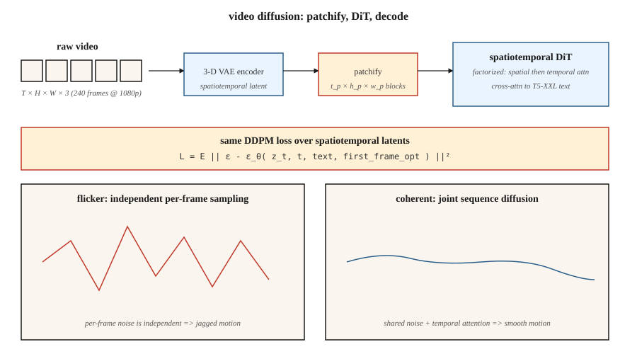

# 视频生成

> 图像是 2 维张量,视频是 3 维张量。理论相同,算力难 10–100 倍。OpenAI 的 Sora(2024 年 2 月)证明了这事可行。到 2026 年,Veo 2、Kling 1.5、Runway Gen-3、Pika 2.0、WAN 2.2 已经能量产 1080p 的文生视频——而开放权重阵营(CogVideoX、HunyuanVideo、Mochi-1、WAN 2.2)落后约 12 个月。

**类型:** 动手构建
**编程语言:** Python
**前置要求:** 第 8 阶段第 07 课(潜在扩散)、第 7 阶段第 09 课(ViT)、第 8 阶段第 06 课(DDPM)
**预计耗时:** 约 45 分钟

## 问题

一段 10 秒、1080p、24fps 的视频,是 240 帧 1920×1080×3 像素——每段约 1.5 GB 原始数据。像素空间扩散不可行。你需要:

1. **时空压缩。** 一个编码视频(而非单帧)的 VAE,把视频压成时空 patch 序列。
2. **时序连贯。** 前后帧要在数秒内共享内容、光照和物体身份。网络必须对运动建模。
3. **算力预算。** 同等模型规模下,视频训练比图像贵 10–100 倍。
4. **条件化。** 文本、图像(首帧)、音频或另一段视频。多数生产模型四样都收。

解决这套问题的架构,是作用在时空 patch 上的**扩散 Transformer(DiT)**,在海量(提示词, 描述, 视频)数据集上训练。损失与第 06 课的扩散损失相同。

## 概念



### 切 patch

用 3D VAE 编码视频(学习出来的时空压缩)。潜在表示形状为 `[T_latent, H_latent, W_latent, C_latent]`,切成 `[t_p, h_p, w_p]` 大小的 patch。Sora 风格的模型,`t_p = 1`(逐帧 patch)或 `t_p = 2`(两帧一 patch)。10 秒 1080p 视频压成约 2 万到 10 万个 patch。

### 时空 DiT

一个 Transformer 处理展平后的 patch 序列。每个 patch 带 3D 位置嵌入(时间 + y + x)。注意力通常做分解:

- **空间注意力** —— 每帧内部的 patch 之间。
- **时间注意力** —— 同一空间位置跨帧之间。
- **完整 3D 注意力** —— 贵 16–100 倍,只在低分辨率或研究中使用。

### 文本条件化

与大文本编码器做交叉注意力(Sora 用 T5-XXL,CogVideoX-5B 也用 T5-XXL)。长提示词很关键——Sora 训练集里,用 GPT 生成的稠密重写标注平均每段 200 个 token。

### 训练

标准扩散损失(ε 或 v 预测),作用在时空潜在表示上。数据:网络视频 + 约 1 亿条精选片段 + 合成文本标注。算力:很小的研究级 run 也要 1 万+ GPU 时;Sora 量级是 10 万+。

## 2026 年生产格局

| 模型 | 时间 | 最长时长 | 最高分辨率 | 开放权重? | 备注 |
|-------|------|--------------|---------|---------------|---------|
| Sora(OpenAI) | 2024-02 | 60s | 1080p | 否 | 第一个在规模上展现世界模拟器性质的模型 |
| Sora Turbo | 2024-12 | 20s | 1080p | 否 | 生产版 Sora,推理快 5 倍 |
| Veo 2(Google) | 2024-12 | 8s | 4K | 否 | 2025 年质量与物理最强 |
| Veo 3 | 2025 Q3 | 15s | 4K | 否 | 原生音频,运镜控制更强 |
| Kling 1.5 / 2.1(快手) | 2024–2025 | 10s | 1080p | 否 | 2025 Q1 人体运动最佳 |
| Runway Gen-3 Alpha | 2024-06 | 10s | 768p | 否 | 上层有专业视频工具 |
| Pika 2.0 | 2024-10 | 5s | 1080p | 否 | 角色一致性最强 |
| CogVideoX(智谱) | 2024 | 10s | 720p | 是(2B、5B) | 第一个开放 5B 级视频模型 |
| HunyuanVideo(腾讯) | 2024-12 | 5s | 720p | 是(13B) | 2024 年末开放 SOTA |
| Mochi-1(Genmo) | 2024-10 | 5.4s | 480p | 是(10B) | 授权最宽松 |
| WAN 2.2(阿里) | 2025-07 | 5s | 720p | 是 | 2025 年中开放最强 |

开放权重阵营追赶速度比图像领域更快:到 2026 年中,HunyuanVideo + WAN 2.2 的 LoRA 已经驱动着大多数开源工作流。

```figure
video-diffusion-denoise
```

## 动手构建

`code/main.py` 模拟时空 DiT 的核心思想:把一小段合成视频切成 patch,加逐 patch 位置嵌入,用 Transformer 式注意力对整个序列去噪。不用 numpy,纯 Python。我们展示:即使在一维上,只要相邻帧的 patch 共享去噪器和位置嵌入,时序连贯性也会自然涌现。

### 第 1 步:把合成 1 维"视频"切 patch

```python
def make_video(T_frames=8, rng=None):
    # a "video" is a sequence of 1-D values following a smooth trajectory
    base = rng.gauss(0, 1)
    return [base + 0.3 * t + rng.gauss(0, 0.1) for t in range(T_frames)]
```

### 第 2 步:逐帧位置嵌入

```python
def pos_embed(t, dim):
    return sinusoidal(t, dim)
```

### 第 3 步:去噪器看见整个序列

我们的迷你网络不再逐帧独立去噪,而是把所有帧的值连同位置嵌入拼起来,联合预测所有帧的噪声。

### 第 4 步:时序连贯性测试

训练后采样一段视频,测量帧间差值。如果模型学到了时序结构,差值会小于逐帧独立采样。

## 陷阱

- **逐帧独立采样 = 闪烁。** 对每帧单独跑图像扩散,输出会闪,因为每帧噪声相互独立。视频扩散通过注意力或共享噪声把帧耦合起来,治好了它。
- **朴素 3D 注意力 = OOM。** 10 秒 1080p 潜在表示上的完整 3D 注意力是几千亿次运算。分解为 空间 + 时间。
- **标注质量比数据量更要紧。** Sora 相比前作的主要升级,是在详细约 10 倍的标注上训练(GPT-4 重标注片段)。OpenAI 技术报告对此写得很明白。
- **首帧条件。** 多数生产模型还接受一张图作为首帧,即"图生视频"模式;训练时包含这个变体。
- **物理漂移。** 长片段(>10s)会累积细微的不一致。滑窗生成 + 关键帧锚定有缓解作用。

## 投入使用

| 使用场景 | 2026 年选择 |
|----------|-----------|
| 最高质量文生视频,托管 | Veo 3 或 Sora |
| 运镜可控的电影感 | Runway Gen-3 配运动笔刷 |
| 跨片段角色一致性 | Pika 2.0 或 Kling 2.1 |
| 开放权重、快速微调 | WAN 2.2 + LoRA |
| 图生视频 | WAN 2.2-I2V、Kling 2.1 I2V 或 Runway |
| 音频驱动唇形同步 | Veo 3(原生音频)或专用唇形模型 |
| 视频编辑 | Runway Act-Two、Kling Motion Brush、Flux-Kontext(静帧) |

同等质量下,每秒视频的成本在 2024 到 2026 年间下降了 20 倍。

## 交付

保存 `outputs/skill-video-brief.md`。技能输入:视频需求(时长、宽高比、风格、运镜计划、主体一致性、音频);输出:模型 + 托管、提示词脚手架(运镜语言、主体描述、运动描述词)、种子 + 可复现协议,以及逐帧 QA 清单。

## 练习

1. **易。** 在 `code/main.py` 中对比 (a) 逐帧独立采样与 (b) 整序列联合采样的帧间差值。报告差值的均值与方差。
2. **中。** 加首帧条件:把第 0 帧钉在给定值,采样其余帧。测量钉住的值如何向后传播。
3. **难。** 用 HuggingFace diffusers 在本地 GPU 上跑 CogVideoX-2B。6 秒 720p 片段跑 20 步推理,计时。对时空注意力做 profiling,找出瓶颈。

## 关键术语

| 术语 | 人们常说的是 | 实际含义是 |
|------|-----------------|-----------------------|
| 视频 VAE | "3D VAE" | 把 `(T, H, W, C)` 压成时空潜在表示的编码器。 |
| Patch | "那些 token" | 潜在表示的定长 3D 块;DiT 的输入。 |
| 分解注意力 | "空间 + 时间" | 先沿空间做注意力,再沿时间做;跳过完整 3D 注意力。 |
| 图生视频(I2V) | "让这张照片动起来" | 输入图像 + 文本,输出从它开始的视频。 |
| 关键帧条件 | "锚定帧" | 钉住特定帧,控制视频的走向。 |
| 运动笔刷 | "方向提示" | 用户在图上涂画运动向量的 UI 输入。 |
| 重标注 | "稠密标注" | 用 LLM 给训练片段重写详细提示词。 |
| 闪烁 | "时序伪影" | 帧间不一致;靠耦合去噪修复。 |

## 生产注记:视频潜在表示是内存带宽问题

10 秒 1080p、24fps 的片段是 240 帧 × 1920 × 1080 × 3 ≈ 1.5 GB 原始像素。经 4 倍视频 VAE 压缩(空间 2 倍 × 时间 2 倍)后,潜在表示约每请求 100 MB。以批次 1 在时空 DiT 上跑 30 步,每步要在 HBM 里搬约 3 GB——瓶颈是内存带宽,不是 FLOPs。

三个生产旋钮,直接来自生产推理文献的推理章节:

- **DiT 上的 TP。** 文生视频模型动辄 ≥100 亿参数。4 张 H100 上 TP=4 是标配;405B 级模型用 PP=2 × TP=2。单步延迟随 TP 近似线性下降,直到撞上 all-reduce 墙。
- **帧批处理 = 连续批处理。** 生成时,视频在概念上就是一批被注意力串起来的帧。连续批处理(在途调度)同样适用:如果架构支持滑窗生成,第 `t-1` 帧正在返回时就可以开始渲染第 `t+1` 帧。
- **片段级 prefill 缓存。** 图生视频的首帧条件,相当于 LLM 的 prompt prefill:算一次,在所有时间解码 pass 中复用。这实际上就是视频版 KV-cache。

## 延伸阅读

- [Brooks et al. (2024). Video generation models as world simulators](https://openai.com/index/video-generation-models-as-world-simulators/) — Sora 技术报告。
- [Yang et al. (2024). CogVideoX: Text-to-Video Diffusion Models with An Expert Transformer](https://arxiv.org/abs/2408.06072) — CogVideoX。
- [Kong et al. (2024). HunyuanVideo: A Systematic Framework for Large Video Generative Models](https://arxiv.org/abs/2412.03603) — HunyuanVideo。
- [Genmo (2024). Mochi-1 Technical Report](https://www.genmo.ai/blog/mochi) — Mochi-1。
- [Alibaba (2025). WAN 2.2](https://wanvideo.io/) — 2025 年中开放 SOTA。
- [Ho, Salimans, Gritsenko et al. (2022). Video Diffusion Models](https://arxiv.org/abs/2204.03458) — 视频扩散奠基论文。
- [Blattmann et al. (2023). Align your Latents (Video LDM)](https://arxiv.org/abs/2304.08818) — Stable Video Diffusion 的前身。
