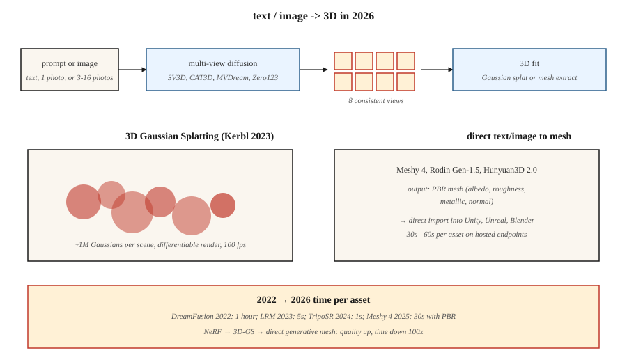

# 3D 生成

> 3D 是"2D 撬动 3D"杠杆最强的模态。2023 年的突破是 3D 高斯泼溅;2024–2026 年的生成式推进,是在其上叠加多视角扩散 + 3D 重建,从一句提示或一张照片产出物体和场景。

**类型:** 学习
**编程语言:** Python
**前置要求:** 第 4 阶段(视觉)、第 8 阶段第 07 课(潜在扩散)
**预计耗时:** 约 45 分钟

## 问题

3D 内容处处是坑:

- **表示。** 网格、点云、体素网格、有符号距离场(SDF)、神经辐射场(NeRF)、3D 高斯。各有取舍。
- **数据稀缺。** ImageNet 有 1400 万张图;最大的干净 3D 数据集(Objaverse-XL, 2023)约 1000 万个物体,多数质量不高。
- **内存。** 512³ 体素网格是 1.28 亿体素;一个好用的场景 NeRF 要每条光线 100 万采样。生成比重建更难。
- **监督。** 2D 图像你有全部像素;3D 你通常只有几张 2D 视图,得自己抬升到 3D。

2026 年的技术栈把两个问题拆开:先用扩散模型生成 *2D 多视角图像*,再把这些图像拟合成 *3D 表示*(通常是高斯泼溅)。

## 概念



### 表示:3D 高斯泼溅(Kerbl et al., 2023)

把场景表示为约 100 万个 3D 高斯的云。每个高斯 59 个参数:位置(3)、协方差(6,或四元数 4 + 缩放 3)、不透明度(1)、球谐颜色(3 阶 48 个,0 阶 3 个)。

渲染 = 投影 + alpha 合成。快(4090 上 1080p 约 100 fps)、可微。对着真实照片做梯度下降拟合,消费级 GPU 上 5–30 分钟拟合一个场景。

2023–2024 年的两个上层创新:

- **生成式高斯泼溅。** LGM、LRM、InstantMesh 这类模型,从一张或几张图直接预测高斯云。
- **4D 高斯泼溅。** 带逐帧偏移的高斯,用于动态场景。

### 多视角扩散

微调预训练图像扩散模型,从文本提示或单张图生成同一物体的多个一致视角。Zero123(Liu et al., 2023)、MVDream(Shi et al., 2023)、SV3D(Stability, 2024)、CAT3D(Google, 2024)。通常输出环绕物体的 4–16 个视角,再经高斯泼溅或 NeRF 抬升到 3D。

### 文生 3D 流水线

| 模型 | 输入 | 输出 | 耗时 |
|-------|-------|--------|------|
| DreamFusion(2022) | 文本 | NeRF(SDS) | 每个资产约 1 小时 |
| Magic3D | 文本 | 网格 + 纹理 | 约 40 分钟 |
| Shap-E(OpenAI, 2023) | 文本 | 隐式 3D | 约 1 分钟 |
| SJC / ProlificDreamer | 文本 | NeRF / 网格 | 约 30 分钟 |
| LRM(Meta, 2023) | 图像 | 三平面 | 约 5 秒 |
| InstantMesh(2024) | 图像 | 网格 | 约 10 秒 |
| SV3D(Stability, 2024) | 图像 | 新视角 | 约 2 分钟 |
| CAT3D(Google, 2024) | 1–64 张图 | 3D NeRF | 约 1 分钟 |
| TripoSR(2024) | 图像 | 网格 | 约 1 秒 |
| Meshy 4(2025) | 文本 + 图像 | PBR 网格 | 约 30 秒 |
| Rodin Gen-1.5(2025) | 文本 + 图像 | PBR 网格 | 约 60 秒 |
| 腾讯 Hunyuan3D 2.0(2025) | 图像 | 网格 | 约 30 秒 |

2025–2026 方向:直接文生网格模型,带适合游戏引擎的 PBR 材质。对通用物体,"多视角扩散中间步"仍是效果最好的配方。

### NeRF(背景知识)

神经辐射场(Mildenhall et al., 2020)。一个小 MLP 输入 `(x, y, z, 观察方向)`,输出 `(颜色, 密度)`。沿光线积分渲染。新视角合成质量胜过网格方案,但渲染慢 100–1000 倍。多数实时场景已被高斯泼溅取代,研究领域仍占主导。

```figure
v4-3d-multiview
```

## 动手构建

`code/main.py` 实现玩具 2D"高斯泼溅"拟合:把一张合成目标图(平滑渐变)表示为若干 2D 高斯泼溅之和,用梯度下降优化位置、颜色和协方差以匹配目标。你会看到两个核心操作:前向渲染(泼溅 + alpha 合成)与梯度下降拟合。

### 第 1 步:2D 高斯泼溅

```python
def gaussian_at(x, y, gaussian):
    px, py = gaussian["pos"]
    sigma = gaussian["sigma"]
    d2 = (x - px) ** 2 + (y - py) ** 2
    return math.exp(-d2 / (2 * sigma * sigma))
```

### 第 2 步:泼溅求和渲染

```python
def render(image_size, gaussians):
    img = [[0.0] * image_size for _ in range(image_size)]
    for g in gaussians:
        for y in range(image_size):
            for x in range(image_size):
                img[y][x] += g["color"] * gaussian_at(x, y, g)
    return img
```

真正的 3D 高斯泼溅会按深度排序高斯、按序做 alpha 合成。我们的 2D 玩具直接求和。

### 第 3 步:梯度下降拟合

```python
for step in range(steps):
    pred = render(size, gaussians)
    loss = mse(pred, target)
    gradients = compute_grads(pred, target, gaussians)
    update(gaussians, gradients, lr)
```

## 陷阱

- **视角不一致。** 独立生成 4 个视角,若它们对物体结构说法不一,3D 拟合就糊。修复:共享注意力的多视角扩散。
- **背面幻觉。** 单图 → 3D 必须脑补看不见的背面,质量飘忽不定。
- **高斯泼溅爆炸。** 不加约束的训练会涨到 1000 万个泼溅并过拟合。致密化 + 剪枝启发式(3D-GS 原论文)必不可少。
- **拓扑问题。** 隐式场(SDF)导出的网格常有破洞或自交。交付前跑一次重网格化(如 Blender 的 voxel remesh)。
- **训练数据授权。** Objaverse 授权混杂;商用许可因模型而异。

## 投入使用

| 任务 | 2026 年选择 |
|------|-----------|
| 照片场景重建 | 高斯泼溅(3DGS、Gsplat、Scaniverse) |
| 游戏用文生 3D 物体 | Meshy 4 或 Rodin Gen-1.5(PBR 输出) |
| 图生 3D | Hunyuan3D 2.0、TripoSR、InstantMesh |
| 少量图新视角合成 | CAT3D、SV3D |
| 动态场景重建 | 4D 高斯泼溅 |
| 虚拟形象 / 着装人体 | Gaussian Avatar、HUGS |
| 研究 / SOTA | 上周刚发的那篇 |

游戏或电商流水线里要交付生产 3D:Meshy 4 或 Rodin Gen-1.5 输出的 PBR 网格可以直接进 Unity / Unreal。

## 交付

保存 `outputs/skill-3d-pipeline.md`。技能输入:3D 需求(输入:文本 / 一张图 / 几张图;输出:网格 / 泼溅 / NeRF;用途:渲染 / 游戏 / VR);输出:流水线(多视角扩散 + 拟合,或直接网格模型)、基座模型、迭代预算、拓扑后处理、所需材质通道。

## 练习

1. **易。** 分别用 4、16、64 个高斯跑 `code/main.py`。报告最终对目标的 MSE。
2. **中。** 扩展到彩色高斯(RGB)。确认重建与目标颜色图案一致。
3. **难。** 用 gsplat 或 Nerfstudio,从 50 张实拍照片重建一个真实物体。报告拟合时间和留出视角上的最终 SSIM。

## 关键术语

| 术语 | 人们常说的是 | 实际含义是 |
|------|-----------------|-----------------------|
| 3D 高斯泼溅 | "3DGS" | 场景 = 3D 高斯的云;可微 alpha 合成渲染。 |
| NeRF | "神经辐射场" | 对 3D 点输出 颜色 + 密度 的 MLP;沿光线积分渲染。 |
| 三平面 | "三张 2D 平面" | 把 3D 分解为三块轴对齐的 2D 特征网格;比体素便宜。 |
| SDS | "分数蒸馏采样" | 借 2D 扩散的分数当伪梯度来训练 3D 模型。 |
| 多视角扩散 | "一次出多个视角" | 输出一批一致相机视角的扩散模型。 |
| PBR | "基于物理的渲染" | 带 albedo、粗糙度、金属度、法线通道的材质。 |
| 致密化 | "泼溅增殖" | 3DGS 训练启发式:在高梯度区域分裂/克隆泼溅。 |

## 生产注记:3D 还没有统一地基

不像图像(潜在扩散 + DiT)和视频(时空 DiT),2026 年的 3D 还没有单一统治性运行时。生产决策树按表示分叉:

- **NeRF / 三平面。** 推理 = 光线步进 + 每采样一次 MLP 前向。一张 512² 渲染要数百万次 MLP 前向。激进地批处理光线采样;SDPA/xformers 适用。
- **多视角扩散 + LRM 重建。** 两阶段流水线。第 1 阶段(多视角 DiT)就是第 07 课那种扩散服务器;第 2 阶段(LRM Transformer)是对所有视角的一次性前向。整体延迟画像是"扩散 + 一次前向"——按阶段选服务原语。
- **SDS / DreamFusion。** 按资产优化,不是推理。建的是任务(job),不是请求处理器。

2026 年多数产品的正确答案是:"请求来了跑多视角扩散模型,异步重建出 3DGS,用 3DGS 做实时查看"。这把负载干净地切给了 GPU 推理服务器(快)和离线优化器(慢)。

## 延伸阅读

- [Mildenhall et al. (2020). NeRF: Representing Scenes as Neural Radiance Fields](https://arxiv.org/abs/2003.08934) — NeRF。
- [Kerbl et al. (2023). 3D Gaussian Splatting for Real-Time Radiance Field Rendering](https://arxiv.org/abs/2308.04079) — 3DGS。
- [Poole et al. (2022). DreamFusion: Text-to-3D using 2D Diffusion](https://arxiv.org/abs/2209.14988) — SDS。
- [Liu et al. (2023). Zero-1-to-3: Zero-shot One Image to 3D Object](https://arxiv.org/abs/2303.11328) — Zero123。
- [Shi et al. (2023). MVDream](https://arxiv.org/abs/2308.16512) — 多视角扩散。
- [Hong et al. (2023). LRM: Large Reconstruction Model for Single Image to 3D](https://arxiv.org/abs/2311.04400) — LRM。
- [Gao et al. (2024). CAT3D: Create Anything in 3D with Multi-View Diffusion Models](https://arxiv.org/abs/2405.10314) — CAT3D。
- [Stability AI (2024). Stable Video 3D (SV3D)](https://stability.ai/research/sv3d) — SV3D。
