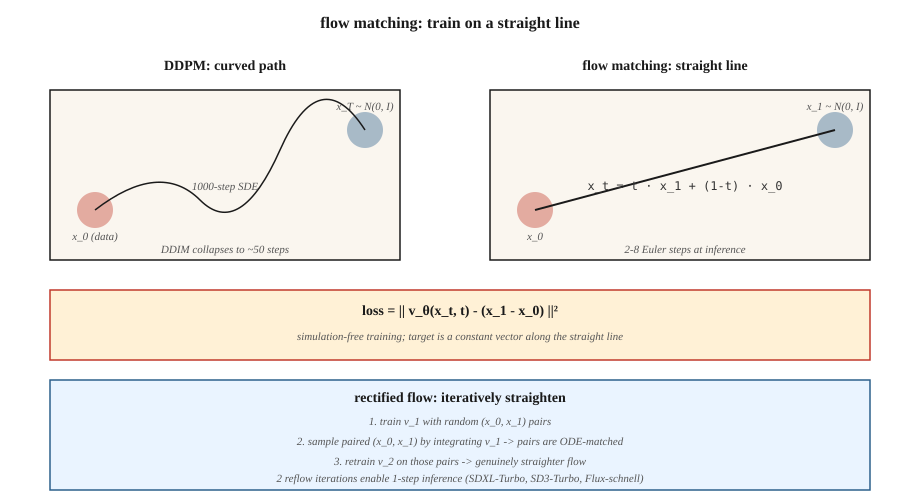

# Flow Matching 与 Rectified Flow

> 扩散模型采样要走 20–50 步,因为它从噪声到数据走的是一条弯路。Flow matching(Lipman et al., 2023)和 rectified flow(Liu et al., 2022)训练的是直路。路越直,步数越少,推理越快。2024 年,Stable Diffusion 3、Flux.1 和 AudioCraft 2 全都转向了 flow matching。

**类型:** 动手构建
**编程语言:** Python
**前置要求:** 第 8 阶段第 06 课(DDPM)、第 1 阶段微积分
**预计耗时:** 约 45 分钟

## 问题

DDPM 的反向过程是从 `N(0, I)` 走回数据分布的 1000 步随机游走;DDIM 把它压到 20–50 个确定性步。你想要更少——理想情况一步。拦路的是:解反向过程的 ODE 是刚性的,路径是弯的。

如果能训练模型,让噪声到数据的路径是一条*直线*,那么从 `t=1` 到 `t=0` 一步 Euler 就够了。Flow matching 直接构造这一点:定义从 `x_1 ∼ N(0, I)` 到 `x_0 ∼ data` 的直线插值,训练向量场 `v_θ(x, t)` 去匹配它对时间的导数,推理时做积分。

Rectified flow(Liu 2022)更进一步:用 reflow 流程迭代地把路径拉直,产出越来越接近线性的 ODE。两轮 reflow 之后,2 步采样器就能追平 50 步 DDPM 的质量。

## 概念



### 直线流

定义:

```
x_t = t · x_1 + (1 - t) · x_0,   t ∈ [0, 1]
```

其中 `x_0 ~ data`,`x_1 ~ N(0, I)`。沿这条直线的时间导数是常数:

```
dx_t / dt = x_1 - x_0
```

定义神经向量场 `v_θ(x_t, t)`,训练它去匹配这个导数:

```
L = E_{x_0, x_1, t} || v_θ(x_t, t) - (x_1 - x_0) ||²
```

这就是**条件 flow matching** 损失(Lipman 2023)。训练免模拟:永远不用展开 ODE,采样 `(x_0, x_1, t)` 做回归就行。

### 采样

推理时,沿时间*反向*积分学到的向量场:

```
x_{t-Δt} = x_t - Δt · v_θ(x_t, t)
```

从 `x_1 ~ N(0, I)` 起步,Euler 步走到 `t=0`。

### Rectified flow(Liu 2022)

直线流能用,但学到的路径*并不真的是直的*——因为许多 `x_0` 可能映射到同一个 `x_1`,路径会弯。Rectified flow 的 reflow 步骤:

1. 用随机配对训练流模型 v_1。
2. 从 `x_1` 出发积分 v_1 到落点 `x_0`,采出 N 对 `(x_1, x_0)`。
3. 在这些配对样本上训练 v_2。由于配对现在是"ODE 匹配"的,它们之间的直线插值真正变平了。
4. 重复。

实践中,2 轮 reflow 就能接近线性,实现 2–4 步推理。SDXL-Turbo、SD3-Turbo、LCM 全是从 flow matching 蒸馏出来的模型。

### 为什么 2024 年它在图像上赢了

三个原因:

1. **免模拟训练** —— 训练中不展开 ODE,实现 trivial。
2. **损失几何更好** —— 直线路径信噪比一致;而 DDPM 的 ε 损失在调度两端信噪比很差。
3. **推理更快** —— SDXL-Turbo 质量只要 4–8 步;加一致性蒸馏可到 1 步。

## Flow matching vs DDPM —— 精确联系

带高斯条件路径的 flow matching,就是*特定噪声调度下的*扩散。取 `x_t = α(t) x_0 + σ(t) x_1` 这个调度,flow matching 就还原为 Stratonovich 形式下的扩散,其中 `v = α'·x_0 - σ'·x_1`。对高斯路径,两者代数等价。

flow matching 带来的增量:目标更*干净*(一个朴素的速度)、损失更干净,以及尝试非高斯插值的自由。

```figure
normalizing-flow
```

## 动手构建

`code/main.py` 在双峰高斯混合上实现 1 维 flow matching。向量场 `v_θ(x, t)` 是个迷你 MLP,按直线目标训练。推理时分别积分 1、2、4、20 个 Euler 步,对比样本质量。

### 第 1 步:训练损失

```python
def train_step(x0, net, rng, lr):
    x1 = rng.gauss(0, 1)
    t = rng.random()
    x_t = t * x1 + (1 - t) * x0
    target = x1 - x0
    pred = net_forward(x_t, t)
    loss = (pred - target) ** 2
    # backprop + update
```

### 第 2 步:多步推理

```python
def sample(net, num_steps):
    x = rng.gauss(0, 1)
    for i in range(num_steps):
        t = 1.0 - i / num_steps
        dt = 1.0 / num_steps
        x -= dt * net_forward(x, t)
    return x
```

### 第 3 步:对比步数

预期 4 步采样器已经能追平 20 步质量——对延迟是大事。

## 陷阱

- **时间参数化。** flow matching 用 `t ∈ [0, 1]`,`t=0` 是数据,`t=1` 是噪声;DDPM 用 `t ∈ [0, T]`,`t=0` 是数据,`t=T` 是噪声。方向相同,尺度不同。论文里这里老是写错。
- **调度选择。** rectified flow 的直线是"正统" flow matching 调度,但也可以用余弦或 logit-normal 的 t 采样(SD3 就这么干),尺度覆盖更好。
- **Reflow 成本。** 给 reflow 生成配对数据集,每个样本都是一次完整推理。只有真的需要 1–2 步推理时才做 reflow。
- **CFG 依然适用。** 把 ε 换成 v 即可:`v_cfg = (1+w) v_cond - w v_uncond`。

## 投入使用

| 使用场景 | 2026 年技术栈 |
|----------|-----------|
| 文生图,最佳质量 | flow matching:SD3、Flux.1-dev |
| 文生图,1–4 步 | 蒸馏 flow matching:Flux.1-schnell、SD3-Turbo、SDXL-Turbo |
| 实时推理 | 从 flow matching 基座做一致性蒸馏(LCM、PCM) |
| 音频生成 | flow matching:Stable Audio 2.5、AudioCraft 2 |
| 视频生成 | flow matching 与扩散混用(Sora、Veo、Stable Video) |
| 科学 / 物理(粒子轨迹、分子) | flow matching + 等变向量场 |

2025–2026 年,论文里说"比扩散快"的,几乎全是 flow matching + 蒸馏。

## 交付

保存 `outputs/skill-fm-tuner.md`。技能输入:一份扩散式模型规格;输出:转换成 flow matching 训练配置——调度选择、时间采样分布(均匀 / logit-normal)、优化器、reflow 计划、目标步数、评估协议。

## 练习

1. **易。** 跑 `code/main.py`,对比 1 步与 20 步对真实数据分布的 MSE。
2. **中。** 把均匀 `t` 采样换成 logit-normal(采样集中在中段 t)。模型质量有提升吗?
3. **难。** 实现一轮 reflow:积分第一个模型生成配对 (x_0, x_1),在配对上训练第二个模型,对比 1 步样本质量。

## 关键术语

| 术语 | 人们常说的是 | 实际含义是 |
|------|-----------------|-----------------------|
| Flow matching | "直线版扩散" | 沿插值训练 `v_θ(x, t)` 匹配 `x_1 - x_0`。 |
| Rectified flow | "Reflow" | 迭代拉直学到的流的流程。 |
| 速度场 | "v_θ" | 模型输出——`x_t` 该往哪走。 |
| 直线插值 | "那条路径" | `x_t = (1-t)·x_0 + t·x_1`;目标导数 trivial。 |
| Euler 采样器 | "一阶 ODE 求解器" | 最简单的积分器;路径直时效果好。 |
| Logit-normal t | "SD3 采样" | 把 `t` 采样集中到梯度最强的中段。 |
| 一致性蒸馏 | "1 步采样器" | 训练学生把任意 `x_t` 直接映射到 `x_0`。 |
| 速度版 CFG | "v-CFG" | `v_cfg = (1+w) v_cond - w v_uncond`;同一戏法,换个变量。 |

## 生产注记:Flux.1-schnell 是最快的 flow matching

flow matching 的生产胜利是 Flux.1-schnell——一个 flow matching 的 DiT,蒸馏到 1–4 步推理,质量保持 Flux-dev 水准。Niels 的"8GB 机器上跑 Flux"notebook 是参考部署配方:T5 + CLIP 编码,量化 MMDiT 去噪(schnell 4 步,dev 50 步),VAE 解码。成本账:

| 变体 | 步数 | L4 上 1024² 延迟 | 总 FLOPs(相对) |
|---------|-------|------------------------|------------------------|
| Flux.1-dev(原始) | 50 | 约 15 s | 1.0× |
| Flux.1-schnell | 4 | 约 1.2 s | 0.08×(快 12 倍) |
| SDXL-base | 30 | 约 4 s | 0.25× |
| SDXL-Lightning 2 步 | 2 | 约 0.3 s | 0.03× |

生产法则:**flow matching 基座 + 蒸馏 = 2026 年快速文生图的默认。** 每个大厂都在交付这个组合:SD3-Turbo(SD3 + flow + 蒸馏)、Flux-schnell(Flux-dev + rectified-flow 拉直)、CogView-4-Flash。纯扩散基座只存在于遗留检查点里。

## 延伸阅读

- [Liu, Gong, Liu (2022). Flow Straight and Fast: Learning to Generate and Transfer Data with Rectified Flow](https://arxiv.org/abs/2209.03003) — rectified flow。
- [Lipman et al. (2023). Flow Matching for Generative Modeling](https://arxiv.org/abs/2210.02747) — flow matching。
- [Esser et al. (2024). Scaling Rectified Flow Transformers for High-Resolution Image Synthesis](https://arxiv.org/abs/2403.03206) — SD3,规模化 rectified flow。
- [Albergo, Vanden-Eijnden (2023). Stochastic Interpolants](https://arxiv.org/abs/2303.08797) — 覆盖 FM + 扩散的通用框架。
- [Song et al. (2023). Consistency Models](https://arxiv.org/abs/2303.01469) — 扩散 / flow 的一步蒸馏。
- [Sauer et al. (2023). Adversarial Diffusion Distillation (SDXL-Turbo)](https://arxiv.org/abs/2311.17042) — turbo 变体。
- [Black Forest Labs (2024). Flux.1 models](https://blackforestlabs.ai/announcing-black-forest-labs/) — 生产中的 flow matching。
