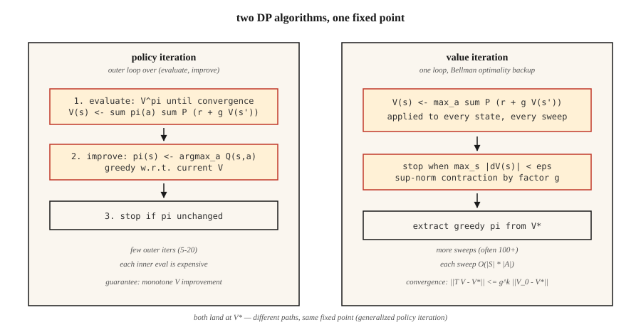

# 动态规划 —— 策略迭代与价值迭代

> 动态规划是开了挂的强化学习:转移函数和奖励函数你都已知,只需迭代贝尔曼方程,直到 `V` 或 `π` 不再动。它是所有基于采样的方法努力逼近的基准。

**类型:** 动手构建
**编程语言:** Python
**前置要求:** 第 9 阶段 · 01(MDP)
**预计耗时:** 约 75 分钟

## 问题

你手上是一个有已知模型的 MDP:对任意状态-动作对,都能查询 `P(s' | s, a)` 和 `R(s, a, s')`。库存经理知道需求分布,棋盘游戏的转移是确定性的,一个 gridworld 不过四行 Python。你有一个*模型*。

无模型 RL(Q-learning、PPO、REINFORCE)是为没有模型的情形发明的——只能从环境中采样。但当你确实有模型时,有更快、更好的方法:动态规划。Bellman 在 1957 年设计了它们,它们至今仍定义着"正确":当人们说"这个 MDP 的最优策略"时,指的就是 DP 会返回的那个策略。

2026 年你仍需要它,三个原因。第一,RL 研究里每个表格环境(GridWorld、FrozenLake、CliffWalking)都用 DP 解出黄金标准策略。第二,精确值能用来*调试*采样方法:如果 Q-learning 对 `V*(s_0)` 的估计与 DP 答案差 30%,那你的 Q-learning 有 bug。第三,现代离线 RL 与规划方法(MCTS、AlphaZero 的搜索、第 9 阶段 · 10 的基于模型 RL),全都在一个学到的或给定的模型上迭代贝尔曼备份。

## 概念



**两个算法,都是贝尔曼方程上的不动点迭代。**

**策略迭代。** 交替两个步骤,直到策略不再变化。

1. *评估:* 给定策略 `π`,反复应用 `V(s) ← Σ_a π(a|s) Σ_{s',r} P(s',r|s,a) [r + γ V(s')]`,直到 `V^π` 收敛。
2. *改进:* 给定 `V^π`,让 `π` 对 `V^π` 取贪心:`π(s) ← argmax_a Σ_{s',r} P(s',r|s,a) [r + γ V(s')]`。

收敛有保证,因为:(a) 每次改进要么保持 `π` 不变,要么让某个状态的 `V^π` 严格上升;(b) 确定性策略的空间是有限的。即使状态空间很大,通常 ~5–20 次外层迭代就收敛。

**价值迭代。** 把评估与改进合并成一次扫描,直接应用贝尔曼*最优*方程:

`V(s) ← max_a Σ_{s',r} P(s',r|s,a) [r + γ V(s')]`

重复到 `max_s |V_{new}(s) - V(s)| < ε`。最后取贪心动作即可提取策略。单次迭代严格更快——没有内层评估循环——但通常需要更多迭代才能收敛。

**广义策略迭代(GPI)。** 统一视角。价值函数与策略锁在一个双向改进循环里;任何驱动两者走向相互一致的方法(异步价值迭代、修正策略迭代、Q-learning、actor-critic、PPO)都是 GPI 的实例。

**为什么 `γ < 1` 要紧。** 贝尔曼算子在 sup 范数下是 `γ` 压缩映射:`||T V - T V'||_∞ ≤ γ ||V - V'||_∞`。压缩意味着唯一不动点和几何收敛。丢掉 `γ < 1`,这个保证就没了——你得靠有限视野或吸收性终止状态来兜底。

```figure
value-iteration-gamma
```

## 动手构建

### 第 1 步:构建 GridWorld 的 MDP 模型

用第 01 课那个 4×4 GridWorld,再加一个随机变体:以 `0.1` 的概率滑向随机的垂直方向。

```python
SLIP = 0.1

def transitions(state, action):
    if state == TERMINAL:
        return [(state, 0.0, 1.0)]
    outcomes = []
    for direction, prob in action_probs(action):
        outcomes.append((apply_move(state, direction), -1.0, prob))
    return outcomes
```

`transitions(s, a)` 返回 `(s', r, p)` 的列表。这就是整个模型。

### 第 2 步:策略评估

给定策略 `π(s) = {action: prob}`,迭代贝尔曼方程直到 `V` 不再动:

```python
def policy_evaluation(policy, gamma=0.99, tol=1e-6):
    V = {s: 0.0 for s in states()}
    while True:
        delta = 0.0
        for s in states():
            v = sum(pi_a * sum(p * (r + gamma * V[s_prime])
                              for s_prime, r, p in transitions(s, a))
                   for a, pi_a in policy(s).items())
            delta = max(delta, abs(v - V[s]))
            V[s] = v
        if delta < tol:
            return V
```

### 第 3 步:策略改进

用对 `V` 贪心的策略替换 `π`。若 `π` 没有变化,返回——已到最优。

```python
def policy_improvement(V, gamma=0.99):
    new_policy = {}
    for s in states():
        best_a = max(
            ACTIONS,
            key=lambda a: sum(p * (r + gamma * V[s_prime])
                              for s_prime, r, p in transitions(s, a)),
        )
        new_policy[s] = best_a
    return new_policy
```

### 第 4 步:把两者缝起来

```python
def policy_iteration(gamma=0.99):
    policy = {s: "up" for s in states()}   # arbitrary start
    for _ in range(100):
        V = policy_evaluation(lambda s: {policy[s]: 1.0}, gamma)
        new_policy = policy_improvement(V, gamma)
        if new_policy == policy:
            return V, policy
        policy = new_policy
```

4×4 上典型 4–6 次外层迭代收敛。输出 `V*(0,0) ≈ -6`,以及一个严格缩短步数的策略。

### 第 5 步:价值迭代(单循环版)

```python
def value_iteration(gamma=0.99, tol=1e-6):
    V = {s: 0.0 for s in states()}
    while True:
        delta = 0.0
        for s in states():
            v = max(sum(p * (r + gamma * V[s_prime])
                       for s_prime, r, p in transitions(s, a))
                   for a in ACTIONS)
            delta = max(delta, abs(v - V[s]))
            V[s] = v
        if delta < tol:
            break
    policy = policy_improvement(V, gamma)
    return V, policy
```

同一个不动点,代码更短。

## 常见坑

- **忘记处理终止状态。** 对吸收态也套贝尔曼,它还是会挑出一个"最佳动作"(虽然什么都不改变)。用 `if s == terminal: V[s] = 0` 守住。
- **sup 范数 vs L2 收敛。** 用 `max |V_new - V|`,不要用平均。理论保证在 sup 范数上。
- **原地更新 vs 同步更新。** 原地更新 `V[s]`(Gauss-Seidel 式)比另开一个 `V_new` 字典(Jacobi 式)收敛更快。生产代码用原地。
- **策略平局。** 两个动作 Q 值相等时,`argmax` 每次迭代的平局打破方式可能不同,导致"策略已稳定"检查来回震荡。用稳定的平局规则(固定顺序取第一个动作)。
- **状态空间爆炸。** DP 每次扫描是 `O(|S| · |A|)`,约 10⁷ 个状态以内可行。超过这个量级,得上函数逼近(第 9 阶段 · 05 起)。

## 投入使用

2026 年,DP 是正确性基准,也是规划器的内循环:

| 用途 | 方法 |
|----------|--------|
| 精确求解小型表格 MDP | 价值迭代(更简单)或策略迭代(外层步数更少) |
| 验证 Q-learning / PPO 实现 | 在玩具环境上与 DP 最优的 V* 对比 |
| 基于模型的 RL(第 9 阶段 · 10) | 在学到的转移模型上做贝尔曼备份 |
| AlphaZero / MuZero 中的规划 | 蒙特卡洛树搜索 = 异步贝尔曼备份 |
| 离线 RL(CQL、IQL) | 保守 Q 迭代——对 OOD 动作加惩罚的 DP |

每当有人说"最优价值函数",指的就是"DP 的不动点"。论文里看到 `V*` 或 `Q*`,脑子里浮现的就是这个循环。

## 交付

保存为 `outputs/skill-dp-solver.md`:

```markdown
---
name: dp-solver
description: Solve a small tabular MDP exactly via policy iteration or value iteration. Report convergence behavior.
version: 1.0.0
phase: 9
lesson: 2
tags: [rl, dynamic-programming, bellman]
---

Given an MDP with a known model, output:

1. Choice. Policy iteration vs value iteration. Reason tied to |S|, |A|, γ.
2. Initialization. V_0, starting policy. Convergence sensitivity.
3. Stopping. Sup-norm tolerance ε. Expected number of sweeps.
4. Verification. V*(s_0) computed exactly. Greedy policy extracted.
5. Use. How this baseline will be used to debug/evaluate sampling-based methods.

Refuse to run DP on state spaces > 10⁷. Refuse to claim convergence without a sup-norm check. Flag any γ ≥ 1 on an infinite-horizon task as a guarantee violation.
```

## 练习

1. **易。** 在 4×4 GridWorld 上分别用 `γ ∈ {0.9, 0.99}` 跑价值迭代。多少次扫描后 `max |ΔV| < 1e-6`?把 `V*` 打印成 4×4 网格。
2. **中。** 在*随机* GridWorld(滑动概率 `0.1`)上对比策略迭代与价值迭代。统计:扫描次数、墙钟时间、最终的 `V*(0,0)`。哪个迭代次数更少?哪个墙钟更快?
3. **难。** 实现修正策略迭代:评估步骤只跑 `k` 次扫描,不跑到收敛。画出 `k ∈ {1, 2, 5, 10, 50}` 时 `V*(0,0)` 的误差曲线。这条曲线告诉你评估与改进之间怎样的权衡?

## 关键术语

| 术语 | 人们常说的 | 实际含义 |
|------|-----------------|-----------------------|
| 策略迭代 | "DP 算法" | 交替进行评估(求 `V^π`)与改进(对 `V^π` 取贪心 `π`),直到策略不再变化 |
| 价值迭代 | "更快的 DP" | 一次扫描里做贝尔曼最优备份;以几何速度收敛到 `V*` |
| 贝尔曼算子 | "那个递归" | `(T V)(s) = max_a Σ P (r + γ V(s'))`;sup 范数下的 `γ` 压缩映射 |
| 压缩映射 | "DP 为什么收敛" | 任何满足 `\|\|T x - T y\|\| ≤ γ \|\|x - y\|\|` 的算子 `T` 都有唯一不动点 |
| GPI | "万物皆 DP" | 广义策略迭代:任何驱动 `V` 与 `π` 走向相互一致的方法 |
| 同步更新 | "Jacobi 式" | 一次扫描全程用旧 `V`;便于分析但更慢 |
| 原地更新 | "Gauss-Seidel 式" | 边更新边用新 `V`;实践中收敛更快 |

## 延伸阅读

- [Sutton & Barto(2018),第 4 章 —— 动态规划](http://incompleteideas.net/book/RLbook2020.pdf) —— 策略迭代与价值迭代的经典讲解。
- [Bertsekas(2019),《强化学习与最优控制》](http://www.athenasc.com/rlbook.html) —— 压缩映射论证的严谨处理。
- [Puterman(2005),《Markov Decision Processes》](https://onlinelibrary.wiley.com/doi/book/10.1002/9780470316887) —— 修正策略迭代及其收敛性分析。
- [Howard(1960),《Dynamic Programming and Markov Processes》](https://mitpress.mit.edu/9780262582300/dynamic-programming-and-markov-processes/) —— 策略迭代的原始论文。
- [Bertsekas & Tsitsiklis(1996),《Neuro-Dynamic Programming》](http://www.athenasc.com/ndpbook.html) —— 从 DP 通往近似 DP / 深度 RL 的桥梁,后续每一课都在用。
