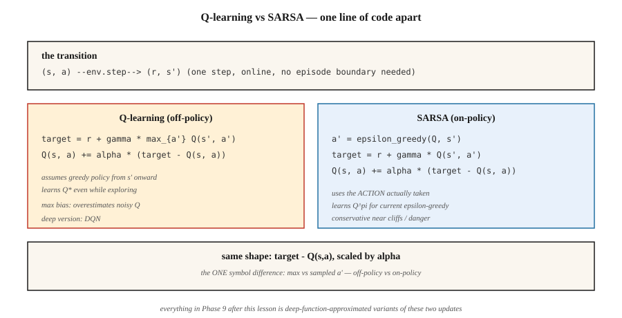

# 时序差分 —— Q-Learning 与 SARSA

> 蒙特卡洛要等到回合结束,TD 每走一步就更新——用下一个价值估计自举。Q-learning 离策略、乐观;SARSA 在策略、谨慎。两者都只有一行核心代码,也都垫在本阶段每个深度 RL 方法的底下。

**类型:** 动手构建
**编程语言:** Python
**前置要求:** 第 9 阶段 · 01(MDP)、第 9 阶段 · 02(动态规划)、第 9 阶段 · 03(蒙特卡洛)
**预计耗时:** 约 75 分钟

## 问题

蒙特卡洛能用,但它有两个昂贵的要求:回合必须终止,而且只有拿到最终回报才更新。如果你的回合有 1,000 步,MC 就等上 1,000 步才动一下。它高方差、低偏差,实践中慢。

动态规划是另一个极端——零方差的自举备份——但要求已知模型。

时序差分(TD)学习取两者中间:从单条转移 `(s, a, r, s')` 构造单步目标 `r + γ V(s')`,把 `V(s)` 往它那边推一推。不需要模型,不需要完整回合。右边用了近似的 `V` 所以带偏差,但方差比 MC 低得多,而且从第一步起就在线更新。

现代 RL——DQN、A2C、PPO、SAC——全都围绕这个支点转。第 9 阶段 的其余部分,不过是在你本课要写出的单步 TD 更新之上,叠加函数逼近和各种技巧。

## 概念



**V 的 TD(0) 更新:**

`V(s) ← V(s) + α [r + γ V(s') - V(s)]`

括号里的量就是 TD 误差 `δ = r + γ V(s') - V(s)`,它是 MC 中 `G_t - V(s_t)` 的在线版本。收敛要求 `α` 满足 Robbins-Monro 条件(`Σ α = ∞`,`Σ α² < ∞`),且所有状态被无限次访问。

**Q-learning。** 用于控制的离策略 TD 方法:

`Q(s, a) ← Q(s, a) + α [r + γ max_{a'} Q(s', a') - Q(s, a)]`

`max` 假设从 `s'` 起将遵循*贪心*策略,不管智能体实际选了什么动作。这个解耦让 Q-learning 在智能体用 ε-greedy 探索的同时学到 `Q*`。Mnih 等(2015)把它变成了 Atari 上的深度 Q-learning(第 05 课)。

**SARSA。** 在策略 TD 方法:

`Q(s, a) ← Q(s, a) + α [r + γ Q(s', a') - Q(s, a)]`

名字就是那个五元组 `(s, a, r, s', a')`。SARSA 用智能体*实际*采取的下一个动作 `a'`,而不是贪心的 `argmax`。它收敛到当前 ε-greedy 策略 `π` 的 `Q^π`;在 `ε → 0` 的极限下,这就是 `Q*`。

**悬崖行走上的差异。** 在经典的悬崖行走任务里(掉下悬崖奖励 -100),Q-learning 学会沿悬崖边缘的最优路径,但探索中偶尔会摔下去吃罚;SARSA 学会离悬崖一步之遥的更安全的路线,因为它把探索噪声计入了 Q 值。训练到位后,两者在 `ε → 0` 时都达到最优。但实践中这点很重要:如果部署时探索仍在发生,SARSA 的行为更保守。

**Expected SARSA。** 把 `Q(s', a')` 换成它在 `π` 下的期望:

`Q(s, a) ← Q(s, a) + α [r + γ Σ_{a'} π(a'|s') Q(s', a') - Q(s, a)]`

比 SARSA 方差更低(不用采样 `a'`),目标同在策略。现代教科书常拿它当默认。

**n 步 TD 与 TD(λ)。** 等 `n` 步再自举,就在 TD(0) 和 MC 之间插值:`n=1` 是 TD,`n=∞` 是 MC。TD(λ) 用几何权重 `(1-λ)λ^{n-1}` 对所有 `n` 求平均。深度 RL 大多用 3 到 20 之间的 `n`。

```figure
qlearning-gridworld
```

## 动手构建

### 第 1 步:在 ε-greedy 策略上跑 SARSA

```python
def sarsa(env, episodes, alpha=0.1, gamma=0.99, epsilon=0.1):
    Q = defaultdict(lambda: {a: 0.0 for a in ACTIONS})

    def choose(s):
        if random() < epsilon:
            return choice(ACTIONS)
        return max(Q[s], key=Q[s].get)

    for _ in range(episodes):
        s = env.reset()
        a = choose(s)
        while True:
            s_next, r, done = env.step(s, a)
            a_next = choose(s_next) if not done else None
            target = r + (gamma * Q[s_next][a_next] if not done else 0.0)
            Q[s][a] += alpha * (target - Q[s][a])
            if done:
                break
            s, a = s_next, a_next
    return Q
```

八行。与 Q-learning *唯一*的区别在目标那一行。

### 第 2 步:Q-learning

```python
def q_learning(env, episodes, alpha=0.1, gamma=0.99, epsilon=0.1):
    Q = defaultdict(lambda: {a: 0.0 for a in ACTIONS})
    for _ in range(episodes):
        s = env.reset()
        while True:
            a = choose(s, Q, epsilon)
            s_next, r, done = env.step(s, a)
            target = r + (gamma * max(Q[s_next].values()) if not done else 0.0)
            Q[s][a] += alpha * (target - Q[s][a])
            if done:
                break
            s = s_next
    return Q
```

`max` 把目标与行为解耦。这一个符号,就是在策略与离策略的全部差别。

### 第 3 步:学习曲线

跟踪每 100 回合的平均回报。在简单确定性 GridWorld 上 Q-learning 收敛更快,在悬崖行走上 SARSA 更保守。在 `code/main.py` 的 4×4 GridWorld 上,`α=0.1, ε=0.1` 时两者约 2,000 回合后都接近最优。

### 第 4 步:对照 DP 真值

跑价值迭代(第 02 课)得到 `Q*`,检查 `max_{s,a} |Q_learned(s,a) - Q*(s,a)|`。一个健康的表格 TD 智能体,在 4×4 GridWorld 上 10,000 回合后误差在 `~0.5` 以内。

## 常见坑

- **Q 初值很重要。** 乐观初始化(负奖励任务上 `Q = 0`)鼓励探索;悲观初始化可能让贪心策略永远困在原地。
- **α 日程。** 常数 `α` 适合非平稳问题;衰减的 `α_n = 1/n` 理论上收敛但实践中太慢——把 `α` 钉在 `[0.05, 0.3]`,盯学习曲线。
- **ε 日程。** 从高开始(`ε=1.0`),衰减到 `ε=0.05`。"GLIE"(无限探索下极限贪心)是收敛条件。
- **Q-learning 的 max 偏差。** `max` 算子在 `Q` 有噪声时向上偏,导致高估——Hasselt 的 Double Q-learning(第 05 课 DDQN 在用)用两张 Q 表修掉它。
- **回合不终止。** TD 不需要终止态也能学,但你要么限制步数,要么在触顶时处理好自举。标准做法:触顶视为非终止,继续自举。
- **状态哈希。** 状态是元组/张量时,用可哈希的键(元组而非列表;浮点数取整后的元组而非原始值)。

## 投入使用

2026 年的 TD 版图:

| 任务 | 方法 | 原因 |
|------|--------|--------|
| 小型表格环境 | Q-learning | 直接学最优策略 |
| 在策略、安全攸关 | SARSA / Expected SARSA | 探索期间行为保守 |
| 高维状态 | DQN(第 9 阶段 · 05) | 神经网络 Q 函数 + 回放缓冲 + 目标网络 |
| 连续动作 | SAC / TD3(第 9 阶段 · 07) | 在 Q 网络上做 TD 更新,策略网络输出动作 |
| LLM RL(基于奖励模型) | PPO / GRPO(第 9 阶段 · 08、12) | actor-critic,经 GAE 得 TD 式优势 |
| 离线 RL | CQL / IQL(第 9 阶段 · 08) | 带保守正则化的 Q-learning |

2026 年论文里你读到的"RL",九成是 Q-learning 或 SARSA 的某种变奏。先把表格更新练到指尖有感觉,再往深读。

## 交付

保存为 `outputs/skill-td-agent.md`:

```markdown
---
name: td-agent
description: Pick between Q-learning, SARSA, Expected SARSA for a tabular or small-feature RL task.
version: 1.0.0
phase: 9
lesson: 4
tags: [rl, td-learning, q-learning, sarsa]
---

Given a tabular or small-feature environment, output:

1. Algorithm. Q-learning / SARSA / Expected SARSA / n-step variant. One-sentence reason tied to on-policy vs off-policy and variance.
2. Hyperparameters. α, γ, ε, decay schedule.
3. Initialization. Q_0 value (optimistic vs zero) and justification.
4. Convergence diagnostic. Target learning curve, `|Q - Q*|` check if DP is possible.
5. Deployment caveat. How will exploration behave at inference? Is SARSA's conservatism needed?

Refuse to apply tabular TD to state spaces > 10⁶. Refuse to ship a Q-learning agent without a max-bias caveat. Flag any agent trained with ε held at 1.0 throughout (no exploitation phase).
```

## 练习

1. **易。** 在 4×4 GridWorld 上实现 Q-learning 和 SARSA。画 2,000 回合的学习曲线(每 100 回合的平均回报)。谁收敛更快?
2. **中。** 搭一个悬崖行走环境(4×12,最后一行是悬崖,奖励 -100 并回到起点)。对比 Q-learning 与 SARSA 的最终策略,截图两者走出的路径。哪条离悬崖更近?
3. **难。** 实现 Double Q-learning。在带噪奖励的 GridWorld(每步奖励加 σ=5 的高斯噪声)上,展示 Q-learning 对 `V*(0,0)` 的高估达到可感知的量级,而 Double Q-learning 没有。

## 关键术语

| 术语 | 人们常说的 | 实际含义 |
|------|-----------------|-----------------------|
| TD 误差 | "更新信号" | `δ = r + γ V(s') - V(s)`,自举残差 |
| TD(0) | "单步 TD" | 每条转移后就更新,只用下一状态的估计 |
| Q-learning | "离策略 RL 入门" | 对下一状态动作取 `max` 的 TD 更新;无论行为策略如何都学到 `Q*` |
| SARSA | "在策略 Q-learning" | 用实际下一动作的 TD 更新;学到当前 ε-greedy π 的 `Q^π` |
| Expected SARSA | "低方差 SARSA" | 把采样的 `a'` 换成它在 π 下的期望 |
| GLIE | "正确的探索日程" | 无限探索下极限贪心;Q-learning 收敛所需的条件 |
| 自举 | "在目标里用自己的估计" | TD 与 MC 的分水岭。带来偏差,但换来巨大的方差削减 |
| 最大化偏差 | "Q-learning 会高估" | 对有噪估计取 `max` 向上偏;Double Q-learning 修复 |

## 延伸阅读

- [Watkins & Dayan(1992),《Q-learning》](https://link.springer.com/article/10.1007/BF00992698) —— 原始论文与收敛证明。
- [Sutton & Barto(2018),第 6 章 —— 时序差分学习](http://incompleteideas.net/book/RLbook2020.pdf) —— TD(0)、SARSA、Q-learning、Expected SARSA。
- [Hasselt(2010),《Double Q-learning》](https://papers.nips.cc/paper_files/paper/2010/hash/091d584fced301b442654dd8c23b3fc9-Abstract.html) —— 最大化偏差的修复。
- [Seijen、Hasselt、Whiteson、Wiering(2009),《Expected SARSA 的理论与实证分析》](https://ieeexplore.ieee.org/document/4927542) —— Expected SARSA 的动机。
- [Rummery & Niranjan(1994),《用联结主义系统做在线 Q-learning》](https://www.researchgate.net/publication/2500611_On-Line_Q-Learning_Using_Connectionist_Systems) —— 提出 SARSA 的论文(当时叫"修改版联结主义 Q-learning")。
- [Sutton & Barto(2018),第 7 章 —— n 步自举](http://incompleteideas.net/book/RLbook2020.pdf) —— 把 TD(0) 推广到 TD(n),是从 Q-learning 到资格迹、再到 PPO 中 GAE 的路径。
