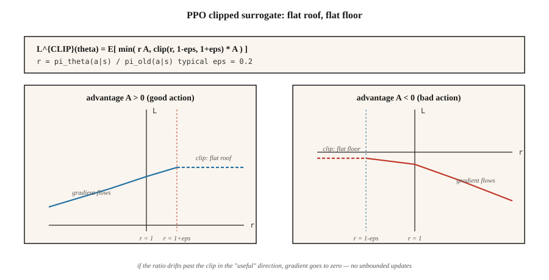

# 近端策略优化(PPO)

> A2C 每条展开用完一次更新就扔。PPO 给策略梯度包上一层截断重要性比率,让同一批数据能跑 10+ 轮更新而策略不炸。Schulman 等(2017)。2026 年仍是默认的策略梯度算法。

**类型:** 动手构建
**编程语言:** Python
**前置要求:** 第 9 阶段 · 06(REINFORCE)、第 9 阶段 · 07(Actor-Critic)
**预计耗时:** 约 75 分钟

## 问题

A2C(第 07 课)是在策略的:梯度 `E_{π_θ}[A · ∇ log π_θ]` 要求数据采自*当前*的 `π_θ`。做一步更新,`π_θ` 就变了——你刚用的数据立刻变成离策略,再用,梯度就有偏。

展开很昂贵。Atari 上,8 个环境 × 128 步 = 1024 条转移,十几秒环境时间。走一步梯度就扔掉,太浪费。

信任域策略优化(TRPO,Schulman 2015)是第一个修法:约束每次更新,让新旧策略的 KL 散度不超过 `δ`。理论上干净,但每次更新要解一次共轭梯度。2026 年没人跑 TRPO。

PPO(Schulman 等,2017)用一个简单的截断目标换掉硬信任域约束。多一行代码,每条展开跑十轮,没有共轭梯度,理论保证够用。九年过去,它仍是从 MuJoCo 到 RLHF 一切场景的默认策略梯度算法。

## 概念



**重要性比率。**

`r_t(θ) = π_θ(a_t | s_t) / π_{θ_old}(a_t | s_t)`

这是新策略相对采数据那个策略的似然比。`r_t = 1` 表示没变;`r_t = 2` 表示新策略选 `a_t` 的概率翻倍。

**截断代理目标。**

`L^{CLIP}(θ) = E_t [ min( r_t(θ) A_t, clip(r_t(θ), 1-ε, 1+ε) A_t ) ]`

两项的意义:

- 若优势 `A_t > 0` 且比率想涨过 `1 + ε`,截断把梯度削平——好动作的提升不许超过旧概率的 `+ε`。
- 若优势 `A_t < 0` 且比率想突破 `1 - ε`(即我们会让坏动作变得更可能,超过截断允许的降幅),截断封住梯度——坏动作的压低不许超过 `-ε`。

`min` 处理另一个方向:比率若朝*有利*方向移动,梯度照拿(在你不会受伤的一侧不截断)。

典型取 `ε = 0.2`。把目标画成 `r_t` 的函数:一条分段线性曲线,"好的一侧"是平顶,"坏的一侧"是平底。

**完整 PPO 损失。**

`L(θ, φ) = L^{CLIP}(θ) - c_v · (V_φ(s_t) - V_t^{target})² + c_e · H(π_θ(·|s_t))`

与 A2C 相同的 actor-critic 结构。三个系数,通常 `c_v = 0.5`、`c_e = 0.01`、`ε = 0.2`。

**训练循环。**

1. 在 `N` 个并行环境上各采 `T` 步,得 `N × T` 条转移。
2. 计算优势(GAE),冻结为常数。
3. 把 `π_{θ_old}` 快照为当前 `π_θ`。
4. 跑 `K` 轮,对每个 `(s, a, A, V_target, log π_old(a|s))` 小批量:
   - 计算 `r_t(θ) = exp(log π_θ(a|s) - log π_old(a|s))`。
   - 施加 `L^{CLIP}` + 价值损失 + 熵。
   - 梯度步。
5. 丢掉这条展开,回到第 1 步。

`K = 10`、小批量 64 是标准配置。PPO 很皮实:具体数字在 ±50% 内通常无所谓。

**KL 惩罚变体。** 原论文还提出了自适应 KL 惩罚的替代方案:`L = L^{PG} - β · KL(π_θ || π_old)`,`β` 根据观测 KL 自适应调整。截断版成了主流;KL 版在 RLHF 里活了下来——在那里,对参考策略的 KL 本来就是你永远要的约束。

```figure
ppo-clip
```

## 动手构建

### 第 1 步:展开时记录 `log π_old(a | s)`

```python
for step in range(T):
    probs = softmax(logits(theta, state_features(s)))
    a = sample(probs, rng)
    s_next, r, done = env.step(s, a)
    buffer.append({
        "s": s, "a": a, "r": r, "done": done,
        "v_old": value(w, state_features(s)),
        "log_pi_old": log(probs[a] + 1e-12),
    })
    s = s_next
```

快照在展开时拍一次,更新轮次期间不再变。

### 第 2 步:计算 GAE 优势(第 07 课)

与 A2C 相同。跨批次归一化。

### 第 3 步:截断代理更新

```python
for _ in range(K_EPOCHS):
    for mb in minibatches(buffer, size=64):
        for rec in mb:
            x = state_features(rec["s"])
            probs = softmax(logits(theta, x))
            logp = log(probs[rec["a"]] + 1e-12)
            ratio = exp(logp - rec["log_pi_old"])
            adv = rec["advantage"]
            surrogate = min(
                ratio * adv,
                clamp(ratio, 1 - EPS, 1 + EPS) * adv,
            )
            # backprop -surrogate, add value loss, subtract entropy
            grad_logpi = onehot(rec["a"]) - probs
            if (adv > 0 and ratio >= 1 + EPS) or (adv < 0 and ratio <= 1 - EPS):
                pg_grad = 0.0  # clipped
            else:
                pg_grad = ratio * adv
            for i in range(N_ACTIONS):
                for j in range(N_FEAT):
                    theta[i][j] += LR * pg_grad * grad_logpi[i] * x[j]
```

"被截断 → 零梯度"这个模式是 PPO 的心脏:新策略若已朝有利方向漂得太远,更新就停下。

### 第 4 步:价值与熵

给 critic 目标加标准 MSE,给 actor 加熵奖励,与 A2C 相同。

### 第 5 步:诊断指标

每次更新盯三个东西:

- **平均 KL** `E[log π_old - log π_θ]`。应保持在 `[0, 0.02]`。冲破 `0.1` 就减小 `K_EPOCHS` 或 `LR`。
- **截断比例** —— 比率落在 `[1-ε, 1+ε]` 之外的样本占比。应在 `~0.1-0.3`。接近 `0` 说明截断从未触发 → 调大 `LR` 或 `K_EPOCHS`;超过 `~0.5` 说明对这批展开过拟合 → 调小。
- **可解释方差** `1 - Var(V_target - V_pred) / Var(V_target)`。critic 质量指标,应随 critic 学习爬向 1。

## 常见坑

- **截断系数没调对。** `ε = 0.2` 是事实标准。`0.1` 让更新太怂;`0.3+` 招致不稳定。
- **轮次太多。** `K > 20` 经常失稳,因为策略漂得离 `π_old` 太远。限制轮次,网络越大越要限。
- **不做奖励归一化。** 大奖励尺度会吃掉截断区间。算优势前先归一化奖励(滑动标准差)。
- **忘记优势归一化。** 每批零均值/单位标准差是标准做法;跳过它,大多数基准上 PPO 就废了。
- **学习率不衰减。** PPO 受益于线性衰减到零的学习率。常数 LR 往往更差。
- **重要性比率算错。** 为数值稳定,永远用 `exp(log_new - log_old)`,不要 `new / old`。
- **梯度符号写反。** 最大化代理目标 = *最小化* `-L^{CLIP}`。符号写反是最常见的 PPO bug。

## 投入使用

2026 年,PPO 在多得惊人的领域里都是默认 RL 算法:

| 用途 | PPO 变体 |
|----------|-------------|
| MuJoCo / 机器人控制 | 高斯策略 PPO,GAE(0.95) |
| Atari / 离散游戏 | 类别策略 PPO,128 步滚动展开 |
| LLM 的 RLHF | 带对参考模型 KL 惩罚的 PPO,奖励由 RM 在回答末尾给出 |
| 大规模游戏智能体 | IMPALA + PPO(AlphaStar、OpenAI Five) |
| 推理型 LLM | GRPO(第 12 课)—— 无 critic 的 PPO 变体 |
| 只有偏好数据 | DPO —— PPO+KL 的闭式坍缩,无在线采样 |

PPO 的*损失形状*——截断代理 + 价值 + 熵——就是 DPO、GRPO 和几乎每条 RLHF 流水线的脚手架。

## 交付

保存为 `outputs/skill-ppo-trainer.md`:

```markdown
---
name: ppo-trainer
description: Produce a PPO training config and a diagnostic plan for a given environment.
version: 1.0.0
phase: 9
lesson: 8
tags: [rl, ppo, policy-gradient]
---

Given an environment and training budget, output:

1. Rollout size. `N` envs × `T` steps.
2. Update schedule. `K` epochs, minibatch size, LR schedule.
3. Surrogate params. `ε` (clip), `c_v`, `c_e`, advantage normalization on.
4. Advantage. GAE(`λ`) with explicit `γ` and `λ`.
5. Diagnostics plan. KL, clip fraction, explained variance thresholds with alerts.

Refuse `K > 30` or `ε > 0.3` (unsafe trust region). Refuse any PPO run without advantage normalization or KL/clip monitoring. Flag clip fraction sustained above 0.4 as drift.
```

## 练习

1. **易。** 在 4×4 GridWorld 上用 `ε=0.2, K=4` 跑 PPO。在相同环境步数下,与 A2C(每条展开一轮更新)对比样本效率。
2. **中。** 扫 `K ∈ {1, 4, 10, 30}`。画回报 vs 环境步数,并跟踪每次更新的平均 KL。这个任务上 K 到多少 KL 会爆?
3. **难。** 把截断代理换成自适应 KL 惩罚(`KL > 2·target` 时 `β` 翻倍,`KL < target/2` 时减半)。对比最终回报、稳定性,以及"无截断"这一特性。

## 关键术语

| 术语 | 人们常说的 | 实际含义 |
|------|-----------------|-----------------------|
| 重要性比率 | "r_t(θ)" | `π_θ(a\|s) / π_old(a\|s)`;偏离采数据策略的程度 |
| 截断代理 | "PPO 的主技巧" | `min(r·A, clip(r, 1-ε, 1+ε)·A)`;有利一侧越过截断后梯度为零 |
| 信任域 | "TRPO / PPO 的意图" | 限制每次更新的 KL,保证单调改进 |
| KL 惩罚 | "软信任域" | PPO 的另一种形态:`L - β · KL(π_θ \|\| π_old)`,自适应 `β` |
| 截断比例 | "截断触发的频率" | 诊断指标——应在 0.1-0.3,超出就是没调好 |
| 多轮训练 | "数据复用" | 每条展开跑 K 轮;用方差换样本效率 |
| 近似在策略 | "大体在策略" | PPO 名义上在策略,但 K>1 轮时安全地用了轻微离策略的数据 |
| PPO-KL | "另一种 PPO" | KL 惩罚变体;用于 RLHF——那里对参考策略的 KL 本来就是约束 |

## 延伸阅读

- [Schulman 等(2017),《近端策略优化算法》](https://arxiv.org/abs/1707.06347) —— 原始论文。
- [Schulman 等(2015),《信任域策略优化》](https://arxiv.org/abs/1502.05477) —— TRPO,PPO 的前身。
- [Andrychowicz 等(2021),《在策略 RL 里什么最重要?一项大规模实证研究》](https://arxiv.org/abs/2006.05990) —— 每个 PPO 超参数都做了消融。
- [Ouyang 等(2022),《用人类反馈训练语言模型遵循指令》](https://arxiv.org/abs/2203.02155) —— InstructGPT;RLHF 中的 PPO 配方。
- [OpenAI Spinning Up —— PPO](https://spinningup.openai.com/en/latest/algorithms/ppo.html) —— 干净的现代讲解,附 PyTorch。
- [CleanRL 的 PPO 实现](https://github.com/vwxyzjn/cleanrl) —— 许多论文用的单文件参考实现。
- [Hugging Face TRL —— PPOTrainer](https://huggingface.co/docs/trl/main/en/ppo_trainer) —— 语言模型上 PPO 的生产配方;与第 09 课(RLHF)对照阅读。
- [Engstrom 等(2020),《深度策略梯度中实现很重要》](https://arxiv.org/abs/2005.12729) —— "37 个代码级优化"论文;哪些 PPO 技巧承重、哪些是 folklore。
