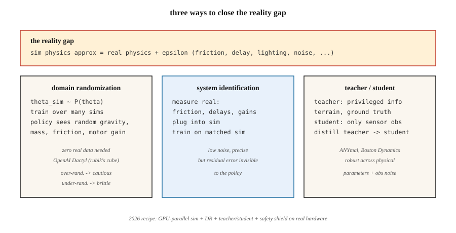

# 仿真到真实的迁移(Sim-to-Real)

> 在模拟器里训练、到硬件上就废的策略,是一个把模拟器背下来的策略。域随机化、域自适应和系统辨识,是让学出来的控制器跨越现实鸿沟的三件工具。

**类型:** 学习
**编程语言:** Python
**前置要求:** 第 9 阶段 · 08(PPO)、第 2 阶段 · 10(偏差/方差)
**预计耗时:** 约 45 分钟

## 问题

在真实机器人上训练,慢、危险、贵。双足机器人学走路要上百万个训练回合;真双足摔一次,硬件就坏一次。仿真给你无限次重置、确定性可复现、并行环境,而且摔不坏东西。

但模拟器是错的。轴承的摩擦比 MuJoCo 建模的大;相机有模拟器没算的镜头畸变;电机有延迟、齿隙和饱和,99% 的仿真模型都跳过了;风、灰尘、变化的光照,会毁掉一个在无菌渲染里训出来的策略。**现实鸿沟**(reality gap)——仿真分布与真实分布之间的系统性差异——是机器人 RL 落地的核心问题。

你需要一个*对 sim-to-real 分布漂移鲁棒*的策略。历史上三条路:随机化模拟器(域随机化)、用少量真实数据适配策略(域自适应/微调)、或者辨识真实系统的参数并对齐(系统辨识)。2026 年的主流配方,是把三者与大规模并行仿真(Isaac Sim、Isaac Lab、GPU 上的 Mujoco MJX)组合起来。

## 概念



**域随机化(DR)。** Tobin 等 2017,Peng 等 2018。训练时,把真实机器人上可能不同的每个仿真参数都随机化:质量、摩擦系数、电机 PD 增益、传感器噪声、相机位置、光照、纹理、接触模型。策略学到的是"今天我在哪个仿真里"的条件分布,从而在整个随机化跨度上泛化。真实机器人落在训练包络内,策略就能用。

- **优点:** 不需要真实数据。一套配方,多种机器人。
- **缺点:** 过度随机化会训出一个"万能"但过分谨慎的策略。噪声太多 ≈ 正则化过量。

**系统辨识(SI)。** 训练前,用真实世界数据拟合仿真参数。能量出真实机器人的关节摩擦,就把它填进仿真,再训一个按这些值预期的策略。需要接触真实系统,但能直接缩小现实鸿沟。

- **优点:** 训练目标精确、噪声低。
- **缺点:** 残余模型误差对策略不可见;没被辨识出的小效应(如电机死区)仍会让部署翻车。

**域自适应。** 仿真里训练,用少量真实数据微调。两种口味:

- **Real2Sim2Real:** 用真实展开学一个残差仿真器 `f(s, a, z) - f_sim(s, a)`,在校正后的仿真里训练。不用多少真实数据就能闭合鸿沟。
- **观测自适应:** 训一个策略,通过学习型特征提取器(如 GAN 像素到像素)把真实观测映射成"仿真风格"的观测。控制器留在仿真里。

**特权学习 / 师生蒸馏。** Miki 等 2022(ANYmal 四足)。在仿真中训一个能接触特权信息(真实摩擦、地形高度、IMU 漂移)的*教师*,蒸馏出一个只看真实传感器观测的*学生*。学生学会从历史中推断特权特征,对物理参数变化鲁棒。

**大规模并行仿真。** 2024–2026。Isaac Lab、Mujoco MJX、Brax 都能在单块 GPU 上跑数千个并行机器人。4,096 个并行双足上跑 PPO,几小时采集数年的经验。训练分布越宽,"现实鸿沟"越窄;当这 4,096 个环境各自带不同随机参数时,DR 几乎免费。

**2026 年真实世界的配方(四足行走为例):**

1. 大规模并行仿真,随机化重力、摩擦、电机增益、负载。
2. 用特权信息(地形图、机身速度真值)训教师策略。
3. 只用本体感知(腿部关节编码器)从教师蒸馏学生策略。
4. 可选:在真实 IMU 上用自编码器做观测自适应。
5. 部署。在 10+ 种环境零样本可用。若失败,用带安全约束的 PPO 做几分钟真实世界微调。

```figure
f3-reality-gap
```

## 动手构建

本课代码在一个*带噪*转移的 GridWorld 上演示域随机化:训练时策略经历随机化的滑动概率("仿真"),评估时用一个训练中从未见过的滑动水平("真实")。这个形状与 MuJoCo 到硬件的迁移直接对应。

### 第 1 步:参数化仿真

```python
def step(state, action, slip):
    if rng.random() < slip:
        action = random_perpendicular(action)
    ...
```

`slip` 是模拟器暴露的参数。在真实机器人上,它可以是摩擦、质量、电机增益——任何在仿真与真实之间漂移的东西。

### 第 2 步:带 DR 训练

每个回合开始时采样 `slip ~ Uniform[0.0, 0.4]`。跑 PPO / Q-learning / 什么都行,跑很多回合。

### 第 3 步:在"真实"滑动上零样本评估

在 `slip ∈ {0.0, 0.1, 0.2, 0.3, 0.5, 0.7}` 上评估。前四个在训练支撑内,`0.5` 和 `0.7` 在支撑外。DR 训出的策略应在支撑内保持近最优、在支撑外优雅退化;固定 slip 训出的策略,一离开它的训练 slip 就会脆断。

### 第 4 步:与窄分布训练对比

再训一个只用 `slip = 0.0` 的策略,做同样的 slip 扫描。你会看到:真实 slip 一超过 0,回报就灾难性下跌。

## 常见坑

- **随机化过多。** 在 `slip ∈ [0, 0.9]` 上训练,策略会风险厌恶到从不尝试最优路径。对齐*预期的*真实分布,而不是"什么都可能发生"。
- **随机化过少。** 只在薄薄一条上训练,策略完全无法泛化。用自适应课程(自动域随机化),随策略变好逐渐加宽分布。
- **参数空间辨识错了。** 随机化错了对象(真实鸿沟在电机延迟,你却在随机化相机色调),DR 帮不上忙。先给真实机器人做画像。
- **特权信息泄漏。** 教师做动作用的是全局状态而非观测,学生就可能永远追不上。确保教师策略在学生给定观测历史下是可实现的。
- **sim-to-sim 迁移失败。** 策略连一个更难的仿真变体都扛不住,就更扛不住真实世界。部署前永远先在留出的仿真变体上测。
- **没有真实世界安全包络。** 仿真里能用、"真实里也能用"但缺少底层安全盾的策略,照样能摔坏硬件。在非学习控制器里加速率限制、力矩限制、关节限位。

## 投入使用

2026 年的 sim-to-real 技术栈:

| 领域 | 技术栈 |
|--------|-------|
| 腿式行走(ANYmal、Spot、人形) | Isaac Lab + DR + 特权教师/学生 |
| 操作(灵巧手、抓取放置) | Isaac Lab + DR + 视觉用 DR-GAN |
| 自动驾驶 | CARLA / NVIDIA DRIVE Sim + DR + 真实微调 |
| 无人机竞速 | RotorS / Flightmare + DR + 在线自适应 |
| 手指/手内操作 | OpenAI Dactyl(空前规模的 DR) |
| 工业机械臂 | MuJoCo-Warp + SI + 少量真实微调 |

无论控制规模大小,工作流程一致:尽量把仿真拟合到位,拟合不了的随机化,训巨型策略,蒸馏,带安全盾部署。

## 交付

保存为 `outputs/skill-sim2real-planner.md`:

```markdown
---
name: sim2real-planner
description: Plan a sim-to-real transfer pipeline for a given robot + task, covering DR, SI, and safety.
version: 1.0.0
phase: 9
lesson: 11
tags: [rl, sim2real, robotics, domain-randomization]
---

Given a robot platform, a task, and access to real hardware time, output:

1. Reality gap inventory. Suspected sources ranked by expected impact (contact, sensing, actuation delay, vision).
2. DR parameters. Exact list, ranges, distribution. Justify each range against real measurements.
3. SI steps. Which parameters to measure; measurement method.
4. Teacher/student split. What privileged info the teacher uses; what obs the student uses.
5. Safety envelope. Low-level limits, emergency stops, backup controller.

Refuse to deploy without (a) a zero-shot sim-variant test, (b) a safety shield, (c) a rollback plan. Flag any DR range wider than 3× measured real variability as likely over-randomized.
```

## 练习

1. **易。** 在固定 slip 的 GridWorld(slip=0.0)上训练 Q-learning 智能体。在 slip ∈ {0.0, 0.1, 0.3, 0.5} 上评估,画回报 vs slip 曲线。
2. **中。** 训练一个采样 `slip ~ Uniform[0, 0.3]` 的 DR Q-learning 智能体,做同样的扫描。在 slip=0.5(分布外)处,DR 带来了多少收益?
3. **难。** 实现一个课程:从 slip=0.0 开始,每当策略达到最优的 90% 就加宽 DR 范围。对比到达 slip=0.3 零样本所需的总环境步数,与固定 DR 基线。

## 关键术语

| 术语 | 人们常说的 | 实际含义 |
|------|-----------------|-----------------------|
| 现实鸿沟 | "仿真与真实的差异" | 训练与部署之间物理/感知的分布漂移 |
| 域随机化(DR) | "在一堆随机仿真里训练" | 训练时随机化仿真参数,让策略泛化 |
| 系统辨识(SI) | "量真实的,填进仿真" | 估计真实物理参数,让仿真对齐 |
| 域自适应 | "用真实数据微调" | 仿真训练后做小规模真实微调;可适配观测或动力学 |
| 特权信息 | "教师用的真值" | 只有仿真才有的信息;学生必须从观测历史中推断 |
| 教师/学生 | "把特权蒸成可观" | 教师带捷径训练;学生学会在没有捷径时模仿 |
| ADR | "自动域随机化" | 随策略变好而加宽 DR 范围的课程 |
| Real2Sim | "用真实数据闭合鸿沟" | 学一个残差,让仿真模仿真实展开 |

## 延伸阅读

- [Tobin 等(2017),《域随机化:把深度神经网络从仿真迁到真实世界》](https://arxiv.org/abs/1703.06907) —— DR 原始论文(机器人视觉)。
- [Peng 等(2018),《动力学随机化的机器人控制 Sim-to-Real 迁移》](https://arxiv.org/abs/1710.06537) —— 动力学 DR,四足行走。
- [OpenAI 等(2019),《用机器人手解魔方》](https://arxiv.org/abs/1910.07113) —— Dactyl,规模化的 ADR。
- [Miki 等(2022),《学习野外鲁棒的感知型四足行走》](https://www.science.org/doi/10.1126/scirobotics.abk2822) —— ANYmal 的师生方法。
- [Makoviychuk 等(2021),《Isaac Gym:面向机器人学习的高性能 GPU 物理仿真》](https://arxiv.org/abs/2108.10470) —— 驱动 2025–2026 年部署的大规模并行仿真器。
- [Akkaya 等(2019),《自动域随机化》](https://arxiv.org/abs/1910.07113) —— ADR 课程方法。
- [Sutton & Barto(2018),第 8 章 —— 表格方法的规划与学习](http://incompleteideas.net/book/RLbook2020.pdf) —— Dyna 框架(用模型做规划 + 展开),现代 sim-to-real 流水线的底层思想。
- [Zhao、Queralta 与 Westerlund(2020),《机器人深度强化学习中的 Sim-to-Real 迁移:综述》](https://arxiv.org/abs/2009.13303) —— sim-to-real 方法的分类学与基准结果。
