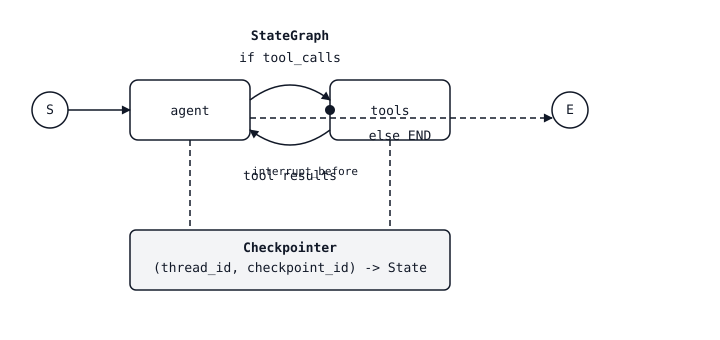

# 智能体状态机——图、节点、检查点

> 手写的 ReAct 循环就是一个 `while True`。同一个循环写成显式的图,就变成了可以检查点、可中断、可分支、可时间旅行的东西。智能体没变,变的是套在它外面的骨架。

**类型:** 动手构建
**编程语言:** Python
**前置要求:** 第 11 阶段 · 09(函数调用),第 11 阶段 · 14(Model Context Protocol)
**预计耗时:** 约 75 分钟

## 问题

你交付了一个函数调用智能体。跑了三轮好好的,然后出事了:模型试的工具返回 500;用户在任务中途改主意;或者智能体决定给一笔订单退款,却没有人类签字。那个 `while True:` 循环没有任何钩子:你不能暂停它,不能回退它,也不能分支出"如果模型当时选了另一个工具会怎样"。一旦把它交付到 demo 之外,智能体就变成一个黑盒——要么成了,要么没成,仅此而已。

下一步在你看见之后就显而易见了:智能体本来就是一台状态机——系统提示 + 消息历史 + 待处理的工具调用 + 下一步动作。把这台状态机显式化:用节点表示"模型思考""工具运行""人类批准",用边表示它们之间的条件转移。图一旦显式,骨架就免费得到四样东西:检查点(在步骤之间保存状态)、中断(为人类暂停)、流式(流式输出 token 和中间事件)、时间旅行(回退到之前的状态,试一条不同的分支)。

这个抽象的参考实现是 LangGraph。它不是 LangChain 意义上的智能体框架("给你一个 AgentExecutor,祝好运"),而是一个图运行时:一等公民的状态、一等公民的持久化、一等公民的中断。智能体循环是你画出来的,不是手写出来的。

## 概念



一个 `StateGraph` 有三样东西。

1. **状态(State)。** 一个流经全图的类型化字典(TypedDict 或 Pydantic 模型)。每个节点收到完整状态,返回部分更新,LangGraph 按字段用 *reducer* 合并——该累加的列表用 `operator.add`,其余默认覆盖。
2. **节点(Nodes)。** 形如 `state -> partial_state` 的 Python 函数,每个是一个离散的步骤:"调用模型""运行工具""做摘要"。
3. **边(Edges)。** 节点之间的转移。静态边去固定的地方;条件边接收一个路由函数 `state -> next_node_name`,让图能按模型输出分支。

编译图:绑定拓扑、挂上检查点器(可选,但生产必需),得到一个可运行对象。用初始状态和一个 `thread_id` 调用它。执行的每一步都以 `(thread_id, checkpoint_id)` 为键持久化一个检查点。

### 四项超能力

**检查点(Checkpointing)。** 每次节点转移都把新状态写入存储(测试用内存,生产用 Postgres/Redis/SQLite)。用同一个 `thread_id` 再次调用图即可恢复——图从暂停处接着走。

**中断(Interrupts)。** 给节点标 `interrupt_before=["human_review"]`,执行会在该节点运行前停下,状态已持久化。你的 API 回复用户"等待批准";之后带着 `Command(resume=...)` 请求同一个 `thread_id`,执行恢复。

**流式(Streaming)。** `graph.stream(state, mode="updates")` 在状态增量发生时产出它们;`mode="messages"` 流式输出模型节点内部的 LLM token;`mode="values"` 产出完整快照。挑哪一种呈现在你的 UI 上。

**时间旅行(Time-travel)。** `graph.get_state_history(thread_id)` 返回完整的检查点日志。把任意之前的 `checkpoint_id` 传给 `graph.invoke`,就从那个点分叉。调试利器("如果模型当时选了工具 B 会怎样?"),也能用来回放生产轨迹做回归测试。

### Reducer 才是要点

每个状态字段都有一个 reducer。大多数默认值没问题——新值覆盖旧值。但消息列表需要 `operator.add`,让新消息追加而不是替换。并行边的更新也通过 reducer 合并:如果两个节点都更新 `messages`,而你忘了写 `Annotated[list, add_messages]`,第二个会静默胜出,你会丢掉半轮对话。reducer 是这个库里唯一微妙的东西;搞对它,其余部分自然组合。

### 四个节点的 ReAct 图

一个生产 ReAct 智能体就是四个节点、两条边:

1. `agent`——用当前消息历史调用 LLM,返回助手消息(可能含 tool_calls)。
2. `tools`——执行最近一条助手消息里的 tool_calls,把工具结果追加为 tool 消息。
3. 一条从 `agent` 出发的条件边:最后一条消息有 tool_calls 就路由到 `tools`,否则到 `END`。
4. 一条从 `tools` 回到 `agent` 的静态边。

就这么多。完整的 ReAct 循环(思考 → 行动 → 观察 → 思考 → ……),带检查点、中断和流式,大约 40 行代码。

### StateGraph 与 Send(扇出)

`Send(node_name, state)` 让节点派发并行子图。例子:智能体决定同时查三个检索器——每个 `Send` 派生一次目标节点的并行执行,它们的输出经状态 reducer 合并。这就是 LangGraph 不用线程原语表达 orchestrator-workers 模式的方式。

### 子图

编译好的图可以作为另一个图的节点:外层图看到一个单节点,内层图有自己的状态和自己的检查点。团队构建 supervisor-worker 智能体靠的就是这个:supervisor 图把用户意图路由给各领域的 worker 子图。

```figure
l5-state-graph-ledger
```

## 动手构建

### 第 1 步:状态与节点

```python
from typing import Annotated, TypedDict
from langchain_core.messages import AnyMessage, HumanMessage, AIMessage
from langgraph.graph import StateGraph, END
from langgraph.graph.message import add_messages
from langgraph.prebuilt import ToolNode
from langgraph.checkpoint.memory import MemorySaver

class State(TypedDict):
    messages: Annotated[list[AnyMessage], add_messages]

def agent_node(state: State) -> dict:
    response = llm.invoke(state["messages"])
    return {"messages": [response]}

def should_continue(state: State) -> str:
    last = state["messages"][-1]
    return "tools" if getattr(last, "tool_calls", None) else END

tool_node = ToolNode(tools=[search_web, read_file])

graph = StateGraph(State)
graph.add_node("agent", agent_node)
graph.add_node("tools", tool_node)
graph.set_entry_point("agent")
graph.add_conditional_edges("agent", should_continue, {"tools": "tools", END: END})
graph.add_edge("tools", "agent")

app = graph.compile(checkpointer=MemorySaver())
```

`add_messages` 是让消息列表累加而非覆盖的 reducer。忘了它,是最常见的 LangGraph bug。

### 第 2 步:带 thread 运行

```python
config = {"configurable": {"thread_id": "user-42"}}
for event in app.stream(
    {"messages": [HumanMessage("find the Anthropic headquarters address")]},
    config,
    stream_mode="updates",
):
    print(event)
```

每个 update 是一个 `{node_name: state_delta}` 字典。你的前端可以把它们流到 UI,让用户看到"智能体思考中……调用 search_web……拿到结果……回答中"。

### 第 3 步:加人在环路中断

标记一个节点,让执行在它运行前暂停。

```python
app = graph.compile(
    checkpointer=MemorySaver(),
    interrupt_before=["tools"],  # pause before every tool call
)

state = app.invoke({"messages": [HumanMessage("delete the production database")]}, config)
# state["__interrupt__"] is set. Inspect proposed tool calls.
# If approved:
from langgraph.types import Command
app.invoke(Command(resume=True), config)
# If denied: write a rejection message and resume
app.update_state(config, {"messages": [AIMessage("Blocked by human reviewer.")]})
```

状态、检查点和 thread 在中断期间全部持久化。除了执行期间,没有任何东西只活在内存里。

### 第 4 步:调试用的时间旅行

```python
history = list(app.get_state_history(config))
for snapshot in history:
    print(snapshot.values["messages"][-1].content[:80], snapshot.config)

# Fork from a prior checkpoint
target = history[3].config  # three steps back
for event in app.stream(None, target, stream_mode="values"):
    pass  # replay from that point forward
```

输入传 `None`,就从给定检查点重放;传入一个值,会先把它作为更新追加到该检查点的状态,再恢复执行。不重跑整段对话就能复现一次糟糕的智能体运行,靠的就是它。

### 第 5 步:为生产换检查点器

```python
from langgraph.checkpoint.postgres import PostgresSaver

with PostgresSaver.from_conn_string("postgresql://...") as checkpointer:
    checkpointer.setup()
    app = graph.compile(checkpointer=checkpointer)
```

SQLite、Redis、Postgres 都有现成实现。`MemorySaver` 只用于测试——任何要跨重启持久化的东西,都得上真存储。

## 技能

> 把智能体构建成图,而不是 `while True` 循环。

动手用 LangGraph 之前,先做 60 秒设计:

1. **给节点命名。** 每个离散的决策或有副作用的动作都是一个节点:"智能体思考""工具运行""审核者批准""响应流式"。列不出来,说明任务还不是智能体形状的。
2. **声明状态。** 最小 TypedDict,每个列表字段配 reducer。别把一切塞进 `messages`——任务专属字段(进行中的 `plan`、`budget` 计数器、`retrieved_docs` 列表)提到顶层。
3. **画出边。** 除非下一步取决于模型输出,否则用静态边。每条条件边需要一个带命名分支的路由函数。
4. **先定检查点器。** 测试用 `MemorySaver`,其余一律 Postgres/Redis/SQLite。没有检查点器就别交付——没它就没有恢复、没有中断、没有时间旅行。
5. **中断放在工具运行之前,而不是之后。** 批准挂在进入有副作用节点的边上,这样你能在造成伤害前取消;校验挂在离开模型的边上,这样能廉价地拒绝坏调用。
6. **默认开流式。** UI 用 `mode="updates"`,模型节点内的 token 级流式用 `mode="messages"`,评估时的完整快照用 `mode="values"`。

拒绝交付没有检查点器的 LangGraph 智能体;拒绝交付在副作用*之后*才中断的智能体;拒绝交付 `messages` 字段不配 `add_messages` reducer 的智能体。

## 练习

1. **简单。** 用计算器工具和网页搜索工具实现上面的四节点 ReAct 图。验证两轮对话时,`list(app.get_state_history(config))` 至少返回四个检查点。
2. **中等。** 加一个 `planner` 节点:在 `agent` 之前运行,把结构化的 `plan: list[str]` 写入状态,让 `agent` 把计划步骤逐项标记完成。写一个测试:如果 `plan` 在检查点恢复后丢失(reducer 配错),就让测试失败。
3. **困难。** 构建一个 supervisor 图,用 `Send` 在三个子图(`researcher`、`writer`、`reviewer`)之间路由。每个子图有自己的状态和检查点器;在外层图加 `interrupt_before=["writer"]`,让人类能批准研究简报。确认从之前的检查点时间旅行时,只重跑分叉的那一支。

## 关键术语

| 术语 | 别人的说法 | 实际含义 |
|------|-----------------|-----------------------|
| StateGraph | "LangGraph 的图" | 编译之前,你往里面加节点和边的构建器对象 |
| Reducer | "字段怎么合并" | 节点返回某字段的更新时应用的 `(old, new) -> merged` 函数;默认覆盖,`add_messages` 追加 |
| Thread | "一个会话 ID" | 为一次会话的所有检查点划定作用域的 `thread_id` 字符串 |
| 检查点(Checkpoint) | "暂停的状态" | 节点转移后持久化的完整图状态快照,以 `(thread_id, checkpoint_id)` 为键 |
| 中断(Interrupt) | "为人类暂停" | `interrupt_before` / `interrupt_after` 在节点边界停止执行;用 `Command(resume=...)` 恢复 |
| 时间旅行(Time-travel) | "从之前那步分叉" | `graph.invoke(None, config_with_old_checkpoint_id)` 从那个检查点向前重放 |
| Send | "并行子图派发" | 节点可返回的构造器,派生目标节点的 N 次并行执行 |
| 子图(Subgraph) | "把编译好的图当节点" | 作为另一个图的节点使用的编译后 StateGraph,保留自己的状态作用域 |

## 延伸阅读

- [LangGraph documentation](https://langchain-ai.github.io/langgraph/)——StateGraph、reducer、检查点器与中断的 经典 参考
- [LangGraph concepts: state, reducers, checkpointers](https://langchain-ai.github.io/langgraph/concepts/low_level/)——本课使用的心智模型,来自官方源头
- [LangGraph Persistence and Checkpoints](https://langchain-ai.github.io/langgraph/concepts/persistence/)——Postgres/SQLite/Redis 存储、检查点命名空间与 thread ID 的细节
- [LangGraph Human-in-the-loop](https://langchain-ai.github.io/langgraph/concepts/human_in_the_loop/)——`interrupt_before`、`interrupt_after`、`Command(resume=...)` 与编辑状态模式
- [Yao et al., "ReAct: Synergizing Reasoning and Acting in Language Models" (ICLR 2023)](https://arxiv.org/abs/2210.03629)——每个 LangGraph 智能体都在实现的那个模式;读它了解推理轨迹的理据
- [Anthropic — Building effective agents (Dec 2024)](https://www.anthropic.com/research/building-effective-agents)——该在什么时候选哪种图形状(链、路由、orchestrator-workers、evaluator-optimizer)
- 第 11 阶段 · 09(函数调用)——每个 LangGraph 智能体节点都在复用的工具调用原语
- 第 11 阶段 · 14(Model Context Protocol)——经 MCP 适配器插进 LangGraph `ToolNode` 的外部工具发现
- 第 11 阶段 · 17(智能体框架的权衡)——何时选 LangGraph 而不是 CrewAI、AutoGen 或 Agno
