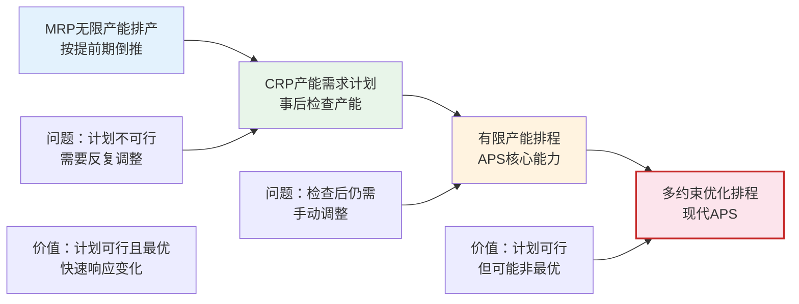
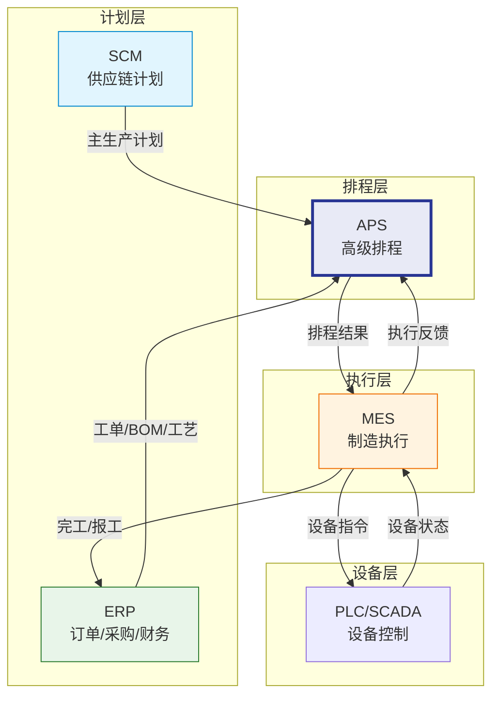

# APS是什么

## APS的定义

APS（Advanced Planning and Scheduling，高级计划与排程）是在有限产能约束条件下，通过优化算法生成可执行生产计划的系统。APS的核心价值在于回答"何时在哪个资源上生产什么"这个制造企业最核心的调度问题。

APS与传统的无限产能排产（如ERP的MRP）有着本质区别：传统MRP假设产能无限，先计算需求再检查产能，往往生成不可行的计划；而APS在排产时就考虑所有约束条件，确保生成的计划是可执行的。

## APS与ERP排产的差异

| 维度 | ERP排产（MRP） | APS高级排程 |
|------|-----------------|-------------|
| 产能假设 | 无限产能 | 有限产能约束 |
| 排产逻辑 | 基于提前期倒推 | 基于资源可用性正向排产 |
| 约束考虑 | 仅考虑物料约束 | 同时考虑物料、产能、模具、人员等约束 |
| 排产结果 | 可能不可行（产能不足） | 保证可行（约束内最优） |
| 重排响应 | 手动触发，耗时 | 实时/近实时自动重排 |
| 可视化 | 报表为主 | 甘特图交互 |
| What-If | 不支持 | 支持多场景模拟对比 |
| 优化目标 | 无明确优化目标 | 多目标优化（交期/利用率/换型） |

### 从MRP到APS的演进

## APS的分类

按计划层级和覆盖范围，APS可分为两大类：

### 供应链级APS

供应链级APS关注跨工厂、跨地域的供应链计划优化，通常作为SCM系统的一部分：

- **战略层**：供应链网络设计、产能规划
- **战术层**：S&OP、主生产计划、分销计划
- **代表产品**：SAP IBP、Kinaxis RapidResponse

### 车间级APS

车间级APS关注单个工厂或车间内的详细排程，是传统意义上的APS：

- **操作层**：工单排程、资源分配、顺序优化
- **实时层**：动态重排、异常响应
- **代表产品**：Opcenter APS、PlanetTogether

| 维度 | 供应链级APS | 车间级APS |
|------|------------|-----------|
| 时间范围 | 月/周 | 日/小时 |
| 粒度 | 产品族/工厂 | 工序/机器 |
| 约束 | 产能、物料、运输 | 机器、模具、人员、换型 |
| 优化目标 | 供需平衡、库存优化 | 交期满足、设备利用率 |
| 用户 | 计划员、管理层 | 调度员、车间主管 |

## APS核心价值

APS的核心价值可以概括为四个方面：

### 可行计划

传统MRP生成的计划往往在执行时发现产能不足，需要反复调整。APS在计划阶段就考虑所有约束，确保生成的计划是可执行的。

- 避免产能冲突（同一资源同一时间不会分配两个工序）
- 避免物料短缺（考虑物料可用性约束）
- 避免违反规则（考虑日历、班次、优先级等约束）

### 优化排产

APS不仅生成可行的计划，更通过优化算法寻找最优的排产方案：

- **交期优化**：最小化延迟订单数量和延迟时间
- **利用率优化**：最大化设备利用率，减少空闲时间
- **换型优化**：最小化换型次数和换型时间
- **库存优化**：最小化在制品库存

### 快速响应

当生产环境发生变化时，APS能够在秒级到分钟级内重新计算排程：

- 急单插入后的快速重排
- 设备故障后的应急调度
- 物料延迟后的计划调整
- 工艺异常后的替代方案

### 决策支持

APS提供丰富的可视化和分析工具，支持计划员的决策：

- 甘特图可视化排程结果
- 多方案对比分析
- KPI指标监控
- What-If模拟分析

## APS与MES/ERP协同定位图

APS在制造系统架构中的定位：

- **上游**：接收ERP的工单、BOM和工艺路线数据，接收SCM的主生产计划
- **下游**：向MES输出排程结果（工序级排产计划）
- **反馈**：接收MES的执行反馈（完工、异常），触发重排

## 商业产品对比

| 维度 | Opcenter APS | PlanetTogether | DELMIA Quintiq |
|------|-------------|----------------|----------------|
| 厂商 | Siemens | PlanetTogether | Dassault Systèmes |
| 核心定位 | 功能全面的专业APS | 易用型交互排程 | 大规模组合优化 |
| 算法引擎 | 启发式+优化混合 | 启发式为主 | 约束编程+数学优化 |
| 甘特图 | 专业级甘特图 | 拖拽式交互甘特图 | 可视化决策支持 |
| 规模支持 | 万级工序 | 千级工序 | 十万级以上 |
| 集成能力 | SAP/Oracle/自有ERP | SAP/Oracle | SAP/Oracle/自有 |
| 行业方案 | 汽车、电子、食品、制药 | 制造业通用 | 复杂制造、物流、航空 |
| 学习曲线 | 较陡 | 较平缓 | 陡峭 |
| 定价 | 高 | 中 | 高 |
| 部署 | 本地+云 | 云+本地 | 云+本地 |
