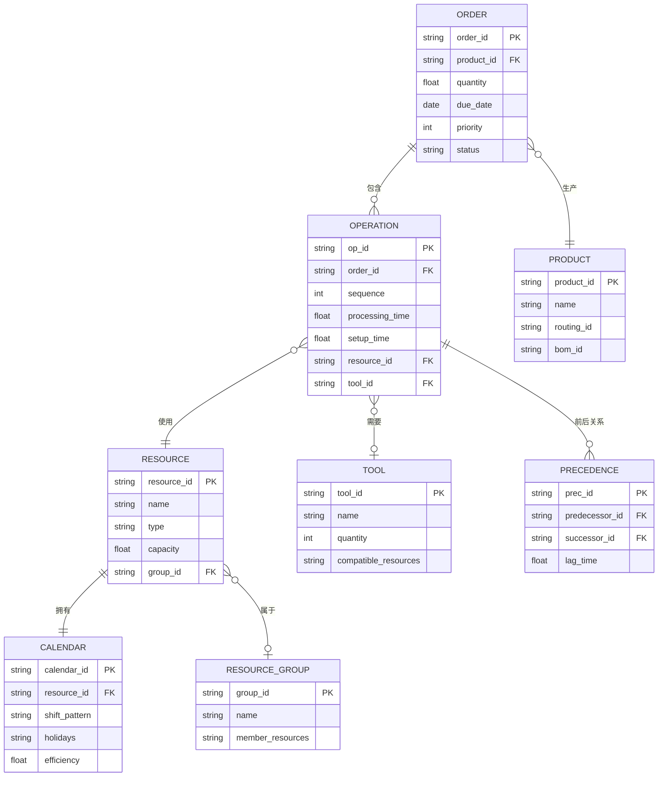

# 核心概念与数据模型

## 核心对象

APS系统的核心对象构成了排程数据模型的基础，理解这些对象及其关系是掌握APS系统的关键。

| 核心对象 | 说明 | 关键属性 |
|----------|------|----------|
| 订单（Order） | 需要排产的生产任务 | 订单号、产品、数量、交期、优先级 |
| 工序（Operation） | 订单中的加工步骤 | 工序号、加工时间、所需资源、前后关系 |
| 资源（Resource） | 执行工序的载体 | 机器、人员、模具、工具 |
| 日历（Calendar） | 资源的工作时间定义 | 工作日、班次、节假日、维护计划 |
| 约束（Constraint） | 排程的限制条件 | 硬约束/软约束、产能/物料/时间窗 |

### 对象间关系

订单→工序→资源是APS数据模型的核心关系链：

- 一个订单包含多个工序，工序之间有前后依赖关系
- 每个工序需要一种或多种资源来执行
- 资源通过日历定义可用时间
- 约束限制了工序在资源上的分配方式

## 排程数据模型

### Job-Shop（作业车间）模型

Job-Shop是最通用的排程模型，每个订单有不同的工艺路线，工序可以在不同的机器上加工：

```
订单1: M1 → M3 → M2
订单2: M2 → M1 → M3
订单3: M3 → M2 → M1
```

特点：
- 每个订单的工艺路线不同
- 同一工序可能有替代机器
- 排程灵活但复杂度高
- 典型行业：机加工、模具制造

### Flow-Shop（流水车间）模型

Flow-Shop中所有订单的工艺路线相同，工序按照固定的机器顺序执行：

```
所有订单: M1 → M2 → M3 → M4
```

特点：
- 所有订单的工艺路线相同
- 排程相对简单
- 典型行业：装配线、化工连续生产

### 混合模型

实际生产通常是Job-Shop和Flow-Shop的混合：

- 前段加工：Job-Shop（不同产品不同路线）
- 后段装配：Flow-Shop（所有产品汇合到装配线）

## 时间模型

APS中的时间模型是排程计算的基础，每个工序的时间由多个部分组成：

| 时间类型 | 说明 | 特点 |
|----------|------|------|
| 加工时间（Processing Time） | 实际加工所需时间 | 与数量成正比，可基于工艺参数计算 |
| 设置时间（Setup Time） | 换型/换模/调试时间 | 可能与序列相关（序列依赖换型时间） |
| 等待时间（Wait Time） | 工序间等待资源的时间 | 排程结果，需最小化 |
| 传输时间（Transfer Time） | 工序间物料搬运时间 | 固定值或与距离相关 |

### 工序时间计算

工序的开始时间和结束时间由以下逻辑确定：

```
工序开始时间 = MAX(前工序结束时间 + 传输时间, 资源可用时间)
工序结束时间 = 工序开始时间 + 设置时间 + 加工时间
```

### 重叠与批量拆分

APS支持工序间的重叠生产，以提高生产效率：

| 策略 | 说明 | 适用场景 |
|------|------|----------|
| 不重叠 | 前工序全部完成才开始后工序 | 质量要求高、不允许提前流转 |
| 传输批量重叠 | 前工序完成一个传输批量就开始后工序 | 大批量生产，缩短生产周期 |
| 逐件重叠 | 前工序完成一件就开始后工序 | 小件生产，极致缩短周期 |

## 资源模型

### 机器资源

- **单机**：一次只能执行一个工序
- **并行机**：多台同类型机器，工序可分配到任意一台
- **多功能机**：一台机器可执行多种工序，需要换型

### 人员资源

- **技能矩阵**：不同人员具备不同技能，影响工序可分配性
- **班次模型**：早班、中班、晚班，影响资源可用时间
- **人员排班**：人员请假、加班等影响产能

### 模具/工具资源

- **模具约束**：模具数量有限，同时只能使用一定数量的模具
- **模具共享**：不同产品可能共用模具
- **模具寿命**：模具使用次数限制，需要定期维护

### 资源能力模型

| 模型 | 说明 | 示例 |
|------|------|------|
| 单能力 | 资源只有一种能力 | 数控车床只能车削 |
| 多能力 | 资源具有多种能力 | 加工中心可铣削、钻孔、攻丝 |
| 能力等级 | 同一能力有不同效率等级 | 高级技工效率是初级工的1.5倍 |

## 约束类型

### 硬约束（Hard Constraint）

硬约束是不可违反的约束，违反硬约束的排程方案不可行：

| 约束 | 说明 | 示例 |
|------|------|------|
| 产能约束 | 资源同时只能执行有限数量的工序 | 一台机器一次只能加工一个零件 |
| 物料约束 | 工序开始前必须有足够的物料 | 装配前所有零部件必须到齐 |
| 日历约束 | 资源只能在可用时间内工作 | 非工作时间不能安排工序 |
| 优先级约束 | 高优先级订单必须优先安排 | 战略客户订单优先于普通订单 |
| 工艺约束 | 工序必须按工艺路线顺序执行 | 先粗加工后精加工 |

### 软约束（Soft Constraint）

软约束是可以违反但会产生惩罚的约束，用于引导优化方向：

| 约束 | 说明 | 惩罚方式 |
|------|------|----------|
| 交期约束 | 期望在交期前完成 | 延迟天数×延迟惩罚系数 |
| 利用率约束 | 期望资源利用率在合理范围 | 偏离目标利用率的惩罚 |
| 连续生产 | 期望相同产品连续生产减少换型 | 换型次数×换型惩罚系数 |
| 均衡生产 | 期望各时段生产量均衡 | 产量波动×均衡惩罚系数 |

## 数据模型图



## 与ERP/MES的数据交互

### ERP→APS的数据

| 数据 | 说明 | 传输频率 |
|------|------|----------|
| 生产订单 | 订单号、产品、数量、交期 | 实时/日 |
| BOM | 物料清单 | 变更时 |
| 工艺路线 | 工序、加工时间、资源 | 变更时 |
| 物料可用性 | 在库量、在途量、预计到货 | 日 |
| 客户优先级 | 订单优先级和交期权重 | 变更时 |

### APS→MES的数据

| 数据 | 说明 | 传输频率 |
|------|------|----------|
| 排程结果 | 各工序的开始/结束时间、分配的资源 | 排程计算后 |
| 工序顺序 | 同一资源上的工序执行顺序 | 排程计算后 |
| 物料需求 | 各工序的物料需求时间和数量 | 排程计算后 |

### MES→APS的数据

| 数据 | 说明 | 传输频率 |
|------|------|----------|
| 工序完工 | 实际完成时间和数量 | 实时 |
| 设备状态 | 设备运行/停机/故障状态 | 实时 |
| 质量异常 | 不良品信息 | 实时 |
| 工时数据 | 实际加工时间和设置时间 | 实时 |
