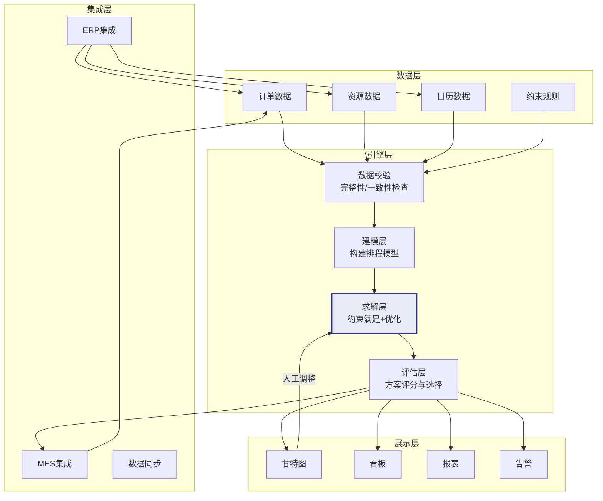
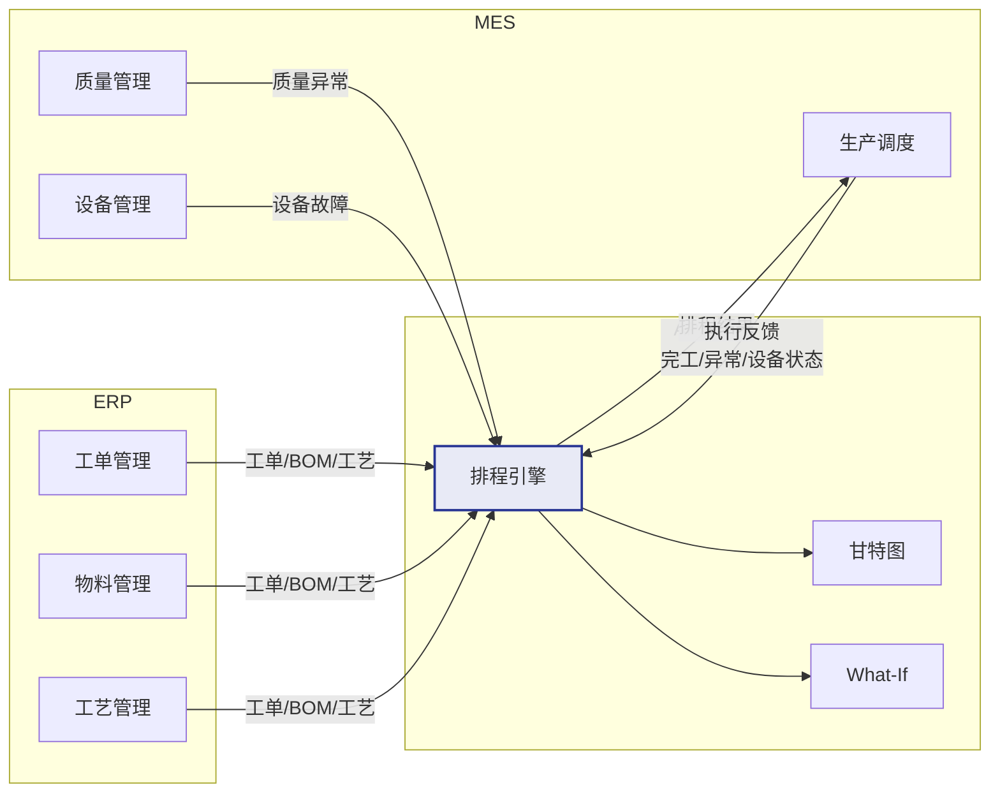
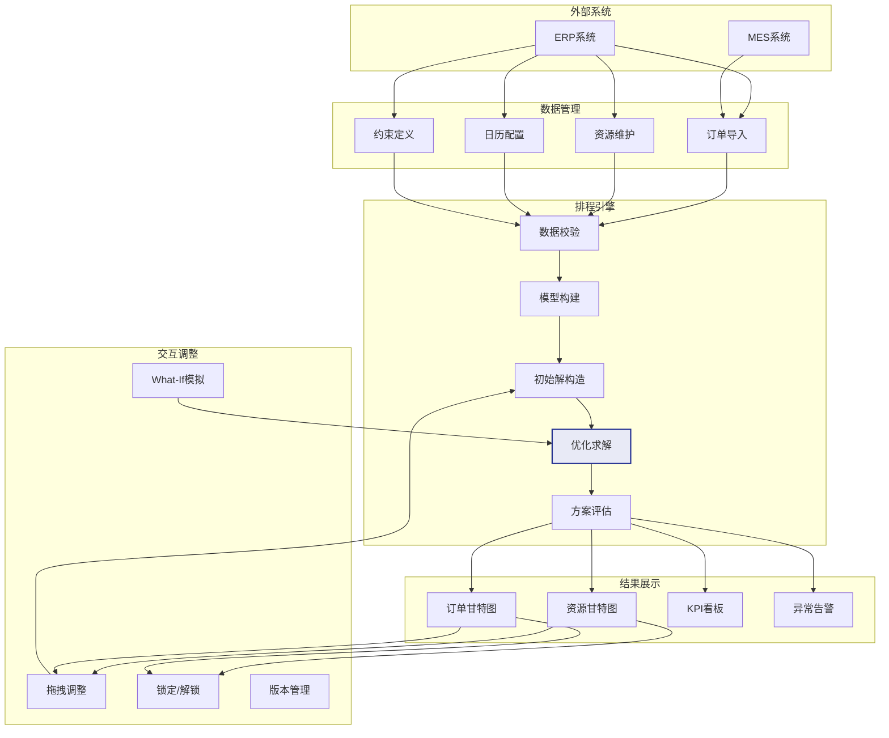

# APS整体架构

## 功能架构

APS系统的功能架构围绕排程的全流程设计，从数据输入到排程计算再到结果展示和反馈。

| 功能模块 | 核心职责 | 关键能力 |
|----------|----------|----------|
| 数据管理 | 排程相关数据的导入和维护 | 订单导入、资源维护、日历配置、约束定义 |
| 排程引擎 | 核心排程计算 | 有限产能排产、约束满足、多目标优化 |
| 甘特图展示 | 排程结果的可视化 | 资源甘特图、订单甘特图、拖拽交互 |
| 看板监控 | 生产状态的实时监控 | 设备状态、工序进度、异常预警 |
| 集成接口 | 与外部系统的数据交换 | ERP集成、MES集成、数据同步 |

## APS引擎架构

APS引擎是系统的核心，其架构通常分为四层：

### 数据层

负责从外部系统接收和校验数据：

- **数据导入**：从ERP/MES接收订单、BOM、工艺路线等数据
- **数据校验**：检查数据完整性和一致性（如工艺路线中引用的资源是否存在）
- **数据缓存**：将数据加载到内存中，加速后续计算

### 建模层

将业务数据转化为排程模型：

- **工序建模**：将订单展开为工序序列，建立工序间的依赖关系
- **资源建模**：定义资源的可用时间、能力、替代关系
- **约束建模**：将业务规则转化为约束条件（硬约束/软约束）
- **目标建模**：定义优化目标和权重（交期/利用率/换型）

### 求解层

在模型基础上进行排程计算：

- **构造启发**：生成初始可行解（如按优先级顺序贪心分配）
- **局部搜索**：在可行解邻域内搜索更优解（如交换、移动工序）
- **优化求解**：调用数学优化求解器或元启发式算法进一步优化
- **多策略组合**：根据问题特征选择合适的算法组合

### 展示层

将排程结果可视化呈现：

- **甘特图**：资源维度和订单维度的甘特图
- **指标看板**：延迟订单数、设备利用率、总完工时间等KPI
- **差异对比**：不同排程方案的对比分析

## 排程算法分类

APS系统中的排程算法可分为三大类：

| 类别 | 代表算法 | 特点 | 适用规模 |
|------|----------|------|----------|
| 精确算法 | 分支定界、整数规划、约束编程 | 可证最优但计算量大 | 小规模（<100工序） |
| 启发式规则 | SPT、EDD、CR等优先规则 | 快速但解质量一般 | 任意规模 |
| 元启发式 | 遗传算法、模拟退火、禁忌搜索 | 解质量好但耗时较长 | 中大规模 |

### 算法选择策略

现代APS系统通常采用**混合算法策略**：

1. 首先用启发式规则快速生成初始可行解
2. 然后用元启发式算法在可行解邻域内搜索更优解
3. 对小规模子问题可用精确算法求局部最优
4. 最终由计划员通过甘特图交互微调

## 与ERP集成

### 集成数据流

| 方向 | 数据 | 说明 |
|------|------|------|
| ERP→APS | 生产订单 | 订单号、产品、数量、交期、优先级 |
| ERP→APS | BOM | 物料清单和用量 |
| ERP→APS | 工艺路线 | 工序序列、加工时间、所需资源 |
| ERP→APS | 物料库存 | 各物料的在库量、在途量 |
| APS→ERP | 排程结果 | 工序的开始/结束时间、资源分配 |
| APS→ERP | 物料需求 | 各工序的物料需求时间和数量 |
| APS→ERP | 交期承诺 | 基于排程结果的预计完工时间 |

### 集成方式

- **实时集成**：通过API实时推送数据，适用于急单、变更等实时场景
- **批量集成**：定时批量同步数据，适用于常规的订单和主数据同步
- **事件驱动**：基于事件总线（如Kafka），ERP产生事件后APS自动响应

## 与MES集成

### MES反馈触发重排的场景

| 反馈事件 | APS响应 | 重排策略 |
|----------|---------|----------|
| 工序提前完工 | 更新排程，后续工序可提前 | 局部调整 |
| 工序延迟 | 评估影响，调整后续排程 | 局部或全局重排 |
| 设备故障 | 将故障设备上的工序移至替代资源 | 受影响订单重排 |
| 质量异常 | 扣除不良品数量，可能需要补产 | 局部调整 |
| 急单插入 | 评估产能，插入急单后重排 | 全局重排 |

## 架构图

## 实时排程vs周期排程

| 维度 | 实时排程 | 周期排程 |
|------|----------|----------|
| 触发方式 | 事件驱动（异常、变更） | 定时触发（每小时/每班次） |
| 计算范围 | 受影响的局部区域 | 全部订单和资源 |
| 计算速度 | 秒级响应 | 分钟到小时级 |
| 结果稳定性 | 频繁变动 | 相对稳定 |
| 适用场景 | 紧急响应、动态环境 | 稳定生产、计划驱动 |

实际应用中通常采用**混合策略**：

- 定期运行全局排程（如每日凌晨），确保计划的全局最优性
- 异常事件触发局部重排，快速响应变化
- 设置冻结区，已下达的近期工序不参与重排，保证执行稳定性
