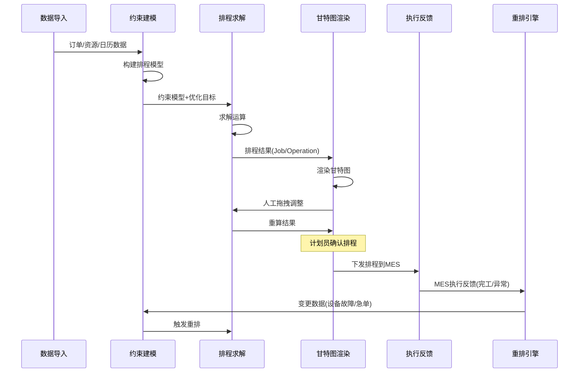
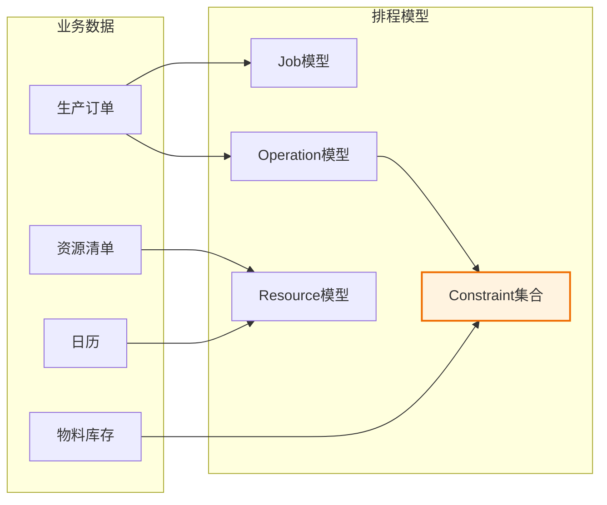
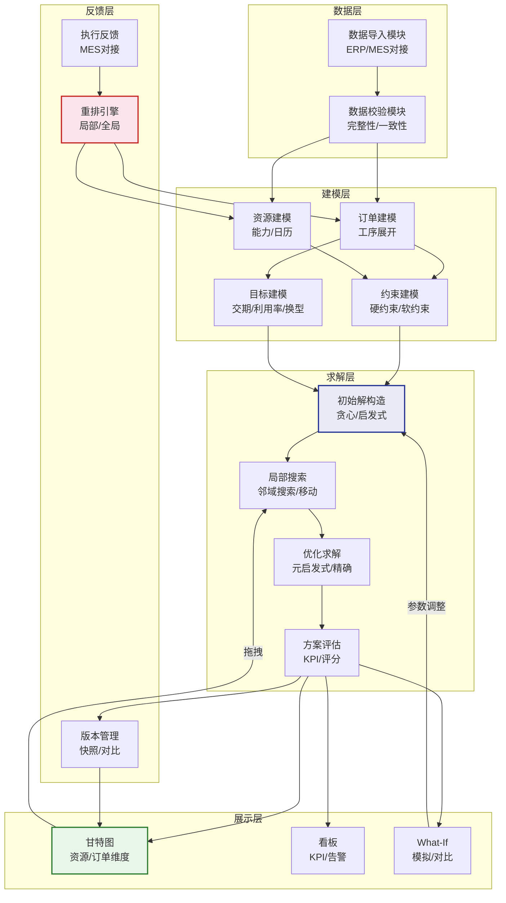

# APS模块联动与数据流

## 模块联动全景

APS系统的核心在于从数据导入到排程求解再到执行反馈的完整闭环。数据在各模块间流转，每一步都为下一步提供必要的输入，同时下游的反馈又能触发上游的重算。



## 级联数据流详解

### 数据导入 → 约束建模

数据导入模块从ERP/MES获取原始数据，经过清洗和校验后提供给约束建模模块：

| 数据类型 | 来源 | 建模用途 | 数据格式 |
|----------|------|----------|----------|
| 生产订单 | ERP | 展开工序序列 | order_id + product + qty + due_date |
| BOM | ERP | 物料需求展开 | parent_item + child_item + qty_per |
| 工艺路线 | ERP | 工序定义和资源需求 | operation + resource + duration |
| 资源清单 | ERP/MES | 资源能力和日历 | resource_id + capacity + calendar |
| 物料库存 | ERP | 物料可用性约束 | item_id + on_hand + allocated |
| 设备状态 | MES | 资源可用性 | resource_id + status + maintenance |

数据导入的关键校验规则：

```python
class DataImportValidator:
    def validate(self, schedule_request):
        errors = []

        # 1. 订单完整性校验
        for order in schedule_request.orders:
            if not order.operations:
                errors.append(f"订单 {order.id} 缺少工序定义")
            for op in order.operations:
                if not op.required_resources:
                    errors.append(f"工序 {op.id} 未指定所需资源")

        # 2. 资源引用完整性
        resource_ids = {r.id for r in schedule_request.resources}
        for order in schedule_request.orders:
            for op in order.operations:
                for res_ref in op.required_resources:
                    if res_ref.resource_id not in resource_ids:
                        errors.append(
                            f"工序 {op.id} 引用资源 {res_ref.resource_id} 不存在"
                        )

        # 3. 工艺路线一致性
        for order in schedule_request.orders:
            ops = order.operations
            for i in range(len(ops) - 1):
                if ops[i].next_op_id != ops[i+1].id:
                    errors.append(
                        f"订单 {order.id} 工序链断裂: {ops[i].id} -> {ops[i+1].id}"
                    )

        # 4. 日历有效性
        for resource in schedule_request.resources:
            if not resource.calendar_id:
                errors.append(f"资源 {resource.id} 未配置工作日历")

        return ValidationResult(valid=len(errors) == 0, errors=errors)
```

### 约束建模 → 排程求解

约束建模将业务数据转化为排程引擎可处理的内部模型：



### 求解结果 → 甘特图渲染

排程引擎输出的结果数据结构需映射到甘特图的渲染数据：

```typescript
// 排程结果 → 甘特图数据映射
interface ScheduleResult {
  operations: ScheduledOperation[];
  resources: ResourceTimeline[];
  dependencies: Dependency[];
  kpis: ScheduleKPI;
}

interface ScheduledOperation {
  operation_id: string;
  order_id: string;
  resource_id: string;
  start_time: string;    // ISO 8601
  end_time: string;
  status: 'SCHEDULED' | 'LOCKED' | 'IN_PROGRESS' | 'COMPLETED';
  setup_start?: string;  // 换型开始时间
  setup_end?: string;    // 换型结束时间
}

// 甘特图渲染数据
interface GanttDataRow {
  resource_id: string;
  resource_name: string;
  bars: GanttBar[];      // 该资源上的所有操作块
}

interface GanttBar {
  id: string;
  operation_id: string;
  order_id: string;
  start: number;         // 时间戳
  end: number;
  type: 'SETUP' | 'PROCESSING' | 'IDLE';
  color: string;         // 按订单/产品/状态着色
  draggable: boolean;    // 是否可拖拽（冻结区不可拖拽）
}
```

### 甘特图交互 → 重算

甘特图上的拖拽操作触发局部或全局重算：

| 交互操作 | 触发重算范围 | 说明 |
|----------|-------------|------|
| 拖拽操作块 | 局部重排 | 移动操作到新资源/新时间，重算受影响操作 |
| 锁定/解锁操作 | 不触发 | 仅标记状态变更 |
| 插入急单 | 全局重排 | 急单插入后需重新评估全局最优 |
| 修改约束参数 | 全局重排 | 约束变更影响全局排程 |
| 调整资源日历 | 局部重排 | 仅影响该资源上的操作 |

```python
class GanttInteractionHandler:
    def handle_drag(self, operation_id, new_resource_id, new_start_time):
        """处理甘特图拖拽操作"""
        operation = self.get_operation(operation_id)

        # 1. 校验：检查新位置是否违反硬约束
        violations = self.constraint_checker.check(
            operation, new_resource_id, new_start_time
        )

        hard_violations = [v for v in violations if v.type == 'HARD']
        if hard_violations:
            return DragResult(
                success=False,
                violations=hard_violations,
                message='拖拽目标位置违反硬约束'
            )

        # 2. 应用变更
        operation.resource_id = new_resource_id
        operation.start_time = new_start_time
        operation.end_time = new_start_time + operation.duration

        # 3. 局部重排：调整受影响的后续操作
        affected_ops = self.find_affected_operations(operation)
        self.local_reschedule(affected_ops)

        # 4. 评估软约束评分
        soft_score = self.evaluate_soft_constraints()

        return DragResult(
            success=True,
            soft_score=soft_score,
            affected_operations=len(affected_ops)
        )
```

### MES反馈 → 重排

MES的执行反馈是触发重排的核心驱动力：

```python
class MESFeedbackHandler:
    def handle_feedback(self, feedback_event):
        """处理MES执行反馈"""
        event_type = feedback_event['type']

        if event_type == 'OPERATION_COMPLETED':
            # 工序完工：标记完成，后续工序可提前
            self.mark_operation_completed(feedback_event['operation_id'])
            self.trigger_local_reschedule(feedback_event['order_id'])

        elif event_type == 'EQUIPMENT_FAILURE':
            # 设备故障：将该设备上的未开始操作移至替代资源
            failed_resource = feedback_event['resource_id']
            affected = self.get_unstarted_operations(failed_resource)
            if affected:
                self.trigger_global_reschedule(
                    reason=f'设备 {failed_resource} 故障',
                    scope=affected
                )

        elif event_type == 'QUALITY_EXCEPTION':
            # 质量异常：扣除不良品，可能需要补产
            defect_qty = feedback_event['defect_qty']
            self.adjust_order_quantity(
                feedback_event['order_id'],
                -defect_qty
            )
            if defect_qty > self.config.quality_threshold:
                self.trigger_local_reschedule(feedback_event['order_id'])

        elif event_type == 'URGENT_ORDER':
            # 急单插入：全局重排
            self.insert_urgent_order(feedback_event['order'])
            self.trigger_global_reschedule(
                reason='急单插入',
                scope='ALL'
            )
```

## 模块接口表

| 源模块 | 目标模块 | 接口方法 | 传输数据 | 触发条件 |
|--------|----------|----------|----------|----------|
| 数据导入 | 约束建模 | `buildModel()` | 订单+资源+日历+约束 | 数据校验通过 |
| 约束建模 | 排程求解 | `solve(model)` | 约束模型+目标函数 | 模型构建完成 |
| 排程求解 | 甘特图渲染 | `render(schedule)` | 排程结果数据 | 求解完成 |
| 甘特图渲染 | 排程求解 | `reschedule(delta)` | 变更操作+范围 | 人工拖拽 |
| 执行反馈 | 约束建模 | `updateModel(event)` | MES反馈事件 | 异常/完工事件 |
| 执行反馈 | 排程求解 | `reschedule(reason)` | 重排原因+范围 | 设备故障/急单 |

## 缓存策略

APS排程涉及大量数据读取，合理的缓存策略对性能至关重要：

| 数据类型 | 缓存策略 | TTL | 原因 |
|----------|----------|-----|------|
| 资源日历 | 应用内存缓存 | 计划周期 | 变化频率极低 |
| 工艺路线 | 应用内存缓存 | 计划周期 | 变化频率低 |
| 物料主数据 | 应用内存缓存 | 1小时 | 偶有变更 |
| 设备状态 | 短TTL缓存 | 30秒 | 需要准实时 |
| 库存数据 | 不缓存/极短TTL | 5秒 | 实时性要求高 |
| 排程结果 | Redis缓存 | 用户会话期 | 支持多人查看 |

```python
class APSCacheManager:
    """APS缓存管理器"""

    # 日历预热：排程前将日历数据加载到内存
    def warmup_calendar(self, resource_ids, start_date, end_date):
        cache_key_prefix = "aps:calendar"
        for resource_id in resource_ids:
            cache_key = f"{cache_key_prefix}:{resource_id}:{start_date}:{end_date}"
            if not cache.exists(cache_key):
                calendar_data = self.calendar_repo.get_working_days(
                    resource_id, start_date, end_date
                )
                cache.set(cache_key, calendar_data, ttl=86400)

    # 工艺路线预热：批量加载到内存
    def warmup_routing(self, order_ids):
        cache_key = "aps:routing:batch"
        routings = self.routing_repo.get_by_orders(order_ids)
        cache.set(cache_key, routings, ttl=86400)
```

## 开发者视角的模块依赖图



## 开发者实战Tips

1. **数据预加载**：排程计算前，将所有需要的日历、工艺路线数据预加载到内存，避免计算过程中的IO阻塞
2. **增量重排**：MES反馈触发的重排优先采用增量算法，只重新计算受影响的操作，避免全局重排的性能开销
3. **异步求解**：全局排程求解耗时较长，采用异步任务+WebSocket通知的方式，前端显示求解进度
4. **快照机制**：每次排程求解前保存当前排程快照，支持回滚到任意版本
5. **乐观锁**：甘特图交互使用乐观锁，避免多人同时编辑时的冲突，提交时检查版本号
6. **分片计算**：大规模排程（>1000操作）时，将问题按资源组或时间窗口分片，并行求解后合并
