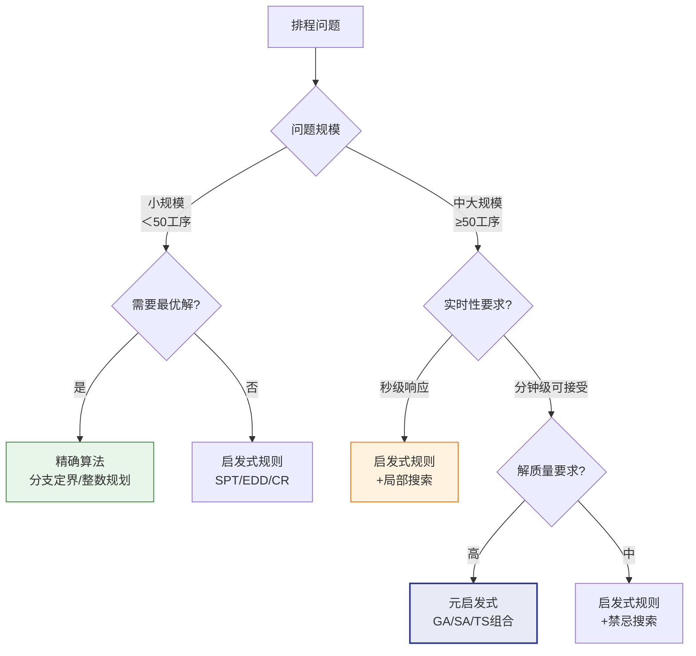

# 排程问题与算法分类

## 排程问题分类

排程问题按照机器配置和工艺路线特征，可分为以下经典类型：

### 单机排程（Single Machine）

所有工序在一台机器上执行，是最简单的排程问题：

- 问题：确定n个工序在单台机器上的执行顺序
- 复杂度：多项式可解（大部分目标函数）
- 应用：单台关键设备的排程

### 并行机排程（Parallel Machine）

多台同类型机器可供选择，工序可分配到任意一台：

| 类型 | 说明 |
|------|------|
| 同速并行机 | 所有机器加工速度相同 |
| 异速并行机 | 不同机器加工速度不同 |
| 无关并行机 | 加工速度与工序和机器都相关 |

### 流水车间排程（Flow-Shop）

所有订单的工艺路线相同，经过相同的机器序列：

- 排程决策：确定各机器上的工序执行顺序
- 经典问题：Permutation Flow-Shop（所有机器上工序顺序一致）
- 复杂度：3台以上机器即为NP-Hard

### 作业车间排程（Job-Shop）

不同订单有不同的工艺路线，是最复杂的经典排程问题：

- 排程决策：确定每台机器上各工序的执行顺序
- 复杂度：NP-Hard，10台机器10个订单已是难题
- 现实意义：最贴近实际制造场景

| 问题类型 | 符号 | 复杂度 | 典型规模 |
|----------|------|--------|----------|
| 单机 | 1‖C_max | P | 任意规模 |
| 并行机 | P_m‖C_max | NP-Hard | 中等规模 |
| 流水车间 | F_m‖C_max | NP-Hard (m≥3) | 中等规模 |
| 作业车间 | J_m‖C_max | NP-Hard | 小中等规模 |

## NP-Hard问题说明

排程问题大多数是NP-Hard问题，这意味着：

- **不存在多项式时间精确算法**（假设P≠NP）
- **计算时间随问题规模呈指数级增长**
- 对于大规模问题，必须在可接受时间内找到近似最优解

```
问题规模与求解时间（示意）：
10个订单:  秒级
50个订单:  分钟级
100个订单: 小时级
500个订单: 天级（精确算法不现实）
```

因此，实际APS系统中几乎不使用纯精确算法，而是采用**启发式+元启发式**的组合策略。

## 精确算法

### 分支定界法（Branch and Bound）

分支定界通过系统地枚举所有可能的解空间，利用下界和上界剪枝来加速搜索：

- **分支**：将问题分解为子问题
- **定界**：计算子问题的下界，剪除不可能优于当前最优解的子问题
- **优势**：可证明最优性
- **局限**：大规模问题时计算时间爆炸

### 整数规划（Integer Programming）

将排程问题建模为整数规划问题，使用商业求解器（如Gurobi、CPLEX）求解：

- **建模**：用0-1变量表示工序在资源上的分配和时间
- **约束**：用线性不等式表达产能约束、先后约束等
- **目标**：用线性函数表达优化目标
- **优势**：建模灵活，求解器不断进步
- **局限**：变量数随问题规模急剧增长

### 约束编程（Constraint Programming）

通过声明式约束描述问题，让求解器自动搜索可行解：

- **建模**：声明变量域和约束关系
- **搜索**：求解器通过约束传播和回溯搜索解
- **优势**：建模直观，对可行性问题效果好
- **局限**：优化目标不如整数规划灵活

## 启发式规则

启发式规则是简单高效的优先级规则，用于快速生成可行排程方案：

| 规则 | 英文 | 含义 | 优化目标 |
|------|------|------|----------|
| SPT | Shortest Processing Time | 优先选择加工时间最短的工序 | 最小化平均完工时间 |
| LPT | Longest Processing Time | 优先选择加工时间最长的工序 | 均衡负载 |
| EDD | Earliest Due Date | 优先选择交期最早的工序 | 最小化最大延迟 |
| FCFS | First Come First Served | 按到达顺序执行 | 公平性 |
| CR | Critical Ratio | 优先选择紧迫比最低的工序 | 最小化延迟 |
| S/R | Slack/RPT | 优先选择余量与剩余加工时间比最低 | 延迟控制 |
| MWKR | Most Work Remaining | 优先选择剩余加工量最多的工序 | 最小化在制品 |
| LWKR | Least Work Remaining | 优先选择剩余加工量最少的工序 | 快速完成短任务 |

### 启发式规则的局限

- **单一规则难以兼顾多个目标**：如SPT减少平均完工时间但可能导致长工序饿死
- **不考虑全局信息**：只看当前可排工序的局部特征
- **解质量有限**：通常只能得到"还行"的方案，距离最优较远
- **组合规则**：实际中常组合多个规则（如先按交期分组，组内按SPT排列）

## 元启发式算法

元启发式算法是更高层次的求解策略，通过智能化的搜索机制在解空间中寻找高质量解。

### 遗传算法（Genetic Algorithm, GA）

模拟自然进化过程，通过选择、交叉、变异操作迭代优化种群：

- **编码**：将排程方案编码为染色体（如工序序列）
- **选择**：根据适应度选择优秀个体进入下一代
- **交叉**：两个父代染色体交叉产生子代
- **变异**：随机改变部分基因，维持种群多样性
- **优势**：全局搜索能力强，适合大规模问题
- **局限**：参数调整需要经验，收敛速度较慢

### 模拟退火（Simulated Annealing, SA）

模拟金属退火过程，在搜索过程中以一定概率接受劣解以跳出局部最优：

- **邻域搜索**：在当前解的邻域内生成新解
- **接受准则**：优解一定接受，劣解以概率exp(-ΔE/T)接受
- **温度控制**：温度逐渐降低，接受劣解的概率逐渐减小
- **优势**：实现简单，跳出局部最优能力强
- **局限**：冷却参数需要调优，收敛速度较慢

### 禁忌搜索（Tabu Search, TS）

通过禁忌表记录最近访问过的解，避免搜索陷入循环：

- **邻域搜索**：在当前解的邻域内搜索最优邻居
- **禁忌表**：记录最近N步的操作，避免重复搜索
- **特赦准则**：当禁忌操作产生显著改进时允许突破禁忌
- **优势**：比局部搜索更不容易陷入局部最优
- **局限**：禁忌表长度需要调优

### 蚁群算法（Ant Colony Optimization, ACO）

模拟蚂蚁觅食行为，通过信息素引导搜索方向：

- **信息素**：好的路径上积累更多信息素
- **概率选择**：根据信息素浓度和启发信息概率选择下一工序
- **信息素更新**：优秀路径的信息素增强，差的路径蒸发
- **优势**：适合组合优化问题，正反馈机制
- **局限**：收敛速度慢，参数多

## 各算法对比

| 算法 | 求解质量 | 求解速度 | 适用规模 | 实现难度 | 参数调优 |
|------|----------|----------|----------|----------|----------|
| 分支定界 | 最优 | 慢（指数级） | 小规模 | 中 | 少 |
| 整数规划 | 最优 | 中 | 中小规模 | 难 | 中 |
| 启发式规则 | 一般 | 极快 | 任意 | 易 | 无 |
| 遗传算法 | 好 | 中 | 大规模 | 中 | 多 |
| 模拟退火 | 好 | 中 | 大规模 | 易 | 中 |
| 禁忌搜索 | 好 | 快 | 大规模 | 中 | 中 |
| 蚁群算法 | 好 | 慢 | 中大规模 | 难 | 多 |

## 算法选择决策树



## 真实案例：Opcenter APS的算法组合策略

Siemens Opcenter APS采用分层的算法组合策略，在不同阶段使用不同算法：

### 第一阶段：构造初始解

使用优先级规则快速生成初始可行排程：

- 按订单优先级排序
- 每个订单的工序按工艺路线顺序分配到资源
- 在资源选择时考虑最早可用时间和最短换型

### 第二阶段：局部优化

对初始解进行局部改善：

- **关键路径分析**：识别影响总完工时间的关键工序
- **瓶颈资源优化**：重点优化瓶颈资源上的工序顺序
- **工序交换**：尝试交换相邻工序的顺序，评估改善效果

### 第三阶段：全局优化

使用元启发式算法进行全局搜索：

- **遗传算法**：种群规模根据问题规模动态调整
- **邻域操作**：交换、插入、逆序等邻域操作
- **自适应参数**：根据搜索进展自动调整变异概率和选择压力

### 第四阶段：人工调整

计划员通过甘特图交互微调排程结果：

- 拖拽调整工序时间和资源
- 锁定关键工序
- What-If模拟调整方案

这种分层策略平衡了求解质量和计算速度，在实际应用中能够在分钟级内生成高质量的排程方案。
