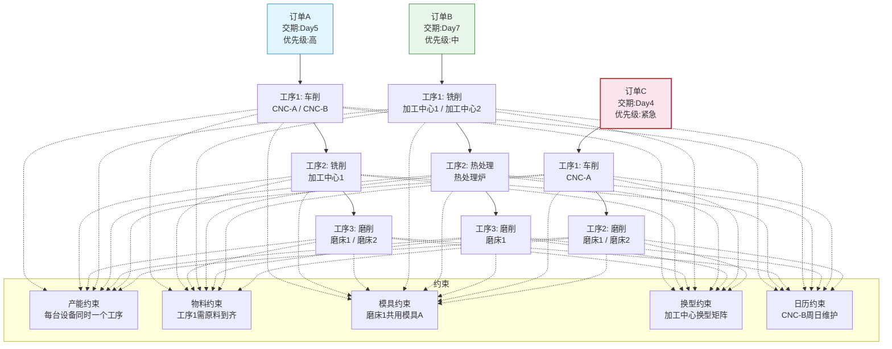

# 约束建模与资源分配

## 约束类型详解

APS系统中的约束类型直接决定了排程的复杂度和可行性，理解约束类型是正确建模的前提。

### 产能约束

产能约束是最基础的约束，限制了资源在给定时间内的加工能力：

| 约束 | 说明 | 建模方式 |
|------|------|----------|
| 机器产能 | 同一机器同一时间只能执行一个工序 | 资源不重叠约束 |
| 人员产能 | 同一人员同一时间只能执行一个工序 | 资源不重叠约束 |
| 日产能 | 一天内所有工序的总加工时间不超过可用工时 | 聚合产能约束 |
| 周产能 | 一周内的总加工量不超过限制 | 聚合产能约束 |

### 物料约束

物料约束确保工序开始前有足够的物料：

- **无余量约束**：工序开始前物料必须全部到齐
- **有余量约束**：物料逐步到位也可开始，但需保持最低库存
- **替代物料**：主物料不可用时可用替代物料

### 模具约束

模具约束是制造排程中特有的重要约束：

- **模具数量**：同时可用的模具数量有限
- **模具占用**：工序执行期间模具被占用
- **模具共享**：不同产品可能共用同一套模具
- **模具准备**：模具安装和拆卸需要额外时间

### 人员约束

- **技能约束**：不同工序需要不同技能的人员
- **人员可用性**：请假、加班、培训等影响人员可用时间
- **人员组合**：某些工序需要特定的人员组合

### 时间窗约束

- **最早开始时间**：物料到位或前工序完成后才能开始
- **最晚开始时间**：必须在某个时间之前开始
- **无等待约束**：前后工序之间不能有等待时间
- **最大等待约束**：前后工序之间的等待时间有上限

### 优先级约束

- **订单优先级**：高优先级订单优先排产
- **客户优先级**：战略客户订单优先
- **工序优先级**：关键路径上的工序优先

## 约束建模方法

### 数学规划建模

将约束表达为数学不等式，使用线性规划或整数规划求解：

```
产能约束：Σ x_ijt ≤ C_jt  (资源j在时间t的分配不超过产能)
先后约束：S_ik + P_ik ≤ S_i(k+1)  (工序k完成前工序k+1不能开始)
物料约束：I_it ≥ 0  (物料i在时间t的库存非负)
```

- 优势：表达精确，可利用商业求解器
- 局限：大规模问题时变量数爆炸

### 规则引擎建模

通过IF-THEN规则表达约束和决策逻辑：

```
IF 工序A和工序B在同一资源上 AND A的优先级 > B的优先级
THEN A排在B前面

IF 资源利用率 > 90%
THEN 触发产能预警
```

- 优势：直观易懂，业务人员可配置
- 局限：规则冲突时处理复杂，优化能力有限

### 约束满足问题（CSP）

将排程问题建模为约束满足问题，通过约束传播和搜索求解：

- **变量**：工序的开始时间、分配的资源
- **域**：变量的可能取值范围
- **约束**：变量之间的限制关系

CSP求解过程：

1. **约束传播**：利用约束缩小变量的取值域
2. **变量选择**：选择域最小的变量优先赋值
3. **值选择**：从域中选择一个值赋给变量
4. **一致性检查**：检查赋值是否与所有约束一致
5. **回溯**：不一致时回溯到上一个决策点

## 资源日历

资源日历定义了资源的可用工作时间，是排程计算的基础。

### 日历层级

| 层级 | 说明 | 示例 |
|------|------|------|
| 工作日历 | 一周中的工作日 | 周一到周五 |
| 班次日历 | 每天的班次安排 | 早8晚5，三班倒 |
| 节假日日历 | 法定假日和公司假期 | 春节、国庆 |
| 维护日历 | 设备计划维护时间 | 每月第一周维护 |
| 例外日历 | 临时调整 | 加班、停工 |

### 日历继承与覆盖

```
工厂日历（默认）
├── 车间A日历（继承工厂日历，覆盖班次）
│   ├── 产线1日历（继承车间日历，覆盖维护）
│   └── 产线2日历（继承车间日历）
└── 车间B日历（7x24小时运行）
```

日历的继承与覆盖机制允许在不同层级定义默认值和例外情况，减少维护工作量。

## 资源能力模型

### 单能力资源

资源只有一种加工能力，同一时间只能执行一个工序：

```
数控车床：车削能力，一次一个工序
```

### 多能力资源

资源具有多种加工能力，可执行不同类型的工序：

```
加工中心：铣削 + 钻孔 + 攻丝
（同时只能执行一种，但不需要换设备）
```

### 能力等级

同一资源对不同类型工序的加工效率不同：

| 工序类型 | 标准工时 | 实际工时（高效模式） | 实际工时（经济模式） |
|----------|----------|---------------------|---------------------|
| 粗加工 | 2小时 | 1.5小时 | 2小时 |
| 精加工 | 4小时 | 3.5小时 | 4小时 |

## 替代资源与替代工艺路线

### 替代资源

当主资源不可用或产能不足时，工序可分配到替代资源：

| 资源角色 | 说明 | 优先级 |
|----------|------|--------|
| 主资源 | 首选的资源 | 最高 |
| 替代资源1 | 主资源不可用时的第一备选 | 次高 |
| 替代资源2 | 替代资源1也不可用时的备选 | 最低 |

替代资源的使用会增加成本或降低效率，因此APS会优先使用主资源，仅在必要时使用替代资源。

### 替代工艺路线

当主工艺路线不可行时（如关键设备故障），可切换到替代工艺路线：

```
主路线：铣削(CNC-A) → 热处理(炉1) → 磨削(磨床1)
替代路线：铣削(CNC-B) → 热处理(炉2) → 磨削(磨床2)
```

替代工艺路线通常加工时间更长或成本更高，APS在排程时优先选择主路线。

## 换型时间矩阵（序列依赖）

换型时间矩阵是制造排程中最复杂也最重要的约束之一。在注塑、涂装、印刷等工序中，前后工序加工不同产品时的换型时间取决于两个产品的属性差异。

### 换型时间矩阵示例

注塑机换型时间取决于前后产品的颜色和模具：

| 从\到 | 白色 | 黑色 | 红色 | 蓝色 |
|-------|------|------|------|------|
| 白色 | 0min | 30min | 60min | 45min |
| 黑色 | 15min | 0min | 30min | 20min |
| 红色 | 90min | 45min | 0min | 30min |
| 蓝色 | 60min | 30min | 45min | 0min |

关键规律：
- 深色→浅色换型时间长（需要彻底清洗）
- 浅色→深色换型时间短（无需彻底清洗）
- 相同颜色无需换型

### 换型时间对排程的影响

换型时间矩阵使得排程问题从简单的排序问题变为旅行商问题（TSP），需要寻找最优的工序序列以最小化总换型时间。

## 约束建模示例



## 真实案例：注塑车间换型时间矩阵优化

某注塑车间有8台注塑机，生产50+种产品，每种产品有不同的颜色和模具组合。优化前的排程方式导致换型时间占总生产时间的25%以上。

### 问题分析

1. **换型时间矩阵**：颜色差异决定了清洗时间，模具差异决定了换模时间
2. **颜色序列优化**：从浅色到深色排列可大幅减少清洗时间
3. **模具共享**：共用模具的产品应连续生产
4. **交期约束**：不能为了减少换型而延迟交付

### 优化方案

1. **构建换型矩阵**：量化所有产品对之间的换型时间
2. **分组排产**：按颜色深浅分组，组内按模具共享分组
3. **序列优化**：使用禁忌搜索算法优化组内和组间的生产序列
4. **交期检查**：确保优化后的排程满足所有交期

### 优化效果

| 指标 | 优化前 | 优化后 | 改善 |
|------|--------|--------|------|
| 换型时间占比 | 25% | 12% | -52% |
| 日均产出 | 3200件 | 3800件 | +19% |
| 延迟订单数 | 15单/周 | 3单/周 | -80% |
| 模具更换次数 | 45次/天 | 22次/天 | -51% |

关键发现：颜色序列优化贡献了70%的换型时间节省，模具共享优化贡献了30%。这验证了"先颜色后模具"的分组策略是最有效的。
