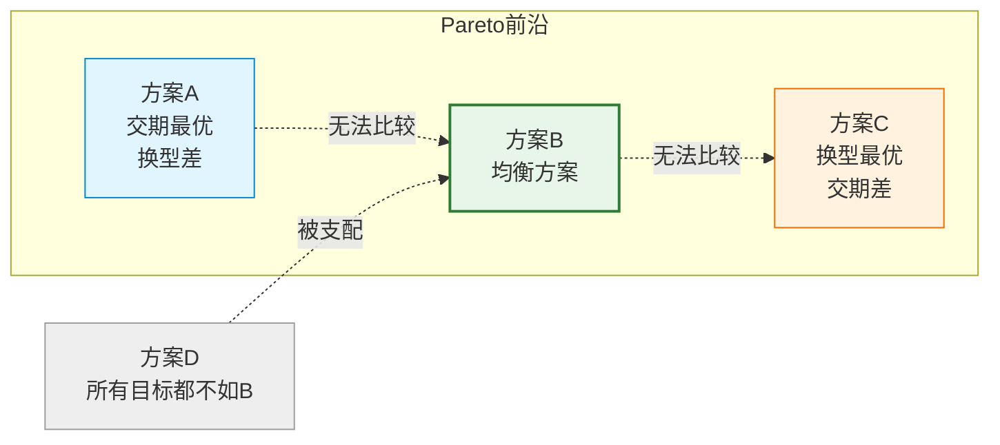
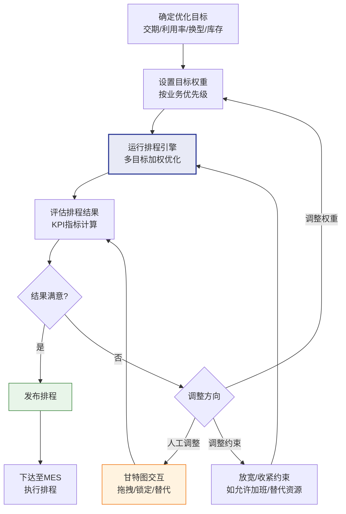

# 多目标优化与甘特图

## 多目标优化

实际生产排程通常需要同时优化多个相互冲突的目标：

| 优化目标 | 说明 | 冲突关系 |
|----------|------|----------|
| 交期满足率 | 尽量按时交付所有订单 | 与换型优化冲突（按时交付可能需要频繁换型） |
| 设备利用率 | 最大化设备使用效率 | 与交期冲突（为利用设备可能延迟低优先级订单） |
| 换型次数 | 最小化换型次数和时间 | 与交期冲突（减少换型可能导致某些订单延迟） |
| 在制品库存 | 最小化在制品积压 | 与利用率冲突（减少在制品可能导致设备空闲） |

### 多目标优化的挑战

多目标优化的核心挑战在于不同目标之间往往相互矛盾：

- **交期vs换型**：为满足交期需要频繁切换产品，增加换型时间
- **利用率vs库存**：为提高利用率需要提前生产，增加库存
- **交期vs利用率**：为满足交期可能需要保持产能冗余

## Pareto最优解

在多目标优化中，不存在单一最优解，而是存在一组**Pareto最优解**（又称非支配解）：

- 一个解A支配另一个解B，当且仅当A在所有目标上不劣于B，且至少一个目标上严格优于B
- Pareto最优解集中的任何一个解，都无法在不牺牲某个目标的情况下改进另一个目标
- Pareto前沿是所有Pareto最优解在目标空间中的投影



## 目标权重设置

将多目标转化为单目标的常用方法是**加权求和法**：

$$Minimize\ Z = w_1 \times f_1 + w_2 \times f_2 + w_3 \times f_3 + ...$$

其中：
- Z = 综合目标值
- w_i = 第i个目标的权重
- f_i = 第i个目标的归一化值

### 权重设置策略

| 策略 | 说明 | 适用场景 |
|------|------|----------|
| 等权重 | 所有目标权重相同 | 目标重要性接近 |
| 优先级权重 | 按业务优先级分配权重 | 有明确优先级 |
| 动态权重 | 根据生产状态动态调整 | 需求波动大的场景 |
| AHP层次分析 | 通过成对比较确定权重 | 决策过程需科学依据 |

### 权重调整示例

| 场景 | 交期权重 | 利用率权重 | 换型权重 | 说明 |
|------|----------|----------|----------|------|
| 旺季 | 0.6 | 0.2 | 0.2 | 交期为王，确保交付 |
| 淡季 | 0.2 | 0.4 | 0.4 | 降低成本，优化换型 |
| 急单多 | 0.7 | 0.2 | 0.1 | 一切为交期让路 |
| 稳定期 | 0.3 | 0.3 | 0.4 | 均衡优化 |

### 目标归一化

不同目标的量纲和范围不同，需要归一化后才能加权：

$$f_i^{norm} = \frac{f_i - f_i^{min}}{f_i^{max} - f_i^{min}}$$

将所有目标归一化到[0,1]区间，消除量纲影响。

## 甘特图展示

甘特图是APS系统最核心的可视化工具，它直观地展示了排程结果中各工序在资源上的时间分配。

### 资源甘特图

以资源为纵轴、时间为横轴，展示每个资源上的工序排列：

```
资源1: [====订单A-工序1====]  [==订单C-工序1==]  [===订单B-工序1===]
资源2:     [===订单B-工序2===]     [====订单A-工序2====]
资源3:  [==订单C-工序2==]           [===订单A-工序3===]

       |----Day1----|----Day2----|----Day3----|----Day4----|
```

颜色编码：
- 绿色：按时完成
- 黄色：接近交期
- 红色：已延迟
- 灰色：换型时间
- 蓝色：冻结（已下达，不可调整）

### 订单甘特图

以订单为纵轴，展示每个订单的各工序在不同资源上的执行情况：

```
订单A:  [==工序1(R1)==]--等待--[====工序2(R2)====]--等待--[===工序3(R3)===]
订单B:       [====工序1(R1)====]--等待--[===工序2(R2)===]
订单C:  [==工序1(R1)==]--等待--[===工序2(R3)===]

       |----Day1----|----Day2----|----Day3----|----Day4----|
```

### 关键路径标识

在订单甘特图中标识关键路径——决定订单最早完工时间的最长工序链：

```
订单A:  [==工序1==]--关键--[====工序2====]--关键--[===工序3===]
                     非关键路径        非关键路径
```

关键路径上的工序延迟会直接导致订单延迟，需要重点监控。

## 甘特图交互

现代APS系统提供丰富的甘特图交互功能，让计划员在可视化环境中调整排程：

### 拖拽调整

- **水平拖拽**：调整工序的开始时间
- **垂直拖拽**：将工序从一台资源拖到另一台（替代资源）
- **拉伸缩短**：调整工序的持续时间

拖拽后系统自动进行约束检查：
- 是否与同资源上的其他工序冲突？
- 是否违反了先后约束？
- 是否违反了物料约束？
- 如果违反约束，系统给出警告或自动修正

### 锁定与解锁

| 操作 | 说明 | 场景 |
|------|------|------|
| 锁定工序 | 工序不可被自动排程调整 | 已下达的工序、关键工序 |
| 锁定订单 | 整个订单的所有工序锁定 | 战略客户订单 |
| 解锁 | 允许自动排程调整 | 条件变化后需要重新优化 |

### 冲突提示

拖拽调整可能导致冲突，APS系统需要实时检测并提示：

- **硬约束冲突**：红色标记，不允许操作
- **软约束违反**：黄色标记，警告但允许操作
- **建议调整**：蓝色标记，系统建议的关联调整

## 排程结果评估

排程结果需要通过KPI指标评估其质量：

### 交期相关指标

| 指标 | 公式 | 说明 |
|------|------|------|
| 准时交付率 | 按时交付订单数/总订单数 | 越高越好 |
| 平均延迟天数 | Σ延迟天数/延迟订单数 | 越低越好 |
| 最大延迟天数 | max(延迟天数) | 越低越好 |
| 总延迟订单数 | 延迟订单计数 | 越少越好 |

### 利用率相关指标

| 指标 | 公式 | 说明 |
|------|------|------|
| 设备利用率 | 实际加工时间/可用时间 | 适中为好 |
| 瓶颈利用率 | 瓶颈设备的利用率 | 应接近100% |
| 设备空闲率 | 空闲时间/可用时间 | 越低越好 |

### 效率相关指标

| 指标 | 公式 | 说明 |
|------|------|------|
| 总完工时间（Makespan） | 最后一个工序的结束时间 | 越短越好 |
| 换型总时间 | Σ所有换型时间 | 越短越好 |
| 换型次数 | 换型操作计数 | 越少越好 |
| 平均流程时间 | Σ(完工时间-开始时间)/订单数 | 越短越好 |

### 综合评分

将各维度KPI归一化后加权，得到排程方案的综合评分：

$$Score = w_1 \times OTDR + w_2 \times (1-Utilization_{dev}) + w_3 \times (1-SetupRatio)$$

其中OTDR为准时交付率，Utilization_dev为利用率偏离目标值，SetupRatio为换型时间占比。

## 多目标决策流程



## 真实案例：PlanetTogether甘特图交互排程

PlanetTogether是一款以易用性著称的APS系统，其甘特图交互功能尤为出色。

### 核心交互功能

- **实时拖拽**：拖拽工序后毫秒级重新计算所有约束
- **冲突自动修正**：拖拽导致的冲突自动调整相关工序
- **多视图切换**：资源视图、订单视图、瓶颈视图一键切换
- **颜色编码**：按交期状态、产品类型、客户等多种维度着色
- **过滤与聚焦**：按资源、订单、产品等条件过滤显示

### 典型工作流

1. 自动排程生成初始方案
2. 计划员在甘特图上检查延迟订单（红色标记）
3. 拖拽延迟订单的工序到更早的时间或替代资源
4. 系统自动调整受影响的工序，实时更新甘特图
5. 检查瓶颈资源利用率，适当均衡负载
6. 确认方案后发布排程

### 交互排程的价值

自动排程虽然高效，但无法完全替代计划员的经验判断。交互排程让计划员的领域知识（如"这个供应商经常延迟""那个工序需要特殊关注"）与算法的优化能力结合，产生比纯自动排程更优的方案。
