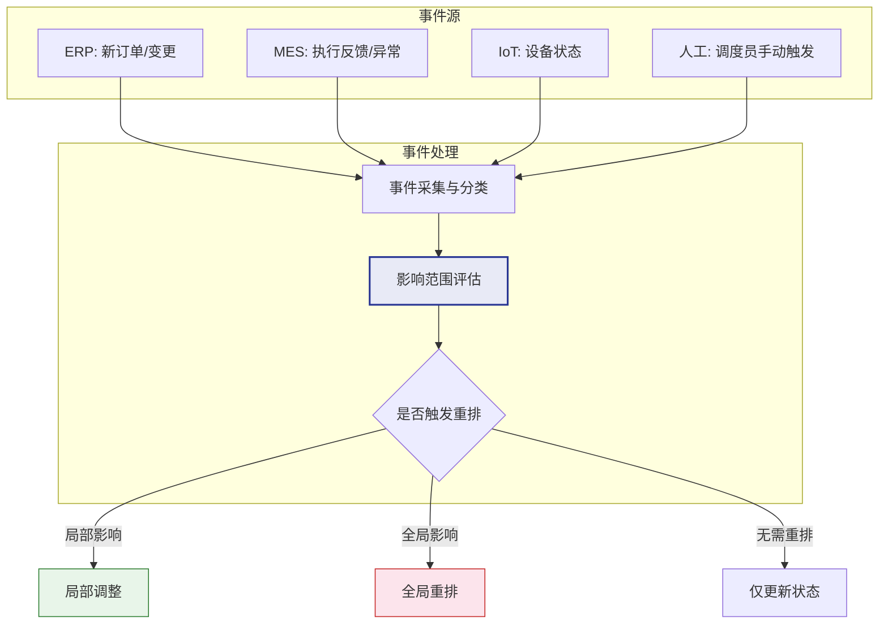
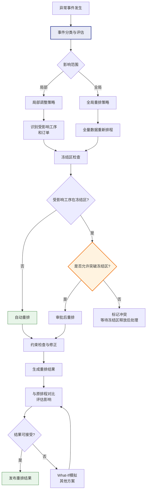

# 动态重排与实时响应

## 重排触发条件

生产环境是动态变化的，APS系统必须能够响应各种突发事件并快速调整排程。

| 触发事件 | 说明 | 紧急程度 |
|----------|------|----------|
| 急单插入 | 客户临时下达紧急订单 | 高 |
| 订单取消 | 客户取消已排产订单 | 中 |
| 设备故障 | 关键设备突发故障停机 | 高 |
| 物料延迟 | 供应商交期延迟 | 高 |
| 工艺异常 | 实际加工时间远超预期 | 中 |
| 质量问题 | 批量不良需要返工或补产 | 高 |
| 人员变动 | 关键岗位人员请假或离职 | 中 |
| 交期变更 | 客户要求提前或延后交期 | 中 |

### 触发机制



## 重排策略

### 全局重排

重新计算所有订单的排程，适用于重大变化：

- **触发条件**：新增大量订单、多台设备故障、大规模物料延迟
- **优势**：全局最优，充分利用所有资源
- **劣势**：计算耗时长，可能导致已执行的工序被调整
- **频率**：通常每日一次（夜间批处理）

### 局部调整

仅调整受影响区域的排程，保持其他部分不变：

- **触发条件**：单个订单变更、单台设备故障
- **优势**：计算快速，排程稳定
- **劣势**：可能不是全局最优
- **频率**：实时响应

### 受影响订单重排

识别受事件直接影响的订单，仅对这些订单重新排程：

- **触发条件**：急单插入、订单取消
- **优势**：兼顾速度和质量
- **劣势**：需准确识别受影响订单
- **频率**：事件驱动

### 策略选择

| 策略 | 计算时间 | 解质量 | 稳定性 | 适用场景 |
|------|----------|--------|--------|----------|
| 全局重排 | 长（分钟级） | 最优 | 低（变化大） | 重大变更、定期优化 |
| 局部调整 | 短（秒级） | 一般 | 高 | 小变更、实时响应 |
| 受影响重排 | 中（秒-分钟） | 较优 | 中 | 中等变更、急单 |

## 排程冻结区

排程冻结区（Frozen Zone）是保护已下达工序不被重排的机制，确保车间执行的稳定性。

### 冻结区设计

```
|---冻结区---|----半冻结区----|------自由区------|
   已下达       已确认          待排程
   不可调整     需审批可调整     自由排程
   (0-2天)      (2-5天)         (5天以后)
```

| 区域 | 时间范围 | 调整权限 | 说明 |
|------|----------|----------|------|
| 冻结区 | 近期（0-2天） | 不可调整 | 已下达工序，物料已备，正在执行 |
| 半冻结区 | 中期（2-5天） | 审批后调整 | 已确认但未下达，调整需审批 |
| 自由区 | 远期（5天后） | 自由调整 | 待排程区域，可自由优化 |

### 冻结区的权衡

- **冻结区过长**：灵活性差，无法快速响应变化
- **冻结区过短**：执行不稳定，频繁变更导致混乱
- **建议**：冻结区长度至少为1个班次到1天，半冻结区为2-3天

### 冻结区例外

以下情况可以突破冻结区：

- 设备故障导致冻结区内的工序无法执行
- 客户要求提前交期（战略客户）
- 安全质量问题需要立即停产

## What-If模拟

What-If模拟是APS的重要功能，允许计划员在不影响运营排程的前提下评估各种假设场景。

### 模拟场景

| 场景 | 假设问题 | 评估内容 |
|------|----------|----------|
| 急单插入 | 如果接受这个急单会怎样？ | 对现有订单的交期影响、产能需求 |
| 设备故障 | 如果某台设备故障2天？ | 哪些订单会延迟、替代资源方案 |
| 加班方案 | 如果周末加班会怎样？ | 产能提升多少、加班成本 |
| 替代路线 | 如果使用替代工艺路线？ | 交期改善、额外成本 |
| 新增设备 | 如果增加一台设备？ | 瓶颈缓解程度、投资回报 |

### What-If操作流程

1. 创建模拟版本（从运营排程复制）
2. 在模拟版本中修改假设参数（如插入急单、移除设备）
3. 运行排程计算，生成模拟结果
4. 对比模拟版本与运营版本的差异
5. 评估关键KPI的变化
6. 决定是否采纳模拟方案

### 模拟结果对比

| 指标 | 运营版本 | 模拟版本 | 差异 |
|------|----------|----------|------|
| 准时交付率 | 92% | 88% | -4% |
| 延迟订单数 | 8 | 12 | +4 |
| 设备利用率 | 85% | 90% | +5% |
| 换型时间 | 120min | 95min | -25min |
| 急单交付 | 未排 | Day3交付 | 已满足 |

## 排程版本管理

排程版本管理支持多版本排程方案的对比和追溯：

### 版本类型

| 版本类型 | 说明 | 修改权限 |
|----------|------|----------|
| 运营版本 | 当前执行的排程 | 受限（需审批） |
| 模拟版本 | What-If模拟的排程 | 自由修改 |
| 历史版本 | 过去的排程快照 | 只读 |
| 基线版本 | S&OP确认的计划基线 | 受限 |

### 版本管理操作

- **创建版本**：从现有版本复制创建新版本
- **对比版本**：并排对比两个版本的排程差异
- **合并版本**：将模拟版本的修改合并到运营版本
- **回滚版本**：回退到之前的版本
- **归档版本**：将历史版本归档保存

## 动态重排流程图



## 真实案例：汽车零部件厂急单重排实战

某汽车零部件工厂为多家主机厂供应冲压件和焊接件，生产环境高度动态，每天都会遇到急单和变更。

### 背景

- 8条冲压线 + 4条焊接线
- 日均排产200+工序
- 多家主机厂客户，交期严格
- 平均每天2-3次急单或变更

### 急单处理流程

**场景**：主机厂A临时增加500件订单，需3天后交付

1. **需求评估**（5分钟）
   - 确认产品BOM和工艺路线
   - 确认所需物料是否有库存
   - 评估标准产能下是否可满足

2. **What-If模拟**（3分钟）
   - 创建模拟版本，插入急单
   - 运行排程，评估对现有订单的影响
   - 结果：3个订单延迟1天，急单可按时交付

3. **方案调整**（10分钟）
   - 尝试方案B：将部分工序排到替代冲压线
   - 结果：1个订单延迟0.5天，其余按时，急单按时
   - 尝试方案C：增加1个班次加班
   - 结果：所有订单按时，急单按时，但加班成本增加

4. **决策与执行**（5分钟）
   - 与客户确认方案C
   - 将模拟版本合并到运营版本
   - 下达至MES执行

### 实施效果

| 指标 | 实施APS前 | 实施APS后 |
|------|-----------|-----------|
| 急单响应时间 | 2-4小时 | 20-30分钟 |
| 重排计算时间 | 手动调整4-8小时 | 自动3-5分钟 |
| 准时交付率 | 85% | 95% |
| 排程一致性 | 多人口头协调 | 系统统一管理 |
| 计划员效率 | 每人管1条线 | 每人管3-4条线 |

### 关键经验

1. **冻结区设置合理**：冻结1天、半冻结2天，在稳定性和灵活性间取得平衡
2. **替代资源预配置**：提前配置好替代资源和替代路线，急单时可直接使用
3. **权重动态调整**：急单期间提高交期权重，平时均衡各目标
4. **版本管理规范**：所有变更都通过版本管理，可追溯可回滚
5. **异常升级机制**：超出计划员权限的重排自动升级到生产经理审批
