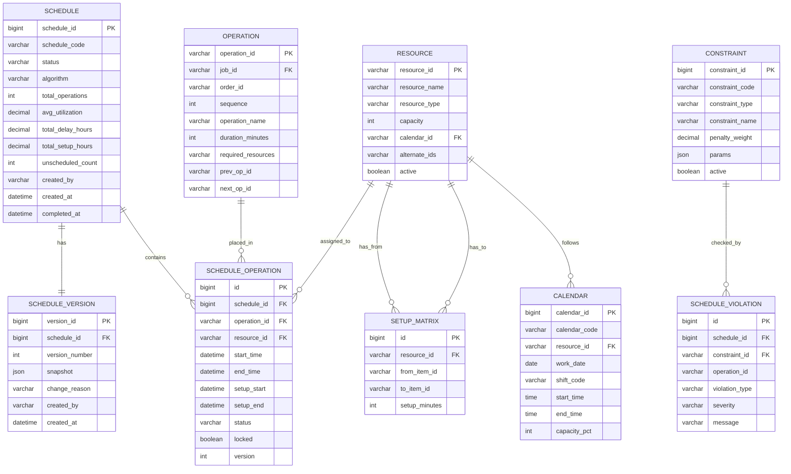

# 排程引擎数据库与API设计

## 核心表设计

### ER图



### 核心表字段说明

#### SCHEDULE 排程主表

| 字段 | 类型 | 说明 | 示例 |
|------|------|------|------|
| schedule_id | BIGINT PK | 排程ID，自增 | 1001 |
| schedule_code | VARCHAR(32) | 排程编码 | SCH-20260701-001 |
| status | VARCHAR(16) | 状态：DRAFT/RUNNING/COMPLETED/FAILED/PUBLISHED | COMPLETED |
| algorithm | VARCHAR(32) | 求解算法 | GREEDY+TABU_SEARCH |
| total_operations | INT | 总操作数 | 356 |
| avg_utilization | DECIMAL(5,4) | 平均资源利用率 | 0.8750 |
| total_delay_hours | DECIMAL(10,2) | 总延迟工时 | 24.50 |
| total_setup_hours | DECIMAL(10,2) | 总换型工时 | 18.00 |
| unscheduled_count | INT | 未排程操作数 | 3 |
| created_by | VARCHAR(32) | 创建人 | planner_zhang |
| created_at | DATETIME | 创建时间 | 2026-07-01 08:00:00 |
| completed_at | DATETIME | 完成时间 | 2026-07-01 08:05:30 |

#### SCHEDULE_OPERATION 排程结果表

| 字段 | 类型 | 说明 | 示例 |
|------|------|------|------|
| id | BIGINT PK | 自增ID | 50001 |
| schedule_id | BIGINT FK | 排程ID | 1001 |
| operation_id | VARCHAR(32) FK | 工序ID | OP-A001-10 |
| resource_id | VARCHAR(32) FK | 分配资源ID | CNC-A |
| start_time | DATETIME | 开始时间 | 2026-07-01 08:00:00 |
| end_time | DATETIME | 结束时间 | 2026-07-01 10:30:00 |
| setup_start | DATETIME | 换型开始时间 | 2026-07-01 07:30:00 |
| setup_end | DATETIME | 换型结束时间 | 2026-07-01 08:00:00 |
| status | VARCHAR(16) | 状态 | SCHEDULED |
| locked | BOOLEAN | 是否锁定 | false |
| version | INT | 乐观锁版本号 | 3 |

#### SETUP_MATRIX 换型矩阵表

| 字段 | 类型 | 说明 | 示例 |
|------|------|------|------|
| id | BIGINT PK | 自增ID | 1 |
| resource_id | VARCHAR(32) FK | 资源ID | INJECT-01 |
| from_item_id | VARCHAR(32) | 前产品ID | ITEM-WHITE |
| to_item_id | VARCHAR(32) | 后产品ID | ITEM-BLACK |
| setup_minutes | INT | 换型时间(分钟) | 30 |

## 甘特图数据结构

甘特图是APS系统的核心交互界面，其数据结构设计直接影响渲染性能和交互体验。

### 资源行模型

```typescript
// 甘特图数据结构定义
interface GanttData {
  resources: GanttResourceRow[];
  dependencies: GanttDependency[];
  timeRange: {
    start: string;  // ISO 8601
    end: string;
  };
}

interface GanttResourceRow {
  resourceId: string;
  resourceName: string;
  resourceType: 'MACHINE' | 'WORKER' | 'MOLD';
  bars: GanttBar[];
  // 当前时间指示器
  currentTime: string;
}

interface GanttBar {
  id: string;
  operationId: string;
  orderId: string;
  productName: string;
  start: number;           // Unix时间戳(ms)
  end: number;
  type: 'SETUP' | 'PROCESSING' | 'IDLE' | 'MAINTENANCE';
  status: 'SCHEDULED' | 'LOCKED' | 'IN_PROGRESS' | 'COMPLETED' | 'DELAYED';
  color: string;           // 按订单/产品/状态映射的颜色
  draggable: boolean;      // 锁定区不可拖拽
  resizable: boolean;
  tooltip: {
    orderNo: string;
    product: string;
    qty: number;
    duration: string;
    setupTime: string;
  };
}

interface GanttDependency {
  fromOperationId: string;
  toOperationId: string;
  type: 'FINISH_START' | 'START_START' | 'FINISH_FINISH';
}
```

### 甘特图数据API响应示例

```json
GET /api/v1/aps/schedules/1001/gantt
```

```json
{
  "timeRange": {
    "start": "2026-07-01T00:00:00+08:00",
    "end": "2026-07-08T00:00:00+08:00"
  },
  "resources": [
    {
      "resourceId": "CNC-A",
      "resourceName": "数控车床A",
      "resourceType": "MACHINE",
      "bars": [
        {
          "id": "bar-001",
          "operationId": "OP-A001-10",
          "orderId": "ORD-2026-001",
          "productName": "轴承A",
          "start": 1719792000000,
          "end": 1719801000000,
          "type": "SETUP",
          "status": "SCHEDULED",
          "color": "#FF9800",
          "draggable": true,
          "resizable": false,
          "tooltip": {
            "orderNo": "ORD-2026-001",
            "product": "轴承A",
            "qty": 100,
            "duration": "2h30m",
            "setupTime": "30m"
          }
        },
        {
          "id": "bar-002",
          "operationId": "OP-A001-10",
          "orderId": "ORD-2026-001",
          "productName": "轴承A",
          "start": 1719801000000,
          "end": 1719810000000,
          "type": "PROCESSING",
          "status": "SCHEDULED",
          "color": "#4CAF50",
          "draggable": true,
          "resizable": false,
          "tooltip": {
            "orderNo": "ORD-2026-001",
            "product": "轴承A",
            "qty": 100,
            "duration": "2h30m",
            "setupTime": "0"
          }
        }
      ]
    }
  ],
  "dependencies": [
    {
      "fromOperationId": "OP-A001-10",
      "toOperationId": "OP-A001-20",
      "type": "FINISH_START"
    }
  ]
}
```

## API设计

### 创建排程任务

```
POST /api/v1/aps/schedules
```

请求体：

```json
{
  "schedule_code": "SCH-20260701-001",
  "algorithm": "GREEDY+TABU_SEARCH",
  "parameters": {
    "horizon": {
      "start_date": "2026-07-01",
      "end_date": "2026-07-31"
    },
    "frozen_zone_days": 3,
    "objectives": [
      {"type": "MINIMIZE_DELAY", "weight": 0.4},
      {"type": "MAXIMIZE_UTILIZATION", "weight": 0.3},
      {"type": "MINIMIZE_SETUP", "weight": 0.3}
    ],
    "constraints": {
      "respect_calendar": true,
      "respect_capacity": true,
      "respect_material": false
    },
    "max_solve_time_sec": 300
  },
  "scope": {
    "order_ids": ["ORD-2026-001", "ORD-2026-002"],
    "resource_ids": ["CNC-A", "CNC-B", "MILL-01"]
  }
}
```

响应体：

```json
{
  "schedule_id": 1001,
  "schedule_code": "SCH-20260701-001",
  "status": "RUNNING",
  "task_id": "APS-TASK-20260701-001",
  "estimated_duration_sec": 180,
  "websocket_channel": "/ws/schedule/1001/progress"
}
```

### 获取排程结果

```
GET /api/v1/aps/schedules/1001
```

响应体：

```json
{
  "schedule_id": 1001,
  "schedule_code": "SCH-20260701-001",
  "status": "COMPLETED",
  "algorithm": "GREEDY+TABU_SEARCH",
  "kpis": {
    "total_operations": 356,
    "scheduled_operations": 353,
    "unscheduled_operations": 3,
    "avg_utilization": 0.875,
    "total_delay_hours": 24.5,
    "total_setup_hours": 18.0,
    "delayed_orders": 5,
    "solve_duration_sec": 142
  },
  "violations": [
    {
      "constraint_id": "C-001",
      "operation_id": "OP-C003-20",
      "violation_type": "SOFT",
      "severity": "WARNING",
      "message": "工序延迟4.5小时超过交期"
    }
  ],
  "created_at": "2026-07-01T08:00:00+08:00",
  "completed_at": "2026-07-01T08:05:30+08:00"
}
```

### 拖拽调整操作

```
PATCH /api/v1/aps/schedules/1001/operations/OP-A001-10/move
```

请求体：

```json
{
  "new_resource_id": "CNC-B",
  "new_start_time": "2026-07-01T09:00:00+08:00",
  "cascade": true,
  "reason": "CNC-A计划维护，调整至CNC-B"
}
```

响应体：

```json
{
  "success": true,
  "affected_operations": [
    {
      "operation_id": "OP-A001-10",
      "old_resource": "CNC-A",
      "new_resource": "CNC-B",
      "old_start": "2026-07-01T08:00:00+08:00",
      "new_start": "2026-07-01T09:00:00+08:00"
    },
    {
      "operation_id": "OP-A001-20",
      "old_start": "2026-07-01T10:30:00+08:00",
      "new_start": "2026-07-01T11:30:00+08:00"
    }
  ],
  "kpi_impact": {
    "avg_utilization_delta": -0.02,
    "total_delay_hours_delta": 1.5,
    "total_setup_hours_delta": 0.5
  },
  "new_version": 4
}
```

### 锁定/解锁操作

```
PUT /api/v1/aps/schedules/1001/operations/OP-A001-10/lock
```

请求体：

```json
{
  "locked": true,
  "reason": "已下发MES，锁定排程"
}
```

响应体：

```json
{
  "operation_id": "OP-A001-10",
  "locked": true,
  "locked_by": "planner_zhang",
  "locked_at": "2026-07-01T08:30:00+08:00"
}
```

### 插入急单

```
POST /api/v1/aps/schedules/1001/urgent-insert
```

请求体：

```json
{
  "order_id": "ORD-URGENT-001",
  "product_id": "ITEM-X999",
  "qty": 50,
  "due_date": "2026-07-03T18:00:00+08:00",
  "priority": 1,
  "reason": "VIP客户紧急需求",
  "reschedule_scope": "GLOBAL"
}
```

响应体：

```json
{
  "success": true,
  "inserted_operations": 4,
  "affected_operations": 28,
  "kpi_impact": {
    "avg_utilization_delta": 0.03,
    "total_delay_hours_delta": 8.5,
    "delayed_orders": 3
  },
  "new_version": 5,
  "diff_summary": {
    "added": 4,
    "moved": 24,
    "unchanged": 328
  }
}
```

## 甘特图WebSocket实时推送

排程求解和重排过程通过WebSocket实时推送到前端：

```python
# WebSocket消息协议
class ScheduleWebSocket:
    """排程进度WebSocket推送"""

    # 消息类型定义
    MSG_PROGRESS = "SCHEDULE_PROGRESS"
    MSG_COMPLETED = "SCHEDULE_COMPLETED"
    MSG_OPERATION_MOVED = "OPERATION_MOVED"
    MSG_VIOLATION_DETECTED = "VIOLATION_DETECTED"

    async def send_progress(self, schedule_id, progress):
        """推送求解进度"""
        await self.ws_manager.broadcast(
            channel=f"/ws/schedule/{schedule_id}/progress",
            message={
                "type": self.MSG_PROGRESS,
                "schedule_id": schedule_id,
                "progress_pct": progress.pct,
                "current_step": progress.step,
                "elapsed_sec": progress.elapsed,
                "estimated_remaining_sec": progress.estimated_remaining
            }
        )

    async def send_operation_moved(self, schedule_id, operation_id, old_pos, new_pos):
        """推送操作移动事件（多人协同场景）"""
        await self.ws_manager.broadcast(
            channel=f"/ws/schedule/{schedule_id}/gantt",
            message={
                "type": self.MSG_OPERATION_MOVED,
                "schedule_id": schedule_id,
                "operation_id": operation_id,
                "old_position": old_pos,
                "new_position": new_pos,
                "moved_by": "planner_zhang"
            }
        )
```

前端订阅示例（JavaScript）：

```javascript
const ws = new WebSocket('wss://aps.example.com/ws/schedule/1001/progress');

ws.onmessage = (event) => {
  const data = JSON.parse(event.data);

  switch (data.type) {
    case 'SCHEDULE_PROGRESS':
      updateProgressBar(data.progress_pct);
      updateStatusText(`正在求解: ${data.current_step}`);
      break;
    case 'SCHEDULE_COMPLETED':
      loadGanttChart(data.schedule_id);
      showNotification('排程完成');
      break;
    case 'OPERATION_MOVED':
      // 其他用户的拖拽操作实时同步到当前甘特图
      moveGanttBar(data.operation_id, data.new_position);
      break;
  }
};
```

## 排程版本管理

### 版本号+快照机制

每次排程操作（求解、拖拽、重排）都生成新版本，保留完整快照：

```python
class ScheduleVersionManager:
    """排程版本管理器"""

    def create_version(self, schedule_id, change_reason, created_by):
        """创建排程版本快照"""
        # 获取当前排程的所有操作
        operations = self.db.query(
            "SELECT * FROM schedule_operation WHERE schedule_id = %s",
            schedule_id
        )

        # 序列化为快照
        snapshot = {
            'operations': [self.serialize_op(op) for op in operations],
            'kpis': self.calculate_kpis(operations)
        }

        # 获取当前最大版本号
        max_version = self.db.query_val(
            "SELECT COALESCE(MAX(version_number), 0) FROM schedule_version "
            "WHERE schedule_id = %s",
            schedule_id
        )

        # 插入新版本
        self.db.execute(
            "INSERT INTO schedule_version "
            "(schedule_id, version_number, snapshot, change_reason, created_by) "
            "VALUES (%s, %s, %s, %s, %s)",
            schedule_id, max_version + 1,
            json.dumps(snapshot), change_reason, created_by
        )

        return max_version + 1
```

### 排程结果对比（Diff算法）

```python
class ScheduleDiffer:
    """排程版本对比"""

    def diff(self, schedule_id, version_a, version_b):
        """对比两个版本的排程差异"""
        snap_a = self.get_snapshot(schedule_id, version_a)
        snap_b = self.get_snapshot(schedule_id, version_b)

        ops_a = {op['operation_id']: op for op in snap_a['operations']}
        ops_b = {op['operation_id']: op for op in snap_b['operations']}

        result = ScheduleDiff(
            version_a=version_a,
            version_b=version_b,
            added=[],       # 新增的操作
            removed=[],     # 移除的操作
            moved=[],       # 时间或资源变更的操作
            unchanged=[]    # 未变更的操作
        )

        all_op_ids = set(ops_a.keys()) | set(ops_b.keys())

        for op_id in all_op_ids:
            if op_id not in ops_a:
                result.added.append(ops_b[op_id])
            elif op_id not in ops_b:
                result.removed.append(ops_a[op_id])
            else:
                a, b = ops_a[op_id], ops_b[op_id]
                if (a['start_time'] != b['start_time'] or
                    a['resource_id'] != b['resource_id']):
                    result.moved.append({
                        'operation_id': op_id,
                        'old_start': a['start_time'],
                        'new_start': b['start_time'],
                        'old_resource': a['resource_id'],
                        'new_resource': b['resource_id'],
                        'time_delta_minutes': self.calc_time_delta(a, b)
                    })
                else:
                    result.unchanged.append(op_id)

        # KPI对比
        result.kpi_diff = {
            'avg_utilization': snap_b['kpis']['avg_utilization'] - snap_a['kpis']['avg_utilization'],
            'total_delay_hours': snap_b['kpis']['total_delay_hours'] - snap_a['kpis']['total_delay_hours'],
            'total_setup_hours': snap_b['kpis']['total_setup_hours'] - snap_a['kpis']['total_setup_hours']
        }

        return result
```

对比API：

```
GET /api/v1/aps/schedules/1001/diff?version_a=3&version_b=5
```

响应体：

```json
{
  "version_a": 3,
  "version_b": 5,
  "summary": {
    "added": 4,
    "removed": 0,
    "moved": 24,
    "unchanged": 328
  },
  "kpi_diff": {
    "avg_utilization": 0.03,
    "total_delay_hours": 8.5,
    "total_setup_hours": 2.0
  },
  "moved_details": [
    {
      "operation_id": "OP-B002-10",
      "old_start": "2026-07-02T08:00:00+08:00",
      "new_start": "2026-07-02T14:00:00+08:00",
      "old_resource": "CNC-A",
      "new_resource": "CNC-A",
      "time_delta_minutes": 360
    }
  ]
}
```

## 开发者实战Tips

1. **时间戳统一用UTC**：数据库存储UTC时间，API返回ISO 8601带时区格式，前端按用户时区渲染，避免时区混乱
2. **大结果分页**：排程结果API支持分页（按资源或按订单分页），避免一次性返回数千条操作数据
3. **WebSocket断线重连**：前端WebSocket断线后自动重连，重连时通过版本号同步最新状态
4. **快照压缩**：排程快照JSON通常较大（>1MB），存储前用gzip压缩，读取时解压，节省70%+存储空间
5. **乐观锁防冲突**：甘特图拖拽使用乐观锁（version字段），提交时检查版本号，冲突时提示用户刷新
6. **换型矩阵预热**：排程前将换型矩阵加载到内存HashMap中，避免求解过程中频繁查库
7. **慢查询监控**：排程结果查询超过2秒时记录慢查询日志，常见原因是缺少`schedule_id + operation_id`的复合索引
