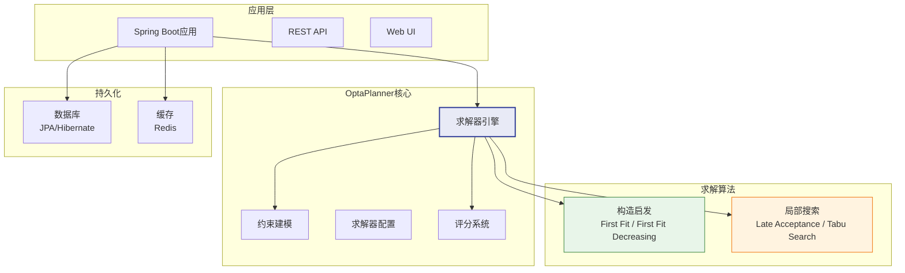

# OptaPlanner深度解析

## OptaPlanner项目介绍

OptaPlanner是Red Hat开源的约束满足优化引擎，用于高效求解资源分配和调度问题。它是目前最成熟的开源排程优化框架之一。

| 属性 | 说明 |
|------|------|
| 开源协议 | Apache License 2.0 |
| 开发语言 | Java / Kotlin |
| 所属组织 | Red Hat（原JBoss） |
| 项目地址 | github.com/TimefoldAI/optaplanner |
| 最新版本 | 9.x（已迁移至Timefold） |
| 适用场景 | 员工排班、课程表、车辆路径、生产排程 |

> 注：2023年OptaPlanner核心团队从Red Hat独立，创建了Timefold.ai，项目名称也更新为Timefold Solver。本文基于OptaPlanner 9.x版本进行解析，核心概念与Timefold一致。

## 技术栈



### 核心依赖

- **Java 11+**：运行环境
- **Spring Boot**：应用框架（可选但推荐）
- **JPA/Hibernate**：数据持久化
- **Drools**：规则引擎，用于约束定义（可选）

## 约束建模

OptaPlanner的约束建模支持两种方式：DRL规则和约束提供器（Constraint Provider）。

### DRL规则

DRL（Drools Rule Language）是基于Drools规则引擎的约束定义方式：

```java
rule "同一资源上的工序不能重叠"
    when
        $op1 : Operation(resource == $resource, startTime < $op2.endTime)
        $op2 : Operation(resource == $resource, startTime < $op1.endTime)
    then
        scoreHolder.addHardConstraintMatch(kcontext, -1000);
end

rule "延迟交期惩罚"
    when
        $order : Order(dueDate < completionTime)
    then
        long delayDays = ChronoUnit.DAYS.between($order.getDueDate(), $order.getCompletionTime());
        scoreHolder.addSoftConstraintMatch(kcontext, -(int)delayDays);
end
```

### 约束提供器（Constraint Provider）

约束提供器是更推荐的Java流式API方式：

```java
@ConstraintProvider
public class SchedulingConstraintProvider implements ConstraintProvider {

    @Override
    public Constraint[] defineConstraints(ConstraintFactory factory) {
        return new Constraint[] {
            resourceConflict(factory),
            dueDatePenalty(factory),
            setupTimePenalty(factory)
        };
    }

    // 硬约束：同一资源上的工序不能重叠
    Constraint resourceConflict(ConstraintFactory factory) {
        return factory.forEach(Operation.class)
                .join(Operation.class)
                .filter((op1, op2) -> op1.getResource().equals(op2.getResource())
                        && op1.overlaps(op2))
                .penalize(HardSoftScore.ONE_HARD)
                .asConstraint("资源冲突");
    }

    // 软约束：延迟交期惩罚
    Constraint dueDatePenalty(ConstraintFactory factory) {
        return factory.forEach(Operation.class)
                .filter(op -> op.getEndTime().isAfter(op.getOrder().getDueDate()))
                .penalize(HardSoftScore.ONE_SOFT,
                        op -> (int) ChronoUnit.HOURS.between(
                            op.getOrder().getDueDate(), op.getEndTime()))
                .asConstraint("交期延迟");
    }
}
```

### 评分系统

OptaPlanner使用评分系统评估解的质量：

| 评分类型 | 说明 | 适用场景 |
|----------|------|----------|
| HardSoftScore | 硬约束+软约束 | 最常用，硬约束不可违反 |
| HardMediumSoftScore | 硬约束+中等约束+软约束 | 三级优先级 |
| BendableScore | 可变级别的约束 | 动态优先级 |

评分规则：
- **硬约束分数**必须为0（可行解），负值越大越不可行
- **软约束分数**越接近0越好（优化目标）
- 先满足硬约束，再优化软约束

## 求解器配置

### 构造启发（Construction Heuristic）

构造启发用于快速生成初始可行解：

| 算法 | 说明 | 特点 |
|------|------|------|
| First Fit | 按顺序将实体分配到第一个可用的槽位 | 最快，解质量一般 |
| First Fit Decreasing | 先按难度降序排列再First Fit | 改善解质量 |
| Weakest Fit | 分配到剩余容量最大的槽位 | 均衡分配 |
| Strongest Fit | 分配到剩余容量最小的槽位 | 集中分配 |
| Cheapest Insertion | 分配到代价最小的位置 | 解质量较好 |

### 局部搜索（Local Search）

局部搜索在初始解基础上进一步优化：

| 算法 | 说明 | 特点 |
|------|------|------|
| Late Acceptance | 接受比近期历史最优更好的解 | 收敛快，效果好 |
| Tabu Search | 禁忌近期访问过的解 | 避免循环 |
| Simulated Annealing | 以递减概率接受劣解 | 跳出局部最优 |
| Step Counting Hill Climbing | 计数式爬山 | 简单有效 |

### 求解器配置示例

```xml
<solver>
    <scoreDirectoryScore>hardSoft</scoreDirectoryScore>
    <entityClass>com.example.Operation</entityClass>

    <constructionHeuristic>
        <constructionHeuristicType>FIRST_FIT_DECREASING</constructionHeuristicType>
    </constructionHeuristic>

    <localSearch>
        <unionMoveSelector>
            <changeMoveSelector/>
            <swapMoveSelector/>
        </unionMoveSelector>
        <acceptor>
            <lateAcceptanceSize>400</lateAcceptanceSize>
        </acceptor>
        <forager>
            <acceptedCountLimit>1</acceptedCountLimit>
        </forager>
        <termination>
            <minutesSpentLimit>5</minutesSpentLimit>
        </termination>
    </localSearch>
</solver>
```

## 课程表示例

OptaPlanner官方提供了课程表（Course Scheduling）示例，展示了基本的排程建模方法：

### 问题定义

- 一组课程需要分配到时间段和教室
- 约束：同一时间同一教室只能有一门课、同一老师不能同时上两门课、同一学生不能同时上两门课
- 优化：减少空课、偏好特定时段

### 核心模型

```java
@PlanningEntity
public class Lesson {
    private String subject;
    private String teacher;
    private String studentGroup;

    @PlanningVariable(valueRangeProviderRefs = "timeslotRange")
    private Timeslot timeslot;

    @PlanningVariable(valueRangeProviderRefs = "roomRange")
    private Room room;
}
```

### 约束定义

```java
// 硬约束：同一老师不能同时上两门课
Constraint teacherConflict(ConstraintFactory factory) {
    return factory.forEach(Lesson.class)
            .join(Lesson.class)
            .filter((l1, l2) -> l1.getTeacher().equals(l2.getTeacher())
                    && l1.getTimeslot().equals(l2.getTimeslot()))
            .penalize(HardSoftScore.ONE_HARD)
            .asConstraint("教师冲突");
}
```

## 员工排班示例

员工排班是OptaPlanner的另一个经典应用场景：

### 问题定义

- 为一组员工分配一周的班次
- 约束：技能匹配、每日最大工时、连续工作天数限制、休息天数
- 优化：公平分配班次、偏好员工意愿

### 核心模型

```java
@PlanningEntity
public class ShiftAssignment {
    private Shift shift;    // 班次（时间+岗位）
    
    @PlanningVariable(valueRangeProviderRefs = "employeeRange")
    private Employee employee;
}
```

### 关键约束

| 约束 | 类型 | 说明 |
|------|------|------|
| 技能匹配 | 硬约束 | 员工必须具备岗位所需技能 |
| 每日最大工时 | 硬约束 | 同一员工一天不超过10小时 |
| 连续工作天数 | 硬约束 | 连续工作不超过6天 |
| 最少休息时间 | 硬约束 | 两个班次间至少休息11小时 |
| 班次偏好 | 软约束 | 员工偏好的班次优先 |
| 公平分配 | 软约束 | 尽量均衡分配班次 |

## 与Spring Boot集成

### 依赖配置

```xml
<dependency>
    <groupId>org.optaplanner</groupId>
    <artifactId>optaplanner-spring-boot-starter</artifactId>
</dependency>
```

### 求解器服务

```java
@Service
public class SchedulingService {

    @Autowired
    private SolverManager<SchedulingSolution, Long> solverManager;

    // 异步求解
    public JobId solve(SchedulingSolution problem) {
        return solverManager.solveAndListen(
            problem.getId(),
            problem,
            this::onBestSolutionChange
        );
    }

    // 获取求解状态
    public SchedulingSolution getSolution(Long id) {
        return solverManager.getSolverStatus(id);
    }

    // 停止求解
    public void stopSolving(Long id) {
        solverManager.terminateEarly(id);
    }
}
```

### 关键特性

- **异步求解**：SolverManager支持异步求解，不阻塞主线程
- **实时更新**：求解过程中可以动态添加或修改问题实体
- **多实例**：支持同时运行多个求解实例
- **持久化**：配合Spring Data JPA实现求解状态的持久化

## 部署实践

| 部署方式 | 说明 | 适用场景 |
|----------|------|----------|
| Spring Boot Jar | 单机部署 | 小规模、低并发 |
| Docker容器 | 容器化部署 | 中等规模、CI/CD |
| Kubernetes | 编排部署 | 大规模、高可用 |
| Quarkus原生 | GraalVM原生编译 | 极致启动速度 |

### 性能调优

- **求解时间**：根据业务需求设置合理的时间限制
- **移动选择器**：只使用有效的Move类型，减少无效搜索
- **并行求解**：多线程并行求解同一问题的不同策略
- **增量计算**：约束提供器使用增量计算，避免重复计算

## 与商业APS对比

| 维度 | OptaPlanner | Opcenter APS |
|------|-------------|-------------|
| 排程能力 | 约束满足+启发式优化 | 多算法混合+深度优化 |
| 甘特图 | 需自行开发 | 专业级甘特图组件 |
| 交互调整 | 需自行开发 | 拖拽式交互 |
| 换型时间矩阵 | 需自行建模 | 内置支持 |
| 替代资源 | 需自行建模 | 内置支持 |
| 冻结区 | 需自行实现 | 内置支持 |
| What-If | 需自行实现 | 内置支持 |
| 开发成本 | 高（需要开发团队） | 低（配置为主） |
| 许可成本 | 免费 | 百万级 |
| 定制灵活性 | 极高 | 有限 |
| 适用规模 | 中小规模 | 大规模 |
| 技术门槛 | 高（Java/优化算法） | 中（业务配置为主） |

OptaPlanner适合有技术实力、需要深度定制的中型企业，或作为大型系统中的排程优化组件。对于需要开箱即用、大规模排程、丰富交互的企业，商业APS仍是更好的选择。
