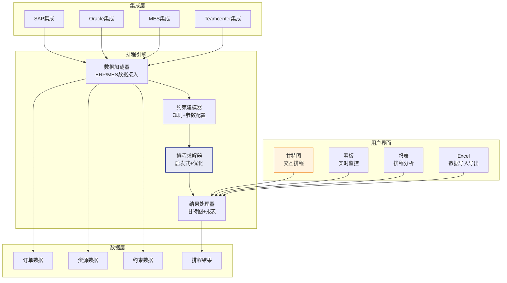

# Opcenter APS架构解析

## Opcenter APS产品历史

Opcenter APS是Siemens数字化制造软件家族中的高级排程产品，其发展历史可追溯到英国Preactor International公司开发的Preactor排程软件。

### 产品演进

| 阶段 | 产品 | 特点 |
|------|------|------|
| 早期 | Preactor 200 | 单机版，适合中小型工厂 |
| 发展期 | Preactor 400 | 支持大规模排程，多资源多约束 |
| 成熟期 | Preactor 400 FCS | 有限产能排程，完整约束建模 |
| Siemens时代 | Opcenter APS Scheduling | 与Siemens产品线集成 |
| 当前 | Opcenter APS | 云化、AI增强、与Teamcenter/Xcelerator集成 |

## APS模块

Opcenter APS按功能层次分为三个模块：

### 计划模块（Planning）

关注中长期的产能计划和物料计划：

| 功能 | 说明 | 时间范围 |
|------|------|----------|
| 产能计划 | 评估中长期产能需求与供给 | 周/月 |
| 物料计划 | 评估中长期物料需求与供给 | 周/月 |
| S&OP支持 | 为S&OP提供产能和物料可行性分析 | 月 |
| 齐套分析 | 评估订单的物料齐套情况 | 周 |

### 排程模块（Scheduling）

关注短期的详细工序排程，是Opcenter APS的核心模块：

| 功能 | 说明 | 时间范围 |
|------|------|----------|
| 详细排程 | 工序级排产，精确到分钟 | 日/周 |
| 约束建模 | 产能、物料、模具、人员等约束 | - |
| 换型优化 | 序列依赖换型时间优化 | - |
| 替代资源 | 主/备资源自动选择 | - |
| 甘特图 | 资源/订单甘特图交互 | - |

### 优化模块（Optimization）

在排程基础上进行多目标优化：

| 功能 | 说明 |
|------|------|
| 多目标优化 | 交期/利用率/换型等目标权衡 |
| What-If模拟 | 多场景对比分析 |
| 排程评估 | KPI指标计算和可视化 |
| 方案推荐 | AI推荐最优排程方案 |

## 技术架构

### 内存计算架构

Opcenter APS采用内存计算架构，所有排程数据加载到内存中进行计算：

- **快速加载**：数据从数据库加载到内存，通常在秒级完成
- **内存计算**：排程计算完全在内存中进行，无需数据库交互
- **增量更新**：支持数据的增量加载，仅更新变化的部分
- **结果持久化**：排程结果可保存到数据库

### 多线程计算

- **并行求解**：支持多线程并行执行不同阶段的计算
- **异步计算**：长时间求解不阻塞用户界面
- **实时响应**：用户交互（拖拽、过滤）优先级高于后台计算

## 约束建模方法

Opcenter APS提供丰富的约束建模能力，几乎覆盖了制造排程中的所有约束类型：

### 内置约束类型

| 约束类型 | 建模方式 | 参数 |
|----------|----------|------|
| 产能约束 | 资源日历+产能定义 | 工作时间、班次、效率 |
| 物料约束 | 物料可用性检查 | 在库量、在途量、预计到货 |
| 换型约束 | 换型矩阵 | 序列依赖换型时间表 |
| 模具约束 | 模具资源定义 | 模具数量、占用时间 |
| 人员约束 | 技能矩阵+人员日历 | 技能匹配、可用时间 |
| 优先级约束 | 订单/工序优先级 | 优先级权重 |
| 时间窗约束 | 最早/最晚开始时间 | 时间窗参数 |
| 替代约束 | 替代资源/路线 | 替代优先级、效率系数 |

### 约束配置方式

- **图形化配置**：通过配置界面设置约束参数，无需编程
- **表格化配置**：通过Excel表格批量导入约束参数
- **脚本扩展**：通过VBScript或C#编写自定义约束逻辑

## 算法引擎

Opcenter APS采用启发式+优化的混合算法策略：

### 排程算法

| 算法 | 说明 | 应用阶段 |
|------|------|----------|
| 正向排程 | 从当前时间开始向前安排工序 | 初始解构造 |
| 反向排程 | 从交期开始向后倒推工序 | 交期驱动的排程 |
| 瓶颈排程 | 优先安排瓶颈资源上的工序 | 瓶颈优化 |
| 遗传算法 | 基于种群的元启发式搜索 | 全局优化 |
| 局部搜索 | 基于邻域的迭代改善 | 局部优化 |

### 算法组合策略

1. **构造阶段**：使用正向排程或瓶颈排程快速生成初始可行解
2. **优化阶段**：使用遗传算法或局部搜索在可行解邻域内搜索更优解
3. **交互阶段**：计划员通过甘特图微调排程结果

### 算法参数调优

| 参数 | 说明 | 影响 |
|------|------|------|
| 求解时间限制 | 算法运行的最大时间 | 时间越长解质量越好 |
| 种群大小 | 遗传算法的种群规模 | 影响搜索多样性 |
| 变异概率 | 遗传算法的变异率 | 影响跳出局部最优的能力 |
| 禁忌长度 | 禁忌搜索的禁忌表长度 | 影响避免循环的效果 |

## 甘特图组件

Opcenter APS的甘特图组件是其核心竞争力之一，提供了专业级的排程可视化能力。

### 甘特图类型

| 类型 | 说明 | 核心用途 |
|------|------|----------|
| 资源甘特图 | 以资源为维度展示工序排布 | 查看资源利用情况 |
| 订单甘特图 | 以订单为维度展示工序流转 | 查看订单进度 |
| 负载甘特图 | 展示资源的产能负载 | 识别瓶颈资源 |
| 库存甘特图 | 展示物料的库存变化 | 物料齐套分析 |

### 交互功能

- **拖拽排程**：拖拽工序调整时间和资源
- **缩放**：时间轴缩放（分钟→日→周→月）
- **过滤**：按资源、订单、产品过滤
- **着色**：按多种维度着色（交期状态、产品类型、客户）
- **分组**：按资源组、产品族分组显示
- **打印**：导出甘特图为PDF或图片

### 实时更新

甘特图支持与MES的实时集成：

- 工序完工后甘特图自动更新
- 设备故障后实时显示受影响的工序
- 延迟工序自动标记为红色

## 与Teamcenter/SAP集成

### 与Siemens Teamcenter集成

| 集成点 | 方向 | 数据 |
|--------|------|------|
| Teamcenter→APS | 工艺路线 | BOM、工序、资源需求 |
| Teamcenter→APS | 制造特征 | 加工参数、质量要求 |
| APS→Teamcenter | 排程结果 | 工序时间、资源分配 |

### 与SAP集成

| 集成点 | 方向 | 数据 |
|--------|------|------|
| SAP→APS | 生产订单 | 订单、BOM、工艺路线 |
| SAP→APS | 物料信息 | 库存、在途、预计到货 |
| APS→SAP | 排程结果 | 计划订单、工序排程 |
| APS→SAP | 交期承诺 | 基于排程的ATP |

集成方式：
- **SAP RFC/BAPI**：直接调用SAP接口，实时性高
- **中间文件**：通过XML/CSV文件交换，适合批量数据
- **SAP MII**：通过SAP Manufacturing Integration and Intelligence中间件

## 大规模排程（10000+工序）

Opcenter APS在大规模排程场景下的技术要点：

### 分层排程

将大规模问题分解为多个层次：

1. **工厂层排程**：确定各车间的产能分配（粗排程）
2. **车间层排程**：确定各产线的工序顺序（细排程）
3. **单元层排程**：确定各机器的详细排程（精排程）

### 分区排程

将工厂按区域或产线划分为独立的排程区域：

- 每个区域独立排程，减少问题规模
- 区域之间通过交接点约束关联
- 支持分布式并行排程

### 性能优化

| 优化措施 | 说明 | 效果 |
|----------|------|------|
| 内存数据结构 | 使用高效的内存数据结构 | 减少内存占用50% |
| 增量计算 | 仅重算受影响的部分 | 计算速度提升5-10倍 |
| 多线程求解 | 并行搜索多个方向 | 充分利用多核CPU |
| 约束松弛 | 放松非关键约束加速求解 | 减少求解时间30-50% |
| 近似算法 | 对非关键区域使用快速近似 | 整体速度提升2-3倍 |

## 行业解决方案

Opcenter APS针对不同行业提供了预配置的解决方案：

| 行业 | 核心挑战 | 解决方案要点 |
|------|----------|-------------|
| 汽车零部件 | 多品种混线生产、JIS交付 | 换型优化+冻结区+急单响应 |
| 电子制造 | SMT高速贴片、多品种小批量 | 序列依赖换型+替代资源+多目标优化 |
| 食品饮料 | 保质期约束、批次追溯、季节性 | 保质期约束+配方管理+CIP清洗排程 |
| 制药 | GMP合规、批次管理、验证批次 | 合规约束+批次追溯+验证排程 |
| 航空航天 | 长周期、高精度、多级BOM | 多级排程+资源认证+质量约束 |
| 机械加工 | 多工序、多资源、多替代 | 替代路线+技能约束+模具管理 |
