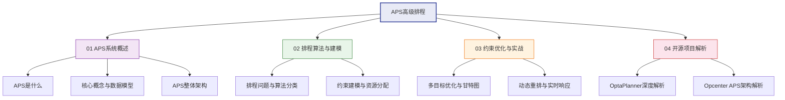

# APS高级排程

高级排程（Advanced Planning and Scheduling, APS）是制造执行层的核心系统，它通过有限产能约束下的优化排产，帮助企业实现"可执行的生产计划"。APS与ERP的无限产能MRP形成互补，与MES的执行反馈形成闭环，是制造企业从"能做多少"到"最优做多少"的关键跨越。

## 学习路线

## 参考产品

| 产品 | 厂商 | 核心能力 | 适用场景 |
|------|------|----------|----------|
| Opcenter APS | Siemens | 有限产能排程、启发式+优化、甘特图交互 | 多行业制造、大规模排程 |
| PlanetTogether | PlanetTogether | 易用甘特图、拖拽排程、实时可视化 | 中大型制造、快速实施 |
| DELMIA Quintiq | Dassault | 大规模组合优化、AI驱动 | 复杂制造、物流、人员排班 |
| 开源OptaPlanner | Red Hat | 约束满足、启发式求解、Java生态 | 中小场景、定制化需求 |

## 章节目录

- **01 APS系统概述**：APS定义、与ERP差异、核心概念、整体架构
- **02 排程算法与建模**：排程问题分类、算法对比、约束建模
- **03 约束优化与实战**：多目标优化、甘特图交互、动态重排
- **04 开源项目解析**：OptaPlanner深度剖析、Opcenter APS架构解析
