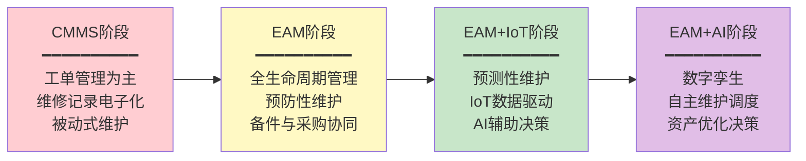
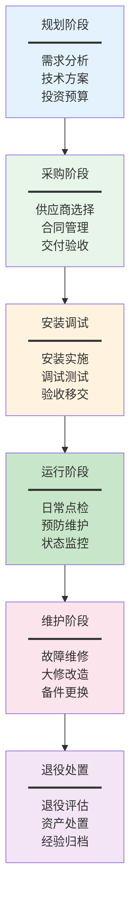
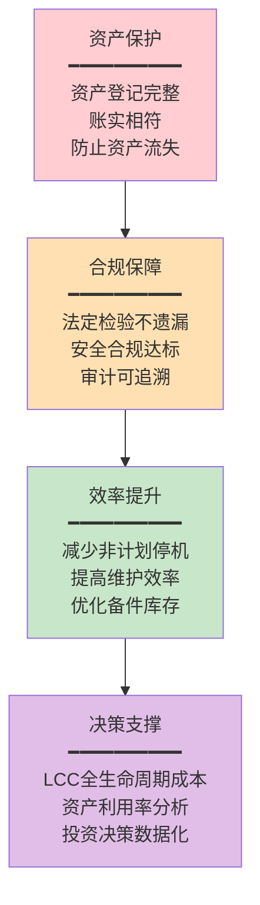

# EAM是什么

## EAM的定义

EAM（Enterprise Asset Management，企业资产管理）是以设备资产为核心，对资产从规划、采购、安装、运行、维护到退役的全生命周期进行系统化管理的企业级信息平台。Gartner将EAM定义为："最大化资产可用性、延长资产寿命、降低维护成本、提升资产投资回报率的综合管理解决方案"。

EAM的核心目标是回答三个关键问题：**资产在哪里？资产状态如何？资产成本多少？** 通过对这三个问题的持续回答，实现资产价值的最大化。

## EAM与MES设备模块的区别

EAM与MES中的设备管理模块经常被混淆，但两者在管理定位、覆盖范围和数据深度上存在本质差异：

| 对比维度 | EAM系统 | MES设备模块 |
|---------|---------|------------|
| 管理定位 | 全生命周期管理，从采购到退役 | 实时监控，聚焦生产运行 |
| 核心目标 | 最大化资产价值和可用性 | 保障生产设备稳定运行 |
| 管理范围 | 覆盖全企业所有资产（生产/非生产） | 仅覆盖生产相关设备 |
| 功能深度 | 资产登记/工单/预防维护/备件/采购/财务 | 设备状态/参数采集/OEE/报警 |
| 时间维度 | 全生命周期（年/十年） | 生产周期（秒/分钟/小时） |
| 成本视角 | 全寿命周期成本LCC分析 | 设备停机损失分析 |
| 典型用户 | 设备部/维修部/采购部/财务部 | 生产部/工艺部 |

**简言之：EAM管全生命周期，MES管实时运行状态。** EAM回答"这台设备的全生命成本是多少、什么时候该维修、备件准备好了吗"，MES回答"这台设备现在在干什么、效率如何、什么时候会停"。

## 从CMMS到EAM的演进

EAM不是凭空出现的，而是从CMMS（Computerized Maintenance Management System，计算机化维护管理系统）逐步演进而来：

| 演进阶段 | 时间 | 核心能力 | 代表产品 |
|---------|------|---------|---------|
| CMMS | 1980s-1990s | 工单管理、维修记录 | Maximo Classic |
| EAM | 2000s-2010s | 全生命周期管理、预防性维护 | IBM Maximo 7.x |
| EAM+IoT | 2015-2020 | IoT数据接入、预测性维护 | IBM MAS 7.x |
| EAM+AI | 2020-至今 | AI决策、数字孪生 | IBM MAS 8.x |

**CMMS与EAM的核心区别**：CMMS只管维护（工单+维修记录），EAM管全生命周期（资产+维护+备件+采购+财务）。EAM可以理解为CMMS的升级版，但不仅是功能的增加，更是管理理念的升级——从"坏了再修"到"全生命优化"。

## 设备全生命周期管理

EAM的核心理念是设备全生命周期管理，覆盖从设备规划到退役的每个阶段：

每个阶段在EAM中的关键活动：

| 生命周期阶段 | EAM关键活动 | 核心数据 |
|-------------|------------|---------|
| 规划 | 需求登记、可行性评估、预算编制 | 需求文档、投资回报分析 |
| 采购 | 供应商评估、采购申请、合同管理 | 采购订单、供应商评估记录 |
| 安装调试 | 安装记录、调试参数、验收签字 | 安装报告、调试记录、验收单 |
| 运行 | 资产登记、日常点检、性能监控 | 资产台账、点检记录、运行数据 |
| 维护 | 工单管理、预防维护、故障分析 | 工单记录、PM计划、故障代码 |
| 退役 | 退役评估、残值计算、处置记录 | 退役报告、残值评估、处置单 |

## EAM的4层价值

### 第1层：资产保护价值

确保资产的安全和完整，防止资产流失和损坏。通过完整的资产登记和台账管理，企业清楚知道"我们有什么、在哪里、值多少"。这是EAM最基础的价值，但很多企业仍然做不好——资产不清、账实不符是普遍问题。

### 第2层：合规价值

满足法规和行业标准对设备管理的要求。在能源、化工、制药等行业，设备管理合规是硬性要求：

- 特种设备必须定期检验（法规要求）
- 安全阀必须按期校验（安全要求）
- 计量设备必须按期检定（质量要求）
- 消防设备必须按期检查（消防要求）

EAM通过预防性维护计划和到期提醒，确保不遗漏任何合规性检查。

### 第3层：效率价值

通过优化维护策略和工单管理，提高维护效率、减少设备停机时间：

- 预防性维护减少突发故障
- 工单调度优化提高维修人员效率
- 备件管理优化减少等待时间
- 知识库积累提高故障诊断速度

### 第4层：决策价值

基于全生命周期数据分析，支撑资产投资和运营决策：

- 全寿命周期成本（LCC）分析，决定维修还是更换
- 设备故障趋势分析，优化维护策略
- 资产利用率分析，识别闲置和低效资产
- 维护成本归集，支撑财务决策

## 商业产品对比

| 产品 | 供应商 | 核心优势 | 典型行业 | 集成能力 |
|------|--------|---------|---------|---------|
| IBM Maximo | IBM | 资产密集型行业标杆、IoT+AI、10万+资产 | 能源、交通、大型制造 | Watson IoT、SAP、Oracle |
| SAP PM | SAP | 与SAP ERP深度集成、财务资产一体化 | 流程行业、大型制造 | SAP全生态 |
| Infor EAM | Infor | 中端市场、行业解决方案、云原生 | 制造、公共事业、医疗 | Infor CloudSuite |
| IFS EAM | IFS | 项目型资产管理、航空MRO | 航空、国防、工程 | IFS Applications |
| eMaint | Fluke | 中小企业友好、移动端优先 | 中小制造、设施管理 | Fluke检测设备 |

### 选型建议

| 企业特征 | 推荐产品 | 理由 |
|---------|---------|------|
| 超大型企业（10万+资产） | IBM Maximo | 大规模部署能力，IoT+AI |
| SAP ERP用户 | SAP PM | 原生集成，财务一体化 |
| 中端市场（千-万级资产） | Infor EAM | 性价比高，行业方案成熟 |
| 中小企业 | MaintainX / eMaint | 低成本、快速部署、移动友好 |

## 总结

EAM是设备资产全生命周期管理的核心系统，与MES设备模块形成"全生命管理+实时监控"的协同关系。从CMMS到EAM+AI的演进，反映了设备管理从被动维修到主动优化的理念升级。理解EAM的定义、全生命周期管理和四层价值模型，是深入学习EAM各功能模块的基础。下一章将深入EAM的核心业务概念与数据模型设计。
