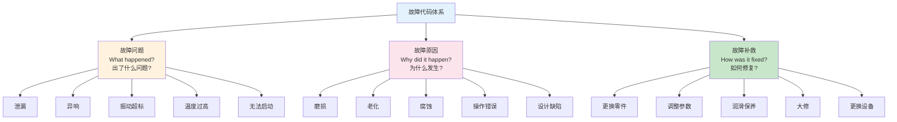
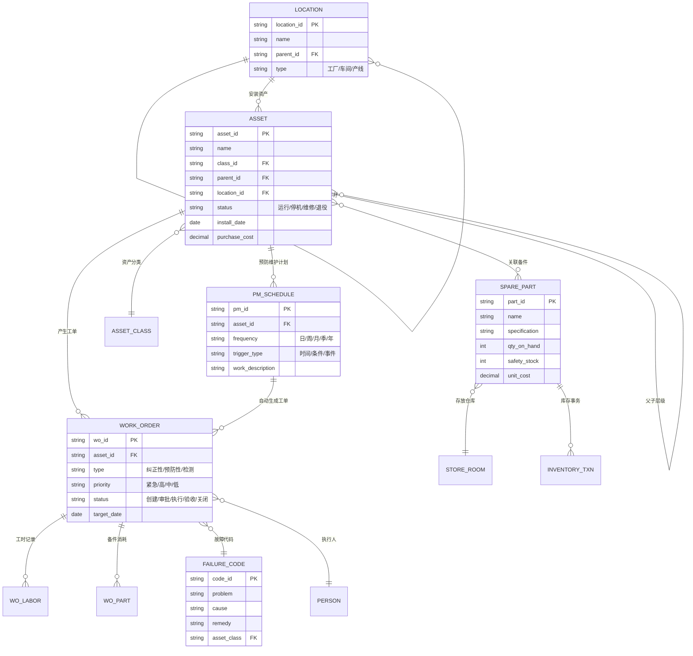

# 核心概念与数据模型

## 核心业务对象

EAM系统围绕以下核心业务对象构建，这些对象的关联构成了设备资产全生命周期管理的完整数据链路：

| 核心对象 | 说明 | 关键属性 |
|---------|------|---------|
| 资产 | EAM管理的核心实体，代表一个设备或设备组件 | 资产编号、名称、类别、位置、状态、原值 |
| 位置 | 资产安装或存放的物理/逻辑位置 | 位置编号、名称、层级、所属工厂 |
| 工单 | 维修、检查、保养等工作任务的载体 | 工单号、类型、优先级、设备、状态 |
| 预防性维护 | 按计划周期或条件触发的维护任务模板 | PM编号、触发条件、工作内容、频次 |
| 备件 | 用于设备维修和保养的零部件 | 备件号、名称、规格、库存数量、安全库存 |
| 故障代码 | 标准化的故障描述体系 | 故障代码、问题描述、故障类别 |

这些对象的关系可以概括为：**资产在位置上运行 → 预防性维护计划保护资产 → 工单执行维护任务 → 备件支撑工单执行 → 故障代码标准化问题记录**。

## 资产层级

EAM中的资产按照组织结构和物理关系建立层级，从企业到子组件的多级层次：

```
企业
├── 工厂A
│   ├── 冲压车间
│   │   ├── 冲压产线1
│   │   │   ├── 800T冲压机（设备）
│   │   │   │   ├── 主电机（子组件）
│   │   │   │   ├── 液压系统（子组件）
│   │   │   │   └── 控制系统（子组件）
│   │   │   └── 500T冲压机（设备）
│   │   └── 冲压产线2
│   ├── 焊接车间
│   └── 涂装车间
└── 工厂B
    ├── 机加工车间
    └── 装配车间
```

| 层级 | 说明 | EAM中的用途 |
|------|------|------------|
| 企业 | 集团/公司级别 | 全局报表、跨工厂对比 |
| 工厂 | 制造基地 | 工厂级KPI、成本中心 |
| 车间 | 生产区域 | 车间级维护计划 |
| 产线 | 生产流水线 | 产线OEE、停机分析 |
| 设备 | 独立功能设备 | 设备级维护、故障分析 |
| 子组件 | 设备的可更换部件 | 精确定位故障、备件关联 |

**资产层级的设计原则**：

- **颗粒度适当**：不是越细越好，应与维护管理需求匹配
- **可扩展性**：层级设计应支持未来新增设备类型
- **一致性**：全公司使用统一的层级标准
- **业务驱动**：层级划分服务于维护管理和成本分析

## 资产登记卡

资产登记卡（Asset Register Card）是EAM中每个资产的核心信息集合，相当于设备的"身份证"和"档案"：

### 铭牌参数

| 参数 | 说明 | 示例 |
|------|------|------|
| 资产编号 | 唯一标识 | EQ-CP-001 |
| 资产名称 | 设备名称 | 800T伺服冲压机 |
| 制造商 | 设备制造商 | AIDA |
| 型号 | 设备型号 | NC1-2000 |
| 序列号 | 出厂序列号 | AIDA-2020-00123 |
| 制造年份 | 出厂年份 | 2020 |
| 投用日期 | 正式投入使用日期 | 2021-03-15 |
| 原值 | 采购原值 | ¥8,500,000 |
| 设计寿命 | 预计使用年限 | 20年 |

### 技术参数

| 参数 | 说明 | 示例 |
|------|------|------|
| 公称压力 | 最大冲压力 | 800T |
| 行程次数 | 每分钟冲压次数 | 15-30 SPM |
| 滑块行程 | 滑块运动距离 | 400mm |
| 装模高度 | 模具安装高度 | 600mm |
| 电机功率 | 主电机功率 | 110kW |
| 外形尺寸 | 长×宽×高 | 6000×3500×5500mm |
| 重量 | 设备总重量 | 65T |

### 文档关联

| 文档类型 | 说明 |
|---------|------|
| 操作手册 | 设备操作规程 |
| 维修手册 | 维修和保养指南 |
| 电气图纸 | 电气原理图和接线图 |
| 液压图纸 | 液压系统原理图 |
| 备件清单 | 推荐备件列表 |
| 证书 | 合格证、特种设备使用证 |

## 故障代码体系

### ISO 14224标准

ISO 14224（石油和天然气工业 — 设备可靠性和维护数据的收集与交换）是故障代码体系设计的参考标准，被EAM系统广泛采用：



### 故障代码三层结构

| 层级 | 说明 | 示例 |
|------|------|------|
| 故障问题（Failure Problem） | 描述发生了什么故障 | 泄漏、异响、振动超标 |
| 故障原因（Failure Cause） | 描述导致故障的原因 | 磨损、老化、腐蚀 |
| 故障补救（Failure Remedy） | 描述如何修复故障 | 更换零件、调整参数、润滑 |

**故障代码的设计原则**：

- **标准化**：全公司使用统一的故障代码体系
- **可统计**：代码设计应支持故障统计和趋势分析
- **可扩展**：支持新增故障类型而不破坏现有结构
- **与设备类型关联**：不同设备类型可配置不同的故障代码集

### 故障代码示例——液压系统

| 故障问题 | 故障原因 | 故障补救 |
|---------|---------|---------|
| 液压泄漏 | 密封件老化 | 更换密封件 |
| 液压泄漏 | 管路接头松动 | 紧固接头 |
| 压力不足 | 液压泵磨损 | 更换液压泵 |
| 压力不足 | 溢流阀故障 | 清洗/更换溢流阀 |
| 温度过高 | 冷却器堵塞 | 清洗冷却器 |
| 温度过高 | 油液变质 | 更换液压油 |

## 数据模型ER图

EAM核心数据模型围绕"资产→位置→工单→备件"的主线设计：



## 与MES设备数据的关系

EAM与MES在设备管理上形成互补关系，需要建立数据同步机制：

| 数据类别 | EAM管理 | MES管理 | 数据流向 |
|---------|---------|---------|---------|
| 设备台账 | 主数据源 | 引用 | EAM → MES |
| 设备状态 | 手动更新 | 实时采集 | MES → EAM |
| 运行参数 | 不管理 | 实时监控 | MES → EAM |
| OEE数据 | 引用分析 | 实时计算 | MES → EAM |
| 维修记录 | 主数据源 | 查看关联停机 | EAM → MES |
| 工单状态 | 主数据源 | 查看维护计划 | EAM → MES |
| 故障代码 | 主数据源 | 事件触发 | EAM ↔ MES |
| 备件信息 | 主数据源 | 不管理 | — |

**集成关键**：MES检测到设备异常时自动在EAM中创建工单；EAM计划性维护时自动通知MES调整排产计划。

## 总结

EAM的核心概念围绕"资产→位置→工单→预防性维护→备件→故障代码"的数据链路构建。资产层级从企业到子组件的多级结构支撑了不同颗粒度的管理需求，资产登记卡是每个设备的核心信息集合，ISO 14224故障代码体系实现了故障信息的标准化记录。EAM与MES在设备数据上形成互补，通过数据同步实现维护与生产的协同。下一章将深入EAM系统的整体架构设计。
