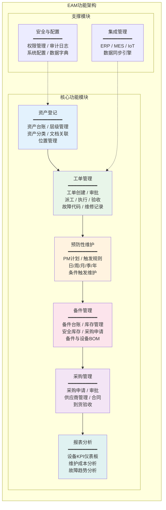
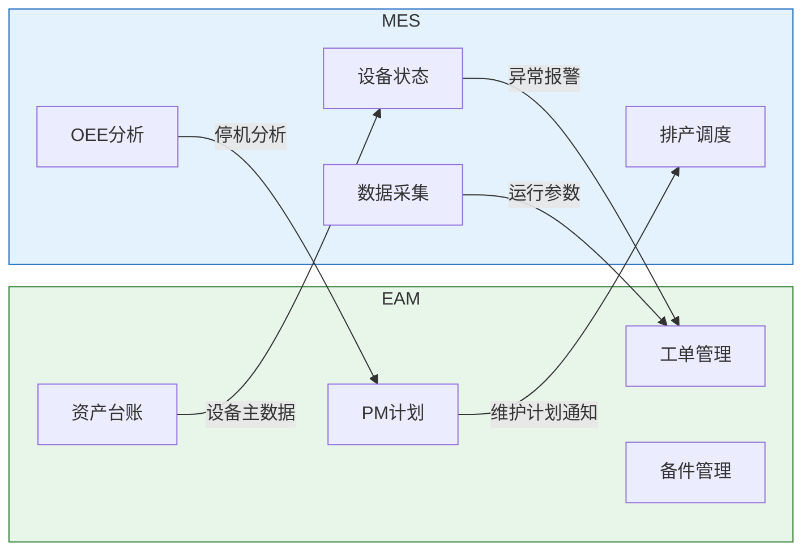
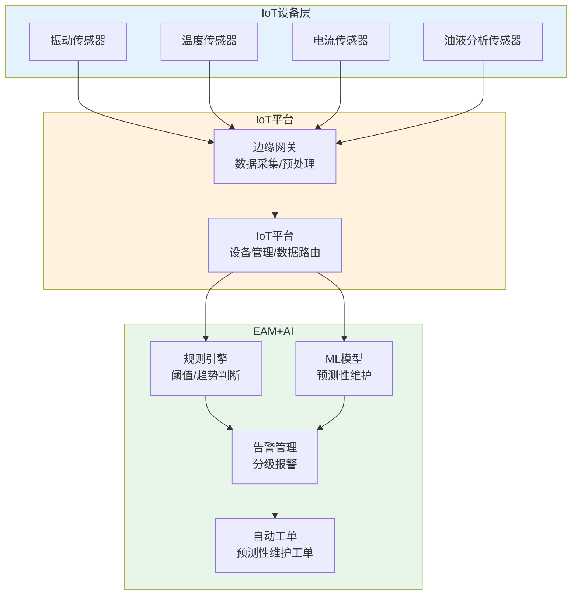

# EAM整体架构

## 功能架构

EAM系统的功能架构围绕设备资产全生命周期管理设计，包含六大核心功能模块和两大支撑模块：



### 各模块功能说明

| 功能模块 | 核心功能 | 关键特性 |
|---------|---------|---------|
| 资产登记 | 资产台账、层级管理、资产分类 | 多级层级、资产关系图、文档关联 |
| 工单管理 | 工单创建、审批、派工、执行、验收 | 状态机、SLA、移动端执行 |
| 预防性维护 | PM计划编制、触发规则、自动生成工单 | 时间/条件/事件触发、多频次支持 |
| 备件管理 | 备件台账、库存管理、采购申请 | ABC分类、安全库存、设备BOM关联 |
| 采购管理 | 采购申请、审批流程、供应商管理 | 与备件库存联动、合同管理 |
| 报表分析 | 设备KPI、维护成本、故障趋势 | 实时仪表板、多维分析、趋势预测 |

## 技术架构

EAM系统的技术架构通常采用分层设计，确保系统的可扩展性和可维护性：

```
┌─────────────────────────────────────────────────┐
│                  展示层                          │
│    Web端(Vue/React) │ 移动端(App/H5) │ 大屏看板  │
├─────────────────────────────────────────────────┤
│                  网关层                          │
│    API Gateway / 负载均衡 / 认证鉴权 / 限流熔断    │
├─────────────────────────────────────────────────┤
│                  服务层                          │
│  资产服务 │ 工单服务 │ PM服务 │ 备件服务 │ 采购服务  │
│  报表服务 │ 集成服务 │ IoT服务 │ 规则引擎 │ 通知服务  │
├─────────────────────────────────────────────────┤
│                  中间件层                        │
│  消息队列 │ 分布式缓存 │ 任务调度 │ 搜索引擎       │
├─────────────────────────────────────────────────┤
│                  数据层                          │
│  关系数据库 │ 时序数据库 │ 对象存储 │ 数据仓库       │
└─────────────────────────────────────────────────┘
```

### 技术选型参考

| 技术层 | 推荐方案 | 说明 |
|--------|---------|------|
| 前端框架 | Vue3 + TypeScript + Element Plus | 企业级组件库，移动端用uni-app |
| 后端框架 | Spring Boot / Spring Cloud | 微服务架构，适合中大型企业 |
| 关系数据库 | PostgreSQL / MySQL | 业务数据存储 |
| 时序数据库 | TDengine / InfluxDB | IoT设备数据存储 |
| 消息队列 | RabbitMQ / Kafka | 工单通知、IoT数据接入 |
| 缓存 | Redis | 热点数据缓存、分布式锁 |
| 规则引擎 | Drools | 预防性维护触发规则 |
| 任务调度 | XXL-JOB / Quartz | PM计划定时生成工单 |

## 与ERP集成

EAM与ERP的集成是设备管理与企业经营管理的桥梁：

| 集成场景 | 数据流向 | 说明 |
|---------|---------|------|
| 固定资产同步 | ERP → EAM | ERP固定资产主数据同步到EAM资产台账 |
| 采购订单 | EAM → ERP | 备件采购申请推送到ERP采购模块 |
| 采购入库 | ERP → EAM | 采购到货信息回传EAM更新库存 |
| 财务过账 | EAM → ERP | 维修工时和备件成本过账到ERP成本中心 |
| 供应商主数据 | ERP → EAM | 供应商信息同步到EAM |
| 预算控制 | ERP → EAM | 维护预算额度下发到EAM工单审批 |

### SAP PM集成示例

SAP PM（Plant Maintenance）与SAP ERP的集成最为典型：

| 集成模块 | 集成内容 |
|---------|---------|
| FI（财务） | 维修工单成本过账、资产折旧、资本化处理 |
| CO（成本） | 维修成本中心、内部订单、成本分析 |
| MM（物料） | 备件采购、库存管理、领料出库 |
| PP（生产） | 设备停机计划与生产排程协调 |
| HR（人力） | 维修人员技能资质、工时统计 |

## 与MES集成

EAM与MES的集成实现维护与生产的协同：



| 集成场景 | 说明 | 实时性 |
|---------|------|--------|
| 设备状态同步 | MES实时设备状态同步到EAM | 实时 |
| 异常自动报修 | MES检测异常自动创建EAM工单 | 实时 |
| 维护计划通知 | EAM维护计划提前通知MES调整排产 | 天级 |
| 设备参数关联 | MES采集的运行参数关联到EAM工单 | 准实时 |
| 停机原因分析 | MES停机数据与EAM维修记录关联分析 | 批量 |
| OEE数据同步 | MES的OEE数据同步到EAM进行设备绩效分析 | 批量 |

## 与IoT集成

IoT集成是EAM向预测性维护演进的关键能力：



| 集成层次 | 功能 | 技术 |
|---------|------|------|
| 数据采集 | 传感器数据实时采集 | MQTT/OPC UA/Modbus |
| 边缘计算 | 数据预处理和过滤 | 边缘网关/工业PC |
| 数据存储 | 时序数据存储 | InfluxDB/TDengine |
| 规则引擎 | 阈值判断和趋势预警 | Drools/自研规则 |
| AI分析 | 预测性维护模型 | 机器学习/深度学习 |
| 告警联动 | 异常告警自动创建工单 | 事件驱动架构 |

### IoT数据接入方案

| 协议 | 适用场景 | 优势 | 劣势 |
|------|---------|------|------|
| MQTT | IoT传感器数据上报 | 轻量、低带宽、支持QoS | 需MQTT Broker |
| OPC UA | 工业设备数据采集 | 标准化、安全、信息模型 | 配置复杂 |
| Modbus TCP | PLC/仪表数据采集 | 简单、广泛支持 | 功能有限 |
| HTTP REST | 第三方系统对接 | 通用、易于开发 | 实时性差 |

## 部署模式

| 部署模式 | 适用场景 | 优势 | 劣势 |
|---------|---------|------|------|
| 本地部署 | 大型制造企业、数据安全要求高 | 数据自主可控、定制灵活 | 初期投入高、运维成本大 |
| 公有云SaaS | 中小企业、快速上线 | 低成本、快速部署、免运维 | 定制受限、数据在云端 |
| 混合部署 | 多工厂企业 | 核心数据本地、IoT边缘上云 | 架构复杂 |
| 私有云 | 集团型企业 | 资源弹性、安全可控 | 需要云平台运维能力 |

### 移动端支持

现代EAM系统必须支持移动端，维修工程师需要在现场使用移动设备：

| 移动端场景 | 功能 | 设备 |
|-----------|------|------|
| 工单执行 | 查看工单、记录维修过程、拍照上传 | 手机/平板 |
| 点检巡检 | 按路线执行点检、记录数据 | 手机/PDA |
| 备件查询 | 查询备件库存和位置 | 手机 |
| 扫码报修 | 扫描设备二维码快速报修 | 手机 |
| 离线操作 | 无网络环境下的工单执行 | 手机/平板 |

## 总结

EAM系统以六大核心功能模块（资产登记、工单管理、预防性维护、备件管理、采购管理、报表分析）为骨架，通过与ERP、MES、IoT的深度集成实现资产数据的全面贯通。IoT集成是EAM从预防性维护向预测性维护演进的关键能力，边缘计算+规则引擎+AI分析构成完整的预测性维护技术栈。移动端支持是现代EAM的必要特性，支撑维修工程师的现场作业。下一章将深入设备维护管理的核心流程与方法。
