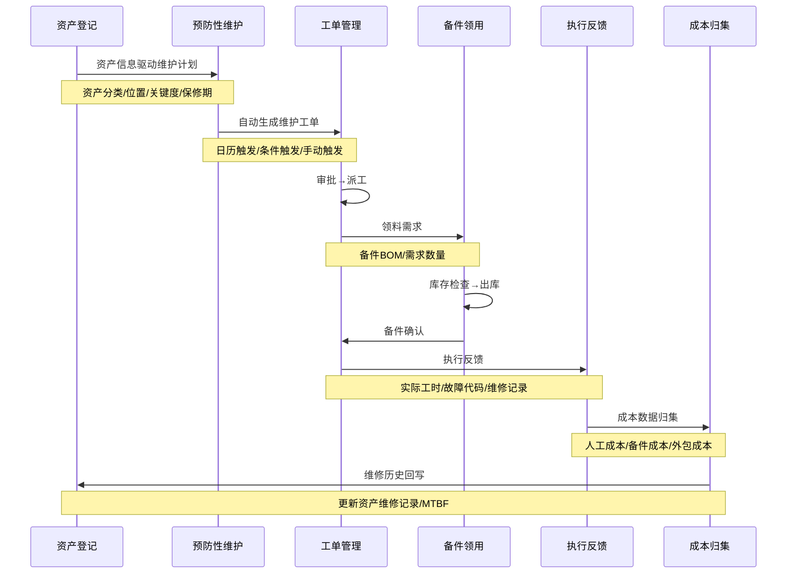
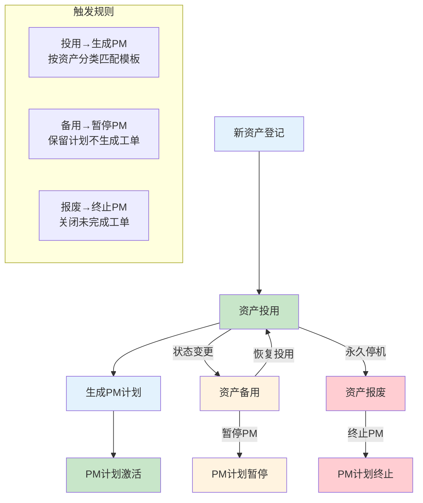
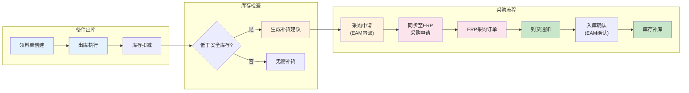
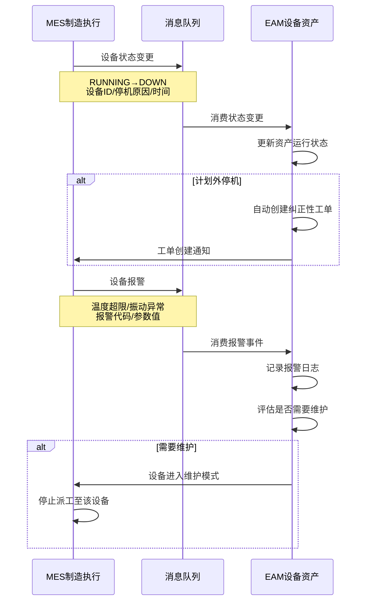
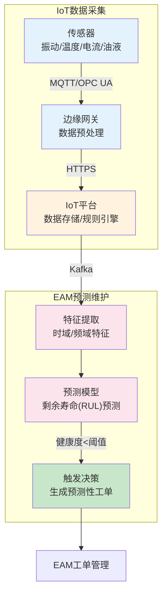
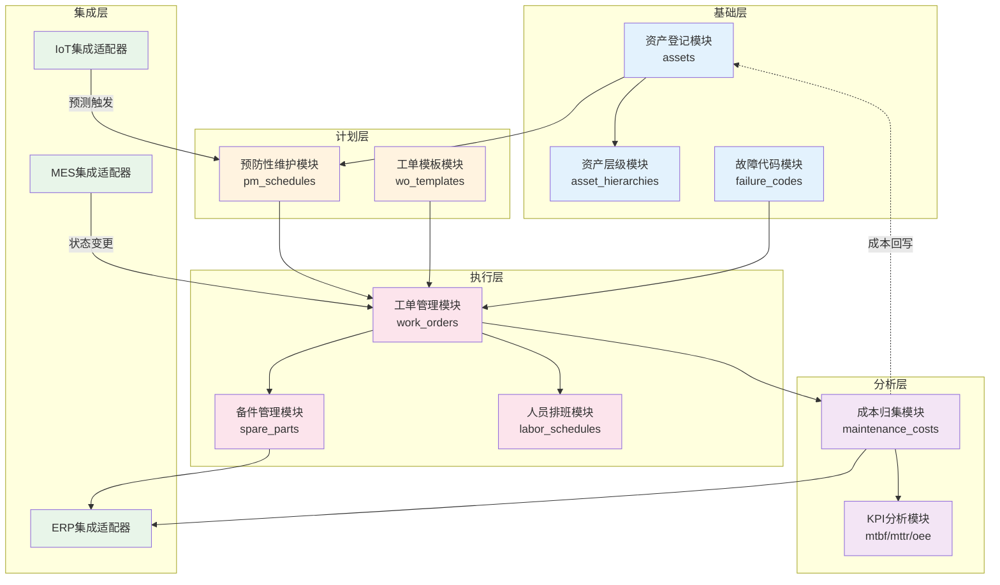

# EAM模块联动与数据流

## 工单闭环全景

EAM系统的核心价值在于构建从"资产登记"到"成本归集"的完整工单闭环。数据在各模块间流转，确保每一次维护活动都可追踪、可度量、可优化。以下是工单闭环的完整数据流：



## 模块接口定义

各模块之间的接口是EAM系统数据流转的关键节点。下表定义了EAM内部模块间的完整接口关系：

| 源模块 | 目标模块 | 接口名称 | 传输数据 | 触发条件 |
|--------|----------|----------|----------|----------|
| 资产登记 | 预防性维护 | 计划生成 | 资产ID、分类、位置、关键度等级 | 新资产登记/资产分类变更 |
| 预防性维护 | 工单管理 | 工单生成 | PM计划ID、维护内容、频次、窗口期 | 日历触发/条件触发 |
| 工单管理 | 备件管理 | 领料需求 | 工单ID、备件BOM、需求数量 | 工单审批通过/派工时 |
| 备件管理 | 采购管理 | 补货请求 | 备件ID、当前库存、安全库存、补货量 | 库存低于安全库存 |
| 采购管理 | 备件管理 | 到货入库 | 采购订单号、到货数量、检验结果 | ERP采购到货通知 |
| 工单管理 | 成本归集 | 工单成本 | 工单ID、人工工时、备件消耗、外包费用 | 工单验收关闭 |
| 成本归集 | 资产登记 | 历史回写 | 资产ID、累计维修成本、MTBF/MTTR | 工单关闭后 |
| IoT平台 | 预防性维护 | 条件触发 | 设备ID、传感器数据、阈值 | 运行参数超阈值 |

## 资产状态变更触发维护计划

资产的状态变更（投用、停机、报废等）直接影响维护计划的生成和调整：



**资产状态变更处理器：**

```python
class AssetStatusChangeHandler:
    """资产状态变更 - 触发维护计划调整"""

    def on_status_changed(self, asset_id: str, old_status: str, new_status: str):
        if new_status == "ACTIVE" and old_status in ("NEW", "STANDBY"):
            # 资产投用 - 创建或恢复PM计划
            self._create_or_resume_pm(asset_id)
        elif new_status == "STANDBY":
            # 资产备用 - 暂停PM计划
            self._suspend_pm(asset_id)
        elif new_status == "SCRAPPED":
            # 资产报废 - 终止PM计划
            self._terminate_pm(asset_id)

    def _create_or_resume_pm(self, asset_id: str):
        asset = Asset.get(asset_id)
        existing_pm = PMSchedule.filter(asset_id=asset_id, status="SUSPENDED").first()

        if existing_pm:
            existing_pm.status = "ACTIVE"
            existing_pm.save()
            return

        # 根据资产分类匹配PM模板
        template = PMTemplate.filter(asset_class=asset.asset_class).first()
        if template:
            PMSchedule.create(
                asset_id=asset_id,
                template_id=template.id,
                frequency=template.frequency,
                maintenance_window=template.window_hours,
                status="ACTIVE"
            )
```

## 工单执行触发备件出库

工单审批通过并派工后，系统根据工单关联的备件BOM自动生成领料需求：

```python
class WorkOrderMaterialHandler:
    """工单领料处理器"""

    def on_work_order_approved(self, wo: WorkOrder):
        """工单审批通过 - 生成领料需求"""
        # 获取备件BOM
        bom_items = SparePartsBOM.filter(
            asset_id=wo.asset_id,
            maintenance_type=wo.maintenance_type
        ).all()

        for item in bom_items:
            # 检查库存
            inventory = SparePartsInventory.get(item.spare_part_id)
            if inventory.available_qty >= item.required_qty:
                # 库存充足 - 创建领料单
                MaterialRequisition.create(
                    work_order_id=wo.work_order_id,
                    spare_part_id=item.spare_part_id,
                    requested_qty=item.required_qty,
                    status="PENDING_ISSUE"
                )
            else:
                # 库存不足 - 部分领料 + 触发补货
                if inventory.available_qty > 0:
                    MaterialRequisition.create(
                        work_order_id=wo.work_order_id,
                        spare_part_id=item.spare_part_id,
                        requested_qty=inventory.available_qty,
                        status="PENDING_ISSUE"
                    )
                # 触发采购补货
                self._trigger_procurement(
                    spare_part_id=item.spare_part_id,
                    required_qty=item.required_qty - inventory.available_qty,
                    reason=f"工单{wo.work_order_id}领料需求"
                )
```

## 备件出库触发采购申请

备件出库后，若库存降至安全库存以下，自动触发采购补货流程：



**库存触发器设计：**

```python
class InventoryTrigger:
    """库存触发器 - 出库后自动检查并补货"""

    SAFETY_STOCK_CONFIG = {
        "CRITICAL": 3,   # 关键备件：3倍安全库存
        "IMPORTANT": 2,  # 重要备件：2倍安全库存
        "NORMAL": 1,     # 普通备件：1倍安全库存
    }

    def on_stock_deducted(self, spare_part_id: str, deducted_qty: int):
        """库存扣减后的触发检查"""
        inventory = SparePartsInventory.get(spare_part_id)
        part = SparePart.get(spare_part_id)

        if inventory.available_qty <= inventory.safety_stock:
            # 计算补货量
            multiplier = self.SAFETY_STOCK_CONFIG.get(part.criticality, 1)
            reorder_qty = (inventory.max_stock - inventory.available_qty) * multiplier

            # 生成补货建议
            suggestion = ReorderSuggestion.create(
                spare_part_id=spare_part_id,
                current_qty=inventory.available_qty,
                safety_stock=inventory.safety_stock,
                reorder_qty=reorder_qty,
                reason=f"库存{inventory.available_qty}低于安全库存{inventory.safety_stock}",
                urgency="URGENT" if inventory.available_qty == 0 else "NORMAL"
            )

            # 自动生成采购申请（可配置为自动或人工确认）
            if part.auto_reorder_enabled:
                self._create_procurement_request(suggestion)
```

## 维护完成触发成本归集

工单验收关闭时，系统自动归集本次维护的所有成本，并回传ERP：

```python
class CostCollectionService:
    """成本归集服务 - 工单关闭时自动归集"""

    def on_work_order_closed(self, wo: WorkOrder):
        """工单关闭 - 归集成本"""
        cost = MaintenanceCost(
            work_order_id=wo.work_order_id,
            asset_id=wo.asset_id,

            # 人工成本
            labor_cost=self._calculate_labor_cost(wo),

            # 备件成本
            material_cost=self._calculate_material_cost(wo),

            # 外包成本
            outsourcing_cost=wo.outsourcing_cost or 0,

            # 其他费用
            other_cost=wo.other_cost or 0,
        )
        cost.total_cost = cost.labor_cost + cost.material_cost + cost.outsourcing_cost + cost.other_cost
        cost.save()

        # 回传ERP成本中心
        self._sync_to_erp(cost)

        # 更新资产维修统计
        self._update_asset_statistics(wo.asset_id, cost)

    def _calculate_labor_cost(self, wo: WorkOrder) -> float:
        """计算人工成本"""
        labor_records = LaborRecord.filter(work_order_id=wo.work_order_id).all()
        total = sum(
            record.actual_hours * record.hourly_rate
            for record in labor_records
        )
        return total

    def _calculate_material_cost(self, wo: WorkOrder) -> float:
        """计算备件成本"""
        material_records = MaterialConsumption.filter(work_order_id=wo.work_order_id).all()
        total = sum(
            record.consumed_qty * record.unit_price
            for record in material_records
        )
        return total

    def _update_asset_statistics(self, asset_id: str, cost: MaintenanceCost):
        """更新资产维修统计指标"""
        asset = Asset.get(asset_id)
        history = MaintenanceCost.filter(asset_id=asset_id)

        asset.total_maintenance_cost = history.aggregate(sum("total_cost"))
        asset.mtbf = self._calculate_mtbf(asset_id)  # 平均故障间隔时间
        asset.mttr = self._calculate_mttr(asset_id)  # 平均修复时间
        asset.last_maintenance_date = cost.created_at
        asset.save()
```

## 与MES联动：设备状态与报警

EAM与MES的联动实现设备运行状态实时同步和报警联动：



**MES联动接口：**

| 接口 | 方向 | 协议 | 说明 |
|------|------|------|------|
| 设备状态变更 | MES→EAM | Kafka | 设备启停/故障状态实时推送 |
| 设备报警 | MES→EAM | Kafka | 温度/振动/压力等参数超限报警 |
| 维护模式通知 | EAM→MES | REST API | 设备进入维护模式，MES停止派工 |
| 维护完成通知 | EAM→MES | REST API | 设备恢复可用，MES恢复派工 |
| OEE数据同步 | MES→EAM | 定时 | 设备综合效率数据，用于PM计划优化 |

## 与IoT联动：传感器数据到预测模型

EAM与IoT平台的联动实现从传感器数据采集到预测性维护模型的完整链路：



**IoT触发预测性维护：**

```python
class IoTPredictiveHandler:
    """IoT预测性维护触发器"""

    def on_health_score_updated(self, asset_id: str, health_score: float, prediction: dict):
        """设备健康度更新回调"""
        asset = Asset.get(asset_id)

        if health_score < 30:
            # 紧急 - 立即创建工单
            wo = WorkOrder.create(
                asset_id=asset_id,
                type="PREDICTIVE",
                priority="URGENT",
                description=f"预测性维护：设备健康度{health_score:.0f}%，"
                           f"预计剩余寿命{prediction['rul_days']}天",
                estimated_failure_date=prediction['estimated_failure_date'],
                auto_created=True
            )
            self._notify_maintenance_team(wo, "URGENT")

        elif health_score < 60:
            # 预警 - 排入下次维护窗口
            self._schedule_predictive_maintenance(
                asset_id, health_score, prediction
            )

        # 更新资产健康度指标
        asset.health_score = health_score
        asset.rul_days = prediction.get('rul_days')
        asset.save()
```

## 与ERP联动：采购与财务

EAM与ERP的联动覆盖采购申请、采购订单、到货入库和成本回传四个关键流程：

```python
class ERPIntegrationService:
    """EAM与ERP集成服务"""

    def create_procurement_requisition(self, suggestion: ReorderSuggestion) -> str:
        """在ERP中创建采购申请"""
        payload = {
            "requisition_type": "NB",  # 标准采购申请
            "plant": suggestion.plant,
            "cost_center": suggestion.cost_center,
            "items": [{
                "material_number": suggestion.erp_material_number,
                "quantity": suggestion.reorder_qty,
                "unit": suggestion.unit,
                "desired_date": (
                    datetime.now() + timedelta(days=suggestion.lead_time)
                ).strftime("%Y-%m-%d"),
                "account_assignment": {
                    "category": "K",  # 成本中心
                    "cost_center": suggestion.cost_center,
                }
            }]
        }
        response = erp_client.post("/api/mm/requisition", json=payload)
        return response.json()["requisition_number"]

    def on_goods_receipt(self, erp_notification: dict):
        """ERP到货通知 - EAM确认入库"""
        spare_part = SparePart.filter(
            erp_material_number=erp_notification["material_number"]
        ).first()

        if spare_part:
            # 增加库存
            inventory = SparePartsInventory.get(spare_part.id)
            inventory.available_qty += erp_notification["received_qty"]
            inventory.save()

            # 检查是否有待料工单
            self._check_pending_work_orders(spare_part.id)

    def sync_maintenance_cost(self, cost: MaintenanceCost):
        """同步维护成本至ERP"""
        erp_client.post("/api/co/internal-order/settlement", json={
            "order_number": cost.asset_id,
            "period": cost.created_at.strftime("%Y%m"),
            "cost_elements": [
                {"type": "LABOR", "amount": cost.labor_cost, "cost_center": cost.cost_center},
                {"type": "MATERIAL", "amount": cost.material_cost, "cost_center": cost.cost_center},
                {"type": "OUTSOURCING", "amount": cost.outsourcing_cost, "cost_center": cost.cost_center},
            ]
        })
```

## 开发者视角：模块依赖图

从开发者视角看EAM各模块的代码依赖关系：



## 开发者实战Tips

1. **事件溯源模式**：资产状态变更、工单状态流转等关键业务建议采用Event Sourcing模式，所有状态变更以事件形式追加存储，便于问题排查和状态重建。

2. **工单编号生成策略**：工单编号需保证唯一且可读。建议格式`WO-{年月}-{流水号}`，如`WO-202403-00156`。使用数据库序列+Redis缓存预分配提高并发性能。

3. **异步解耦领料流程**：工单领料不应阻塞工单审批流程。审批通过后异步发送领料需求，领料结果通过回调通知工单。备件不足时工单状态变为"待料"，到货后自动恢复。

4. **成本归集延迟处理**：工单关闭时部分成本数据可能尚未到齐（如外包费用月结）。成本归集应支持多次追加，设置"成本关闭"标记区分"工单关闭"和"成本结算完成"。

5. **跨系统幂等性**：EAM↔ERP的采购申请和成本回传接口必须保证幂等，使用ERP单据号作为幂等键。网络超时后重试不会创建重复采购申请。
